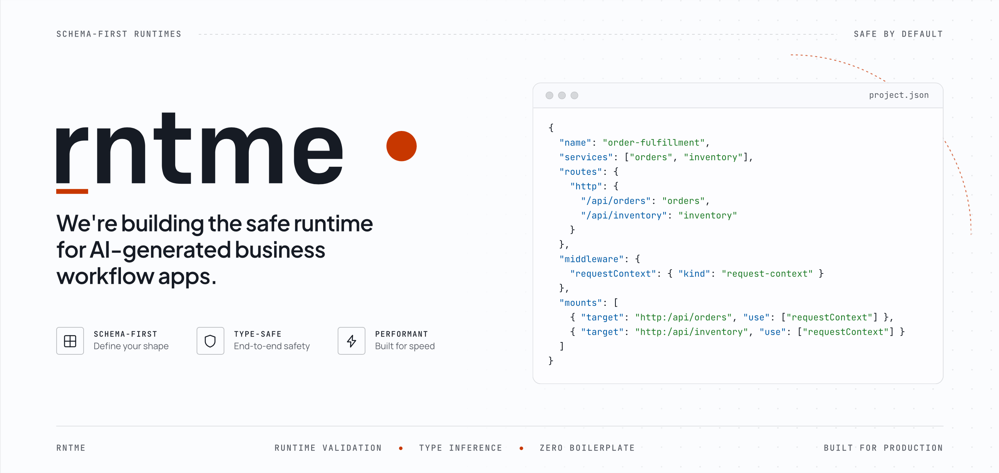
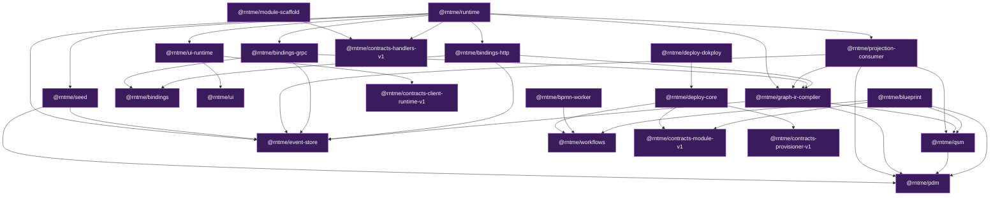

# rntme



[](https://github.com/vladprrs/rntme/actions/workflows/ci.yml)
[](LICENSE)

> **An open, validated runtime for AI-generated business apps.**
>
> A team — or an agent — describes the app as a project blueprint: domain model, queries, commands, HTTP bindings, UI, BPMN workflows, vendor modules. rntme validates the blueprint in layers and boots a standard runtime around it. The apps an agent generates stay consistent, observable, and reviewable across the second, third, and tenth iteration.
>
> Open-source under Apache 2.0.

- 🧱 **Architecture deep-dive:** [`docs/architecture.md`](docs/architecture.md).
- 🤖 **Coding agents:** start with [`AGENTS.md`](AGENTS.md) — it has the research map, conventions, and task-indexed pointers.
- ⚖️ **License:** [`LICENSE`](LICENSE) (Apache 2.0).

## What rntme does

A team (or an agent) describes a working app as a **validated project blueprint**: a project blueprint folder containing `project.json` (project metadata, routing, middleware), a project-level PDM, one or more services (each with its own QSM, Graph IR, bindings, UI, seed, and manifest), project-level workflows (BPMN), and integration modules. The rntme runtime validates the blueprint in layers and boots the services described by it, with project-level routing and middleware composing them into one HTTP surface — **with zero service-specific code**.

The durable unit is the project blueprint. Teams edit the blueprint; the runtime keeps the app consistent. Agents author blueprints; the runtime enforces what's valid. The second app you build starts from a copy of the first project blueprint, not from an empty repo.

**Where it fits.** rntme targets **business processes that need consistency, observability, safety, and extensibility** — workflow apps (approvals, ticketing, customer-ops, onboarding, back-office), AI-extraction jobs (see [`demo/cv-extract-blueprint`](demo/cv-extract-blueprint)), and stateful back-office tools where every additional service shouldn't reinvent the backend.

**What we deliberately do not build:** a generic AI app builder (Lovable / Bolt / Firebase Studio), a backend-as-a-service (Supabase / Appwrite / Firebase), an internal-tools low-code platform (Retool / Appsmith / ToolJet / Budibase), or an agent runtime. rntme runs the services that agents describe, not the agents themselves.

## How it works

The project blueprint is the bounded authoring object. Internally it compiles from a project-level layer (`project.json`, project-level PDM, optional project-level workflows) and per-service artifacts — **QSM** (read-side projections), **Graph IR** (queries + commands, carried by bindings / UI), **bindings** (HTTP surface), **UI**, **seed**, **manifest** — through a four-layer validator (parse → structural → references → consistency) onto an event-sourced SQLite runtime.

**Cross-service orchestration: BPMN.** rntme uses BPMN as the orchestration model for cross-service workflows. The current implementation provisions Operaton — the project-level `workflows` artifact compiles into deployable BPMN process definitions, executed by a separate `@rntme/bpmn-worker` workload that calls back into rntme services through gRPC action bindings. The load-bearing choice is **BPMN as the standard**, not Operaton specifically: timers, gateways, message-correlated process starts, and event-driven step sequencing come from the BPMN spec, not from rntme code we'd otherwise have to invent.

**Vendor modules: typed adapters for the outside world.** Every category of external integration (identity, AI/LLM, CRM, object storage, …) has a **canonical contract** under `packages/contracts/<category>/v1` — a protobuf-shaped interface, conformance scenarios, and standardized error codes. **Vendor modules** implement that contract for a specific vendor (Auth0, OpenRouter, Bitrix24, S3-compatible storage, …) and ship as their own packages under `modules/<category>/<vendor>/`. Modules can declare a **provisioner** block in `module.json` to reconcile external resources idempotently as part of deploy (e.g. create the Auth0 client, create the S3 bucket) and feed env vars back into the runtime. This is how rntme reuses existing SDKs without losing the validated-artifact guarantee: the canonical contract is the trust boundary; the vendor module owns the SDK call.

**Production-class consequences, not the identity of the product.** CQRS, event-sourcing, SQLite/Turso storage, branded `Validated*` types, plugin seams (`DbDriver`, `EventBus`, `Surface`), and executor seams (`CommandExecutor` / `QueryExecutor`) are downstream of the repeatability goal. They deliver extensibility without editing artifacts, migrations as event replay, and one-file-per-service scale-out — but they're not the headline.

From the project layer and service-level artifacts, the toolchain produces:

- SQLite DDL for projections and the event log.
- SQL for every query graph and a runtime to execute it.
- An event-sourced command runtime with optimistic concurrency, at-least-once CloudEvents-1.0-enveloped Kafka-style relay, and bounded-retry DLQ.
- An idempotent projection consumer that keeps the read-side eventually consistent.
- An OpenAPI 3.1 document and a Hono HTTP surface.
- A declarative React SPA compiled from the `ui` artifact.
- BPMN workflow deployment metadata for provisioned Operaton plus a `bpmn-worker` workload, when the project declares cross-service workflows.

Organised as a pnpm monorepo. Each package has a single, testable responsibility and depends only on the packages strictly below it.

## Architecture at a glance

```mermaid
flowchart LR
    subgraph authors["Artifact authors"]
        AI["AI agent"]:::external
        HUM["Human"]:::external
    end
    subgraph blueprint["validated project blueprint (folder)"]
        direction TB
        PJSON["project.json<br/>routes + middleware + service registry"]:::project
        PPDM["project-level PDM"]:::project
        subgraph services["service-level artifacts x N"]
            direction TB
            QSM["QSM"]:::artifact
            IR["Graph IR"]:::artifact
            B["Bindings"]:::artifact
            UI["UI"]:::artifact
            S["Seed"]:::artifact
            M["Manifest"]:::artifact
        end
        MOD["modules x N<br/>(gRPC adapters)"]:::module
        WF["workflows<br/>(BPMN mappings)"]:::artifact
    end
    V["4-layer validator<br/>(parse → structural → reference → consistency)"]:::validator
    REG["project-routed bindings<br/>+ composed project model"]:::runtime
    R["rntme runtime<br/>(per-service today;<br/>project intake deferred)"]:::runtime
    DEPLOY["@rntme/deploy-core<br/>+ deploy-dokploy"]:::deploy
    DB[("SQLite / Turso")]:::storage
    SVC["Running project<br/>(HTTP + UI)"]:::runtime

    AI --> blueprint
    HUM --> blueprint
    blueprint --> V --> REG --> R
    R --> DB
    R --> SVC
    blueprint --> DEPLOY

    classDef artifact fill:#1b3a5c,stroke:#4a90e2,color:#fff;
    classDef project fill:#1b3a5c,stroke:#4a90e2,color:#fff,stroke-width:3px;
    classDef module fill:#1b3a5c,stroke:#4a90e2,color:#fff,stroke-dasharray: 4 2;
    classDef validator fill:#5c3a1b,stroke:#e29a4a,color:#fff;
    classDef storage fill:#1b5c3a,stroke:#4ae29a,color:#fff;
    classDef runtime fill:#3a1b5c,stroke:#9a4ae2,color:#fff;
    classDef deploy fill:#3a1b5c,stroke:#9a4ae2,color:#fff,stroke-dasharray: 4 2;
    classDef external fill:#444,stroke:#999,color:#fff;
```



> **Deep dive:** [`docs/architecture.md`](docs/architecture.md) — full C4 (L1–L4), 18 diagrams, ~25-entry cross-cutting abstractions catalogue, and a diagnostic observations section across 9 lenses.

## Packages

| Package | Purpose |
| ------- | ------- |
| [`@rntme/blueprint`](packages/artifacts/blueprint) | Project-first blueprint folder parser/validator: loads `project.json`, project-level PDM, service artifacts, route/middleware composition, project-routed binding registry, and optional `project.json#modules` UI catalog + virtual entry. |
| [`@rntme/pdm`](packages/artifacts/pdm) | Platform Domain Model: project-shared entities, ownership classification, fields, relations, and optional stateMachine per entity; derives event-type specs from transitions. |
| [`@rntme/qsm`](packages/artifacts/qsm) | Query-Side Materialized projections: declares per-service read-side tables, projection-per-file directories, relation metadata for JOINs, DDL, and event-handler specs. |
| [`@rntme/workflows`](packages/artifacts/workflows) | Project-level BPMN/Operaton workflow artifact parser and validator: maps event-envelope message starts and BPMN service tasks to project services and action bindings. |
| [`@rntme/event-store`](packages/runtime/event-store) | SQLite-backed event log with optimistic concurrency + at-least-once Kafka relay. |
| [`@rntme/seed`](packages/artifacts/seed) | Declarative `seed.json`: parse and validate envelopes against the PDM, append to the event store (used by `@rntme/runtime` for reference data). |
| [`@rntme/projection-consumer`](packages/runtime/projection-consumer) | Kafka → SQLite projection updater with three-layer idempotency and batch transactions. |
| [`@rntme/graph-ir-compiler`](packages/artifacts/graph-ir-compiler) | Graph IR compiler/runtime for effect-aware operations: local reads, local emits, call/branch/result nodes, plus legacy SQL/query helpers. |
| [`@rntme/bindings`](packages/artifacts/bindings) | HTTP bindings artifact + four-layer validator + OpenAPI 3.1 emitter, including `exposure`, `inputFrom`, callback response shapes, and effect consistency checks. |
| [`@rntme/bindings-http`](packages/runtime/bindings-http) | Hono sub-router that executes validated Graph IR operations through one operation executor, with callback redirects and action idempotency cache support. |
| [`@rntme/bindings-grpc`](packages/runtime/bindings-grpc) | gRPC adapter surface for exposing validated Graph IR operations to service and module callers. |
| [`@rntme/ui`](packages/artifacts/ui) | UI artifact + four-layer validator; declarative per-service UI description with route-local `data` + `actions` bindings resolved through project-routed refs. |
| [`@rntme/ui-runtime`](packages/runtime/ui-runtime) | Hono sub-router + SPA host bootstrap that serves compiled `@rntme/ui` artifacts, bundles the React shell, and executes screens against service HTTP bindings. |
| [`@rntme/runtime`](packages/runtime/runtime) | Service runtime: reads a folder of artifacts + `manifest.json`, wires the Graph IR operation executor, module/service call clients, idempotency support, and serves the full HTTP surface. Published as both an npm package and the `ghcr.io/vladprrs/rntme-runtime` image. |
| [`@rntme/bpmn-worker`](packages/runtime/bpmn-worker) | BPMN worker bridge for provisioned Operaton projects: subscribes to Kafka topics, starts process instances, and executes BPMN service tasks through rntme gRPC action bindings. |
| [`@rntme/module-scaffold`](packages/tooling/module-scaffold) | Examples and scaffolding for rntme module authors. Holds `exampleHandlers`; no contract surface — copy as a starting point rather than depending on it. |
| **Canonical contracts** |  |
| [`@rntme/contracts-module-v1`](packages/contracts/module/v1) | JSON shape of `module.json` (manifest schema, types, `parseModuleManifest`). All loaders/composers depend on this; modules implement it via their `module.json`. |
| [`@rntme/contracts-provisioner-v1`](packages/contracts/provisioner/v1) | Provisioner runtime contract: `ProvisionerContract`, `ProvisionerInput`/`Output`, `ProvisionerLog`, `ProvisionerVendorError`, env-mapping types. `@rntme/deploy-core` implements; vendor modules with a provisioner block code against it. |
| [`@rntme/contracts-client-runtime-v1`](packages/contracts/client-runtime/v1) | Browser-side module contract: `ModuleBootContext`, hooks/providers, operation registry, transport chain, visibility evaluator, and router helpers used by UI-bearing modules and `@rntme/ui-runtime`. |
| [`@rntme/contracts-handlers-v1`](packages/contracts/handlers/v1) | Code-command-handler runtime contract: `CodeCommandHandler`, `CodeCommandHandlerMap`, structurally-minimal `CommandExecutionContext`/`CommandExecutorOutput`. Modules code their handlers against this contract; `@rntme/runtime` re-exports the same names and ships a drift gate to keep the runtime's richer ctx assignable to the contract. |
| [`@rntme/contracts-common-v1`](packages/contracts/_common/v1) | Shared cross-category protobuf primitives (`CanonicalRef`, `CommandContext`, `Name`, `ListRequest`/Filter/Sort, `Metadata`) imported by every category contract. |
| [`@rntme/contracts-ai-llm-v1`](packages/contracts/ai-llm/v1) | Canonical AI/LLM contract: `service AiLlmModule` (14 RPCs), Completion, AssistantThread, AsyncJob, sixteen CloudEvents payloads, MCP-shape tools, `AI_LLM_<LAYER>_<KIND>` error codes. |
| [`@rntme/contracts-identity-v1`](packages/contracts/identity/v1) | Canonical Identity contract: `service IdentityModule` (24 RPCs), six entity types, seventeen CloudEvents payloads, `IDENTITY_<LAYER>_<KIND>` error codes. |
| [`@rntme/contracts-crm-v1`](packages/contracts/crm/v1) | Canonical CRM contract: `service CrmModule`, Contact/Company/Deal/Activity/Note/AsyncJob types, helper read models, twenty-one CloudEvents payloads, `CRM_<LAYER>_<KIND>` error codes. |
| [`@rntme/conformance-crm`](modules/crm/conformance) | CRM conformance scenarios + fixtures (34 RPCs, 4 webhook formats incl. amoCRM URL-encoded) |
| [`@rntme/crm-bitrix24`](modules/crm/bitrix24) | Bitrix24 CRM vendor module backed by `@bitrix24/b24jssdk`; maps the CRM v1 canonical surface with explicit partial behavior for labels, idempotency, webhook retry, and sync. |
| **Identity vendor track** |  |
| [`@rntme/conformance-identity`](modules/identity/conformance) | Per-RPC conformance scenarios for `@rntme/contracts-identity-v1`. Drift-tested against the canonical `service IdentityModule`. Imported by every Identity vendor module. |
| **AI/LLM vendor track** |  |
| [`@rntme/conformance-ai-llm`](modules/ai-llm/conformance) | AI/LLM conformance scenarios + fixtures (14 RPCs, binary media). Drift-tested against `service AiLlmModule`. Imported by every AI/LLM vendor module. |
| [`@rntme/ai-llm-openrouter`](modules/ai-llm/openrouter) | First AI/LLM vendor module — OpenRouter multi-provider gateway. Implements `Complete` and `GetCompletion`; remaining 12 RPCs return `UNIMPLEMENTED`. SQLite idempotency store (≥24h TTL). Single-vendor manifest with `gateway_upstreams[]`. |

| **Deployment (CLI-side)** |  |
| [`@rntme/deploy-core`](packages/deploy/deploy-core) | Target-neutral deployment plan model for validated/composed projects. |
| [`@rntme/deploy-dokploy`](packages/deploy/deploy-dokploy) | Dokploy adapter that renders and applies redacted deployment plans. |

### Demo

[`demo/notes-blueprint`](demo/notes-blueprint) is the canonical project-shape example: a project blueprint folder with `project.json`, project-level PDM, and one or more services under `services/`.
[`demo/order-fulfillment-blueprint`](demo/order-fulfillment-blueprint) is the BPMN workflow example: two services plus `workflows/workflows.json` and BPMN files.
[`demo/cv-extract-blueprint`](demo/cv-extract-blueprint) is the first AI-LLM-bearing demo: resume PDF → JSON-schema-pinned structured extraction via `@rntme/ai-llm-openrouter`.

### Apps

| App | Purpose |
| --- | --- |
| [`apps/platform-http`](apps/platform-http) | **Optional self-hosted control plane.** Manages organizations, projects, deploy targets, encrypted credentials, and the artifact registry. Self-host alongside your rntme-runtime services if you want a UI for project lifecycle and deploy. |
| [`apps/cli`](apps/cli) | `rntme` CLI: bundle a project blueprint, publish to a platform instance, trigger deploys. |
| [`apps/landing`](apps/landing) | Source for the rntme.com landing site. Not required to run rntme. |

### Dependency graph



This is a simplified dependency view, not a complete `package.json` edge list. Arrows show the important package directions used for navigation and layering. `pdm`, `event-store`, `bindings`, `ui`, and `workflows` have no internal dependencies. `@rntme/blueprint` validates project composition and produces a project-routed binding registry consumed by `@rntme/bindings` / `@rntme/ui` for compilation and by `@rntme/workflows` validation context for BPMN service tasks. Project-level runtime intake — boot from a project blueprint folder rather than a single service folder — is **not yet wired** in `@rntme/runtime`; the runtime still boots one service at a time. See [`docs/superpowers/specs/done/2026-04-23-project-first-blueprint-design.md`](docs/superpowers/specs/done/2026-04-23-project-first-blueprint-design.md).

## Quick start

Requirements: **Node.js ≥ 20**, **pnpm ≥ 9** (CI uses pnpm 9.12.0).

```bash
pnpm install
pnpm -r run build
pnpm -r run test
```

### Run a service with the runtime

The runtime is the production face of the project. Given a folder of artifacts it boots the whole stack with no user code:

```bash
docker run --rm -p 3000:3000 \
  -v "$(pwd)/path/to/service/artifacts:/srv/artifacts:ro" \
  ghcr.io/vladprrs/rntme-runtime:1.0
```

Or embed it:

```ts
import { loadService, startService } from '@rntme/runtime';
const loaded = loadService('./artifacts');
if (loaded.ok) await startService(loaded.value);
```

## Developer commands

Each library package exposes the same scripts. Run them across all packages from the root, or for one package with `pnpm -F <name>`.

| Command | Effect |
| ------- | ------ |
| `pnpm -r run build` | `tsc -p tsconfig.json` in every package. |
| `pnpm -r run typecheck` | Typecheck-only pass with `tsconfig.check.json`. |
| `pnpm -r run test` | `vitest run` in every package (unit + integration + e2e + golden). |
| `pnpm -r run lint` | ESLint on `src/**` and `test/**`. |
| `pnpm depcruise` | Layering check (`dependency-cruiser` rules in `.dependency-cruiser.cjs`). |
| `pnpm -F <name> test:watch` | Vitest watch mode for one package. |

CI runs `build → typecheck → test → lint → depcruise → vendor:check` on every push and PR to `main` (see `.github/workflows/ci.yml`).

## Design docs and specs

- [`docs/architecture.md`](docs/architecture.md) — **top-down architecture overview** (C4 L1–L4, 18 mermaid diagrams, cross-cutting abstractions catalogue, diagnostic observations). Start here if you want depth.
- [`AGENTS.md`](AGENTS.md) — research map for coding agents: task-indexed pointers, conventions, per-package entry points.
- `docs/superpowers/specs/done/2026-05-04-platform-contracts-extraction-design.md` — platform contract layer: module manifest, provisioner, client-runtime, and handler contracts extracted out of implementation packages so modules depend on contracts only.
- `docs/superpowers/specs/done/2026-05-05-provisioned-bpmn-operaton-design.md` — project-level BPMN workflow artifact, provisioned Operaton, and BPMN worker deployment.
- `docs/superpowers/specs/2026-05-07-vision-deletion-readme-rework-design.md` — retiring the standalone positioning doc, condensing its essence into this README, licensing under Apache 2.0.
- `docs/superpowers/specs/done/2026-04-23-project-first-blueprint-design.md` — active umbrella spec for the project-first pivot: project blueprint folder, project-level PDM, service-level cross-service QSM, project routing/middleware, runtime deferred.
- `docs/superpowers/specs/done/2026-04-24-project-deployment-pipeline-design.md` — deploy pipeline: target-neutral planning, redacted previews, Dokploy rendering, and apply flow.
- `docs/superpowers/specs/done/2026-04-13-graph-ir-sql-compiler-mvp-design.md` — compiler scope and MVP deviations from rc7.
- `docs/superpowers/specs/done/2026-04-14-mutations-design.md` — CQRS / ES design: stateMachine, event envelope, command role, event store, relay, projection consumer.
- `docs/superpowers/specs/done/2026-04-14-bindings-design.md` — bindings artifact, four-layer validation, OpenAPI emission.
- `docs/superpowers/specs/done/2026-04-14-bindings-http-design.md` — Hono runtime for bindings.
- `docs/superpowers/specs/*.md` — active specs (e.g. CloudEvents envelope, DLQ, QSM relations migration, architecture overview).
- `docs/superpowers/plans/*.md` — per-feature implementation plans.
- `docs/superpowers/reports/*.md` — gap analyses (spec vs. implementation).

## MVP / Tier 1 scope

What ships today:

- SQLite target only (`≥ 3.30`); **no PostgreSQL**, ksqlDB or other dialects. Scale-out target is **Turso** (SQLite-compatible Rust rewrite), not a different database.
- Both `entity-mirror` and `derived` projection backings are supported (derived projections are built from Graph IR sources).
- Single-writer event log; Kafka-style relay is at-least-once with per-stream ordering (partition key = `stream`), bounded retries, and a DLQ wrapper event on poison.
- The demo uses an in-memory Kafka bridge; plugging a real broker is a `KafkaProducer` / `KafkaConsumer` swap.
- One graph compiled per `compile()` call.
- Graph operation nodes: `findMany`, `findOne`, `filter`, `map`, `reduce`, `sort`, `limit`, `call`, `branch`, `emit`, `result`.
- JSON authoring; no YAML.
- UI artifact (`@rntme/ui` + `@rntme/ui-runtime` + `@rntme/contracts-client-runtime-v1`): shadcn-catalog-based React SPA with route-local `data` (read bindings), `actions` (action or navigation bindings), module boot hooks, operation registry, transport middleware, four-layer validation, `NextAppSpec`-compatible format. No SSR.
- CloudEvents 1.0 envelope end-to-end; topics follow `rntme.{svc}.{agg}` (no `.v1` suffix — breaking event changes use a new `eventType`, not a topic version).
- Project blueprint composition: `project.json` + project-level PDM + N services + modules; project routes/middleware validated; project-routed binding registry compiled. Runtime intake at the project level is not yet wired.
- Vendor-module integration: `manifest.modules[]` declares external services; Graph IR `call` nodes invoke vendor-module operations over gRPC; HTTP action idempotency cache has a 24h TTL; callback bindings support GET + 302. Vendor-module communication is gRPC-based (`@rntme/bindings-grpc`); canonical contracts live under `packages/contracts/<category>/v1` and are independent of any vendor implementation.
- Project workflow artifact (`@rntme/workflows`): `workflows/workflows.json` validates BPMN file refs, event-envelope message starts, and BPMN service tasks against project services and action bindings. **BPMN as the orchestration model**; current target is provisioned Operaton plus a separate `bpmn-worker` workload when the deploy target provides workflow config.
- Vendor modules shipping today: `auth0` (identity), `openrouter` (AI/LLM), `bitrix24` (CRM); `s3` (object storage) in design.

Out of scope for now: snapshots, multi-aggregate commands, list/`in` parameters, named predicate graphs, `distinct`, `lookupOne`, window functions, multi-tenancy, schema registry / breaking schema evolution.

## Glossary

| Term | Meaning |
| ---- | ------- |
| **PDM** | Platform Domain Model — entities, fields, relations, optional stateMachine per entity. |
| **QSM** | Query-Side Materialized projections — read-side tables derived from PDM. |
| **Graph IR** | Declarative DAG of operators (`findMany`, `filter`, `call`, `branch`, `emit`, `result`, …) that compiles to an executable operation. |
| **Canonical Graph IR** | Normalised internal form without syntactic sugar. |
| **Semantic plan** | Typed, scope-resolved plan produced by the semantic layer of the compiler. |
| **Bindings** | Artifact mapping graphs to HTTP operations; input to OpenAPI generation. |
| **Workflow artifact** | Project-level `workflows/workflows.json` mapping BPMN definitions to event-envelope message starts and project-routed action binding service tasks. |
| **BPMN worker** | Runtime workload that subscribes to Kafka topics, starts Operaton process instances, and executes BPMN service tasks through rntme gRPC action bindings. |
| **Event envelope** | Immutable event record (eventId, stream, version, actor, payload, schemaVersion, …). |
| **Aggregate** | Domain entity identified by `<aggregateType>-<aggregateId>`; stream of events. |
| **Relay** | Background loop that tails the event log and publishes to Kafka with a persistent cursor. |
| **Projection** | Materialised view kept up to date by the projection consumer. |
| **Entity-mirror** | Projection backing that mirrors an entity's exposed fields plus generated columns and idempotency columns. |
| **Emit node** | Graph IR node describing an event to append for a mutation. |
| **Result\<T\>** | `{ ok: true; value: T } \| { ok: false; errors: E[] }` — no exceptions in the validation pipeline. |
| **Platform contract** | Leaf package under `packages/contracts/*/v1` that exposes a cross-cutting module/platform boundary (`module.json`, provisioner, client runtime) without depending on implementation packages. |
| **Client runtime contract** | Browser-side platform contract consumed by UI modules and `@rntme/ui-runtime`: `ModuleBootContext`, hooks/providers, operation registry, transport chain, visibility, and router helpers. |
| **Canonical contract** | The protobuf-shaped interface, conformance scenarios, and `<CATEGORY>_<LAYER>_<KIND>` error codes for a category of external integration. Lives under `packages/contracts/<category>/v1`. Vendor modules code against the contract; the contract has no vendor knowledge. |
| **Vendor module** | An implementation of a canonical category contract (`identity`, `ai-llm`, `crm`, `storage`, …) for a specific vendor (Auth0, OpenRouter, Bitrix24, …). Lives under `modules/<category>/<vendor>/` and ships its own `module.json`. |
| **Provisioner** | The optional `module.json` block that lets a vendor module reconcile external resources (e.g. create the Auth0 client, create the S3 bucket) idempotently as part of `provision → plan → render → apply → verify`. The contract lives in `@rntme/contracts-provisioner-v1`. |

## License

rntme is released under the [Apache License 2.0](LICENSE).

That includes the runtime, all artifact validators, all vendor modules in this repository, the `apps/*` workspace, and the demo blueprints. There is no separately-licensed commercial layer. If a future managed offering exists, it will be a separate product.
