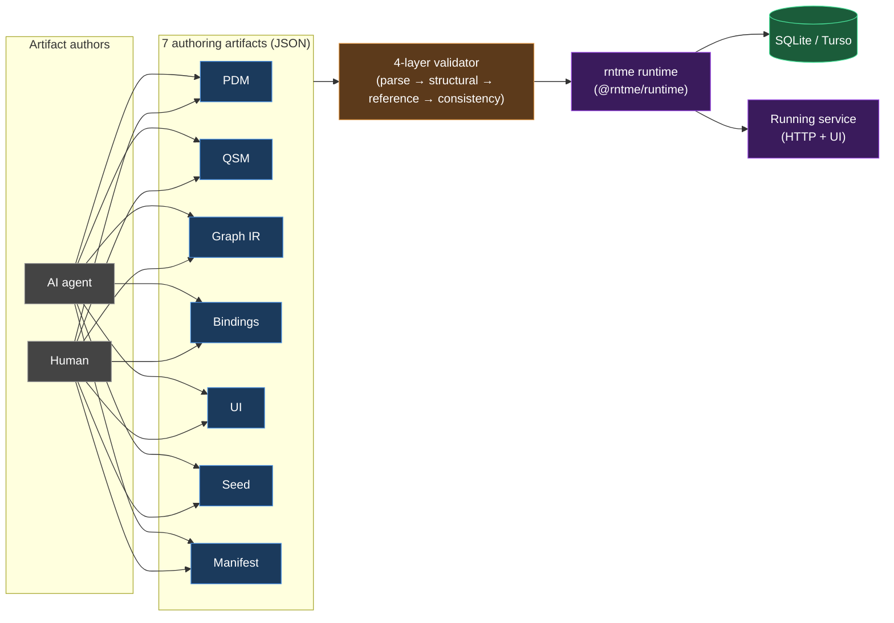
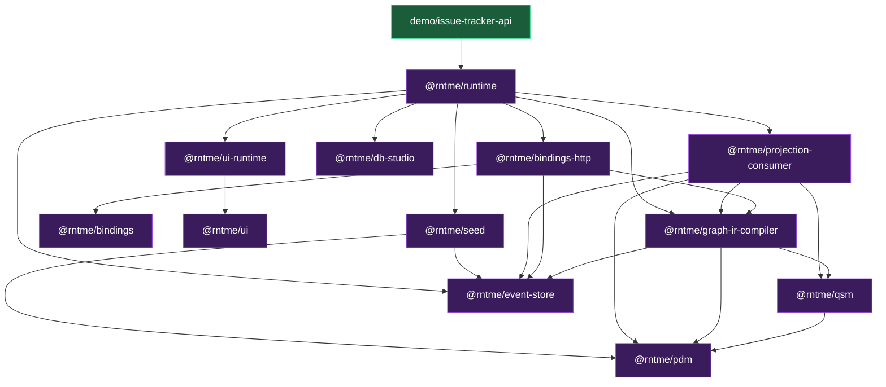

# rntme

[](https://github.com/vladprrs/rntme/actions/workflows/ci.yml)

> **Coding agents:** start with [`AGENTS.md`](AGENTS.md), not this file.
> It contains the project map, conventions, and task-indexed pointers.

**rntme is an artifact-driven runtime for AI-agent-generated services.** A small set of strictly-validated JSON artifacts — **PDM** (domain), **QSM** (read-side projections), **Graph IR** (queries + commands, carried by bindings/ui), **bindings** (HTTP surface), **ui**, **seed**, **manifest** — describe a service. The runtime loads, validates, and boots them into a working HTTP + UI service with **no service-specific code**. The point is that humans *or* AI agents can generate these artifacts and get a running service.

CQRS, event-sourcing, SQLite/Turso, branded `Validated*` types, and plugin seams (`DbDriver`, `EventBus`, `Surface`) are **consequences** of that goal, not the identity — they deliver extensibility without editing artifacts, migrations as event replay, and one-file-per-service scale-out.

From those seven artifacts, the toolchain produces:

- SQLite DDL for projections and the event log.
- SQL for every query graph and a runtime to execute it.
- An event-sourced command runtime with optimistic concurrency, at-least-once Kafka-style relay, and bounded-retry DLQ.
- An idempotent projection consumer that keeps the read-side eventually consistent.
- An OpenAPI 3.1 document and a Hono HTTP surface.
- A declarative React SPA compiled from the `ui` artifact.

Organised as a pnpm monorepo. Each package has a single, testable responsibility and depends only on the packages strictly below it.

## Architecture at a glance



> **Deep dive:** [`docs/architecture.md`](docs/architecture.md) — full C4 (L1–L4), 18 diagrams, ~25-entry cross-cutting abstractions catalogue, and a diagnostic observations section across 9 lenses.

## Packages

| Package | Purpose |
| ------- | ------- |
| [`@rntme/pdm`](packages/pdm) | Platform Domain Model: entities, fields, relations and an optional stateMachine per entity; derives event-type specs from transitions. |
| [`@rntme/qsm`](packages/qsm) | Query-Side Materialized projections: declares read-side tables, generates DDL and event-handler specs. |
| [`@rntme/event-store`](packages/event-store) | SQLite-backed event log with optimistic concurrency + at-least-once Kafka relay. |
| [`@rntme/seed`](packages/seed) | Declarative `seed.json`: parse and validate envelopes against the PDM, append to the event store (used by `@rntme/runtime` for reference data). |
| [`@rntme/projection-consumer`](packages/projection-consumer) | Kafka → SQLite projection updater with three-layer idempotency and batch transactions. |
| [`@rntme/graph-ir-compiler`](packages/graph-ir-compiler) | Graph IR → SQLite compiler (query path) and state-machine-gated command runtime (command path). |
| [`@rntme/bindings`](packages/bindings) | HTTP bindings artifact + four-layer validator + OpenAPI 3.1 emitter. |
| [`@rntme/bindings-http`](packages/bindings-http) | Hono sub-router that executes queries and commands described by a validated bindings artifact. |
| [`@rntme/ui`](packages/ui) | UI artifact + four-layer validator; declarative per-service UI description (route-local `data` + `actions` bindings). |
| [`@rntme/ui-runtime`](packages/ui-runtime) | Hono sub-router + SPA bundle that executes `@rntme/ui` artifacts against the service's HTTP bindings. |
| [`@rntme/db-studio`](packages/db-studio) | libSQL Hrana v3 read-only HTTP endpoint over rntme's two SQLite handles, usable by any Hrana-compatible browser studio. |
| [`@rntme/runtime`](packages/runtime) | Service runtime: reads a folder of artifacts + `manifest.json` and serves the full HTTP surface. Published as both an npm package and the `ghcr.io/vladprrs/rntme-runtime` image. |

### Demo

[`demo/issue-tracker-api`](demo/issue-tracker-api) is an end-to-end issue tracker that wires every package together: PDM with a stateMachine, QSM entity-mirror projections, 14 graphs (queries + commands), bindings → OpenAPI, a full event pipeline with the in-memory Kafka bridge, a Hono HTTP server, and a declarative UI served at `GET /ui`.

### Dependency graph



Arrows mean "depends on". `pdm`, `event-store`, `bindings`, `ui`, and `db-studio` have no internal dependencies. `@rntme/runtime` is the top layer — it depends on every other `@rntme/*` package (transitively through the edges above). `demo/issue-tracker-api` is the only package that consumes `@rntme/runtime` directly.

## Quick start

Requirements: **Node.js ≥ 20**, **pnpm ≥ 9** (CI uses pnpm 9.12.0).

### Private submodule (`rntme-cli/`)

Some CLI code lives in a private submodule at `rntme-cli/` backed by
`vladprrs/rntme-cli`. Clone the monorepo with
`git clone --recurse-submodules https://github.com/vladprrs/rntme.git`, or
after a plain clone run `git submodule update --init --recursive`. New git
worktrees created with `git worktree add` do not initialise submodules
automatically — run `git submodule update --init --recursive` inside each
new worktree. External contributors without access to the private repo will
see `pnpm -r` skip `@rntme-cli/*` workspace members.

```bash
pnpm install
pnpm -r run build
pnpm -r run test
```

### Run a service with the runtime

The runtime is the production face of the project. Given a folder of artifacts it boots the whole stack with no user code:

```bash
docker run --rm -p 3000:3000 \
  -v "$(pwd)/demo/issue-tracker-api/artifacts:/srv/artifacts:ro" \
  ghcr.io/vladprrs/rntme-runtime:1.0
```

Or embed it (the demo does this):

```ts
import { loadService, startService } from '@rntme/runtime';
const loaded = loadService('./artifacts');
if (loaded.ok) await startService(loaded.value);
```

### Run the demo

```bash
pnpm -F @rntme/issue-tracker-api-demo start
# ➜ issue-tracker-api-demo listening on http://localhost:3000
# UI: http://localhost:3000/ui
```

```bash
curl -s 'http://localhost:3000/v1/issues?status=open&limit=5'

curl -s -X POST http://localhost:3000/v1/issues \
  -H 'content-type: application/json' \
  -H 'x-actor-id: alice' \
  -d '{"issueId":7001,"title":"Demo","projectId":1,"reporterId":1,"priority":"high","storyPoints":3}'
```

See [`demo/issue-tracker-api/README.md`](demo/issue-tracker-api/README.md) for the full route inventory, seed instructions and example flow.

## Developer commands

Each library package exposes the same scripts. Run them across all packages from the root, or for one package with `pnpm -F <name>`.

| Command | Effect |
| ------- | ------ |
| `pnpm -r run build` | `tsc -p tsconfig.json` in every package. |
| `pnpm -r run typecheck` | Typecheck-only pass with `tsconfig.check.json`. |
| `pnpm -r run test` | `vitest run` in every package (unit + integration + e2e + golden). |
| `pnpm -r run lint` | ESLint on `src/**` and `test/**`. |
| `pnpm -F <name> test:watch` | Vitest watch mode for one package. |
| `pnpm -F @rntme/issue-tracker-api-demo start` | Start the demo via `@rntme/runtime` (`tsx src/server.ts`; override port with `RNTME_HTTP_PORT`). |
| `pnpm -F @rntme/issue-tracker-api-demo start:runtime-cli` | Start via the `rntme-runtime start ./artifacts` CLI. |

CI runs `build → typecheck → test → lint` on every push and PR to `main` (see `.github/workflows/ci.yml`).

## Design docs and specs

- [`docs/architecture.md`](docs/architecture.md) — **top-down architecture overview** (C4 L1–L4, 18 mermaid diagrams, cross-cutting abstractions catalogue, diagnostic observations). Start here if you want depth.
- [`AGENTS.md`](AGENTS.md) — research map for coding agents: task-indexed pointers, conventions, per-package entry points.
- `docs/superpowers/specs/done/2026-04-13-graph-ir-sql-compiler-mvp-design.md` — compiler scope and MVP deviations from rc7.
- `docs/superpowers/specs/done/2026-04-14-mutations-design.md` — CQRS / ES design: stateMachine, event envelope, command role, event store, relay, projection consumer.
- `docs/superpowers/specs/done/2026-04-14-bindings-design.md` — bindings artifact, four-layer validation, OpenAPI emission.
- `docs/superpowers/specs/done/2026-04-14-bindings-http-design.md` — Hono runtime for bindings.
- `docs/superpowers/specs/*.md` — active specs (e.g. CloudEvents envelope, DLQ, QSM relations migration, architecture overview, db-studio).
- `docs/superpowers/plans/*.md` — per-feature implementation plans.
- `docs/superpowers/reports/*.md` — gap analyses (spec vs. implementation).

## MVP / Tier 1 scope

What ships today:

- SQLite target only (`≥ 3.30`); **no PostgreSQL**, ksqlDB or other dialects. Scale-out target is **Turso** (SQLite-compatible Rust rewrite), not a different database.
- Both `entity-mirror` and `derived` projection backings are supported (derived projections are built from Graph IR sources).
- Single-writer event log; Kafka-style relay is at-least-once with per-stream ordering (partition key = `stream`), bounded retries, and a DLQ wrapper event on poison.
- The demo uses an in-memory Kafka bridge; plugging a real broker is a `KafkaProducer` / `KafkaConsumer` swap.
- One graph compiled per `compile()` call.
- Query nodes: `findMany`, `filter`, `map`, `reduce`, `sort`, `limit`. Command path adds `emit`.
- JSON authoring; no YAML.
- UI artifact (`@rntme/ui` + `@rntme/ui-runtime`): shadcn-catalog-based React SPA with route-local `data` (query bindings) and `actions` (command or navigation bindings), four-layer validation, `NextAppSpec`-compatible format. No SSR.
- CloudEvents 1.0 envelope end-to-end; topics follow `rntme.{svc}.{agg}` (no `.v1` suffix — breaking event changes use a new `eventType`, not a topic version).
- Read-only libSQL Hrana endpoint (`@rntme/db-studio`) over both runtime SQLite handles, usable from any Hrana-compatible browser studio.

Out of scope for now: snapshots, multi-aggregate commands, list/`in` parameters, named predicate graphs, `distinct`, `lookupOne`, window functions, auth/authz, multi-tenancy, schema registry / breaking schema evolution.

## Glossary

| Term | Meaning |
| ---- | ------- |
| **PDM** | Platform Domain Model — entities, fields, relations, optional stateMachine per entity. |
| **QSM** | Query-Side Materialized projections — read-side tables derived from PDM. |
| **Graph IR** | Declarative DAG of operators (`findMany`, `filter`, …, `emit`) that compiles to SQL and/or events. |
| **Canonical Graph IR** | Normalised internal form without syntactic sugar. |
| **Semantic plan** | Typed, scope-resolved plan produced by the semantic layer of the compiler. |
| **Bindings** | Artifact mapping graphs to HTTP operations; input to OpenAPI generation. |
| **Event envelope** | Immutable event record (eventId, stream, version, actor, payload, schemaVersion, …). |
| **Aggregate** | Domain entity identified by `<aggregateType>-<aggregateId>`; stream of events. |
| **Relay** | Background loop that tails the event log and publishes to Kafka with a persistent cursor. |
| **Projection** | Materialised view kept up to date by the projection consumer. |
| **Entity-mirror** | Projection backing that mirrors an entity's exposed fields plus generated columns and idempotency columns. |
| **Emit node** | Graph IR node describing an event to append for a mutation. |
| **Result\<T\>** | `{ ok: true; value: T } \| { ok: false; errors: E[] }` — no exceptions in the validation pipeline. |
