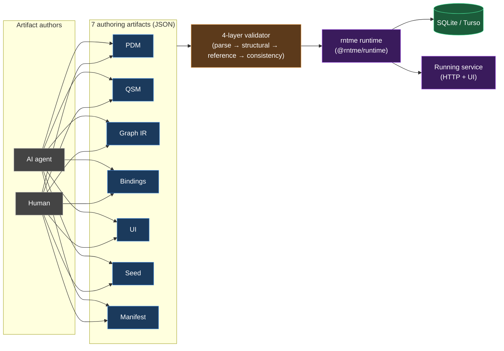
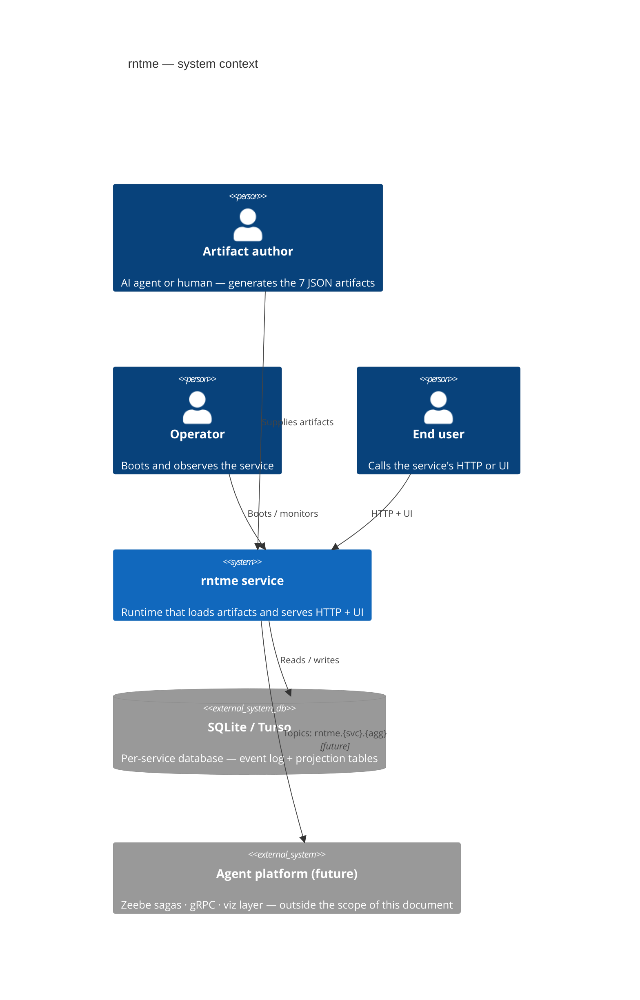
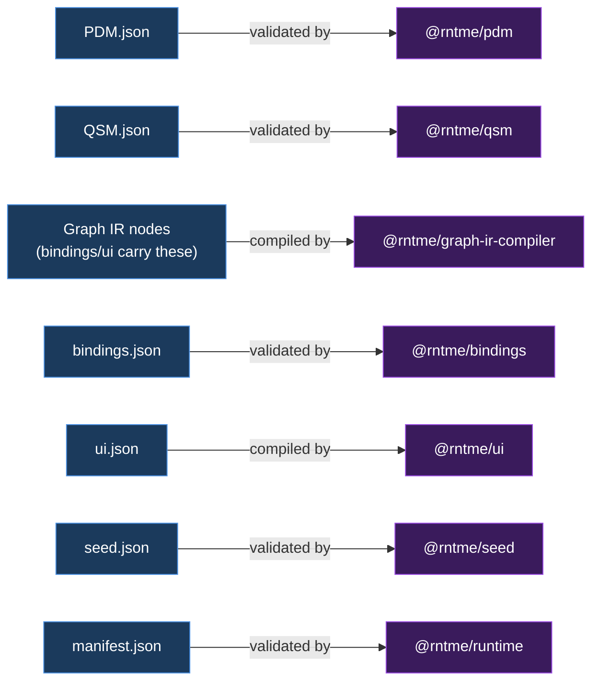
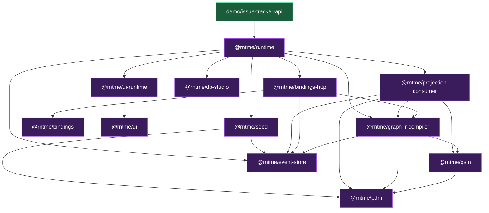
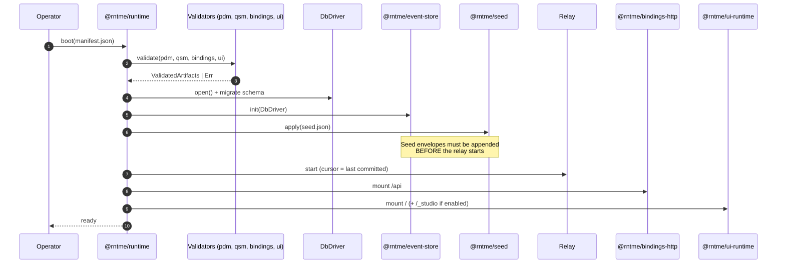
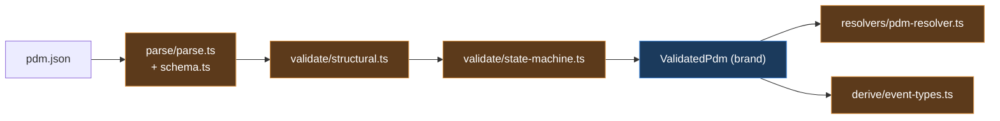
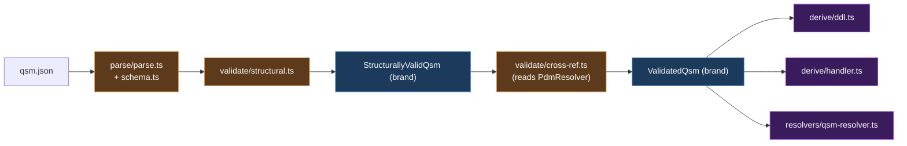
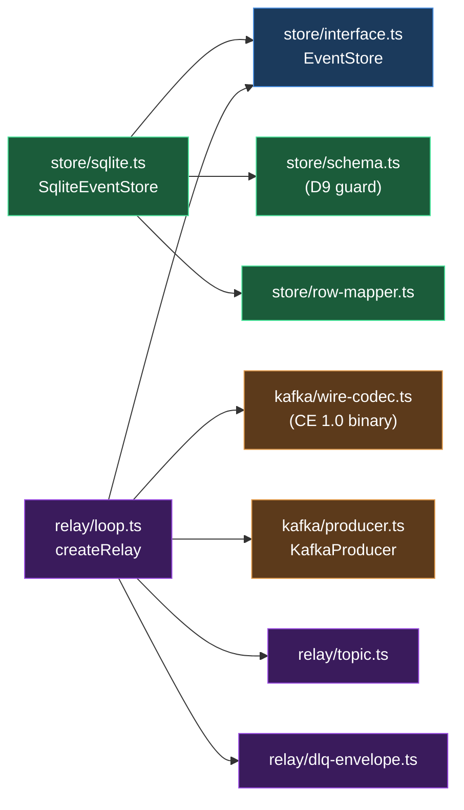
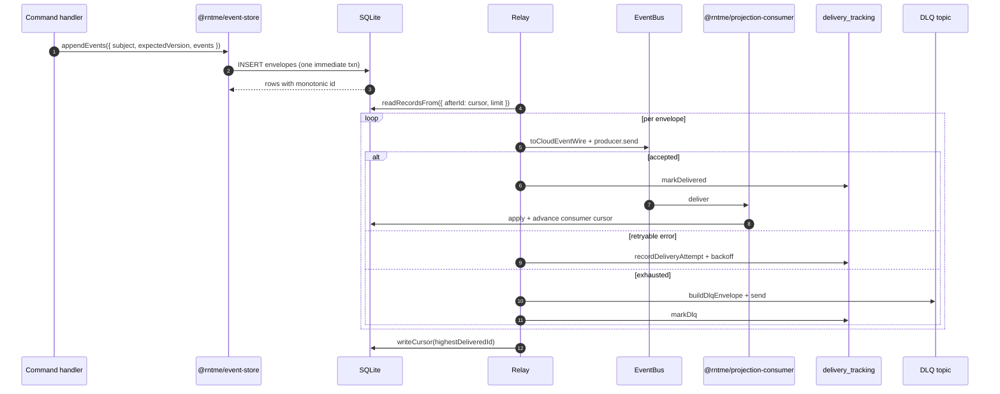

<!--
Architecture overview for rntme.
Spec: docs/superpowers/specs/2026-04-18-architecture-overview-design.md
Cutoff date: 2026-04-18. Later specs are folded in via subsequent bumps, not
retroactively.

Diagram colour palette (use the `classDef` lines below inside mermaid blocks
where styling is desired — copy, do not invent new colours):

  classDef artifact   fill:#1b3a5c,stroke:#4a90e2,color:#fff;
  classDef validator  fill:#5c3a1b,stroke:#e29a4a,color:#fff;
  classDef storage    fill:#1b5c3a,stroke:#4ae29a,color:#fff;
  classDef runtime    fill:#3a1b5c,stroke:#9a4ae2,color:#fff;
  classDef external   fill:#444,stroke:#999,color:#fff;
-->

# rntme — Architecture Overview

> Status: in progress (writing per plan `docs/superpowers/plans/2026-04-18-architecture-overview.md`).
>
> Spec: `docs/superpowers/specs/2026-04-18-architecture-overview-design.md`.
>
> Primary framing: rntme is an artifact-driven runtime for AI-agent-generated services. CQRS, event-sourcing, SQLite, Turso, branded `Validated*` types, and plugin seams are **consequences** of that goal, not the identity of the system. See `rntme_vision_framing` memory.

## Table of contents

1. [Executive summary](#1-executive-summary)
2. [L1 — System Context](#2-l1--system-context)
3. [L2 — Containers](#3-l2--containers)
4. [L3 — Components](#4-l3--components)
5. [L4 — Code](#5-l4--code)
6. [Cross-cutting abstractions](#6-cross-cutting-abstractions)
7. [Observations and refactoring candidates](#7-observations-and-refactoring-candidates)
8. [Glossary](#8-glossary)
9. [How to use and maintain this document](#9-how-to-use-and-maintain-this-document)

---

## 1. Executive summary

**rntme is an artifact-driven runtime.** A service is described by a small set of strictly-validated JSON artifacts (PDM, QSM, Graph IR, bindings, UI, seed, manifest). The runtime loads those artifacts, validates them in layers, and boots a working HTTP + UI service without requiring any service-specific code. The primary payoff is that **AI agents and humans can _generate_ these artifacts and get a running service** — the runtime's job is to make that generation safe and repeatable.

**Key invariants at a glance**

- **SQLite forever.** Scale-out target is Turso (SQLite-compatible); no Postgres dialect path is permitted.
- **JSON authoring only.** No YAML, no TOML for any artifact.
- **`Result<T>` across package boundaries.** No exceptions leak out of a package's public API.
- **Branded `Validated*` types.** Downstream APIs accept only the brand; casting into the brand (`as ValidatedPdm`) is an anti-pattern.
- **Fail-fast layered validation.** Each artifact runs parse → structural → reference/cross-ref → consistency; the orchestrator returns the first failing layer's errors only.

**Design rationale — why these choices serve the vision**

| Decision | Property delivered to the vision |
| --- | --- |
| Layered validators + branded types | An agent-generated artifact cannot silently bypass a check; downstream code cannot consume unvalidated data. |
| CQRS + event-sourcing | Schema and behaviour can evolve without losing history; migrations become replays, not destructive DDL. |
| SQLite (+ Turso) | One service = one file; running many services does not require orchestrating a database cluster. |
| Kafka-style topic convention `rntme.{svc}.{agg}` | Services can be composed into a larger platform (Zeebe sagas, gRPC) without invasive per-service wiring. |
| Plugin seams (`DbDriver`, `EventBus`, `Surface`) | Runtime can be swapped in (e.g. different storage or transport) without changing any of the seven artifacts. |
| Kept-small public surface per package | Agents and humans reason about fewer concepts per artifact; each artifact has a single canonical validator. |

The rest of this document unpacks each of these in order: L1 context (§2), container topology (§3), per-package components (§4), critical functions (§5), the abstractions catalogue (§6), diagnostic observations (§7).

## 2. L1 — System Context

**What the diagram shows.** The runtime has exactly one direct input from humans/agents — the artifact set — and two human-facing surfaces (operator, end user). Storage is explicitly per-service. The agent platform (Zeebe, gRPC, viz layer) is an **external future consumer**, not a part of this document.

**Why only one storage actor.** rntme treats storage as a per-service concern. The `DbDriver` plugin seam (see §3) lets the same runtime run against `BetterSqlite`, an in-memory driver for tests, or Turso without changing any artifact.

**Why the platform is external.** The memory entry `project_platform_vision` describes the larger DDD platform (Zeebe for cross-service sagas, gRPC for synchronous calls, a viz layer for business users). rntme is *one per-service runtime inside that platform*; cross-service concerns are not in scope here.

## 3. L2 — Containers

### 3.1 Authoring surface — the 7 artifacts

rntme's authoring surface is seven JSON artifacts plus one service manifest. Each artifact has exactly one canonical validator and one canonical consumer.

**Caption.** Every artifact has exactly one owner package; a downstream package consuming an artifact does so via the owner's branded `Validated*` type.

### 3.2 Container map — 12 packages

**Caption.** Arrows mean "depends on". `@rntme/runtime` is the orchestrator; it boots the plugin seams, wires the event pipeline, and mounts the HTTP surface. The demo is the only package that consumes `@rntme/runtime` directly.

### 3.3 Plugin seams — extension without editing artifacts

Three interfaces live in `packages/runtime/src/plugins/`:

- **`DbDriver`** — storage adapter. Default: `BetterSqliteDriver`. Alternate: in-memory for tests, future Turso driver.
- **`EventBus`** — message transport. Default: `InMemoryBus`. Alternate: Kafka / NATS via a custom implementation.
- **`Surface`** — HTTP (or equivalent) entry point. Default: `HttpSurface` (Hono-based). Alternate: any surface that can route bindings.

The manifest (`manifest.json`) selects defaults; a caller passing a custom implementation replaces one seam without editing any other artifact. See `packages/runtime/README.md` for the exact interface shapes.

### 3.4 Boot & seed lifecycle (sequence #3)

**Caption.** The boot-order invariant (see `2026-04-15-runtime-seed-design.md`) is that seed application and the publish relay are mutually exclusive in time: seeds are committed through `appendRaw` *before* the relay cursor starts advancing, or seed events would double-publish.

## 4. L3 — Components

Each subsection below follows the same structure:

1. **Purpose** — one sentence.
2. **Spec lineage** — which specs shaped this package, in time order.
3. **Component diagram** — internal modules and data flow.
4. **Components** — 2–3 sentences per module naming its responsibility.
5. **Invariants** — what must hold.

Sequence diagrams live with the package that owns the flow.

### 4.1 `@rntme/pdm`

**Purpose.** Parse, validate, resolve, and derive event-types for the PDM artifact — rntme's source of truth for entities, fields, relations, keys, and per-entity finite-state machines that drive event-sourced mutations.

**Spec lineage.**

| Spec | Date | Status | Contribution |
| --- | --- | --- | --- |
| `docs/superpowers/specs/done/2026-04-14-mutations-design.md` | 2026-04-14 | landed | Defined the `stateMachine` extension, derived event-types, and the event-sourcing topology consumed by PDM output. |
| `docs/adr/2026-04-15-event-driven-architecture.md` | 2026-04-15 | ADR | Write-path topology (event log, outbox, relay) that consumes `deriveEventTypes` output. |

**Component diagram.**

**Caption.** Two validation layers (structural, then state-machine) construct the `ValidatedPdm` brand; resolver and event-type derivation consume the brand — they are not validation layers.

**Components.**

- **`parse/parse.ts` + `parse/schema.ts`** — Zod strict parsing; accepts either a JS object or a JSON string. Returns `Ok<PdmArtifact>` on success or `Err` with `PDM_PARSE_*` codes otherwise.
- **`validate/structural.ts`** — First validation layer. Checks keys reference real fields, relation endpoints resolve, and scalars are well-formed. Constructs the intermediate `StructurallyValidPdm` brand.
- **`validate/state-machine.ts`** — Second validation layer. Enforces state/transition rules, creation-transition `affects` declaration, self-loop non-empty `affects`, and BFS reachability from creation states. Promotes `StructurallyValidPdm` to the final `ValidatedPdm` brand.
- **`validate/index.ts`** — Orchestrator `validatePdm()`. Fail-fast: on a structural error, the state-machine layer does not run.
- **`resolvers/pdm-resolver.ts`** — Pure-lookup facade (`createPdmResolver`) that resolves entity / field / relation / state-machine references to in-memory handles; each resolved transition exposes a computed `declared` list that augments `affects` with `stateField`.
- **`derive/event-types.ts`** — Produces one `EventTypeSpec` per transition, consumed downstream by bindings, projection-consumer, and the event store.

**Invariants.**

- The `ValidatedPdm` brand is constructed only inside `validate/state-machine.ts`; the intermediate `StructurallyValidPdm` brand is constructed only inside `validate/structural.ts`. Downstream packages (QSM, bindings, graph-ir-compiler) accept only the final brand.
- `stateField` is a non-nullable string; `stateMachine.initial` is literal `null` (creation transitions are the only entry).
- Creation transitions and self-loop transitions must declare `affects` explicitly and non-empty.
- Reachability is enforced: any state unreachable from a creation transition is rejected with `PDM_SM_UNREACHABLE_STATE`.
- `relation.to` is local-only; cross-service relations are an explicit gap tracked in `docs/gaps/pdm-gaps.md` and in the package's "Out of scope" README section.

### 4.2 `@rntme/qsm`

**Purpose.** Parse, validate, and derive DDL + event handlers for QSM — the query-side model that declares read-side projections (entity-mirrors) over the PDM, and, post-2026-04-16, owns the relation metadata used for JOINs.

**Spec lineage.**

| Spec | Date | Status | Contribution |
| --- | --- | --- | --- |
| `docs/superpowers/specs/done/2026-04-14-mutations-design.md` | 2026-04-14 | landed | Entity-mirror projection contract: backing semantics, key/grain rules, generated columns, idempotency triple (§6). |
| `docs/superpowers/specs/2026-04-16-qsm-relations-migration-design.md` | 2026-04-16 | in-flight | Read-side relation graph moved from PDM to QSM: B2 cross-validation rules, single-hop / fan-out gates, error codes. |

**Component diagram.**

**Caption.** Two validation layers (structural, then PDM-aware cross-ref) produce `ValidatedQsm`. Both derive modules also take a `PdmResolver` to look up entity shapes and event types; only `resolvers/qsm-resolver.ts` is PDM-free.

**Components.**

- **`parse/parse.ts` + `parse/schema.ts`** — Zod strict parser; accepts object or JSON string. Emits `QSM_PARSE_SCHEMA_VIOLATION` on failure.
- **`validate/structural.ts`** — PDM-free rules: empty / duplicate keys / grain / exposed, table-name collisions, relation-key shape `"<Projection>.<relation>"`. Constructs `StructurallyValidQsm`.
- **`validate/cross-ref.ts`** — PDM-aware rules: entity and field existence, entity-mirror constraints (keys and grain set-equal to source entity's keys; source entity must have a state-machine), at-most-one entity-mirror per source entity, and B2 relation parity with PDM on `(to, localKey, foreignKey, cardinality)`. Promotes to `ValidatedQsm`.
- **`validate/index.ts`** — `validateQsm()` orchestrator: structural → cross-ref, fail-fast.
- **`derive/ddl.ts`** — `generateProjectionDdl(ValidatedQsm, PdmResolver)` → `ProjectionDdlSpec[]`. Entity-mirror specs carry the full idempotency triple `(last_event_id, last_event_version, applied_at)`; derived specs (opt-in via `opts.derivedSchemas`) carry only `(last_event_id, applied_at)` plus a separate `seen_events` dedup table. State-field indexes and a `CREATE TABLE` statement are emitted with SQLite double-quoted identifiers.
- **`derive/handler.ts`** — `deriveProjectionHandler(ValidatedQsm, PdmResolver)` → `ProjectionHandlerSpec[]`. One `EventHandler` per `EventTypeSpec` with an `insert | update` op respecting the idempotency guard.
- **`resolvers/qsm-resolver.ts`** — Pure-lookup facade (`createQsmResolver`) with `listProjections`, `resolveProjection`, `findEntityMirror`, `listRelations`, `resolveRelation`.
- **`common/invariant.ts`** — `invariantViolated()` post-validation safety net; consumed by derive/* and resolver.

**Invariants.**

- **Brand path is the only path.** `ValidatedQsm` is constructed only in `validate/cross-ref.ts`; `StructurallyValidQsm` only in `validate/structural.ts`. Downstream (graph-ir-compiler, projection-consumer) accepts only `ValidatedQsm`.
- **Entity-mirror key / grain contract.** Keys and grain of an entity-mirror projection must be set-equal to the source entity's keys. Enforced by `QSM_XREF_ENTITY_MIRROR_KEYS_MISMATCH` and `QSM_XREF_ENTITY_MIRROR_GRAIN_MISMATCH`.
- **One mirror per entity.** `QSM_XREF_ENTITY_MIRROR_DUPLICATE` rejects a second entity-mirror for the same source entity.
- **`derived` backing is gated at cross-ref.** Zod accepts `backing: 'derived'`; the standard `validateQsm()` path rejects it in `validate/cross-ref.ts` with `QSM_BACKING_DERIVED_NOT_SUPPORTED`. `derive/ddl.ts` has a forward-compat path (`opts.derivedSchemas`) that produces DDL for derived projections, but no runtime consumer currently enables it — this is an explicit MVP gate.
- **B2 relation parity.** QSM relations must match PDM on `(to, localKey, foreignKey, cardinality)`. PDM is canon; divergence fails cross-ref with specific mismatch codes.
- **`cardinality: 'many'` is reserved.** Parser and validator accept it, but graph-ir-compiler refuses to lower it (`NAV_FAN_OUT_NOT_ALLOWED`). Author should treat `many` as forward-compat only.
- **Idempotency columns are immutable.** Entity-mirror tables carry `last_event_id`, `last_event_version`, `applied_at`; derived tables carry `last_event_id`, `applied_at` plus a `seen_events` dedup row. Names are stable; renaming is a breaking change for projection-consumer.

### 4.3 `@rntme/event-store`

**Purpose.** SQLite-backed event log with optimistic concurrency, a per-relay monotonic publish cursor, and a Kafka-style at-least-once relay — the write side of rntme's CQRS / event-sourced pipeline.

**Spec lineage.**

| Spec | Date | Status | Contribution |
| --- | --- | --- | --- |
| `docs/superpowers/specs/done/2026-04-14-mutations-design.md` | 2026-04-14 | landed (superseded) | Pre-D9 event model; envelope fields are now covered by the CloudEvents design below. |
| `docs/superpowers/specs/2026-04-17-cloudevents-envelope-design.md` | 2026-04-17 | landed | D9 CloudEvents 1.0 envelope end-to-end — shape (§3.1), DLQ wrapper (§5.2), topic convention (§6), schema compatibility (§7). |
| `docs/superpowers/specs/2026-04-17-relay-dlq-delivery-tracking-design.md` | 2026-04-17 | landed | A1 delivery-tracking table + unbounded DLQ retry semantics. |

**Component diagram.**

**Caption.** The `EventStore` interface is the single seam the rest of the system talks to. `SqliteEventStore` is the default implementation; the relay polls it, encodes envelopes via the CloudEvents 1.0 wire codec, and publishes through a `KafkaProducer` (in-memory in tests).

**Components.**

- **`store/interface.ts`** — The `EventStore` interface: `appendEvents`, `appendRaw`, `readStream`, `readFrom`, `readRecordsFrom`, `readCursor` / `writeCursor`, plus per-event delivery-tracking ops (`readDeliveryAttempt`, `recordDeliveryAttempt`, `updateLastError`, `markDelivered`, `markDlq`).
- **`store/sqlite.ts`** — `SqliteEventStore` implementation over `better-sqlite3` with `journal_mode=WAL`. Maps SQLite errors to `ConcurrencyConflict` / `DuplicateEventId`. All append requests in one batch run in a single `immediate` transaction — atomic across subjects.
- **`store/schema.ts`** — DDL (`applyEventStoreSchema`) plus `assertSchemaD9Compatible(db)` that rejects pre-D9 files missing the `correlation_id` column.
- **`store/row-mapper.ts`** — `rowToEnvelope(row, serviceName)` re-derives CloudEvents `source` / `type` / `dataSchema` on read so those fields need not be persisted verbatim.
- **`relay/loop.ts`** — `createRelay({ store, cursorId, kafka, ... })` spins a polling loop: read from cursor → encode → send → record delivery → advance cursor. Retries per event with exponential backoff (10 ms → `maxBackoffMs`, up to `maxAttempts`). Emits a DLQ envelope after exhaustion.
- **`relay/topic.ts`** — `defaultTopicOf(service, aggregate)` returns `rntme.{service}.{aggregate}` (both lowercased). No `.v1` suffix.
- **`relay/dlq-envelope.ts`** — `buildDlqEnvelope` wraps a failed event with `type: '{service}.Relay.EventDeliveryFailed'`, published to `{topic}.dlq`.
- **`kafka/wire-codec.ts`** — `toCloudEventWire` / `fromCloudEventWire` — CloudEvents 1.0 binary content mode (CE attributes in headers, JSON payload in body).
- **`kafka/producer.ts` + `kafka/in-memory.ts`** — `KafkaProducer` interface plus an in-memory test producer.

**Invariants.**

- **Caller mints `id`, `time`, and `correlationId`.** The store never generates them; determinism matters for replay and golden tests. `correlation_id` is `NOT NULL` in the schema.
- **Optimistic concurrency on `(subject, expectedVersion)`.** `expectedVersion` is the pre-append `MAX(version)` for the subject; `0` means the subject does not exist. Violation raises `ConcurrencyConflict(subject, expectedVersion, actualVersion)`.
- **Append is atomic across subjects.** A multi-request batch either fully commits or fully rolls back (single `immediate` transaction).
- **Per-subject order in Kafka, not cross-subject.** The relay sets Kafka `key = subject`, giving partition affinity; cross-subject ordering is not guaranteed.
- **At-least-once delivery.** The publish cursor advances only after a batch is accepted by the producer. Crash mid-batch replays on restart; consumers must deduplicate by `event_id`.
- **Monotonic cursor per relay.** `writeCursor` rejects non-monotonic `last_event_id` values. Each relay instance uses its own `cursorId`.
- **Unbounded DLQ retry.** If the DLQ topic itself fails, the relay keeps retrying the DLQ envelope; `onDlqError` surfaces the failure to the operator.
- **Topic convention is fixed.** `rntme.{service}.{aggregate}`, lowercase, no version suffix. Breaking event changes are modelled as a new `eventType`, not a new topic.
- **`serviceName` is immutable.** It flows into CE `source`, `type`, `dataSchema`, and the topic; renaming after events exist rewrites derived values.
- **Single-writer SQLite.** WAL + `busy_timeout` handles short contention; multi-instance writes to the same file are not supported.
- **`appendRaw` trusts the caller's `rntVersion`** — non-contiguous versions are permitted for seed and replay only.

#### Sequence #6 — Envelope lifecycle

**Caption.** The publish cursor advances only after a batch's primary sends complete (or enter DLQ); a consumer failure is recorded in `delivery_tracking` but does not block the cursor — the relay is at-least-once; the consumer deduplicates on `event_id`.

## 5. L4 — Code

_(pending — Task 13)_

## 6. Cross-cutting abstractions

_(pending — Tasks 14–16)_

## 7. Observations and refactoring candidates

_(pending — Tasks 17–20)_

## 8. Glossary

_(pending — Task 21)_

## 9. How to use and maintain this document

_(pending — Task 21)_
