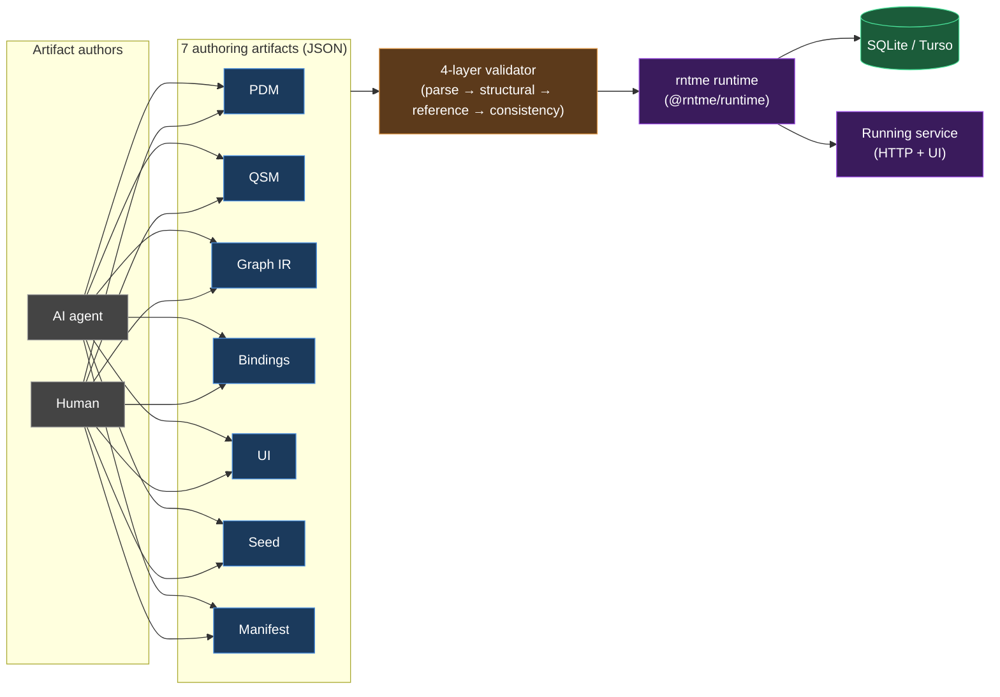

<!--
Architecture overview for rntme.
Spec: docs/superpowers/specs/2026-04-18-architecture-overview-design.md
Cutoff date: 2026-04-18. Later specs are folded in via subsequent bumps, not
retroactively.

Diagram colour palette (use the `classDef` lines below inside mermaid blocks
where styling is desired — copy, do not invent new colours):

  classDef artifact   fill:#1b3a5c,stroke:#4a90e2,color:#fff;
  classDef validator  fill:#5c3a1b,stroke:#e29a4a,color:#fff;
  classDef storage    fill:#1b5c3a,stroke:#4ae29a,color:#fff;
  classDef runtime    fill:#3a1b5c,stroke:#9a4ae2,color:#fff;
  classDef external   fill:#444,stroke:#999,color:#fff;
-->

# rntme — Architecture Overview

> Status: in progress (writing per plan `docs/superpowers/plans/2026-04-18-architecture-overview.md`).
>
> Spec: `docs/superpowers/specs/2026-04-18-architecture-overview-design.md`.
>
> Primary framing: rntme is an artifact-driven runtime for AI-agent-generated services. CQRS, event-sourcing, SQLite, Turso, branded `Validated*` types, and plugin seams are **consequences** of that goal, not the identity of the system. See `rntme_vision_framing` memory.

## Table of contents

1. [Executive summary](#1-executive-summary)
2. [L1 — System Context](#2-l1--system-context)
3. [L2 — Containers](#3-l2--containers)
4. [L3 — Components](#4-l3--components)
5. [L4 — Code](#5-l4--code)
6. [Cross-cutting abstractions](#6-cross-cutting-abstractions)
7. [Observations and refactoring candidates](#7-observations-and-refactoring-candidates)
8. [Glossary](#8-glossary)
9. [How to use and maintain this document](#9-how-to-use-and-maintain-this-document)

---

## 1. Executive summary

**rntme is an artifact-driven runtime.** A service is described by a small set of strictly-validated JSON artifacts (PDM, QSM, Graph IR, bindings, UI, seed, manifest). The runtime loads those artifacts, validates them in layers, and boots a working HTTP + UI service without requiring any service-specific code. The primary payoff is that **AI agents and humans can _generate_ these artifacts and get a running service** — the runtime's job is to make that generation safe and repeatable.

**Key invariants at a glance**

- **SQLite forever.** Scale-out target is Turso (SQLite-compatible); no Postgres dialect path is permitted.
- **JSON authoring only.** No YAML, no TOML for any artifact.
- **`Result<T>` across package boundaries.** No exceptions leak out of a package's public API.
- **Branded `Validated*` types.** Downstream APIs accept only the brand; casting into the brand (`as ValidatedPdm`) is an anti-pattern.
- **Fail-fast layered validation.** Each artifact runs parse → structural → reference/cross-ref → consistency; the orchestrator returns the first failing layer's errors only.

**Design rationale — why these choices serve the vision**

| Decision | Property delivered to the vision |
| --- | --- |
| Layered validators + branded types | An agent-generated artifact cannot silently bypass a check; downstream code cannot consume unvalidated data. |
| CQRS + event-sourcing | Schema and behaviour can evolve without losing history; migrations become replays, not destructive DDL. |
| SQLite (+ Turso) | One service = one file; running many services does not require orchestrating a database cluster. |
| Kafka-style topic convention `rntme.{svc}.{agg}` | Services can be composed into a larger platform (Zeebe sagas, gRPC) without invasive per-service wiring. |
| Plugin seams (`DbDriver`, `EventBus`, `Surface`) | Runtime can be swapped in (e.g. different storage or transport) without changing any of the seven artifacts. |
| Kept-small public surface per package | Agents and humans reason about fewer concepts per artifact; each artifact has a single canonical validator. |

The rest of this document unpacks each of these in order: L1 context (§2), container topology (§3), per-package components (§4), critical functions (§5), the abstractions catalogue (§6), diagnostic observations (§7).

## 2. L1 — System Context

_(pending — Task 3)_

## 3. L2 — Containers

_(pending — Task 4)_

## 4. L3 — Components

_(pending — Tasks 5–12)_

## 5. L4 — Code

_(pending — Task 13)_

## 6. Cross-cutting abstractions

_(pending — Tasks 14–16)_

## 7. Observations and refactoring candidates

_(pending — Tasks 17–20)_

## 8. Glossary

_(pending — Task 21)_

## 9. How to use and maintain this document

_(pending — Task 21)_
