<!--
Architecture overview for rntme.
Spec: docs/superpowers/specs/done/2026-04-18-architecture-overview-design.md
Cutoff date: 2026-04-18. Later specs are folded in via subsequent bumps, not
retroactively.

Diagram colour palette (use the `classDef` lines below inside mermaid blocks
where styling is desired — copy, do not invent new colours):

  classDef artifact   fill:#1b3a5c,stroke:#4a90e2,color:#fff;
  classDef validator  fill:#5c3a1b,stroke:#e29a4a,color:#fff;
  classDef storage    fill:#1b5c3a,stroke:#4ae29a,color:#fff;
  classDef runtime    fill:#3a1b5c,stroke:#9a4ae2,color:#fff;
  classDef external   fill:#444,stroke:#999,color:#fff;
-->

# rntme — Architecture Overview

> Cutoff: 2026-04-26. Originally written per plan `docs/superpowers/plans/done/2026-04-18-architecture-overview.md`; refreshed after PR 9-16 project-first pivot.
>
> Spec: `docs/superpowers/specs/done/2026-04-18-architecture-overview-design.md`.
>
> Primary framing: rntme is an artifact-driven runtime authored as a validated project blueprint folder. CQRS, event-sourcing, SQLite, Turso, branded `Validated*` types, plugin seams, executor seams, and modules are **consequences** of that goal, not the identity of the system.

## Table of contents

1. [Executive summary](#1-executive-summary)
2. [L1 — System Context](#2-l1--system-context)
3. [L2 — Containers](#3-l2--containers)
4. [L3 — Components](#4-l3--components)
5. [L4 — Code](#5-l4--code)
6. [Cross-cutting abstractions](#6-cross-cutting-abstractions)
7. [Observations and refactoring candidates](#7-observations-and-refactoring-candidates)
8. [Glossary](#8-glossary)
9. [How to use and maintain this document](#9-how-to-use-and-maintain-this-document)

---

## 1. Executive summary

**rntme is an artifact-driven runtime authored as a project blueprint.** A working app is described by a validated project blueprint folder: `project.json`, a project-level PDM, N service folders, and integration modules. The project layer composes service-level primitives (QSM, Graph IR, bindings, UI, seed, manifest) and validates routing, middleware, ownership, service discovery, and project-routed binding refs before any runtime surface is booted.

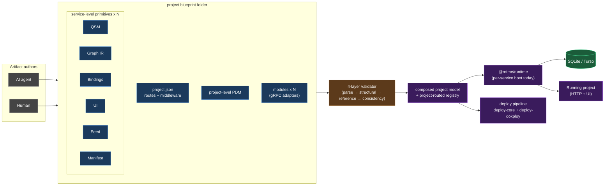

**Key invariants at a glance**

- **SQLite forever.** Scale-out target is Turso (SQLite-compatible); no Postgres dialect path is permitted.
- **JSON authoring only.** No YAML, no TOML for any artifact.
- **`Result<T>` across package boundaries.** No exceptions leak out of a package's public API.
- **Branded `Validated*` types.** Downstream APIs accept only the brand; casting into the brand (`as ValidatedPdm`) is an anti-pattern.
- **Fail-fast layered validation.** Each artifact runs parse → structural → reference/cross-ref → consistency; the orchestrator returns the first failing layer's errors only.

**Design rationale — why these choices serve the vision**

| Decision | Property delivered to the vision |
| --- | --- |
| Layered validators + branded types | An agent-generated artifact cannot silently bypass a check; downstream code cannot consume unvalidated data. |
| CQRS + event-sourcing | Schema and behaviour can evolve without losing history; migrations become replays, not destructive DDL. |
| Project as deployable unit | Whole-project deploys, project-level routing, and project-shared PDM follow the project-first spec (`docs/superpowers/specs/2026-04-23-project-first-blueprint-design.md`). |
| Modules over gRPC | External integrations stay decoupled from the runtime through dynamic-proto-load gRPC adapters (`docs/superpowers/specs/2026-04-19-platform-modules-integration-design.md`). |
| SQLite (+ Turso) | One service = one file; running many services does not require orchestrating a database cluster. |
| Kafka-style topic convention `rntme.{svc}.{agg}` | Services can be composed into a larger platform (Zeebe sagas, gRPC) without invasive per-service wiring. |
| Plugin seams (`DbDriver`, `EventBus`, `Surface`) | Runtime can be swapped in (e.g. different storage or transport) without changing service-level artifacts. |
| Kept-small public surface per package | Agents and humans reason about fewer concepts per artifact; each artifact has a single canonical validator. |

The rest of this document unpacks each of these in order: L1 context (§2), container topology (§3), per-package components (§4), critical functions (§5), the abstractions catalogue (§6), diagnostic observations (§7).

The legacy artifact set is still real, but it is framed as **service-level primitives**, not the top-level product model. The project blueprint folder is the canonical authoring/versioning/deploy unit above them.

## 2. L1 — System Context

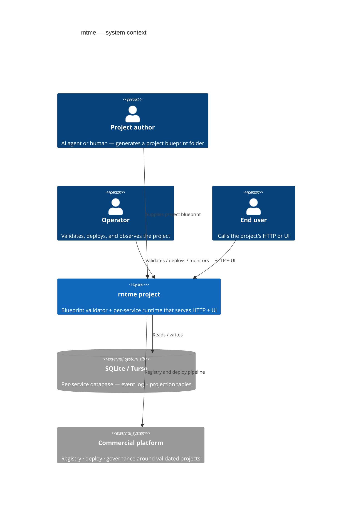

**What the diagram shows.** The project blueprint folder is the direct input from humans/agents. rntme validates project composition, then boots service runtimes behind one project-routed HTTP/UI surface. Storage remains explicitly per-service.

**Why only one storage actor.** rntme treats storage as a per-service concern. The `DbDriver` plugin seam (see §3) lets the same runtime run against `BetterSqlite`, an in-memory driver for tests, or Turso without changing any artifact.

**Why the platform is external.** The commercial platform owns registry, deploy, governance, SSO, and organization control-plane concerns. `@rntme-cli/deploy-core` and `@rntme-cli/deploy-dokploy` consume validated/composed project models, but they are CLI-side and not in the runtime path.

## 3. L2 — Containers

### 3.1 Authoring surface — project blueprint folder

rntme's authoring surface is the validated project blueprint folder. `@rntme/blueprint` owns `project.json`, project-level PDM loading, service artifact discovery, project routes/middleware validation, service member validation, and the project-routed binding registry. Inside the folder, each service still composes from service-level primitives with exactly one canonical validator and consumer.

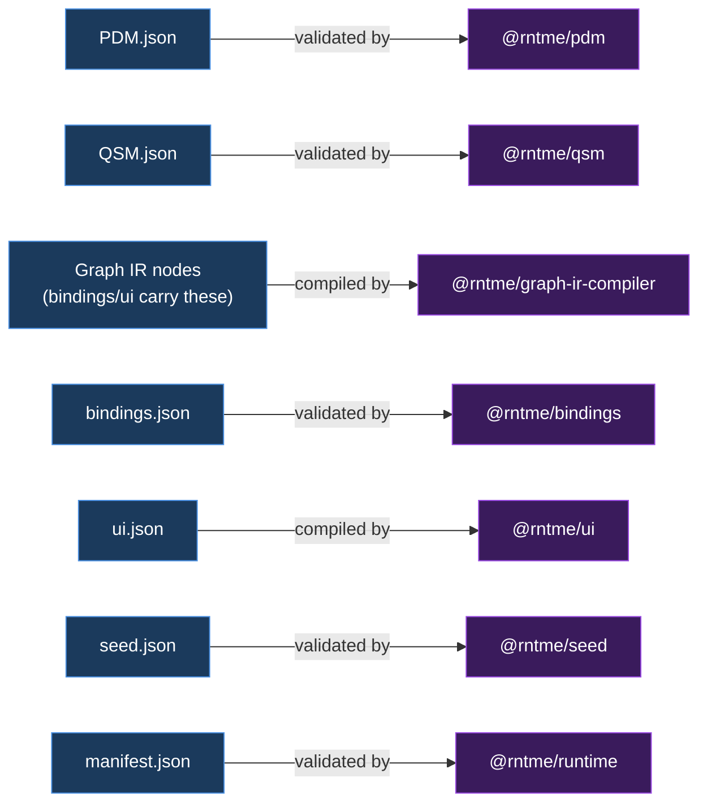

**Caption.** Every artifact has exactly one owner package; a downstream package consuming an artifact does so via the owner's branded `Validated*` type.

### 3.2 Container map — 16 packages

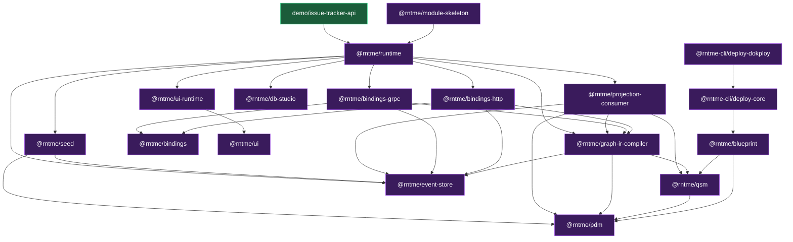

**Caption.** Arrows mean "depends on". `@rntme/blueprint` is the top project-composition layer. `@rntme/runtime` is still the per-service orchestrator; it boots plugin/executor seams, wires modules, projections, bindings, gRPC/HTTP, and UI. `@rntme-cli/deploy-*` packages are CLI-side deployment containers that consume validated/composed project models. The demo is a deprecated historical single-service consumer of `@rntme/runtime`.

### 3.3 Plugin seams — extension without editing artifacts

Three interfaces live in `packages/runtime/src/plugins/`:

- **`DbDriver`** — storage adapter. Default: `BetterSqliteDriver`. Alternate: in-memory for tests, future Turso driver.
- **`EventBus`** — message transport. Default: `InMemoryBus`. Alternate: Kafka / NATS via a custom implementation.
- **`Surface`** — HTTP (or equivalent) entry point. Default: `HttpSurface` (Hono-based). Alternate: any surface that can route bindings.

The manifest (`manifest.json`) selects defaults; a caller passing a custom implementation replaces one seam without editing any other artifact. See `packages/runtime/README.md` for the exact interface shapes.

### 3.4 Boot & seed lifecycle (sequence #3)

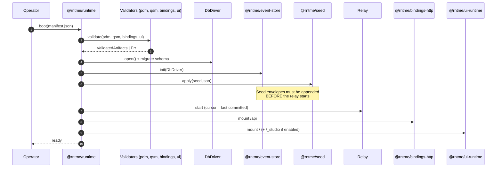

**Caption.** The boot-order invariant (see `2026-04-15-runtime-seed-design.md`) is that seed application and the publish relay are mutually exclusive in time: seeds are committed through `appendRaw` *before* the relay cursor starts advancing, or seed events would double-publish.

## 4. L3 — Components

Each subsection below follows the same structure:

1. **Purpose** — one sentence.
2. **Spec lineage** — which specs shaped this package, in time order.
3. **Component diagram** — internal modules and data flow.
4. **Components** — 2–3 sentences per module naming its responsibility.
5. **Invariants** — what must hold.

Sequence diagrams live with the package that owns the flow.

### 4.1 `@rntme/pdm`

**Purpose.** Parse, validate, resolve, and derive event-types for the PDM artifact — rntme's source of truth for entities, fields, relations, keys, and per-entity finite-state machines that drive event-sourced mutations.

**Spec lineage.**

| Spec | Date | Status | Contribution |
| --- | --- | --- | --- |
| `docs/superpowers/specs/done/2026-04-14-mutations-design.md` | 2026-04-14 | landed | Defined the `stateMachine` extension, derived event-types, and the event-sourcing topology consumed by PDM output. |
| `docs/adr/2026-04-15-event-driven-architecture.md` | 2026-04-15 | ADR | Write-path topology (event log, outbox, relay) that consumes `deriveEventTypes` output. |

**Component diagram.**

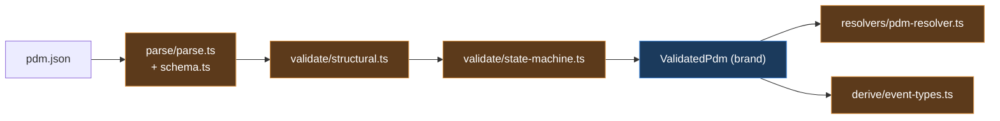

**Caption.** Two validation layers (structural, then state-machine) construct the `ValidatedPdm` brand; resolver and event-type derivation consume the brand — they are not validation layers.

**Components.**

- **`parse/parse.ts` + `parse/schema.ts`** — Zod strict parsing; accepts either a JS object or a JSON string. Returns `Ok<PdmArtifact>` on success or `Err` with `PDM_PARSE_*` codes otherwise.
- **`validate/structural.ts`** — First validation layer. Checks keys reference real fields, relation endpoints resolve, and scalars are well-formed. Constructs the intermediate `StructurallyValidPdm` brand.
- **`validate/state-machine.ts`** — Second validation layer. Enforces state/transition rules, creation-transition `affects` declaration, self-loop non-empty `affects`, and BFS reachability from creation states. Promotes `StructurallyValidPdm` to the final `ValidatedPdm` brand.
- **`validate/index.ts`** — Orchestrator `validatePdm()`. Fail-fast: on a structural error, the state-machine layer does not run.
- **`resolvers/pdm-resolver.ts`** — Pure-lookup facade (`createPdmResolver`) that resolves entity / field / relation / state-machine references to in-memory handles; each resolved transition exposes a computed `declared` list that augments `affects` with `stateField`.
- **`derive/event-types.ts`** — Produces one `EventTypeSpec` per transition, consumed downstream by bindings, projection-consumer, and the event store.

**Invariants.**

- The `ValidatedPdm` brand is constructed only inside `validate/state-machine.ts`; the intermediate `StructurallyValidPdm` brand is constructed only inside `validate/structural.ts`. Downstream packages (QSM, bindings, graph-ir-compiler) accept only the final brand.
- `stateField` is a non-nullable string; `stateMachine.initial` is literal `null` (creation transitions are the only entry).
- Creation transitions and self-loop transitions must declare `affects` explicitly and non-empty.
- Reachability is enforced: any state unreachable from a creation transition is rejected with `PDM_SM_UNREACHABLE_STATE`.
- `relation.to` is local-only; cross-service relations are an explicit gap tracked in `docs/gaps/pdm-gaps.md` and in the package's "Out of scope" README section.

### 4.2 `@rntme/qsm`

**Purpose.** Parse, validate, and derive DDL + event handlers for QSM — the query-side model that declares read-side projections (entity-mirrors) over the PDM, and, post-2026-04-16, owns the relation metadata used for JOINs.

**Spec lineage.**

| Spec | Date | Status | Contribution |
| --- | --- | --- | --- |
| `docs/superpowers/specs/done/2026-04-14-mutations-design.md` | 2026-04-14 | landed | Entity-mirror projection contract: backing semantics, key/grain rules, generated columns, idempotency triple (§6). |
| `docs/superpowers/specs/done/2026-04-16-qsm-relations-migration-design.md` | 2026-04-16 | in-flight | Read-side relation graph moved from PDM to QSM: B2 cross-validation rules, single-hop / fan-out gates, error codes. |

**Component diagram.**

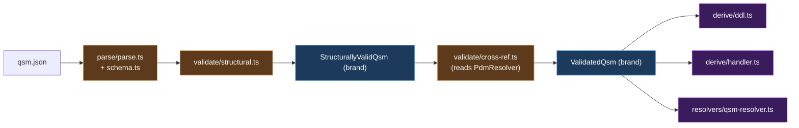

**Caption.** Two validation layers (structural, then PDM-aware cross-ref) produce `ValidatedQsm`. Both derive modules also take a `PdmResolver` to look up entity shapes and event types; only `resolvers/qsm-resolver.ts` is PDM-free.

**Components.**

- **`parse/parse.ts` + `parse/schema.ts`** — Zod strict parser; accepts object or JSON string. Emits `QSM_PARSE_SCHEMA_VIOLATION` on failure.
- **`validate/structural.ts`** — PDM-free rules: empty / duplicate keys / grain / exposed, table-name collisions, relation-key shape `"<Projection>.<relation>"`. Constructs `StructurallyValidQsm`.
- **`validate/cross-ref.ts`** — PDM-aware rules: entity and field existence, entity-mirror constraints (keys and grain set-equal to source entity's keys; source entity must have a state-machine), at-most-one entity-mirror per source entity, and B2 relation parity with PDM on `(to, localKey, foreignKey, cardinality)`. Promotes to `ValidatedQsm`.
- **`validate/index.ts`** — `validateQsm()` orchestrator: structural → cross-ref, fail-fast.
- **`derive/ddl.ts`** — `generateProjectionDdl(ValidatedQsm, PdmResolver)` → `ProjectionDdlSpec[]`. Entity-mirror specs carry the full idempotency triple `(last_event_id, last_event_version, applied_at)`; derived specs (opt-in via `opts.derivedSchemas`) carry only `(last_event_id, applied_at)` plus a separate `seen_events` dedup table. State-field indexes and a `CREATE TABLE` statement are emitted with SQLite double-quoted identifiers.
- **`derive/handler.ts`** — `deriveProjectionHandler(ValidatedQsm, PdmResolver)` → `ProjectionHandlerSpec[]`. One `EventHandler` per `EventTypeSpec` with an `insert | update` op respecting the idempotency guard.
- **`resolvers/qsm-resolver.ts`** — Pure-lookup facade (`createQsmResolver`) with `listProjections`, `resolveProjection`, `findEntityMirror`, `listRelations`, `resolveRelation`.
- **`common/invariant.ts`** — `invariantViolated()` post-validation safety net; consumed by derive/* and resolver.

**Invariants.**

- **Brand path is the only path.** `ValidatedQsm` is constructed only in `validate/cross-ref.ts`; `StructurallyValidQsm` only in `validate/structural.ts`. Downstream (graph-ir-compiler, projection-consumer) accepts only `ValidatedQsm`.
- **Entity-mirror key / grain contract.** Keys and grain of an entity-mirror projection must be set-equal to the source entity's keys. Enforced by `QSM_XREF_ENTITY_MIRROR_KEYS_MISMATCH` and `QSM_XREF_ENTITY_MIRROR_GRAIN_MISMATCH`.
- **One mirror per entity.** `QSM_XREF_ENTITY_MIRROR_DUPLICATE` rejects a second entity-mirror for the same source entity.
- **`derived` backing is gated at cross-ref.** Zod accepts `backing: 'derived'`; the standard `validateQsm()` path rejects it in `validate/cross-ref.ts` with `QSM_BACKING_DERIVED_NOT_SUPPORTED`. `derive/ddl.ts` has a forward-compat path (`opts.derivedSchemas`) that produces DDL for derived projections, but no runtime consumer currently enables it — this is an explicit MVP gate.
- **B2 relation parity.** QSM relations must match PDM on `(to, localKey, foreignKey, cardinality)`. PDM is canon; divergence fails cross-ref with specific mismatch codes.
- **`cardinality: 'many'` is reserved.** Parser and validator accept it, but graph-ir-compiler refuses to lower it (`NAV_FAN_OUT_NOT_ALLOWED`). Author should treat `many` as forward-compat only.
- **Idempotency columns are immutable.** Entity-mirror tables carry `last_event_id`, `last_event_version`, `applied_at`; derived tables carry `last_event_id`, `applied_at` plus a `seen_events` dedup row. Names are stable; renaming is a breaking change for projection-consumer.

### 4.3 `@rntme/event-store`

**Purpose.** SQLite-backed event log with optimistic concurrency, a per-relay monotonic publish cursor, and a Kafka-style at-least-once relay — the write side of rntme's CQRS / event-sourced pipeline.

**Spec lineage.**

| Spec | Date | Status | Contribution |
| --- | --- | --- | --- |
| `docs/superpowers/specs/done/2026-04-14-mutations-design.md` | 2026-04-14 | landed (superseded) | Pre-D9 event model; envelope fields are now covered by the CloudEvents design below. |
| `docs/superpowers/specs/done/2026-04-17-cloudevents-envelope-design.md` | 2026-04-17 | landed | D9 CloudEvents 1.0 envelope end-to-end — shape (§3.1), DLQ wrapper (§5.2), topic convention (§6), schema compatibility (§7). |
| `docs/superpowers/specs/done/2026-04-17-relay-dlq-delivery-tracking-design.md` | 2026-04-17 | landed | A1 delivery-tracking table + unbounded DLQ retry semantics. |

**Component diagram.**

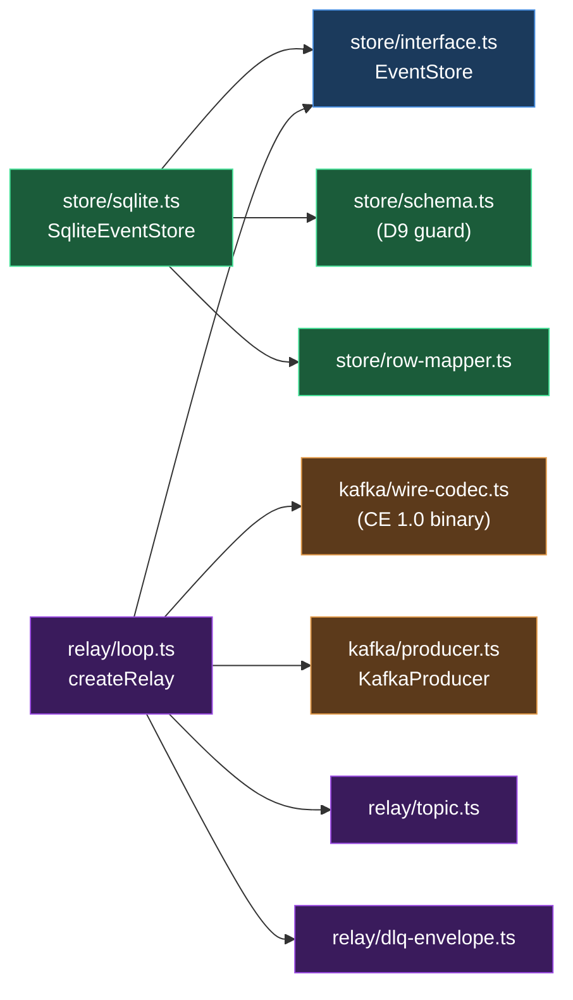

**Caption.** The `EventStore` interface is the single seam the rest of the system talks to. `SqliteEventStore` is the default implementation; the relay polls it, encodes envelopes via the CloudEvents 1.0 wire codec, and publishes through a `KafkaProducer` (in-memory in tests).

**Components.**

- **`store/interface.ts`** — The `EventStore` interface: `appendEvents`, `appendRaw`, `readStream`, `readFrom`, `readRecordsFrom`, `readCursor` / `writeCursor`, plus per-event delivery-tracking ops (`readDeliveryAttempt`, `recordDeliveryAttempt`, `updateLastError`, `markDelivered`, `markDlq`).
- **`store/sqlite.ts`** — `SqliteEventStore` implementation over `better-sqlite3` with `journal_mode=WAL`. Maps SQLite errors to `ConcurrencyConflict` / `DuplicateEventId`. All append requests in one batch run in a single `immediate` transaction — atomic across subjects.
- **`store/schema.ts`** — DDL (`applyEventStoreSchema`) plus `assertSchemaD9Compatible(db)` that rejects pre-D9 files missing the `correlation_id` column.
- **`store/row-mapper.ts`** — `rowToEnvelope(row, serviceName)` re-derives CloudEvents `source` / `type` / `dataSchema` on read so those fields need not be persisted verbatim.
- **`relay/loop.ts`** — `createRelay({ store, cursorId, kafka, ... })` spins a polling loop: read from cursor → encode → send → record delivery → advance cursor. Retries per event with exponential backoff (10 ms → `maxBackoffMs`, up to `maxAttempts`). Emits a DLQ envelope after exhaustion.
- **`relay/topic.ts`** — `defaultTopicOf(service, aggregate)` returns `rntme.{service}.{aggregate}` (both lowercased). No `.v1` suffix.
- **`relay/dlq-envelope.ts`** — `buildDlqEnvelope` wraps a failed event with `type: '{service}.Relay.EventDeliveryFailed'`, published to `{topic}.dlq`.
- **`kafka/wire-codec.ts`** — `toCloudEventWire` / `fromCloudEventWire` — CloudEvents 1.0 binary content mode (CE attributes in headers, JSON payload in body).
- **`kafka/producer.ts` + `kafka/in-memory.ts`** — `KafkaProducer` interface plus an in-memory test producer.

**Invariants.**

- **Caller mints `id`, `time`, and `correlationId`.** The store never generates them; determinism matters for replay and golden tests. `correlation_id` is `NOT NULL` in the schema.
- **Optimistic concurrency on `(subject, expectedVersion)`.** `expectedVersion` is the pre-append `MAX(version)` for the subject; `0` means the subject does not exist. Violation raises `ConcurrencyConflict(subject, expectedVersion, actualVersion)`.
- **Append is atomic across subjects.** A multi-request batch either fully commits or fully rolls back (single `immediate` transaction).
- **Per-subject order in Kafka, not cross-subject.** The relay sets Kafka `key = subject`, giving partition affinity; cross-subject ordering is not guaranteed.
- **At-least-once delivery.** The publish cursor advances only after a batch is accepted by the producer. Crash mid-batch replays on restart; consumers must deduplicate by `event_id`.
- **Monotonic cursor per relay.** `writeCursor` rejects non-monotonic `last_event_id` values. Each relay instance uses its own `cursorId`.
- **Unbounded DLQ retry.** If the DLQ topic itself fails, the relay keeps retrying the DLQ envelope; `onDlqError` surfaces the failure to the operator.
- **Topic convention is fixed.** `rntme.{service}.{aggregate}`, lowercase, no version suffix. Breaking event changes are modelled as a new `eventType`, not a new topic.
- **`serviceName` is immutable.** It flows into CE `source`, `type`, `dataSchema`, and the topic; renaming after events exist rewrites derived values.
- **Single-writer SQLite.** WAL + `busy_timeout` handles short contention; multi-instance writes to the same file are not supported.
- **`appendRaw` trusts the caller's `rntVersion`** — non-contiguous versions are permitted for seed and replay only.

#### Sequence #6 — Envelope lifecycle

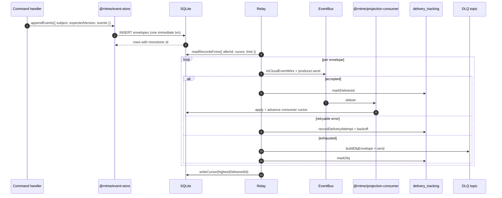

**Caption.** The publish cursor advances only after a batch's primary sends complete (or enter DLQ); a consumer failure is recorded in `delivery_tracking` but does not block the cursor — the relay is at-least-once; the consumer deduplicates on `event_id`.

### 4.4 `@rntme/graph-ir-compiler`

**Purpose.** Parse, validate, plan, lower, and execute rc7 Graph IR authoring specs. Query graphs lower to SQLite `SELECT`; command graphs compile to event-sourced emit plans executed against `@rntme/event-store`.

**Spec lineage.**

| Spec | Date | Status | Contribution |
| --- | --- | --- | --- |
| `docs/superpowers/specs/done/2026-04-13-graph-ir-sql-compiler-mvp-design.md` | 2026-04-13 | landed | MVP Tier 1 scope: `findMany` / `filter` / `map` / `reduce` / `sort` / `limit` / `emit`; structural + semantic validation; SQLite target; TDD workflow. |
| `docs/superpowers/specs/done/2026-04-16-predicate-optional-fix-design.md` | 2026-04-16 | landed | Fixes `wrapPredicateOptional` param-position misalignment by reordering OR args; regression tests at unit and e2e. |

Historical note: `graph_ir_rc_7.md` (gitignored, local-only) was the first-step IR language sketch; it is not treated as canon — later specs supersede it (see §7.8).

**Component diagram.**

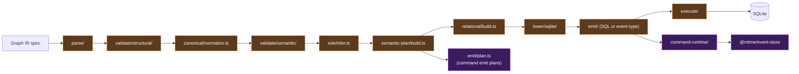

**Caption.** Parse / structural / normalize / semantic / semantic-plan are shared by both roles. The role inferer splits the pipeline into a query tail (relational → lower → emit SQL → execute) and a command tail (buildEmitPlans → command-runtime → event-store). Neither tail skips the shared head; the role check happens after canonicalisation so it can inspect the final graph.

**Components.**

- **`parse/` + `types/authoring.ts`** — Zod rc7 discriminated-union parser; produces `AuthoringSpec`. First line of defence; rejects syntactic errors with `PARSE_SCHEMA_VIOLATION`.
- **`validate/structural/`** — PDM-free rules: id uniqueness, output/input shapes, DAG, map/reduce arity, tier-1 node set, command shape, role. Errors are `STRUCT_*`.
- **`canonical/normalize.ts`** — Lifts authoring → `CanonicalNode`, allocates scope ids, fills sort defaults.
- **`validate/semantic/`** — PDM / QSM aware rules: source resolution, nav-relation / projection-required checks, scope-aware field resolution, param-context (`predicate_optional` only inside `filter`), shape-conformance, aggregate-phase. Errors are `SEM_*` or `NAV_*`.
- **`role/infer.ts`** — Classifies the graph as `query` / `command` / `predicate` / `mapper` / `reducer`. Rowset + emit in the same graph is `GRAPH_MIXED_ROLE`.
- **`semantic-plan/build.ts`** — Produces `SemanticPlan` (a typed `PlanStep[]`) from the canonical graph. Consumed by both tails.
- **`relational/build.ts`** — Query-tail only. Lowers `PlanStep[]` to a `RelOp` tree (`Scan` / `Filter` / `Project` / `Aggregate` / `Sort` / `Limit` / `Join`).
- **`lower/sqlite/lower.ts` + `expr.ts` + `joins.ts`** — Lowers `RelOp` to a `SqlSelect` AST with an ordered `paramOrder` list. `wrapPredicateOptional` wraps a filter expression with null-guards for each optional param; on 2026-04-16 a param-alignment bug was fixed by swapping the OR argument order so inner params walk before the guard `?` in emitted SQL.
- **`lower/sqlite/emit.ts`** — Serialises the AST to a SQL string.
- **`execute/execute.ts`** — Binds the `paramOrder` list positionally and runs the statement against the given SQLite driver.
- **`emit/plan.ts` + `event-type.ts` + `payload.ts`** — Command tail. Produces `EmitPlan[]` (one per `emit` node) and the runtime payload-builder. Emit-payload expressions at runtime may reference `$param` and `$literal` only — field paths are rejected.
- **`command-runtime/compile.ts` + `execute.ts` + `replay.ts` + `transition.ts`** — Command entry; re-validates PDM / QSM internally; at runtime, runs an optional read-prelude, replays aggregate state, checks `stateMachine` transition legality, builds payloads, appends to the event store. Only `COMMAND_CONCURRENCY_CONFLICT` is mapped from event-store errors; others propagate.
- **`explain/explain.ts`** — Returns partial artifacts on failure (parsed / canonical / semanticPlan / relational / sql / paramOrder) so agents can diagnose without re-running the pipeline.

**Invariants.**

- **Two public entries, not unified.** `compile()` for query graphs, `compileCommand()` for command graphs. Both perform the shared head and then diverge by role.
- **Validation order is load-bearing.** Structural before normalize; `inferRole` after canonical. Reordering silently breaks `SEM_PARAM_CONTEXT` and `GRAPH_MIXED_ROLE` detection.
- **Exactly one graph per compile.** `STRUCT_DUPLICATE_GRAPH_ID` rejects multi-graph specs.
- **`predicate_optional` only in `filter`.** `SEM_PARAM_CONTEXT` rejects it elsewhere.
- **NAV rules are validator errors, not runtime throws.** `NAV_NOT_ALLOWED` and `NAV_FAN_OUT_NOT_ALLOWED` surface at semantic layer; lowering-site throws are defensive safety nets only.
- **`makeColumnOf` requires an entity-mirror projection.** Enforced earlier by `checkNavProjectionRequired`; lowering assumes it held.
- **Param order is bind order.** `lowerExpr`, `wrapPredicateOptional`, and limit-appending append to `paramOrder` in statement order; `execute()` binds positionally. A reorder here is a correctness bug.
- **Creation transitions replay against `version = 0`.** First `append` sets `lastVersion = 1`; `COMMAND_CONCURRENCY_CONFLICT` surfaces the only event-store error.
- **Emit-payload runtime accepts `$param` and `$literal` only.** Field paths throw; this is the only runtime-side rc7 restriction.
- **SQLite ≥ 3.30 is required** (for `NULLS FIRST / LAST` in `ORDER BY`).

#### Sequence #5 — IR → SQL (query tail)

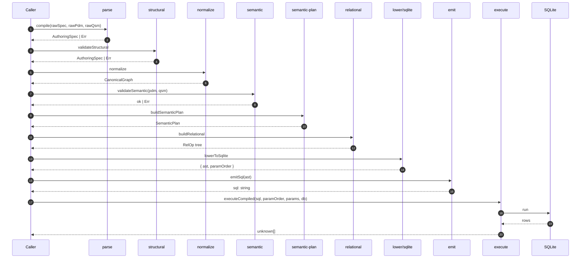

**Caption.** Parse through semantic-plan is shared with the command tail; from `buildRelational` onward is query-only. Param-binding is positional: `execute` maps `params[name]` into positions using `paramOrder`.

#### Sequence #1 — Command write path

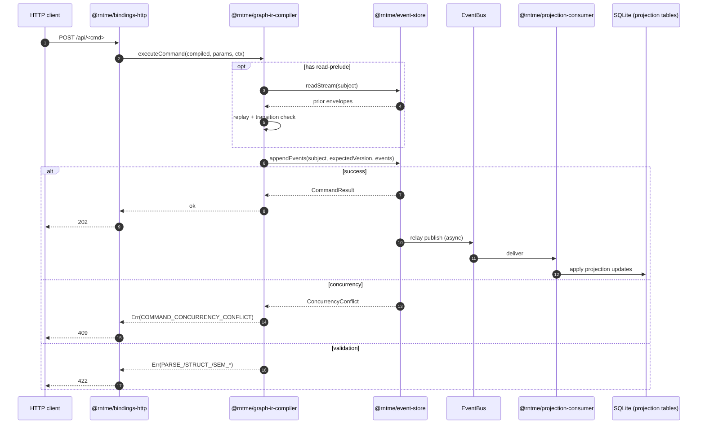

**Caption.** `executeCommand` runs any read-prelude against the event store, replays aggregate state, and only then appends. The HTTP response returns as soon as the append commits; projection updates are asynchronous — a client that needs read-after-write must poll the query endpoint.

#### Sequence #2 — Query read path

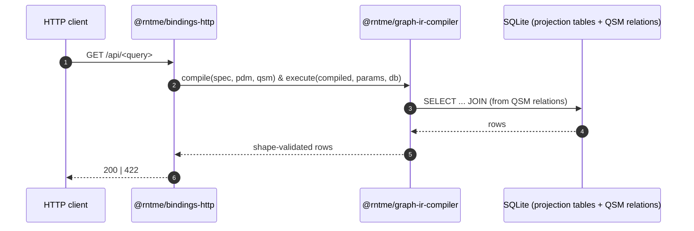

**Caption.** Query lowering uses QSM relation metadata (post-2026-04-16) to construct JOINs; the response shape is declared in the binding artifact and validated against the query's output row-type.

### 4.5 `@rntme/projection-consumer`

**Purpose.** Kafka-to-SQLite read-side runner. Bootstraps entity-mirror DDL, compiles per-event apply handlers from PDM + QSM (and from graph-IR-derived projection handlers), and drains envelopes into projection rows under an all-or-nothing batch transaction, guarded by hybrid idempotency.

**Spec lineage.**

| Spec | Date | Status | Contribution |
| --- | --- | --- | --- |
| `docs/superpowers/specs/done/2026-04-14-mutations-design.md` | 2026-04-14 | landed | §6 projection consumer + QSM store: mirror table shape (§6.1–§6.3), batch loop (§6.4), three-layer idempotent apply (§6.5), offset tracking (§6.6), tier-2 deferrals (§6.9). |
| `docs/superpowers/specs/done/2026-04-18-d5-consumer-idempotency-hybrid-design.md` | 2026-04-18 | proposed | D5 hybrid idempotency: per-row `last_event_version` for mirrors plus a shared `seen_events(event_id, projection_id)` table for derived projections; unblocks graph-IR-backed projections. |

**Component diagram.**

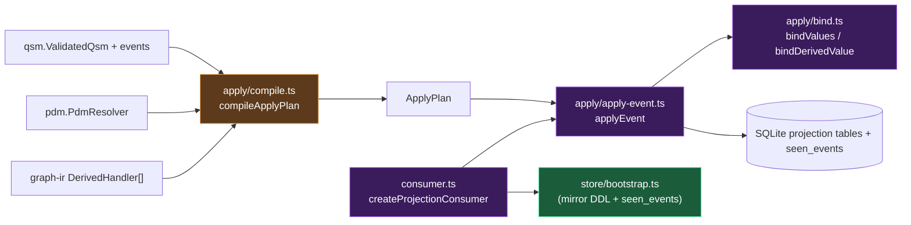

**Caption.** `compileApplyPlan` is pure and can run at build time; `applyEvent` runs inside the batch transaction owned by `createProjectionConsumer`. The `seen_events` table is created alongside the mirror tables in `bootstrapProjections`.

**Components.**

- **`store/bootstrap.ts`** — `bootstrapProjections(db, ProjectionDdlSpec[])` rewrites DDL to `IF NOT EXISTS` and creates the shared `seen_events(event_id, projection_id)` composite-key table plus an `applied_at` index.
- **`apply/compile.ts`** — `compileApplyPlan({ pdm, qsm, events, derivedHandlers? })` → `ApplyPlan`. Pure (no DB); produces `handlersByEventType` and `mirrorsByAggregate`. Rejects composite keys with `PC_COMPOSITE_KEY_NOT_SUPPORTED` and missing fields with `PC_MISSING_ENTITY_FIELD`.
- **`apply/apply-event.ts`** — `applyEvent` dispatches by handler kind: mirror handlers pre-check `last_event_version`, run the compiled SQL, and reclassify 0-row writes as `skipped-older-version`; derived handlers gate on `seen_events`, run the delta UPSERT, and record the seen row.
- **`apply/bind.ts`** — `bindValues` (mirror) and `bindDerivedValue` (derived) resolve `ColumnBinding` unions to positional SQL params in the exact order emitted by `compileApplyPlan`.
- **`consumer.ts`** — `createProjectionConsumer({ db, plan, consumer, onError? })` runs the batch loop: `BEGIN IMMEDIATE → for each envelope applyEvent → COMMIT → commitOffsets(batch)`; `ROLLBACK` on any throw. Without `onError`, loop terminates on failure; with `onError`, offsets stay uncommitted and the batch is re-delivered.
- **`kafka/in-memory.ts`** — Test / demo `KafkaConsumer` adapter with async-iterator, monotonic offsets, and replay via `produce`.
- **`types/apply.ts` + `types/consumer.ts` + `types/errors.ts`** — `ApplyPlan`, `CompiledHandler` (union of `MirrorHandler | DerivedHandler`), `ColumnBinding` union (8 kinds), `ApplyResult` (5 outcomes), `KafkaConsumer` interface, and `ApplyCompileErrorCode`.

**Invariants.**

- **Three-layer idempotency for mirror handlers.** (1) Pre-check `last_event_version`; (2) `INSERT … ON CONFLICT DO UPDATE … WHERE last_event_version < excluded.last_event_version`; (3) `UPDATE … WHERE last_event_version < ?`. Removing any layer regresses replay safety.
- **Hybrid idempotency for derived handlers.** Composite `seen_events(event_id, projection_id)` table gates each apply; inserted after a successful delta UPSERT. `last_event_version` is not available on derived rows (aggregates over many events).
- **Batch atomicity.** All events in a Kafka batch commit together under `BEGIN IMMEDIATE`; a thrown apply rolls the whole batch back and leaves offsets uncommitted, so the broker re-delivers.
- **Single-column key only.** Composite keys rejected at compile; deferred to tier 2.
- **Idempotency columns are appended in a fixed order.** Reordering breaks positional binding.
- **Unknown aggregate ⇒ commit-but-skip.** Envelopes targeting an aggregate without a mirror return `skipped-no-mirror`; the batch still commits its offset.
- **Type coercion is centralised.** `bindValues` and the pre-check `SELECT` coerce aggregate-id types identically; divergence breaks the version guard for integer keys.
- **No DLQ here.** A poison message is the relay's or the Kafka adapter's concern; the consumer only exposes `onError` to swap termination for continue.
- **State-column literal only on creation with a state machine.** Otherwise the state column comes from `payload.after`.
- **`generated: 'createdAt' | 'updatedAt'` both bind `envelope.occurredAt`.** Updates re-emit `updatedAt` on every event.
- **SQLite-only today.** Uses `BEGIN IMMEDIATE`, `ON CONFLICT DO UPDATE`, and `excluded.<col>`; future target is Turso.

### 4.6 `@rntme/bindings` + `@rntme/bindings-http`

**Purpose.** `@rntme/bindings` parses, validates (4 layers), and emits OpenAPI 3.1 for the HTTP binding artifact — a declarative map from `(method, path)` tuples to graphs plus input/output shapes. `@rntme/bindings-http` is the Hono sub-router that, given a `ValidatedBindings` artifact and a Graph IR spec, mounts those bindings at runtime and serves `/openapi.json`.

**Spec lineage.**

| Spec | Date | Status | Contribution |
| --- | --- | --- | --- |
| `docs/superpowers/specs/done/2026-04-14-bindings-design.md` | 2026-04-14 | landed | Bindings artifact format (§4), 4-layer validator (§6), OpenAPI mapping (§7), package layout (§8). |
| `docs/superpowers/specs/done/2026-04-14-bindings-http-design.md` | 2026-04-14 | landed | Hono surface: public API, request lifecycle, Zod rules, startup pipeline, error model. |

**Component diagram.**

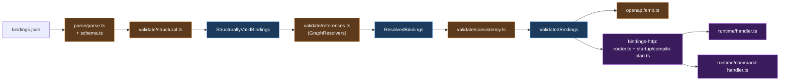

**Caption.** Bindings runs four layers (parse, structural, references, consistency) with two intermediate brands (`StructurallyValidBindings`, `ResolvedBindings`) before producing `ValidatedBindings`. The same `ValidatedBindings` value is consumed by the OpenAPI emitter and by `@rntme/bindings-http`'s router — no second parse, no cast.

**Components.**

- **`bindings/parse/*`** — Zod strict parser. Enums include `method` (`GET | POST`), `in` (`query | path | body`), `kind` (`query | command`, default `query`). Emits `BINDINGS_PARSE_*` codes.
- **`bindings/validate/structural.ts`** — Binding / method / path uniqueness, path-placeholder symmetry (`{id}` ↔ parameter name set), GET-cannot-have-body, command method = `POST` only, command cannot declare `in: 'query'` parameters.
- **`bindings/validate/references.ts`** — Resolves each binding's graph signature (inputs, output shape) via `BindingResolvers` and checks every `bindTo` exists in the target graph.
- **`bindings/validate/consistency.ts`** — Kind × role matrix (see below), root-input ban, output-shape contract, mode ↔ required matrix, type ↔ location rules, unbound inputs.
- **`bindings/openapi/emit.ts` + `shapes.ts` + `parameters.ts` + `responses.ts` + `errors.ts`** — Produces an OpenAPI 3.1 `OpenApiDoc` with `paths`, `components.schemas`, the built-in `CommandResult` shape for command responses, and the standard 400 / 409 / 422 / 500 error schemas. Passthrough (`x-*`) annotations deep-merge.
- **`bindings-http/router.ts`** — Entry point `createBindingsRouter({ bindings, graphIrSpec, pdm, qsm, eventStore? })`. Throws a single aggregated `BindingsRuntimeError` if compile errors exist; mounts query / command handlers per binding; serves `/openapi.json`.
- **`bindings-http/startup/compile-plan.ts`** — Per binding, slices the Graph IR to the target graph and calls `compile` or `compileCommand`, producing a `QueryBindingPlan | CommandBindingPlan` discriminated-union.
- **`bindings-http/startup/zod-schema.ts` + `primitive-schema.ts` + `hono-path.ts`** — Derives per-request Zod schemas (query / path / body) from the binding's input set; rewrites OpenAPI `{id}` to Hono `:id`.
- **`bindings-http/runtime/handler.ts` + `command-handler.ts` + `extract.ts` + `remap.ts`** — Per request: extract (list vs last-wins for query), Zod-parse, `bindTo`-map to graph inputs, execute, serialize. Correlation id is injected by `correlation-middleware.ts`.

**Kind × role matrix** (enforced by `validate/consistency.ts`):

| Binding kind | Graph role | Valid? | Required output |
| --- | --- | --- | --- |
| `query` | `query` | ✓ | `rowset<T>` |
| `query` | `command` | ✗ (`BINDINGS_QUERY_ON_COMMAND_GRAPH`) | — |
| `command` | `query` | ✗ (`BINDINGS_COMMAND_ON_NON_COMMAND_GRAPH`) | — |
| `command` | `command` | ✓ | `row<CommandResult>` |

**Error → HTTP status mapping** (bindings-http):

| Status | Trigger |
| --- | --- |
| `400 VALIDATION_ERROR` | Zod `safeParse` failure on query / path / body. |
| `400 INVALID_BODY` | Body is not a JSON object. |
| `409 COMMAND_CONCURRENCY_CONFLICT` | `CommandExecutionError.code === 'COMMAND_CONCURRENCY_CONFLICT'`. |
| `422 COMMAND_*` | Any other `CommandExecutionError` (e.g. `COMMAND_ILLEGAL_TRANSITION`, `COMMAND_GUARD_REJECTED`). |
| `500 INTERNAL_ERROR` | Any uncaught throw. |

**Invariants.**

- **Same 4-layer shape as pdm / qsm / ui.** The bindings validator is the canonical instance of rntme's layered-validator pattern: parse → structural → references → consistency.
- **Fail-fast across layers; aggregate within.** A layer returns all its errors before the next layer runs.
- **Branded stage order.** `StructurallyValidBindings` → `ResolvedBindings` → `ValidatedBindings`; each brand is constructed only by its validator.
- **Commands output `row<CommandResult>`.** Built-in shape `{ aggregateId: string, version: integer, eventIds: array<string> }`.
- **Commands are `POST`-only.** `in: 'query'` parameters are forbidden on a command binding.
- **`requestBody.required = true` whenever any `in: 'body'` parameter exists.** Per-field `required` does not override this.
- **`in: 'path'` parameters are always `required: true`** and the placeholder set must equal the parameter set exactly.
- **Root inputs cannot be bound.** Graphs with `mode: 'root'` inputs fail `BINDINGS_GRAPH_HAS_ROOT_INPUT`.
- **Mode ↔ required matrix.** `required → [true]`, `defaulted → [false]`, `predicate_optional → [false]`, `nullable → [true, false]`, `root → []`.
- **Type ↔ location rules.** Scalars legal everywhere; `list<T>` legal in query / body only; row / rowset forbidden as input.
- **Passthrough annotations deep-merge.** Arrays replace; objects merge key-wise.
- **bindings-http is strict end-to-end.** Zod schemas are `.strict()`; no `additionalProperties: true` escape hatch.
- **`eventStore` is required when any binding is `kind: 'command'`.** Synchronous throw before route mount.
- **Compile errors aggregate.** A partial router is never mounted; `BindingsRuntimeError` carries all failures.

#### Sequence #4 — Validation pipeline (on bindings; shared pattern)

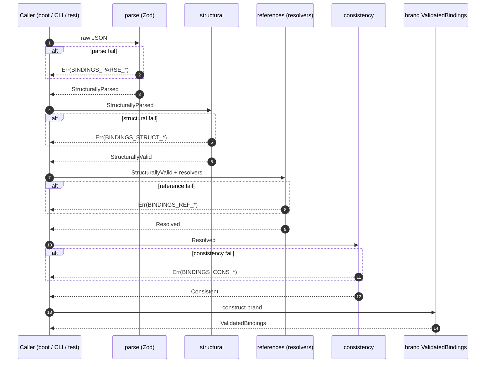

**Caption.** pdm / qsm / ui all run the same four layers in this order; only the error-code prefixes and the specific rules differ. The brand is constructible only after all four layers pass — there is no `as ValidatedX` escape hatch in any legitimate code path.

### 4.7 `@rntme/ui` + `@rntme/ui-runtime`

**Purpose.** `@rntme/ui` compiles a multi-file UI authoring tree (manifest + layouts + screens + fragments, all JSON) into a single `CompiledArtifact`. `@rntme/ui-runtime` mounts a Hono sub-router that serves the compiled artifact as per-screen JSON endpoints and a static shell, paired with an esbuild-bundled React SPA that hydrates on the client and fetches screens on-demand.

**Spec lineage.**

| Spec | Date | Status | Contribution |
| --- | --- | --- | --- |
| `docs/superpowers/specs/done/2026-04-16-ui-artifact-v2-design.md` | 2026-04-16 | landed | UI artifact v2: manifest + screens + layouts + fragments, six-stage pipeline, `CompiledArtifact` shape consumed by the runtime. |

**Component diagram.**

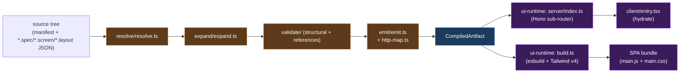

**Caption.** The compiler's six stages (parse → resolve → expand → validate → compile orchestrator → emit) produce a single JSON artifact. The runtime splits that artifact into per-screen / per-layout / manifest endpoints so the SPA loads only what each route needs.

**Components (ui compiler).**

- **Parse (implicit).** `JSON.parse` inside `resolve.readFile` catches syntax errors with `MANIFEST_INVALID`.
- **`resolve/resolve.ts`** — Reads the source tree, assembles paired `*.spec.json` + `*.screen.json` / `*.layout.json` files, detects `$ref` cycles.
- **`expand/expand.ts`** — Inlines fragments, substitutes `$param`, prefixes nested element ids as `<refKey>__<elKey>`. After this stage the tree has no `$ref` or `$param` tokens.
- **`validate/` (structural + references)** — Structural: root-element existence, no orphans, slot-only-in-layout. References: bindings resolve, navigation targets match manifest routes, state paths land in a covered prefix (`/form/`, `/route/params/`, `/data/`, `/data/__status/`, `/data/__error/`, `/actions/`).
- **`compile.ts` orchestrator** — Chains the above with fail-fast and produces a `CompiledArtifact` via `emit`.
- **`emit/emit.ts` + `http-map.ts`** — Maps binding ids to HTTP paths (consumes the ValidatedBindings contract), assembles the final artifact (`manifest`, `layouts`, `screens`).

**Components (ui-runtime).**

- **`server/index.ts`** — `createApp({ artifact, assetsDir? })` Hono app. Routes:
  - `GET /_manifest.json` → artifact.manifest.
  - `GET /_layouts/:name` → `artifact.layouts[name]` (404 on miss).
  - `GET /_screens/:name` → `artifact.screens[name]` (404 on miss).
  - `GET /assets/:file` → static file from `assetsDir` (path-traversal sandboxed).
  - `GET /*` → HTML shell (SPA deep-link fallback).
- **`server/static-shell.ts`** — Emits a minimal HTML document loading `/assets/main.js` and `/assets/main.css`.
- **`client/entry.tsx`** — `hydrateApp({ rootSelector })`: fetches `/_manifest.json`, wires store / loader / registry / driver, renders `<AppShell>` and listens to `popstate`.
- **`client/router.ts`** — `matchRoute` (exact-then-`:param` precedence) + `expandTemplate`.
- **`client/screen-loader.ts`** — Per-instance in-memory cache for `/_screens/:name.json` and `/_layouts/:name.json`.
- **`client/registry.ts` + `driver.ts` + `layout-manager.tsx`** — Wires the shadcn catalog, `navigate` / `dispatch` actions with zod validation, parallel data-endpoint fetches with `/data/__status` / `/data/__error` sentinels, and the `<AppShell>` that composes json-render state / action / visibility / validation providers.
- **`build.ts`** — esbuild bundles `client/entry.tsx` → `build/main.js` (ESM, es2022); Tailwind v4 CLI scans that bundle (via `@source` in `client/styles.css`) → `build/main.css`. Both are served under `/assets/`.

**Invariants.**

- **Manifest version is literal `"2.0"`.** Anything else fails at parse.
- **Screen key = route path's last segment.** Two routes with the same trailing segment collide.
- **`$ref` and `$param` are erased post-expand.** Compiled specs contain neither token.
- **Fragment element ids are prefixed recursively.** `<refKey>__<elKey>`, nested refs accumulate.
- **Structural errors short-circuit reference validation.** A broken tree never reaches the reference-layer rules.
- **History-based routing, not hash-based.** SPA deep-link fallback is served by the Hono `GET /*` route.
- **Path precedence is exact-then-param.** `/issues/browse` matches literal before `/issues/:id`.
- **Build order matters.** Tailwind scans the JS bundle; running Tailwind first prunes shadcn classes.
- **Only `server` is exported from the package root.** Browser-only code must import `@rntme/ui-runtime/client`.

#### Sequence #7 — UI compile

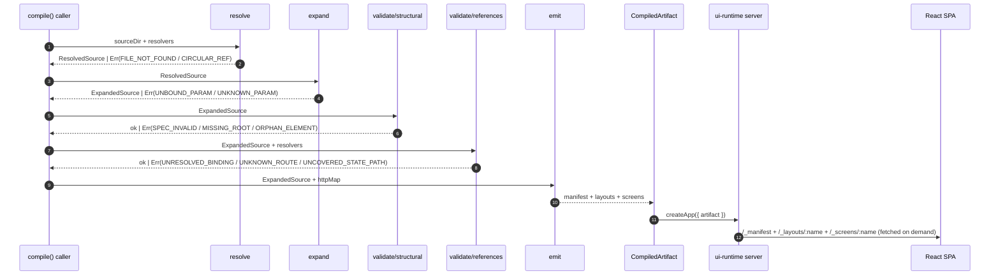

**Caption.** Compilation is once-per-artifact at build or boot time; the SPA never re-runs validation. Per-screen lazy loading keeps the initial payload small: the shell + manifest is fetched up front, and each route pulls exactly one layout and one screen.

### 4.8 Orchestration layer: `@rntme/seed`, `@rntme/db-studio`, `@rntme/runtime`

#### 4.8.1 `@rntme/seed`

**Purpose.** Parse, validate, and append a declarative JSON of event envelopes (`seed.json`) against the PDM and derived event-type specs, so a fresh deployment can arrive at a useful initial state.

**Spec.** `docs/superpowers/specs/done/2026-04-15-runtime-seed-design.md` (landed). The before-relay invariant (spec §3.1, §8.3) is the central constraint: seed envelopes must be appended through `eventStore.appendRaw` **before** the relay starts its publish cursor, or seeded events would double-publish once the cursor reached them.

**Surface.** `parseSeed`, `validateSeed`, `loadSeed`, `applySeed`, plus a `seedBuilder` helper and a `rntme-seed` CLI (`validate` / `apply`). Default `eventId` is deterministic (`seed:{aggregateType}:{aggregateId}:v{version}`), default `actor` is `{ kind: 'system', id: 'seed' }`.

**Modes.** `strict` (runtime default — reject non-empty store with `SEED_STORE_NOT_EMPTY`) and `upsertByEventId` (CLI default — idempotent re-apply by skipping seen ids).

See sequence #3 in §3.4 for the boot-time placement of `applySeed`.

#### 4.8.2 `@rntme/db-studio` (in-flight scaffold)

**Purpose.** Expose a read-only libSQL Hrana v3 HTTP endpoint over rntme's two SQLite databases (event log + projection DB), so operators can attach any Hrana-compatible browser studio (for example `libsqlstudio.com`) without bundling a custom UI.

**Spec.** `docs/superpowers/specs/done/2026-04-18-db-studio-design.md` (design landed; package scaffold in progress).

**Status (2026-04-18).** Only `packages/db-studio/test/` is present; `src/`, `package.json`, and `README.md` are not yet tracked. The runtime manifest carries a `studio: { enabled: false, mountPath: '/_studio', maxRows: 10000 }` block; `http-surface.ts` will mount the sub-router when enabled. This subsection describes intent; refer to the spec for the authoritative shape until the package lands.

**Planned safety.** Three layers of read-only guard: a second SQLite file handle opened read-only (never `:memory:`), a SQL classifier whitelist (`SELECT` / `EXPLAIN` / `PRAGMA` only) with a PRAGMA allow-list, and a server-side row cap (default 10,000) wrapping every result.

#### 4.8.3 `@rntme/runtime`

**Purpose.** Service orchestrator: loads and validates every artifact (`manifest.json` + PDM / QSM / bindings / graphs / UI / seed), boots the plugin seams, wires the event pipeline, applies seed, and mounts the HTTP surface.

**Spec.** `docs/superpowers/specs/done/2026-04-15-runtime-packaging-design.md` (landed): manifest schema, plugin-seam registration, Docker entry, boot order.

**Plugin seams** (see also §3.3) live in `packages/runtime/src/plugins/interfaces.ts` and are implemented by default in:

- `plugins/better-sqlite-driver.ts` — `BetterSqliteDriver` (default `DbDriver`; reads `eventStorePath` and `qsmPath` from the manifest, falls back to ephemeral `:memory:` in dev).
- `plugins/in-memory-bus.ts` — `InMemoryBus` (default `EventBus`; in-process Kafka emulation for tests and single-node deploys).
- `plugins/http-surface.ts` — `HttpSurface` (default `Surface`; Hono app that mounts bindings at `/api`, the UI at `/`, and — when enabled — db-studio at `/_studio`).
- `plugins/observability.ts` — Prometheus `/metrics` and a `/health` probe; consumed by any surface.

**Boot order (strict; tested in `test/integration/start-service.test.ts`):** `bus.start → wireEventPipeline (no auto-start) → applySeed → pipeline.start (relay + consumer) → HTTP listen`. Reordering any step breaks the before-relay invariant.

**Public API.** `loadService`, `startService`, `buildActorFromRequest`, the `DbDriver` / `EventBus` / `Surface` interfaces and their default implementations, plus the Prometheus helpers. `contract-tests.ts` is deliberately not re-exported (vitest-only dependency); tests import it from the src path.

### 4.9 `@rntme/blueprint`

`@rntme/blueprint` is the project-first composition layer above service artifacts. It parses `project.json`, loads project-level PDM directories, discovers service artifacts, validates project routes and middleware, checks service member references, and builds the project-routed binding registry consumed by `@rntme/bindings` and `@rntme/ui`.

Runtime intake is intentionally still deferred: `@rntme/runtime` boots one service folder at a time. The blueprint package validates and composes the project model so authoring/versioning/deploy can be project-scoped before the service runtime grows project-level boot.

### 4.10 `@rntme/bindings-grpc`

`@rntme/bindings-grpc` exposes validated query and command surfaces over gRPC. It uses the same `CommandExecutor` / `QueryExecutor` seam as `@rntme/bindings-http`, emits dynamic proto descriptors, and keeps module/service communication out of the domain runtime.

### 4.11 `@rntme/module-skeleton`

`@rntme/module-skeleton` is the minimal scaffold for external integration services. Modules are declared in `manifest.modules[]`, reached over gRPC, and invoked from command-binding `pre[]` steps. This keeps vendor SDK code outside the domain service while letting command graphs consume pre-fetch results deterministically.

### 4.12 CLI-side deployment packages

`@rntme-cli/deploy-core` turns a validated/composed project model into a target-neutral, redacted deployment plan. `@rntme-cli/deploy-dokploy` renders and applies that plan against Dokploy. Both packages live in the `rntme-cli/` submodule and are not runtime dependencies.

## 5. L4 — Code

A selection of fourteen functions that carry the most invariants. Signatures are summarised for brevity; names match the current code at the cutoff date (2026-04-18). This is a pointer table — read the file for the actual implementation; follow-up observations on any of these live in §7.

| Function | Package | Purpose (one line) |
| --- | --- | --- |
| `validatePdm(raw)` | `@rntme/pdm` | Orchestrate structural → state-machine validation and construct the `ValidatedPdm` brand. |
| `validateQsm(raw, pdm)` | `@rntme/qsm` | Orchestrate structural → cross-ref validation and construct the `ValidatedQsm` brand. |
| `validateBindings(raw, resolvers)` | `@rntme/bindings` | Run the four validator layers and construct `ValidatedBindings`. |
| `generateOpenApi(validated, resolvers, opts?)` | `@rntme/bindings` | Emit OpenAPI 3.1 from a validated binding artifact. |
| `compile(rawSpec, rawPdm, rawQsm, opts?)` | `@rntme/graph-ir-compiler` | Query compile: parse → structural → normalize → semantic → plan → relational → lower → emit SQL. |
| `compileCommand(rawSpec, rawPdm, rawQsm)` | `@rntme/graph-ir-compiler` | Command compile: shared head + emit-plan construction + optional read-prelude. |
| `wrapPredicateOptional(...)` | `@rntme/graph-ir-compiler` | Wrap a predicate with `(predSql) OR (? IS NULL)` null-guards for each optional param (bug fixed 2026-04-16). |
| `appendEvents(requests)` | `@rntme/event-store` | Atomic multi-subject append with optimistic concurrency on `(subject, expectedVersion)`. |
| `appendRaw(envelopes, opts?)` | `@rntme/event-store` | Bypass command validation to seed or replay; `ignoreDuplicates` idempotent mode available. |
| `createRelay(opts)` | `@rntme/event-store` | Polling relay: read from cursor → encode CloudEvents → send → retry → DLQ → advance cursor. |
| `compileApplyPlan({ pdm, qsm, events, derivedHandlers? })` | `@rntme/projection-consumer` | Produce the handler plan for mirror + derived projections (pure, no DB). |
| `applyEvent(db, plan, envelope)` | `@rntme/projection-consumer` | Execute a single handler under the three-layer idempotency guard (mirror) or `seen_events` gate (derived). |
| `applySeed(seed, store, mode?)` | `@rntme/seed` | Apply validated seed envelopes via `appendRaw` before the relay starts. |
| `startService(validatedService, config?)` | `@rntme/runtime` | Orchestrate boot: bus → wire pipeline → apply seed → start pipeline → mount HTTP surface. |

Follow-up notes on anything surprising here belong in §7, not in this table.

## 6. Cross-cutting abstractions

Each entry below uses a fixed record format so Task-22's structural check can verify completeness:

- **Package / module:** `packages/<pkg>/src/<path>` (no line numbers).
- **Purpose:** one sentence.
- **Contract:** signature or structure.
- **Constructed by:** who creates instances and when.
- **Invariant:** what must hold.
- **Spec(s):** canonical spec link or "not covered by spec".
- **Related:** 1–3 related abstractions.

Sub-sections §6.0 – §6.5 group entries by layer. Follow-up observations about any entry (drift, ambiguity, duplication) belong in §7, not here.

### 6.0 Foundational (type-level plumbing)

#### `Result<T>` — success / error discriminator

- **Package / module:** `packages/pdm/src/types/result.ts` (and per-package copies in `qsm`, `bindings`, `event-store`, `graph-ir-compiler`, `projection-consumer`, `ui`, `seed`, `runtime`).
- **Purpose:** Make success / failure a first-class value across every package boundary; remove the need for exception handling at public APIs.
- **Contract:** `type Result<T, E = Error> = { ok: true; value: T } | { ok: false; error: E }`. Constructors `ok(value)` and `err(error)`; discriminators `isOk` and `isErr`.
- **Constructed by:** Any function whose public return can fail at a package boundary. Prohibited constructors inside `try/catch` that translate a native throw must still land on `err(...)` before exiting the package.
- **Invariant:** Exceptions never leak out of a package's public API. Consumers pattern-match `result.ok`; they never call `result.value` without checking.
- **Spec(s):** not covered by spec — it is a codebase convention documented in `AGENTS.md §4`.
- **Related:** `Validated*` brand family, `ERROR_CODES`, 4-layer validator.

#### `isOk` / `isErr` — Result discriminators

- **Package / module:** alongside each package's `result.ts`.
- **Purpose:** Narrowing helpers so TypeScript recognises `result.value` / `result.error` after a type-guard.
- **Contract:** `isOk(r): r is Ok<T>`, `isErr(r): r is Err<E>`.
- **Constructed by:** re-exported from the same module that defines `Result`.
- **Invariant:** Exactly one is true for any given `Result`.
- **Spec(s):** same as `Result<T>`.
- **Related:** `Result<T>`.

#### Branded `Validated*` family

- **Package / module:** each owner's `types/artifact.ts` (pdm, qsm, bindings, ui) — `StructurallyValid*`, `Resolved*`, `Validated*` branded types.
- **Purpose:** Encode validator success in the type system; downstream packages must accept only the brand.
- **Contract:** `type ValidatedX = XParsed & { readonly [ValidatedBrand]: true }` with a declared `unique symbol`. No public `of()` constructor.
- **Constructed by:** the final validator layer inside the owner package (for example `validate/state-machine.ts` for PDM, `validate/cross-ref.ts` for QSM, `validate/consistency.ts` for bindings). A call-site in any other package cannot construct the brand.
- **Invariant:** `as ValidatedX` is an anti-pattern. Every brand construction site is a single cast inside the validator it belongs to. Downstream APIs accept only the branded type, which forces calls to go through the orchestrator.
- **Spec(s):** per-package design specs (`2026-04-14-mutations-design.md`, `2026-04-14-bindings-design.md`, `2026-04-16-qsm-relations-migration-design.md`, `2026-04-16-ui-artifact-v2-design.md`).
- **Related:** 4-layer validator, `Result<T>`.

#### `ERROR_CODES` registry — stable machine-readable identifiers

- **Package / module:** each owner's `types/result.ts` (for example `packages/pdm/src/types/result.ts`, `packages/bindings/src/types/result.ts`).
- **Purpose:** Give every validation / runtime failure a stable, documented identifier callers can match on.
- **Contract:** Frozen object `ERROR_CODES` exporting keys of shape `<PKG>_<LAYER>_<KIND>` (for example `PDM_SM_UNREACHABLE_STATE`, `QSM_XREF_ENTITY_MIRROR_DUPLICATE`, `BINDINGS_CONS_MODE_MISMATCH`). The type `PdmErrorCode` / `QsmErrorCode` / `BindingsErrorCode` is a union of the values.
- **Constructed by:** Never at call sites — codes are referenced by name only.
- **Invariant:** Codes are APPEND-ONLY. Reordering or deleting a code is a breaking change for any automated error monitor. Renaming is forbidden; to rename, add a new code and deprecate the old in comments.
- **Spec(s):** `AGENTS.md §4` defines the naming rule; each owner's spec enumerates the codes it added.
- **Related:** `Result<T>`, 4-layer validator.

#### 4-layer validator pattern

- **Package / module:** `packages/{pdm,qsm,bindings,ui}/src/validate/` + `parse/`.
- **Purpose:** Fail-fast layered validation. Each artifact passes parse → structural → reference / cross-ref → consistency before any downstream code consumes it.
- **Contract:** `parse(raw) → Result<Parsed>`, then per-layer `Result<...>` functions. An orchestrator `validateX(raw, resolvers?)` short-circuits on the first failing layer.
- **Constructed by:** Each owner packages the orchestrator; no consumer runs layers manually.
- **Invariant:** Layers are ordered; skipping one (even on "trusted" input) loses downstream error codes. Errors from layer N + 1 are never seen when layer N fails.
- **Spec(s):** each artifact's design spec plus `AGENTS.md §4`.
- **Related:** `Validated*` brand family, `Result<T>`, `ERROR_CODES`.

### 6.1 Domain artifacts (PDM / QSM / Graph IR)

#### Entity, Field, Relation (PDM)

- **Package / module:** `packages/pdm/src/types/artifact.ts` + `parse/schema.ts`.
- **Purpose:** The PDM artifact's three core nouns — entities (tables), their fields (columns), and relations (foreign-key-like associations between entities).
- **Contract:** `Entity = { name, fields: Field[], keys: string[], stateField?, relations?: Relation[] }`; `Field = { name, type, nullable, column, generated? }`; `Relation = { name, to, localKey, foreignKey, cardinality }`.
- **Constructed by:** Zod parse in `parse/schema.ts` emits the shape; structural and state-machine validators promote it to `ValidatedPdm`.
- **Invariant:** `stateField` is non-nullable string; `keys` reference fields on the same entity; `relation.to` is local-only (single-service).
- **Spec(s):** `docs/superpowers/specs/done/2026-04-14-mutations-design.md`.
- **Related:** `StateMachine`, `Projection`, `RelationMetadata` (QSM).

#### `StateMachine` + `Transition`

- **Package / module:** `packages/pdm/src/types/artifact.ts` + `validate/state-machine.ts`.
- **Purpose:** Encode per-entity finite-state machines that drive event-sourced mutations; the validator enforces reachability and declared effects.
- **Contract:** `StateMachine = { stateField, states: string[], initial: null, transitions: Transition[] }`; `Transition = { name, from, to, affects: string[], payload?, ... }`.
- **Constructed by:** `validate/state-machine.ts` after `validate/structural.ts`.
- **Invariant:** Creation transitions declare `affects` explicitly; self-loops declare non-empty `affects`; all states reachable by BFS from a creation transition.
- **Spec(s):** `2026-04-14-mutations-design.md` (§4).
- **Related:** `EventTypeSpec` (`derive/event-types.ts`), `Projection`.

#### `Projection` + `Backing`

- **Package / module:** `packages/qsm/src/types/artifact.ts` + `validate/structural.ts` + `validate/cross-ref.ts`.
- **Purpose:** Declare a read-side materialized table backed by a PDM entity (`entity-mirror`) or by a future graph IR (`derived`, MVP-gated).
- **Contract:** `Projection = { backing, source, keys, grain, exposed, table }`; `ProjectionBacking = 'entity-mirror' | 'derived'`.
- **Constructed by:** QSM cross-ref validator promotes `StructurallyValidQsm` to `ValidatedQsm` only if each projection passes its backing-specific rules.
- **Invariant:** Exactly one entity-mirror per source entity; keys and grain set-equal to the source entity's keys; `derived` backing is rejected by `validateQsm()` (parse accepts, cross-ref rejects).
- **Spec(s):** `2026-04-14-mutations-design.md` (§6), `2026-04-16-qsm-relations-migration-design.md`.
- **Related:** `RelationMetadata`, `ApplyPlan` (projection-consumer), derived-DDL `ProjectionDdlSpec`.

#### `RelationMetadata` (post-2026-04-16)

- **Package / module:** `packages/qsm/src/types/artifact.ts` + `validate/cross-ref.ts`.
- **Purpose:** Read-side relation graph used by the Graph-IR compiler to emit JOINs. Owned by QSM (not PDM) as of 2026-04-16.
- **Contract:** `{ "<ProjectionName>.<relationName>": { to, localKey, foreignKey, cardinality, role? } }`.
- **Constructed by:** QSM cross-ref validator after B2 parity check against PDM.
- **Invariant:** B2 parity with PDM on `(to, localKey, foreignKey, cardinality)`; PDM is canon. `cardinality: 'many'` is parse-accepted but rejected by the Graph-IR compiler (`NAV_FAN_OUT_NOT_ALLOWED`).
- **Spec(s):** `2026-04-16-qsm-relations-migration-design.md`.
- **Related:** `Projection`, `ValidatedQsm`, Graph IR `Scan` / `Join` operators.

#### Graph IR `Operator` + `SemanticPlan`

- **Package / module:** `packages/graph-ir-compiler/src/types/authoring.ts` + `semantic-plan/build.ts`.
- **Purpose:** Canonical rc7 rowset operators (`findMany`, `filter`, `map`, `reduce`, `sort`, `limit`, `emit`) and the typed `PlanStep[]` that carries them through the compiler.
- **Contract:** Operators are a discriminated union; `SemanticPlan = { steps: PlanStep[] }`.
- **Constructed by:** Produced by `buildSemanticPlan(canonicalGraph, pdm, qsm)` after structural + semantic validation.
- **Invariant:** Param order reflects statement order — `lowerExpr` appends to `paramOrder` in the same order they will appear in emitted SQL; a reorder here is a correctness bug.
- **Spec(s):** `docs/superpowers/specs/done/2026-04-13-graph-ir-sql-compiler-mvp-design.md`.
- **Related:** `LoweredPlan` (lower/sqlite), `BindingPlan` (bindings-http), `EmitPlan` (command runtime).

#### `EventTypeSpec` — derived event shape

- **Package / module:** `packages/pdm/src/derive/event-types.ts` + `packages/pdm/src/types/artifact.ts`.
- **Purpose:** One spec per PDM state-machine transition. Drives downstream shape of envelopes, projection handlers, and OpenAPI command shapes.
- **Contract:** `{ aggregate, transition, eventType, affects, payload, isCreation, isSelfLoop, fromStates, toState }`.
- **Constructed by:** `deriveEventTypes(ValidatedPdm)` at boot.
- **Invariant:** `eventType` name is stable across additive changes; a breaking change requires a new `eventType`, not a topic-version suffix.
- **Spec(s):** `2026-04-14-mutations-design.md`, `2026-04-17-cloudevents-envelope-design.md`.
- **Related:** `Envelope` (§6.2), `ApplyPlan`, command `EmitPlan`.

### 6.2 Runtime (events, storage, consumer)

#### `Envelope` / CloudEvents 1.0 shape

- **Package / module:** `packages/event-store/src/types/envelope.ts`.
- **Purpose:** The single serialization shape for every event in rntme — CloudEvents 1.0 on the wire, camelCase in memory.
- **Contract:** In-memory `EventEnvelope<TPayload>` with `id`, `time`, `type`, `source`, `subject`, `correlationId`, `rntAggregateType`, `rntAggregateId`, `rntVersion`, `rntSchemaVersion`, `data`, `actor`. On the wire, CE-mandated attributes are `ce_*` headers in Kafka binary content mode; `data` is the JSON body.
- **Constructed by:** Command handlers (via `@rntme/graph-ir-compiler`) and the seed loader; never by consumers.
- **Invariant:** Caller mints `id`, `time`, and `correlationId`. The store never generates them; determinism is required for replay and golden tests.
- **Spec(s):** `docs/superpowers/specs/done/2026-04-17-cloudevents-envelope-design.md`.
- **Related:** `EventStore` interface, DLQ payload, topic convention.

#### `EventStore` interface

- **Package / module:** `packages/event-store/src/store/interface.ts`.
- **Purpose:** The single seam the rest of rntme talks to for event-sourced writes, reads, and per-event delivery-tracking.
- **Contract:** `appendEvents`, `appendRaw`, `readStream`, `readFrom`, `readRecordsFrom`, `readCursor` / `writeCursor`, plus `readDeliveryAttempt`, `recordDeliveryAttempt`, `updateLastError`, `markDelivered`, `markDlq`.
- **Constructed by:** The default implementation is `SqliteEventStore({ filename, serviceName })` in `packages/event-store/src/store/sqlite.ts`. A manifest may supply a different driver via the `DbDriver` seam.
- **Invariant:** `appendEvents` is atomic across subjects (single `BEGIN IMMEDIATE`); optimistic concurrency is enforced on `(subject, expectedVersion)`; `appendRaw` is reserved for seed and replay (bypass command validation, trusts caller's `rntVersion`).
- **Spec(s):** `2026-04-17-cloudevents-envelope-design.md`, `2026-04-17-relay-dlq-delivery-tracking-design.md`.
- **Related:** `Relay`, `ApplyPlan`, `Seed envelope`.

#### `PublishCursor` — per-relay monotonic offset

- **Package / module:** `packages/event-store/src/store/` (table `publish_cursor`).
- **Purpose:** Track how far each relay has published, so at-least-once delivery replays from a known point after a crash.
- **Contract:** Row per `relayId` carrying `last_event_id` and `updated_at`; `writeCursor(relayId, lastEventId)` UPSERTs and rejects non-monotonic values.
- **Constructed by:** Each relay instance allocates its own `cursorId` at `createRelay`.
- **Invariant:** The cursor advances only after a batch is accepted by the producer; a crash mid-batch replays on restart.
- **Spec(s):** `2026-04-17-cloudevents-envelope-design.md` (§6) + `2026-04-17-relay-dlq-delivery-tracking-design.md`.
- **Related:** `Relay`, `EventStore`, `DLQ`.

#### `Relay` (at-least-once publisher)

- **Package / module:** `packages/event-store/src/relay/loop.ts`.
- **Purpose:** Drain `readRecordsFrom(cursor)` batches, encode each envelope to CloudEvents 1.0 binary, publish to `KafkaProducer`, advance the cursor.
- **Contract:** `createRelay({ store, cursorId, kafka, serviceName, onDlqError? })` returns `{ start, stop }`.
- **Constructed by:** `packages/runtime/src/start/start-service.ts` after `wireEventPipeline` and `applySeed`.
- **Invariant:** At-least-once delivery, per-subject Kafka order (key = `subject`), exponential-backoff retry up to `maxAttempts`, then DLQ emit; unbounded DLQ retry.
- **Spec(s):** `2026-04-17-relay-dlq-delivery-tracking-design.md`.
- **Related:** `PublishCursor`, `DLQ`, `ApplyPlan`, sequence #6.

#### `DLQ` payload + delivery tracking

- **Package / module:** `packages/event-store/src/relay/dlq-envelope.ts` + `packages/event-store/src/store/` (`delivery_tracking` table).
- **Purpose:** Capture events that exceeded primary-topic retries, without blocking the cursor.
- **Contract:** `DlqPayload = { failedEvent, reason: 'max-attempts-exceeded', attempts, firstAttemptAt, lastError }` wrapped in a fresh `EventEnvelope` with `type = '{serviceName}.Relay.EventDeliveryFailed'`, published to `{primaryTopic}.dlq`. Per-event `delivery_tracking` row records attempt count, timestamps, last error.
- **Constructed by:** The relay on retry exhaustion.
- **Invariant:** DLQ retry is unbounded; failure of the DLQ topic itself is surfaced through `onDlqError` for operator alerting — it does not block the cursor.
- **Spec(s):** `2026-04-17-relay-dlq-delivery-tracking-design.md`.
- **Related:** `Relay`, `Envelope`.

#### `ApplyPlan` + three-layer idempotency

- **Package / module:** `packages/projection-consumer/src/types/apply.ts` + `packages/projection-consumer/src/apply/*`.
- **Purpose:** Per-event handler bundle for mirror and derived projections; the concrete unit of idempotent read-side apply.
- **Contract:** `ApplyPlan = { handlersByEventType, mirrorsByAggregate }`. Mirror handlers run under a three-layer guard: pre-check `last_event_version`, `INSERT ... ON CONFLICT DO UPDATE WHERE last_event_version < excluded.last_event_version` (creation), `UPDATE ... WHERE last_event_version < ?` (non-creation). Derived handlers gate on `seen_events(event_id, projection_id)` before a delta UPSERT.
- **Constructed by:** `compileApplyPlan({ pdm, qsm, events, derivedHandlers? })` — pure, no DB.
- **Invariant:** All three mirror layers are mandatory; removing any regresses replay safety. Batch apply is all-or-nothing under `BEGIN IMMEDIATE`.
- **Spec(s):** `2026-04-14-mutations-design.md` (§6), `docs/superpowers/specs/done/2026-04-18-d5-consumer-idempotency-hybrid-design.md`.
- **Related:** `Envelope`, `Projection`, `EventTypeSpec`.

#### `Seed envelope` + before-relay invariant

- **Package / module:** `packages/seed/src/apply.ts` + `packages/seed/src/types.ts`.
- **Purpose:** Allow a service to arrive at a useful initial state by declaring envelopes that are appended through the normal event store, then projected through the normal pipeline, but without double-publishing through Kafka.
- **Contract:** `applySeed(validatedSeed, store, { mode: 'strict' | 'upsertByEventId', ... })`. Default `eventId` = `seed:{aggregateType}:{aggregateId}:v{version}`, default `actor` = `{ kind: 'system', id: 'seed' }`.
- **Constructed by:** `packages/runtime/src/start/start-service.ts` between `wireEventPipeline` and `pipeline.start` (the strict boot-order invariant; see §3.4).
- **Invariant:** Seed envelopes must be appended BEFORE the relay's cursor starts advancing; the spec-§3.1 invariant is what prevents seed events from being re-published through Kafka.
- **Spec(s):** `docs/superpowers/specs/done/2026-04-15-runtime-seed-design.md`.
- **Related:** `Relay`, `ApplyPlan`, `startService`.

### 6.3 HTTP / UI

#### `BindingKind × Role` matrix

- **Package / module:** `packages/bindings/src/validate/consistency.ts` + `packages/bindings/src/types/artifact.ts`.
- **Purpose:** Ensure a binding's `kind` (`query | command`) agrees with the target graph's role, and that the output shape matches.
- **Contract:** `BindingKind = 'query' | 'command'`. Matrix: `query × query` requires `rowset<T>` output; `command × command` requires `row<CommandResult>`; other combinations are errors.
- **Constructed by:** Enforced in `checkGraphShape` during consistency validation.
- **Invariant:** Commands are `POST`-only and forbid `in: 'query'` parameters.
- **Spec(s):** `2026-04-14-bindings-design.md`.
- **Related:** `BindingPlan`, `CommandResult`, OpenAPI emitter.

#### `BindingPlan` — discriminated plan

- **Package / module:** `packages/bindings-http/src/startup/compile-plan.ts` + `packages/bindings-http/src/types/`.
- **Purpose:** The runtime pairing of a binding with its compiled graph, ready for per-request execution.
- **Contract:** `QueryBindingPlan | CommandBindingPlan` discriminated-union; each carries the compile result, input Zod schemas, and the HTTP path / method.
- **Constructed by:** `buildPlan` at router creation. Compile errors aggregate; a partial router is never mounted.
- **Invariant:** `eventStore` is required when any binding is `kind: 'command'`; synchronous throw before route mount.
- **Spec(s):** `2026-04-14-bindings-http-design.md`.
- **Related:** `BindingKind × Role`, `CommandResult`, OpenAPI emitter.

#### HTTP error → status mapping

- **Package / module:** `packages/bindings-http/src/errors.ts`.
- **Purpose:** Single source of truth for HTTP error codes emitted by `bindings-http`.
- **Contract:** `VALIDATION_ERROR | INVALID_BODY → 400`; `COMMAND_CONCURRENCY_CONFLICT → 409`; any other `CommandExecutionError → 422`; uncaught → `500`.
- **Constructed by:** The query and command handler modules; `commandErrorStatus(err) → 409 | 422`.
- **Invariant:** `409` is reserved for concurrency; `422` is every other business-rule rejection. Middleware cannot reinterpret a status.
- **Spec(s):** `2026-04-14-bindings-http-design.md` (§7).
- **Related:** `BindingPlan`, `CommandExecutionError`.

#### OpenAPI 3.1 emitter

- **Package / module:** `packages/bindings/src/openapi/emit.ts` + siblings (`shapes.ts`, `parameters.ts`, `responses.ts`, `errors.ts`, `command-result.ts`, `passthrough.ts`).
- **Purpose:** Emit an OpenAPI 3.1 document from a `ValidatedBindings` artifact, for tooling and client generation.
- **Contract:** `generateOpenApi(validated, resolvers, options?) → Result<OpenApiDoc>`. Produces `paths` per `(method, path)`, `components.schemas` for row shapes, and the built-in `CommandResult` shape plus standard 400 / 409 / 422 / 500 schemas. Passthrough `x-*` annotations deep-merge.
- **Constructed by:** `packages/bindings-http/src/router.ts` at startup, served at `/openapi.json`.
- **Invariant:** Emission is pure over `ValidatedBindings`; a missing resolver is a failure, not silent omission.
- **Spec(s):** `2026-04-14-bindings-design.md` (§7).
- **Related:** `BindingPlan`, `BindingKind × Role`.

#### UI compile pipeline + `CompiledArtifact`

- **Package / module:** `packages/ui/src/compile.ts` + siblings (`resolve/`, `expand/`, `validate/`, `emit/`); output type in `packages/ui/src/types/compiled.ts`.
- **Purpose:** Take a multi-file UI authoring tree and produce a single JSON artifact (`manifest`, `layouts`, `screens`) consumed by `@rntme/ui-runtime`.
- **Contract:** `compile(options) → Result<CompiledArtifact>`. Six-stage pipeline: parse (implicit in resolve) → resolve → expand → validate (structural + references) → compile orchestrator → emit.
- **Constructed by:** `packages/runtime` at boot (or by an external build step that persists the artifact).
- **Invariant:** Compiled specs contain no `$ref` or `$param` tokens. Manifest version is literal `"2.0"`. Structural errors short-circuit reference validation.
- **Spec(s):** `docs/superpowers/specs/done/2026-04-16-ui-artifact-v2-design.md`.
- **Related:** `BindingPlan` (for HTTP-map resolution during emit), `Surface` plugin (serves the artifact).

### 6.4 Extensibility seams

#### `DbDriver` plugin seam

- **Package / module:** `packages/runtime/src/plugins/interfaces.ts` + `packages/runtime/src/plugins/better-sqlite-driver.ts`.
- **Purpose:** Swap the underlying storage engine (`BetterSqliteDriver`, in-memory for tests, future Turso) without changing any authored artifact.
- **Contract:** `DbDriver` interface (`openEventStore`, `openProjectionDb`, lifecycle hooks). Default: `BetterSqliteDriver` reading `eventStorePath` / `qsmPath` from the manifest.
- **Constructed by:** `startService` at boot, selected from the manifest or overridden by the caller.
- **Invariant:** SQL stays SQLite-dialect forever (Turso is a SQLite-compatible rewrite). A `DbDriver` implementation must not introduce a second dialect branch in `graph-ir-compiler/src/lower/sqlite/`.
- **Spec(s):** `docs/superpowers/specs/done/2026-04-15-runtime-packaging-design.md`.
- **Related:** `EventStore`, `Surface`, `Manifest`.

#### `EventBus` plugin seam

- **Package / module:** `packages/runtime/src/plugins/interfaces.ts` + `packages/runtime/src/plugins/in-memory-bus.ts`.
- **Purpose:** Swap the publish transport (`InMemoryBus` for single-process / tests, Kafka / NATS in production) without changing artifacts or the relay.
- **Contract:** `EventBus` interface with `publish(topic, envelope, headers?)`; `start()` / `stop()` lifecycle. Default: `InMemoryBus` with in-process subscription fan-out.
- **Constructed by:** `startService` via manifest selection.
- **Invariant:** The bus is the only code path between relay and consumer; there is no direct in-process shortcut. Breaking that invariant couples consumer to writer and defeats the event-sourced topology.
- **Spec(s):** `2026-04-15-runtime-packaging-design.md`.
- **Related:** `Relay`, projection consumer, `KafkaProducer` (event-store).

#### `Surface` plugin seam

- **Package / module:** `packages/runtime/src/plugins/interfaces.ts` + `packages/runtime/src/plugins/http-surface.ts`.
- **Purpose:** Swap the network entry point (Hono-based `HttpSurface` today; gRPC or other transports are the future extension path).
- **Contract:** `Surface` interface mounts bindings at `/api`, the UI at `/`, optional db-studio at `/_studio`, and Prometheus at `/metrics` + `/health`.
- **Constructed by:** `startService` via manifest.
- **Invariant:** A `Surface` implementation must dispatch `bindings-http` `BindingPlan` values without per-binding custom code; otherwise adding a binding would require a surface change.
- **Spec(s):** `2026-04-15-runtime-packaging-design.md` + `2026-04-14-bindings-http-design.md`.
- **Related:** `BindingPlan`, UI `CompiledArtifact`, observability.

#### Service `manifest.json`

- **Package / module:** `packages/runtime/src/manifest/schema.ts` + `parse.ts` + `validate.ts`.
- **Purpose:** Single declarative entry that tells the runtime which artifacts to load, which plugin seams to use, and which features to enable (db-studio, observability).
- **Contract:** Zod-strict schema. Top-level keys include `serviceName`, `eventStorePath`, `qsmPath`, `artifacts: { pdm, qsm, bindings, graphs, ui, seed }`, `studio: { enabled, mountPath, maxRows }`, `observability: { … }`.
- **Constructed by:** Author once per service; validated at boot by `loadService`.
- **Invariant:** Manifest major version is checked at boot (`fail-fast`); reordering or removing fields is a breaking change.
- **Spec(s):** `2026-04-15-runtime-packaging-design.md`.
- **Related:** `DbDriver`, `EventBus`, `Surface`, UI `CompiledArtifact`.

#### MVP gates

- **Package / module:** each owner's README "Out of scope" section.
- **Purpose:** Record features that are deliberately deferred — parsed but rejected by the validator, or absent from the runtime — so a reader does not mistake them for bugs.
- **Contract:** Not a type; a convention. Current gates include: `cardinality: 'many'` in QSM relations (parsed, rejected by compiler), `derived` backing (parsed, rejected by `validateQsm()` but implemented in `derive/ddl.ts` behind an opt-in), composite-key projections, cross-service relations (`relation.to` is local-only), db-studio (spec landed, scaffold only).
- **Constructed by:** Owners add a gate to their README when a feature is designed but not yet shipped.
- **Invariant:** A gate must be enforced somewhere in code (validator rejection, feature flag default-off, missing runtime dispatcher) — not a README-only aspiration.
- **Spec(s):** individual owners' specs.
- **Related:** specific abstractions above that carry a gate (`Projection`, `RelationMetadata`, `ApplyPlan`).

### 6.5 Topology (cross-service composition)

#### Kafka topic convention `rntme.{svc}.{agg}`

- **Package / module:** `packages/event-store/src/relay/topic.ts`.
- **Purpose:** Fix a single, predictable topic name per `(service, aggregate)` pair so any downstream consumer (Zeebe sagas, other rntme services, or external analytics) can subscribe without per-service configuration.
- **Contract:** `defaultTopicOf(service, aggregate)` returns `rntme.{service}.{aggregate}`, both lowercased. DLQ topic is `{primaryTopic}.dlq`.
- **Constructed by:** The relay when publishing; the consumer when subscribing.
- **Invariant:** No version suffix (`.v1` etc.). Event versioning lives inside the envelope (`rntSchemaVersion` for additive changes; a new `eventType` for breaking changes).
- **Spec(s):** `2026-04-17-cloudevents-envelope-design.md` (§6).
- **Related:** `Envelope`, `Relay`, `DLQ`.

#### `db-studio` Hrana v3 endpoint (in-flight)

- **Package / module:** `packages/db-studio/` (scaffold only at 2026-04-18).
- **Purpose:** Expose both rntme SQLite files (event log and projection DB) via the libSQL Hrana v3 wire protocol, so operators can attach any Hrana-compatible browser studio (for example `libsqlstudio.com`) without bundling a custom UI.
- **Contract:** Two endpoints — `POST /_studio/hrana/events/v3/pipeline` and `POST /_studio/hrana/qsm/v3/pipeline` — speaking the Hrana v3 JSON wire protocol for `execute` / `batch` requests.
- **Constructed by:** `packages/runtime/src/plugins/http-surface.ts` when `manifest.studio.enabled === true`.
- **Invariant:** Read-only enforced at three layers — a second SQLite handle opened read-only (never `:memory:`), a SQL classifier whitelist (`SELECT` / `EXPLAIN` / `PRAGMA` only) with PRAGMA allow-list, and a row cap (default 10,000). The endpoint never mutates.
- **Spec(s):** `docs/superpowers/specs/done/2026-04-18-db-studio-design.md`.
- **Related:** `Surface`, `DbDriver`, manifest `studio` block.

#### Project blueprint

- **Package / module:** `packages/blueprint/`.
- **Purpose:** Make the validated project blueprint folder the canonical authoring/versioning/deploy unit above service artifacts.
- **Contract:** Folder contains `project.json`, project-level PDM, `services/<name>/...`, and `modules/<name>/...`. Validation covers project routes, middleware, PDM ownership, service discovery, service members, and project-routed binding refs.
- **Constructed by:** `loadProjectBlueprint(...)` and the project composition pipeline.
- **Invariant:** Project-level runtime intake is deferred; a composed project can validate and deploy as a project while `@rntme/runtime` still boots one service folder at a time.
- **Spec(s):** `docs/superpowers/specs/2026-04-23-project-first-blueprint-design.md`.
- **Related:** project PDM, project-routed binding registry, service-level primitives.

#### Executor seam

- **Package / module:** `@rntme/bindings-http`, `@rntme/bindings-grpc`, `@rntme/runtime`.
- **Purpose:** Decouple HTTP/gRPC surfaces from graph-ir execution.
- **Contract:** `CommandExecutor` runs command graphs and returns command results; `QueryExecutor` runs query graphs and returns rowsets. Surfaces own transport concerns, not command/query implementation.
- **Constructed by:** runtime wiring around graph-ir compiler execution.
- **Invariant:** Adding gRPC or modules does not require a second command runtime.
- **Spec(s):** `docs/superpowers/specs/2026-04-19-platform-modules-integration-design.md`.
- **Related:** bindings-http, bindings-grpc, module pre-fetch.

#### Module pre-fetch and idempotency cache

- **Package / module:** `@rntme/bindings`, `@rntme/bindings-http`, `@rntme/module-skeleton`.
- **Purpose:** Let command bindings call external modules before graph execution while keeping retries deterministic.
- **Contract:** `manifest.modules[]` declares gRPC modules; command bindings may define up to two `pre[]` entries (`system` or `module-rpc`). HTTP retries use a SQLite-backed `(idempotency-key, command-run-id) → response` cache with 24h TTL.
- **Constructed by:** bindings validator, HTTP pre-fetch runtime, and module gRPC clients.
- **Invariant:** `pre[]` is command-only; duplicate `bindAs` values and undeclared modules are rejected before boot.
- **Spec(s):** `docs/superpowers/specs/2026-04-19-platform-modules-integration-design.md`.
- **Related:** callback bindings, executor seam.

#### Callback binding

- **Package / module:** `@rntme/bindings`, `@rntme/bindings-http`.
- **Purpose:** Model vendor return URLs (OAuth, magic links, hosted checkout) as command bindings without custom handlers.
- **Contract:** HTTP method is GET; inputs come from `inputFrom`; `response.onOk` / `response.onErr` redirect with optional templates.
- **Constructed by:** bindings validator and HTTP command handler.
- **Invariant:** GET command bindings are allowed only when success or failure returns a redirect.
- **Spec(s):** `docs/superpowers/specs/2026-04-19-platform-modules-integration-design.md`.
- **Related:** module pre-fetch, command executor.

#### Deployment plan

- **Package / module:** `rntme-cli/packages/deploy-core`, `rntme-cli/packages/deploy-dokploy`.
- **Purpose:** Convert a validated/composed project into a target-neutral redacted deployment descriptor, then render/apply it for a target.
- **Contract:** `planDeployment(...)` produces the core plan; `renderDokployPlan(...)` and `applyDokployPlan(...)` handle Dokploy.
- **Constructed by:** CLI-side deploy pipeline, not runtime boot.
- **Invariant:** Plans are previewable/redacted and adapters are target-specific.
- **Spec(s):** `docs/superpowers/specs/2026-04-24-project-deployment-pipeline-design.md`.
- **Related:** project blueprint, commercial deploy surface.

## 7. Observations and refactoring candidates

This section is **diagnostic, not prescriptive.** Each finding points at a concrete place and states why it is a smell; it does not propose a fix. Follow-up plans will convert findings into work items.

Severity legend:

- **major** — breaks an invariant or creates risk.
- **minor** — harms readability or maintenance but no invariant violation.
- **info** — recorded fact (MVP gate, known bug, acknowledged trade-off); not necessarily actionable.

Finding format:

> **[severity]** `packages/<pkg>/src/<file>` — short description
>  - **Why it is a smell:** one sentence
>  - **Possible direction:** one sentence
>  - **Links:** spec(s), ADR, related observations

### 7.1 Size smells

All source files fit in a 350-line window; no single file exceeds 400. Most "large" files concentrate at compilation and validation boundaries, which is intrinsic to the artifact-driven design and not itself a smell. Two concerns worth recording:

> **[minor]** `packages/runtime/src/load/load-service.ts` — 366 lines.
> - **Why it is a smell:** The orchestrator reads every artifact, validates each against its owner package, and wires plugin seams in a single file. As the artifact set grows (db-studio, observability, future seams), this file will attract unrelated concerns.
> - **Possible direction:** Split by phase — artifact loading, validator orchestration, plugin wiring — once a seventh concern joins.
> - **Links:** `2026-04-15-runtime-packaging-design.md`.

> **[minor]** `packages/graph-ir-compiler/src/lower/sqlite/lower.ts` — 345 lines.
> - **Why it is a smell:** This file owns both the top-level `RelOp → SqlSelect` traversal and the private `wrapPredicateOptional` helper. The helper is the site of the 2026-04-16 param-alignment bug; its collocation with the traversal makes it easy to forget that edits here must preserve paramOrder append order.
> - **Possible direction:** Extract `wrapPredicateOptional` plus its regression assertions into `lower/sqlite/predicate-optional.ts` so a future contributor sees the helper as a first-class unit with its own tests.
> - **Links:** `2026-04-16-predicate-optional-fix-design.md`; §7.7.

> **[info]** `packages/seed/src/validate.ts` — 352 lines.
> - **Why it is a smell:** Seed validation simulates the state machine per stream and enforces intra-file invariants, which is intrinsically stateful. Size reflects the rules, not drift.
> - **Possible direction:** none at this cutoff; the file earns its length.
> - **Links:** `2026-04-15-runtime-seed-design.md`.

### 7.2 Dependency smells

An audit of every `@rntme/*` dependency against the AGENTS.md §3 layering diagram returned **no violations**. No package imports from below itself; no cyclic imports; no `index.ts` exports more than 22 symbols. The layering is well-enforced by the `tsconfig` project references plus the single runtime orchestrator.

> Reviewed — no significant dependency smells found as of cutoff.

One bookkeeping note:

> **[info]** `packages/runtime` depends on ten `@rntme/*` packages.
> - **Why it is a smell:** A single package depending on most of the workspace is expected for the orchestrator — but if any layer below runtime ever grows a runtime-side helper, runtime's breadth could attract unrelated code.
> - **Possible direction:** keep `runtime/src/plugins/*` as the only place that composes pluginable seams; resist adding "miscellaneous helpers" there.
> - **Links:** `AGENTS.md §3`; `2026-04-15-runtime-packaging-design.md`.

### 7.3 Conceptual duplication

The 4-layer validator pattern (§6.0) is applied intentionally in pdm, qsm, bindings, and ui, which is the point — it gives a uniform author experience and a uniform error-code namespace. Drift is the concern. Observations:

> **[minor]** Layer-name drift across validators.
> - **Why it is a smell:** The same concept ("lookup references in a foreign artifact") is called `cross-ref` in `@rntme/qsm`, `references` in `@rntme/bindings`, and `references` in `@rntme/ui`. `@rntme/pdm` has no reference layer (state-machine replaces it). Readers moving between packages must re-learn the vocabulary.
> - **Possible direction:** Pick one name (`references` reads more naturally for external readers) and rename `cross-ref` in a mechanical patch; keep error-code prefixes (`QSM_XREF_*`) as-is since they are public API.
> - **Links:** `packages/qsm/src/validate/cross-ref.ts`, `packages/bindings/src/validate/references.ts`, `packages/ui/src/validate/references.ts`.

> **[minor]** Number-of-layers drift.
> - **Why it is a smell:** pdm runs 2 layers (structural + state-machine); qsm runs 2 layers (structural + cross-ref); bindings runs 3 (structural + references + consistency); ui runs 2 (structural + references, per layout / screen). The §6.0 entry labels the pattern "4-layer" counting parse as layer 1; in practice the post-parse layer count is 2–3.
> - **Possible direction:** Either restate the §6.0 entry as "parse + N owner layers" to be explicit, or split `validate/references.ts` in bindings / ui into reference-resolution and consistency passes to match the pattern that pdm's state-machine and qsm's cross-ref cover in one step.
> - **Links:** §6.0 "4-layer validator pattern".

> **[info]** UI validator iterates per unit, others operate on the whole artifact.
> - **Why it is a smell:** The UI validator visits every layout / screen separately, aggregates errors, then exits; pdm / qsm / bindings validators short-circuit on first-failing layer. This is a deliberate product choice (UI errors are batched per screen for author ergonomics), not drift.
> - **Possible direction:** leave as-is; document the choice in the UI package README.
> - **Links:** `packages/ui/src/compile.ts`.

### 7.4 Brand / `Result` violations

An audit of every `as ValidatedX`, `as StructurallyValidX`, `as ResolvedX` cast and every `try / catch` across the `src/` trees returned **no brand-leak outside an owner package's `validate/` directory**. Every brand construction is in its owner's validator. Most try/catch sites translate a native throw to `Result.err` at a legitimate system boundary (JSON parse, SQLite driver, Kafka wire, CLI entry).

Two housekeeping notes:

> **[minor]** `packages/graph-ir-compiler/src/lower/sqlite/lower.ts` uses `{} as unknown as ValidatedQsm` in a default-parameter fallback.
> - **Why it is a smell:** The fallback lives in production code, not in a test fixture. The only reason it is not a brand leak is that the caller of the lowerer already has a `ValidatedQsm` in every real path — the fallback only runs if someone calls the lowerer without a qsm resolver at all, which no real caller does. But the cast stands as a "how-to-leak" footgun for any future contributor who removes it accidentally.
> - **Possible direction:** Replace the `LowerContext` default with a required-shape refactor (thread `ValidatedQsm` through every caller) or move the fallback into a clearly-marked `test/support/` module.
> - **Links:** §6.0 "Branded `Validated*` family" entry.

> **[minor]** `packages/bindings-http/src/runtime/handler.ts` wraps `c.req.json()` in a bare `try / catch`.
> - **Why it is a smell:** The catch sees a native throw (malformed JSON) and returns a 400; this is correct behaviour. The smell is that the extraction layer mixes two kinds of error — schema parse via Zod (returned as a structured failure) and body-shape native throw — so the call-site has two different error shapes to juggle. Pushing the catch into the `extract/` helper would let the handler see one shape.
> - **Possible direction:** Move JSON parsing into `bindings-http/src/runtime/extract.ts` and have it return `Result<unknown, InvalidBodyError>`; the handler then only deals with `Result` values.
> - **Links:** `2026-04-14-bindings-http-design.md` §5.

### 7.5 MVP gates

Each entry below is an `info` finding: a feature deliberately deferred, enforced somewhere in code, and documented in its owner's README "Out of scope" section.

> **[info]** `@rntme/pdm` — `ScalarPrimitive` is a closed six-member union (`integer | decimal | string | boolean | date | datetime`). No `enum`, no `json`, no `money`, no nested struct.
> - **Links:** `docs/gaps/pdm-gaps.md`.

> **[info]** `@rntme/pdm` — No cross-service references. `relation.to` is local-only; there is no `service::Entity` syntax.
> - **Links:** `2026-04-14-mutations-design.md`.

> **[info]** `@rntme/pdm` — No multi-table entities, no automatic migrations, no state-machine guards beyond declared transitions.
> - **Links:** `2026-04-14-mutations-design.md` §2–§3.

> **[info]** `@rntme/qsm` — `backing: 'derived'` is parse-accepted but rejected by `validateQsm()`; `derive/ddl.ts` has a forward-compat path behind `opts.derivedSchemas`. Entity-mirror is the only production backing.
> - **Links:** `2026-04-14-mutations-design.md` §6; `2026-04-18-d5-consumer-idempotency-hybrid-design.md`.

> **[info]** `@rntme/qsm` — `cardinality: 'many'` is parse-accepted but rejected by the Graph-IR compiler (`NAV_FAN_OUT_NOT_ALLOWED`). No projection materialisation of fan-out relations.
> - **Links:** `2026-04-16-qsm-relations-migration-design.md`.

> **[info]** `@rntme/event-store` — No Kafka client shipped. All producer errors route through a bounded retry + DLQ; a deployment brings its own Kafka adapter (`KafkaProducer` interface).
> - **Links:** `2026-04-17-relay-dlq-delivery-tracking-design.md`.

> **[info]** `@rntme/event-store` — No snapshotting, no multi-writer, no payload validation inside the store; the compiler validates at author time, and the store treats `data` as `unknown`.
> - **Links:** `2026-04-17-cloudevents-envelope-design.md`.

> **[info]** `@rntme/event-store` — No id / time / correlationId auto-mint. Caller supplies all three; determinism is the product property.
> - **Links:** `2026-04-17-cloudevents-envelope-design.md`.

> **[info]** `@rntme/graph-ir-compiler` — No JOIN-based enrichment for list / search bindings; list endpoints return raw FK ids. Demo tracked this in the `demo_join_enrichment_todo` memory.
> - **Links:** memory `demo_join_enrichment_todo`.

> **[info]** `@rntme/graph-ir-compiler` — Tier 1 operator set only (`findMany`, `filter`, `map`, `reduce`, `sort`, `limit`, `emit`). `distinct`, `lookup`, `exists` are parsed but rejected.
> - **Links:** `2026-04-13-graph-ir-sql-compiler-mvp-design.md`.

> **[info]** `@rntme/graph-ir-compiler` — No composite aggregate keys; one aggregate per command; no planner / optimizer; no HTTP surface; no YAML.
> - **Links:** `2026-04-13-graph-ir-sql-compiler-mvp-design.md`.

> **[info]** `@rntme/projection-consumer` — No production Kafka adapter; in-memory adapter only. Poison-message handling is the adapter's concern, not the consumer's.
> - **Links:** `2026-04-14-mutations-design.md` §6.9.

> **[info]** `@rntme/projection-consumer` — No composite-key projections (`PC_COMPOSITE_KEY_NOT_SUPPORTED`); `backing: 'derived'` gated here as well.
> - **Links:** `2026-04-18-d5-consumer-idempotency-hybrid-design.md`.

> **[info]** `@rntme/bindings-http` — No auth, CORS, rate-limiting, or tracing; those belong on the caller's Hono middleware. No pagination envelope, no `totalCount`, no cursors — rowsets are returned as raw JSON arrays. No streaming. No hot reload.
> - **Links:** `2026-04-14-bindings-http-design.md` §11.

> **[info]** `@rntme/bindings` — HTTP methods are `GET` and `POST` only; no PUT / PATCH / DELETE. Single content type: `application/json`. No multipart / file upload.
> - **Links:** `2026-04-14-bindings-design.md` §5; IR rc7 §24.

> **[info]** `@rntme/db-studio` — Package is a scaffold at cutoff (2026-04-18); spec landed, source not yet tracked.
> - **Links:** `2026-04-18-db-studio-design.md`.

### 7.6 Naming drift

> **[minor]** `envelope` vs `EventRecord`.
> - **Why it is a smell:** `packages/event-store/src/types/envelope.ts` defines `EventEnvelope` (the CloudEvents wrapper shared across relay / bus / consumer). `packages/event-store/src/store/interface.ts` defines `EventRecord` (an envelope plus the store's monotonic row id). Specs alternate between the two. A reader who grep-searches for "envelope" misses record-level code.
> - **Possible direction:** Rename `EventRecord` to `EventEnvelopeRow` (or similar) so the core concept is a single name-root.
> - **Links:** `packages/event-store/src/types/envelope.ts`, `packages/event-store/src/store/interface.ts`.

> **[minor]** `Surface` vs `HttpSurface` vs `router`.
> - **Why it is a smell:** The manifest uses `surface.http.port`; the runtime plugin class is `HttpSurface implements Surface`; `@rntme/bindings-http` exposes `createBindingsRouter`. A reader needs three mental models for "the HTTP entry point".
> - **Possible direction:** Keep `Surface` as the plugin-seam name; retire "router" as public API in favour of a `mountBindings(surface, plan)` helper.
> - **Links:** `packages/runtime/src/plugins/http-surface.ts`, `packages/bindings-http/src/router.ts`.

> **[minor]** `backing` vs "projection kind" vs "projection type".
> - **Why it is a smell:** Code uses `ProjectionBacking`; comments in `graph-ir-compiler/src/lower/sqlite/lower.ts` drift to "projection kind"; READMEs (QSM, projection-consumer) sometimes say "projection type". Three words, one concept.
> - **Possible direction:** Pick `backing` (already the code name) and normalise READMEs; add a one-line glossary note in §8.
> - **Links:** `packages/qsm/src/types/artifact.ts`, comments in `packages/graph-ir-compiler/src/lower/sqlite/lower.ts`.

> **[minor]** `Binding` overloaded across HTTP bindings, OpenAPI `BindingKind`, and `ColumnBinding` in projection-consumer.
> - **Why it is a smell:** `@rntme/bindings` binds HTTP endpoints to graphs; `@rntme/projection-consumer` uses `ColumnBinding` for SQL-parameter→envelope-field resolution. The overlap is mostly harmless but surfaces in error messages and variable names like `binding.target`.
> - **Possible direction:** Rename `ColumnBinding` to `ColumnSource` in projection-consumer; the pure term "source" is already used for projection-source in QSM.
> - **Links:** `packages/projection-consumer/src/types/apply.ts`, `packages/bindings/src/types/artifact.ts`.

### 7.7 Known bugs

> **[info]** `packages/graph-ir-compiler/src/lower/sqlite/lower.ts::wrapPredicateOptional` — **fixed 2026-04-16** (commit swapped the OR arguments).
> - **Why it is a smell (history):** The helper wraps a filter predicate with `(predSql) OR (? IS NULL)` per optional param. The pre-fix version emitted the guard `?` before the inner predicate's `?` in SQL text, but appended inner params first to `paramOrder`; SQLite binds `?` in walk-order, so mixed filters (required + optional params) silently bound the guard to the wrong value.
> - **Regression tests:** `packages/graph-ir-compiler/test/unit/lower/sqlite/predicate-optional.test.ts` ("aligns param positions when required and predicate_optional params are mixed") and `packages/graph-ir-compiler/test/e2e/predicate-optional.e2e.test.ts`.
> - **Links:** `docs/superpowers/specs/done/2026-04-16-predicate-optional-fix-design.md`; memory `rntme_predicate_optional_bug`.

> **[info]** Demo list / search endpoints return raw FK ids instead of JOIN-enriched rows.
> - **Why it is a smell:** `demo/issue-tracker-api` list endpoints expose fields like `createdBy: "u-1"` rather than `createdBy: { id, name }`. A UI author has to issue a second query per row, defeating the single-endpoint experience.
> - **Possible direction:** Brainstorm JOIN compilation in graph-ir-compiler; until then, record this as a known limitation.
> - **Links:** memory `demo_join_enrichment_todo`.

### 7.8 Undocumented extensions

> **[minor]** `AGENTS.md §§2, 7` and `CLAUDE.md` describe `graph_ir_rc_7.md` as "authoritative" / "canon".
> - **Why it is a smell:** The owner treats rc7 as the historical first-step IR sketch, not the canon — later specs (the graph-ir-compiler MVP design and the CloudEvents envelope design) supersede it. Meta-docs diverge from current framing.
> - **Possible direction:** Update `AGENTS.md §§2, 7` and the `CLAUDE.md` paragraph to call rc7 "historical context" and apply the generic "latest authoritative spec wins" rule.
> - **Links:** memory `rntme_graph_ir_rc7_not_canon`.

> **[minor]** `packages/runtime/src/plugins/contract-tests.ts` exists but is not exported from `index.ts`.
> - **Why it is a smell:** Contract tests import `vitest`, so re-exporting them from production entries would contaminate runtime consumers with a test-only dependency. The workaround (import directly from the src path) is correct but undocumented in the package README; a new contributor does not know the file exists.
> - **Possible direction:** Add a "Testing plugin seams" section to `packages/runtime/README.md` linking to `src/plugins/contract-tests.ts`.
> - **Links:** `packages/runtime/src/plugins/contract-tests.ts`.

> **[minor]** `packages/qsm/src/derive/ddl.ts` accepts `opts.derivedSchemas` to produce DDL for derived projections.
> - **Why it is a smell:** The main `validateQsm()` rejects `backing: 'derived'` with `QSM_BACKING_DERIVED_NOT_SUPPORTED`, but the DDL generator has a fully functional code path for derived specs reachable only via this option. Nothing in the package README mentions it.
> - **Possible direction:** Either document the forward-compat path in the QSM README, or move it into a `packages/qsm/src/derive/derived/` subdirectory with a clearly-gated export.
> - **Links:** `packages/qsm/src/derive/ddl.ts` `buildDerivedSpec`; §6.1 Projection entry.

> **[minor]** `packages/ui-runtime/src/build.ts` runs Tailwind v4 as a post-step; the ordering constraint is enforced only in the script's comments.
> - **Why it is a smell:** If a future contributor re-orders the build steps (esbuild → Tailwind) to a parallel pair, Tailwind's `@source` scan runs against an out-of-date bundle and silently prunes shadcn classes. Nothing in the `build.ts` type surface prevents this.
> - **Possible direction:** Add an assertion that `build/main.js` exists and has been written within the current run before invoking Tailwind.
> - **Links:** `packages/ui-runtime/src/build.ts`.

### 7.9 Vision alignment (highest-risk lens)

Recall the primary framing (§1): **rntme is an artifact-driven runtime for AI-agent-generated services.** This lens asks whether the code actually supports that vision. Six sub-probes — agent-generability, validation tightness, implementation leakage, brand integrity, extensibility vs. hardcoding, scale properties — look for drift between the product promise and the shipping artefacts.

#### Agent-generability

> **[major]** PDM's `ScalarPrimitive` closed union has implicit domain constraints that are not expressed in Zod.
> - **Why it is a smell:** `string` in PDM is an unbounded SQLite TEXT; an agent has no way to know that a specific field is expected to be, for example, an e-mail address or ISO-4217 currency code. The closed primitive set keeps the validator simple but shifts domain invariants off-artifact.
> - **Possible direction:** Add a `constraint` mini-DSL (regex, enum, range) to `Field` that the Zod schema understands and the Graph-IR compiler checks at filter time.
> - **Links:** `packages/pdm/src/parse/schema.ts` `scalarSchema`; `docs/gaps/pdm-gaps.md`.

> **[major]** Binding input `mode` × `required` × `type-by-location` is a four-dimensional matrix enforced at validator time but not surfaced to an author generator.
> - **Why it is a smell:** An agent drafting a binding has to learn the REQUIRED_BY_MODE rule, the path-placeholder rule, and the type/location matrix by reading four files. A mistake produces an error code but not a structural hint about what was expected.
> - **Possible direction:** Expose the matrix as a machine-readable artifact (JSON) that an agent can consult at draft time.
> - **Links:** `packages/bindings/src/validate/consistency.ts`; `2026-04-14-bindings-design.md` §6.

> **[minor]** Seed artefact defaults (`eventId` template, `actor.system:seed`) are implicit.
> - **Why it is a smell:** An agent writing a seed file by hand or by scaffold does not know it can omit `eventId` and get the deterministic default; the example fixtures supply explicit ids.
> - **Possible direction:** Promote the default rule to a first-class section of `2026-04-15-runtime-seed-design.md` and surface it in an agent prompt template.
> - **Links:** `packages/seed/src/apply.ts`.

#### Validation tightness

> **[info]** Bindings cross-ref layer resolves graph signatures via `BindingResolvers`.
> - **Why it is a smell (negative evidence):** The layer checks every `bindTo` against the target graph's inputs and every output against the declared rowset shape. This is precisely the coverage the vision demands; no gap found as of cutoff.
> - **Links:** `packages/bindings/src/validate/references.ts`.

> **[major]** `ValidatedQsm` + `ValidatedBindings` do not cover the case where a command binding's response schema drifts from `CommandResult`.
> - **Why it is a smell:** The `row<CommandResult>` requirement is enforced at binding validation, but the runtime response is assembled by `bindings-http` from `executeCommand`'s return value; if the return-shape ever gains a field the binding layer would not see it until the response JSON is served.
> - **Possible direction:** Add a runtime contract test that round-trips a command binding through execute and validates the emitted JSON against `CommandResult`'s JSON Schema.
> - **Links:** `packages/bindings-http/src/runtime/command-handler.ts`; `packages/bindings/src/openapi/command-result.ts`.

#### Implementation leakage

> **[major]** The UI-authoring state-path grammar includes `/data/__status` and `/data/__error` sentinels tied to the driver's per-endpoint fetch model.
> - **Why it is a smell:** An author writing a UI must learn sentinel prefixes that exist only because the driver emits them. The authoring surface leaks the runtime's internal bookkeeping.
> - **Possible direction:** Either rename sentinels to a domain-neutral namespace (`$loading`, `$error`) or hide them behind a compiled virtual accessor that the author references without knowing the prefix.
> - **Links:** `packages/ui/src/validate/references.ts` (state-path coverage rule); `packages/ui-runtime/src/client/driver.ts`.

> **[minor]** Bindings authoring exposes the `CommandResult` shape explicitly — authors of a command binding write `row<CommandResult>`, which implies knowing that the runtime emits CloudEvents envelopes with an `aggregateId / version / eventIds` triple.
> - **Why it is a smell:** Arguably this is a necessary leak (the shape IS the contract), but it couples the binding author to the event-log topology. An author who wanted to "return the created row" has to make a second list call.
> - **Possible direction:** Leave as-is (the alternative would hide event-sourcing semantics from authors who must know them anyway) but record the trade-off.
> - **Links:** `packages/bindings/src/openapi/command-result.ts`.

#### Brand integrity

> **[info]** No brand-leak outside validators (see §7.4).
> - **Why it is a smell (negative evidence):** The branded-type discipline holds across 10+ cast sites; the one advisory case (`lower.ts` fallback default) is not yet reachable from any real caller.
> - **Links:** §7.4.

#### Extensibility vs. hardcoding

> **[major]** `BindingKind` is a closed `type` (`'query' | 'command'`).
> - **Why it is a smell:** Adding a third binding kind (for example `subscription` for server-sent events, or `websocket`) requires editing `packages/bindings/src/types/artifact.ts`, every validator layer, every handler in `bindings-http`, and the OpenAPI emitter. There is no plugin seam.
> - **Possible direction:** Introduce a `BindingHandler` plugin registry in `bindings-http` so new kinds can be registered without editing the core type.
> - **Links:** `packages/bindings/src/types/artifact.ts`; `packages/bindings-http/src/runtime/`.

> **[major]** `DbDriver`, `EventBus`, `Surface` seams exist, but the manifest schema hard-codes the selector names (`better-sqlite`, `in-memory`, `http`).
> - **Why it is a smell:** Introducing a new driver (for example Turso) requires editing the manifest Zod schema and the plugin registry. The plugin-seam pattern is there but its registry is not open to a consumer without a code change.
> - **Possible direction:** Allow the manifest to name an arbitrary string; let the runtime look it up in a constructor-passed registry keyed by name.
> - **Links:** `packages/runtime/src/manifest/schema.ts`; `packages/runtime/src/plugins/interfaces.ts`.

> **[minor]** The UI runtime's catalog is bound to shadcn in `packages/ui-runtime/src/client/registry.ts`.
> - **Why it is a smell:** A consumer cannot swap the component library without forking the runtime.
> - **Possible direction:** Accept a catalog factory function at `createApp` time; pass it through to the SPA via a bootstrap endpoint.
> - **Links:** `packages/ui-runtime/src/client/registry.ts`.

#### Scale properties

> **[major]** Relay uses a single cursor per service.
> - **Why it is a smell:** Number-of-services scale is fine, but number-of-consumers per service cannot grow beyond the single-relay model. If a second consumer wants its own pace (for example an analytics projection that is deliberately slower), there is no way to lag without blocking the primary relay.
> - **Possible direction:** Allow multiple relay instances, each with its own `cursorId`; partition delivery by a hash of the subject.
> - **Links:** `packages/event-store/src/relay/loop.ts`; `2026-04-17-relay-dlq-delivery-tracking-design.md`.

> **[minor]** Single-writer SQLite.
> - **Why it is a smell:** A deployment that wants to scale write throughput cannot add a second rntme process against the same database file. Turso will help (SQLite-compatible), but the code path assumes `WAL + busy_timeout` is the answer to contention.
> - **Possible direction:** Record the Turso migration path in `rntme_turso_target` and include the multi-writer test case when it lands.
> - **Links:** memory `rntme_turso_target`; `packages/event-store/src/store/sqlite.ts`.

> **[info]** Per-subject ordering in Kafka is preserved (key = subject) but cross-subject ordering is not.
> - **Why it is a smell:** A saga that reasons across subjects (for example "issue created" then "user updated") must tolerate out-of-order delivery.
> - **Possible direction:** Delegate cross-subject ordering to Zeebe; ensure the topic convention (`rntme.{svc}.{agg}`) feeds Zeebe cleanly.
> - **Links:** `packages/event-store/src/relay/loop.ts`; memory `project_platform_vision`.

## 8. Glossary

Seeded from `AGENTS.md §10` and extended with terms introduced in §§6–7. Cross-links use `§n.m` notation.

- **PDM** — Project Domain Model. The canonical entity / field / relation / state-machine artifact, now loaded at the project level and shared by services. (§4.1)
- **Project blueprint** — Folder with `project.json`, project-level PDM, per-service artifacts, and modules. Canonical authoring/versioning/deploy unit. (§3.1, §4.9)
- **Project PDM** — Project-level PDM shared across all services in a project; owns root/owned entity classification. (§3.1, §4.9)
- **Root entity / Owned entity** — Project-level PDM ownership classification. Root entities have independent lifecycle; owned entities live under a root boundary. (§4.9, §6.5)
- **QSM** — Query-Side Model. Declarative read-side projections on top of PDM; owns relation metadata for JOINs (post 2026-04-16 migration). (§4.2)
- **Graph IR** — The rc7 intermediate representation for queries and commands. (§4.4)
- **Projection** — A QSM-declared table maintained by the projection-consumer. (§4.2, §6.1)
- **Backing** — A projection's storage strategy. Two kinds: `entity-mirror` (1:1 with a PDM entity; the only production backing at cutoff) and `derived` (parsed but MVP-gated). (§6.1)
- **Envelope** — Event-store record shape in the CloudEvents 1.0 format. Carries `id`, `time`, `type`, `source`, `subject`, `correlationId`, `rntAggregateType`, `rntAggregateId`, `rntVersion`, `rntSchemaVersion`, `data`, `actor`. (§6.2)
- **CloudEvents** — The wire format for envelopes. On Kafka, rntme uses CE 1.0 binary content mode (`ce_*` headers + JSON body). (§6.2)
- **Result<T>** — `{ ok: true; value: T } | { ok: false; error: E }`. The workspace-wide fallible-return contract; no exceptions leak across package boundaries. (§6.0)
- **Validated\*** — Phantom-branded type constructed only by the last validator layer of its owner package; downstream APIs require the brand. (§6.0)
- **4-layer validator** — The pattern parse → structural → reference / cross-ref → consistency shared by pdm, qsm, bindings, and ui. Fail-fast across layers; each layer aggregates its own errors. (§6.0)
- **`ERROR_CODES`** — Frozen per-package registry of stable machine-readable identifiers in the `<PKG>_<LAYER>_<KIND>` format. Append-only. (§6.0)
- **Seed** — Declarative event-envelope bootstrap applied once per database, **before the relay starts**. Package `@rntme/seed`; see §3.4 for the before-relay invariant. (§4.8, §6.2)
- **Relay** — The event-store publishing loop. At-least-once, per-subject Kafka key, cursor-guarded; retries with exponential backoff then emits a DLQ envelope. (§4.3, §6.2)
- **Publish cursor** — Per-relay monotonic `last_event_id` pointer stored in the `publish_cursor` table; advanced only after a batch is accepted by the producer. (§6.2)
- **DLQ** — Dead-letter queue. A fresh envelope with `type = '{service}.Relay.EventDeliveryFailed'` published to `{topic}.dlq` when a primary send exhausts retries; retry is unbounded. (§6.2)
- **`ApplyPlan`** — The projection-consumer's per-event handler bundle; produced by `compileApplyPlan`. (§6.2)
- **Three-layer idempotency** — Entity-mirror apply guard: pre-check `last_event_version` → `INSERT … ON CONFLICT DO UPDATE WHERE … < excluded.*` → `UPDATE … WHERE … < ?`. (§6.2)
- **`seen_events`** — Shared `(event_id, projection_id)` dedup table added for derived projections. (§6.2, §4.5)
- **Surface** — Runtime plugin seam for the HTTP (or equivalent) entry point. Default implementation: `HttpSurface` (Hono). (§3.3, §6.4)
- **DbDriver / EventBus** — Runtime plugin seams for storage and messaging. Defaults: `BetterSqliteDriver`, `InMemoryBus`. (§3.3, §6.4)
- **Manifest** — The service-level JSON file (`manifest.json`) selecting artefacts, plugin seams, and feature flags; validated at boot by `loadService`. (§4.8, §6.4)
- **Module** — External integration service declared in `manifest.modules[]`; reached via gRPC; called from a binding's `pre[]`. (§4.11, §6.5)
- **Pre-step** — A `pre[]` command-binding entry; either `system` (idempotency key) or `module-rpc`. Cap of 2 per binding. (§6.5)
- **Callback binding** — GET command binding whose success/failure response redirects; used for vendor callbacks. (§6.5)
- **Idempotency cache** — SQLite-backed cache of `(idempotency-key, command-run-id) → response`, 24h TTL, used by HTTP retries. (§6.5)
- **Executor seam** — `CommandExecutor` / `QueryExecutor` interfaces decoupling bindings-http/grpc from graph-ir execution. (§4.10, §6.5)
- **Deployment plan** — Target-neutral redacted descriptor produced by `@rntme-cli/deploy-core` and rendered/applied by target adapters such as `@rntme-cli/deploy-dokploy`. (§4.12, §6.5)
- **MVP gate** — A feature parsed but validator-rejected (or implementation-gated behind an opt-in) until its backing lands. Enforced in code, not README-only. (§6.4, §7.5)
- **`BindingKind × Role`** — The matrix that pairs a binding's declared kind (`query` / `command`) with its target graph's inferred role and the required output shape (`rowset<T>` / `row<CommandResult>`). (§6.3)
- **`BindingPlan`** — `QueryBindingPlan | CommandBindingPlan` — the runtime pairing of a binding with its compiled graph and request Zod schemas. (§6.3)
- **Hrana** — The libSQL JSON wire protocol used by `@rntme/db-studio` to expose read-only access to rntme's SQLite files for external browser studios. (§4.8.2, §6.5)
- **Topic convention** — `rntme.{service}.{aggregate}`, lowercased, no version suffix. Breaking event changes use a new `eventType`, not a new topic. (§6.5)

## 9. How to use and maintain this document

**Audience.** A contributor who will read or change rntme's code. Section 1 orients; §§2–4 give progressively detailed views; §§5–6 support deep-diving; §7 carries the current punch-list; §8 is the vocabulary.

**Recommended reading order.** For a first pass, read §1, then §3.3 (plugin seams), then whichever §4 subsection owns the area you are changing. For a 60-minute "trace a command from HTTP to projection" test, read §1, §3, §4.4, §4.5 in order, then glance at sequence #1 in §4.4.

**Relationship to other docs.**

- `AGENTS.md` is the **task-index**: repository map, per-task recipes, anti-patterns. Use it when you know what you are doing and need the shortest path.
- `docs/superpowers/specs/` is the **decision record**: one spec per design commitment. Code that disagrees with a spec is a bug; the spec is not "out of date" until it is superseded by a newer spec.
- Per-package `README.md` files are the **internal reference** for each package (invariants, gotchas, out-of-scope list).
- This document is the **architecture overview**: the L1–L4 framing, the cross-cutting abstractions catalogue, and the current diagnostic observations.

**Cutoff and updates.** This document was written to the 2026-04-18 state of the repository. Later specs are folded in via dated bumps, not retroactive edits — if a new spec lands, add a row to the relevant §4 subsection's spec-lineage table and, if the change affects any observation, add or amend the finding in §7. Any meaningful refactor should bump the relevant §4 subsection and, if an invariant moved, the corresponding §6 entry.

**How to keep §7 honest.** Findings live in §7, not §4. A §4 subsection describes what is; §7 describes what is off. If a fix lands, move the finding's severity to `info` with a "fixed in commit …" note and leave it for one cycle (next cutoff) before deleting; that audit trail is useful for contributors who read the doc between cutoffs.

**Diagram conventions (see the HTML comment at the top of the file for the palette).** Node names match code symbols exactly. Each mermaid block is followed by a 1–3-sentence caption. Diagrams are ≤ 30 nodes and ≤ 10 actors; split when a diagram threatens either cap. Sequence diagrams live in the section that owns the flow.
