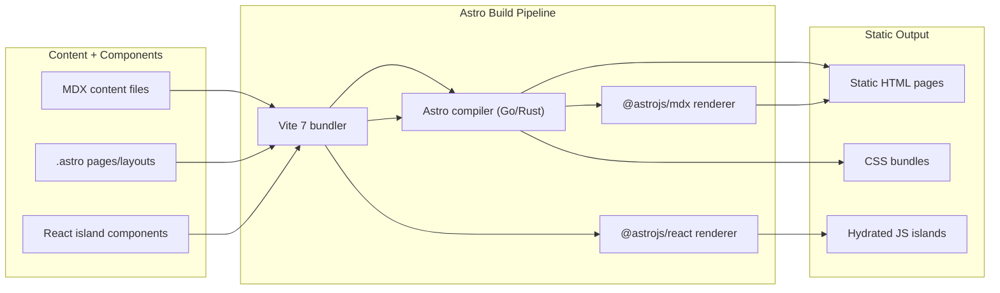

# Dependency Research: astro + @astrojs/react + @astrojs/mdx

Researched: 2026-04-28
Repository: /home/coder/work/rntme
Domain/ecosystem: npm/static-site-framework
Current version(s) in rntme: astro ^5.0.0; @astrojs/react ^4.0.0; @astrojs/mdx ^4.0.0 (landing package.json; docs/marketing site)
Latest stable version: astro 6.1.10 (2026-04-28); @astrojs/react 5.0.4 (2026-04-22); @astrojs/mdx 5.0.4 (2026-04-22)
Confidence: HIGH

## User Constraints
- Goal: understand current dependencies and migrate rntme to latest safe versions later.
- Output must be written to `docs/research/astro-plus-astrojs-react-plus-astrojs-mdx/README.md`.
- Research-only: do not perform dependency upgrades or runtime code migrations in this issue.
- Look for better-suited libraries/solutions, not only latest version of the current choice.
- Use authoritative current sources: Context7 where applicable, official docs/changelog/releases, npm/GitHub/container registry, migration guides, security advisories.

## Summary

Astro is a content-focused static site generator with an islands architecture that ships zero JavaScript by default. It is the dominant choice for marketing sites, documentation, and landing pages in the React ecosystem when performance and SEO are priorities. The rntme landing site (`apps/landing`) uses Astro 5.x with React islands and MDX content files — a standard, well-suited stack for this use case.

Astro 6.0 was released on 2026-03-10, and 6.1.10 is the latest stable as of 2026-04-28. The v6 release is a healthy, incremental major: it requires Node 22+, upgrades to Vite 7 and Zod 4, stabilizes several experimental features (Fonts API, CSP, Live Content Collections), and redesigns the dev server to use Vite's Environment API for runtime fidelity. There are no security advisories for Astro in npm audit.

For rntme's landing/docs use case, Astro remains the best choice. Next.js is heavier and oriented toward full-stack React apps; Nuxt is Vue-centric; SvelteKit is Svelte-centric. None provide Astro's zero-JS-by-default content performance. The primary recommendation is to **KEEP + UPGRADE** to Astro 6.x, but schedule the migration after React 19 unification (see [react-plus-react-dom research](./react-plus-react-dom/README.md)) to avoid double migration work.

Primary recommendation: KEEP + UPGRADE to Astro 6.x + @astrojs/react 5.x + @astrojs/mdx 5.x, coordinated with React 19 upgrade wave.

## Current Usage in rntme

| Package / image / tool | Current version | Used by | Source file(s) | Runtime/dev/build/test | Notes |
|---|---:|---|---|---|---|
| astro | ^5.0.0 | landing | `apps/landing/package.json` | build + dev + preview | Static site generator |
| @astrojs/react | ^4.0.0 | landing | `apps/landing/package.json` | build + dev | React islands integration |
| @astrojs/mdx | ^4.0.0 | landing | `apps/landing/package.json` | build + dev | MDX content support |
| react | ^18.3.0 | landing | `apps/landing/package.json` | runtime | React islands |
| react-dom | ^18.3.0 | landing | `apps/landing/package.json` | runtime | React islands |

### Verification commands used

```bash
cd /home/coder/work/rntme
grep -r "astro" --include="package.json" -l | grep -v node_modules
# → apps/landing/package.json

cat apps/landing/package.json | jq '.dependencies | {astro, "@astrojs/react", "@astrojs/mdx", react, "react-dom"}'
# → astro: "^5.0.0", @astrojs/react: "^4.0.0", @astrojs/mdx: "^4.0.0", react: "^18.3.0", react-dom: "^18.3.0"

find apps/landing/src -name "*.astro" | wc -l
# → 13 Astro components/pages

find apps/landing/src -name "*.mdx" | wc -l
# → 6 MDX content files

find apps/landing/src -name "*.tsx" | wc -l
# → 3 React components (AhaReveal.tsx, SideRail, etc.)
```

### Astro API usage patterns found in landing app

- `Astro.props` — for layout props (`BaseLayout.astro`)
- `Astro.url.href` — for canonical URLs (`BaseLayout.astro`)
- `.astro` pages with frontmatter imports (`index.astro`)
- `.mdx` content files with frontmatter layout references (`terms.mdx`, `privacy.mdx`, `content/*.mdx`)
- Named exports from `.mdx` files (`competitors.mdx`, `micro-jobs.mdx`, `best-fit.mdx`, `objections.mdx`)
- React components imported into Astro pages as islands (`AhaReveal.tsx`, `SideRail`)
- No usage of `getStaticPaths()`, `getCollection()`, Content Collections, or `Astro.glob()`

## Latest Versions / Release State

| Channel | Version | Release date | Source | Notes |
|---|---|---|---|---|
| astro stable | 6.1.10 | 2026-04-28 | npm, GitHub releases | Latest patch |
| astro major | 6.0.0 | 2026-03-10 | npm, GitHub releases, Astro blog | v6 release |
| astro previous | 5.0.0 | 2024-12-03 | npm | Previous major |
| @astrojs/react | 5.0.4 | 2026-04-22 | npm | Requires astro ^6.0.0 |
| @astrojs/mdx | 5.0.4 | 2026-04-22 | npm | Requires astro ^6.0.0 |

### Release cadence
- Astro follows semver with ~6-week minor cycles and yearly major releases.
- v5 → v6 gap: ~15 months (Dec 2024 → Mar 2026).
- v6 is actively maintained; v5 will receive security fixes for a grace period but new features land on v6 only.

## Standard Stack

### Core
| Library | Version | Purpose | Why Standard |
|---|---:|---|---|
| astro | ^6.1.10 | Static site generator / meta-framework | Islands architecture, zero JS by default, content-first, best-in-class performance for marketing/docs |
| @astrojs/react | ^5.0.4 | React component integration | Official integration, hydration control (`client:load`, `client:idle`, `client:visible`, `client:media`), supports React 17–19 |
| @astrojs/mdx | ^5.0.4 | MDX content rendering | Official integration, Astro 6 compatible, supports MDX v3 |
| react + react-dom | ^19.2.5 | UI islands | See [react-plus-react-dom research](./react-plus-react-dom/README.md) |
| vite | ^7.0.0 | Bundler / dev server | Astro 6 bundles Vite 7; aligns with ecosystem |

### Supporting
| Library | Version | Purpose | When to Use |
|---|---:|---|---|
| @astrojs/upgrade | latest | Automated upgrade tool | Use `npx @astrojs/upgrade` when migrating major versions |
| @astrojs/compiler-rs | experimental | Rust-based compiler | Experimental in v6; faster builds, better diagnostics. Not recommended for production yet. |
| astro/zod | bundled | Content schema validation | Astro 6 uses Zod 4; import from `astro/zod` instead of `astro:content` |

### Alternatives Considered
| Instead of | Could Use | Tradeoff | Recommendation for rntme |
|---|---|---|---|
| Astro + React | Next.js 16.2.4 | Next.js is the full-stack React standard but ships more JS by default; heavier for static content; App Router complexity | Not recommended. rntme landing is content-heavy, not app-heavy. Astro's zero-JS default is a better fit. |
| Astro + React | Nuxt 4.4.2 | Vue-centric; would require rewriting all components to Vue | Not recommended. rntme already uses React; switching to Vue is a large, unnecessary migration. |
| Astro + React | SvelteKit | Svelte-centric; smaller ecosystem than React; would rewrite components | Not recommended for same reasons as Nuxt. |
| Astro + React | Gatsby 5.x | Gatsby is mature but declining; slower builds; GraphQL complexity | Not recommended. Astro is the modern replacement for Gatsby in this space. |
| Astro + React | Remix 2.x | Remix is full-stack, server-rendered React; heavier than needed for static sites | Not recommended. Remix is for apps, not landing pages. |
| @astrojs/mdx | @astrojs/markdoc | Markdoc is more constrained than MDX; better for structured docs but less flexible for marketing content | Not recommended. rntme uses MDX for flexible content authoring. |
| @astrojs/react | Preact (via @astrojs/preact) | Preact is smaller but React 19 features may not be fully supported | Not recommended. rntme wants full React compatibility. |

Installation / upgrade commands, if eventually recommended:
```bash
# Upgrade Astro and official integrations together
npx @astrojs/upgrade

# Manual upgrade (if needed)
pnpm add astro@latest @astrojs/react@latest @astrojs/mdx@latest
```

## Architecture Patterns

### System Architecture Diagram


### Component Responsibilities
| Component | Responsibility | Implementation mapping | Notes |
|---|---|---|---|
| astro | Static site generation, routing, islands orchestration | `astro` package, `astro.config.mjs` | Zero-JS by default; hydrates only interactive islands |
| @astrojs/react | Render React components in Astro pages | `@astrojs/react` integration | Supports `client:*` directives for hydration control |
| @astrojs/mdx | Parse and render `.mdx` files as Astro pages | `@astrojs/mdx` integration | Uses MDX v3 under the hood |
| React islands | Interactive UI components (forms, animations) | `src/components/*.tsx` | Only these components ship JS to the browser |
| Astro layouts | Page shell (HTML, meta, global styles) | `src/layouts/BaseLayout.astro` | Runs at build time; zero client JS |
| Astro pages | Compose layouts + components into routes | `src/pages/*.astro` | File-based routing |
| MDX content | Structured content with frontmatter | `src/content/*.mdx`, `src/pages/*.mdx` | Exported data + rendered markup |

### Recommended Project Structure
```text
src/
├── pages/           # Route entry points (.astro, .mdx)
├── layouts/         # Page shells (.astro)
├── components/      # Reusable Astro + React components
├── content/         # MDX content files (data + markup)
├── styles/          # Global CSS, design tokens
└── env.ts           # Environment variable loader
```

### Pattern 1: Islands Architecture (Zero JS by Default)
What: Astro ships static HTML with zero JavaScript. Only components explicitly marked with `client:*` directives hydrate in the browser.
When to use: Always. This is Astro's core value proposition.
Example:
```astro
---
// Source: https://docs.astro.build/en/concepts/islands/
import InteractiveCounter from "../components/Counter.tsx";
---
<!-- Static HTML, zero JS -->
<h1>Welcome</h1>

<!-- Hydrated island: only this component ships JS -->
<InteractiveCounter client:load />
```

### Pattern 2: MDX as Data + Content
What: MDX files export structured data (frontmatter + named exports) and render markup. Astro components import the data and render the markup separately.
When to use: When content needs to be referenced in multiple places or processed before rendering.
Example:
```mdx
---
// Source: apps/landing/src/content/competitors.mdx
export const competitors = [
  { shape: "Prompt + code", tools: "Cursor + Supabase", body: "..." },
];

# Competitors

<CompetitorTable data={competitors} />
```

### Pattern 3: Layout Composition
What: Astro layouts define the HTML shell and receive page-specific metadata via props.
When to use: Every page should use a layout for consistent HTML structure.
Example:
```astro
---
// Source: apps/landing/src/layouts/BaseLayout.astro
const { title, description, canonical = Astro.url.href } = Astro.props;
---
<!doctype html>
<html lang="en">
  <head>
    <title>{title}</title>
    <meta name="description" content={description} />
    <link rel="canonical" href={canonical} />
  </head>
  <body><slot /></body>
</html>
```

### Anti-Patterns to Avoid
- **Hydrating everything with `client:load`**: Only hydrate components that need interactivity. Astro's default is zero JS — respect it.
- **Using React for static content**: If a component doesn't need client-side state, write it as `.astro` instead of `.tsx`.
- **Importing `z` from `astro:content`**: In Astro 6, import Zod from `astro/zod` instead. `astro:content` export is deprecated.
- **Using `Astro.glob()`**: Removed in Astro 6. Use `import.meta.glob()` from Vite or Content Collections.
- **Dynamic `export const prerender`**: Astro 5+ requires static `true`/`false` values.

## Don't Hand-Roll

| Problem | Don't Build | Use Instead | Why |
|---|---|---|---|
| Static site generation | Custom Vite/Rollup setup | Astro | Astro handles routing, Markdown/MDX, image optimization, and islands out of the box |
| Markdown/MDX rendering | Custom remark/rehype pipeline | @astrojs/mdx | Astro's integration handles MDX v3, frontmatter, and component imports correctly |
| React hydration control | Manual lazy-loading + hydration | `client:*` directives | Astro's directives are framework-agnostic and optimized |
| Content collections | Custom file-based CMS | Astro Content Collections / Content Layer API | Type-safe, schema-validated, with loaders for local and remote data |
| Image optimization | Custom Sharp/Sharp pipeline | `astro:assets` | Built-in responsive images, format conversion, CSP-compatible |
| Font loading | Manual `@font-face` CSS | Astro Fonts API (v6+) | Self-hosting, fallback generation, preload hints, privacy-friendly |

Key insight: Astro's value is eliminating custom build pipeline glue. A hand-rolled Vite + React + MDX setup would replicate ~80% of Astro's core but with ongoing maintenance burden and worse performance defaults.

## Common Pitfalls

### Pitfall 1: Node Version Mismatch After Astro 6 Upgrade
What goes wrong: Astro 6 requires Node 22.12.0+. CI or deployment environments on Node 18/20 will fail to build.
Why it happens: Astro 6 dropped Node 18 and 20 support (both EOL or approaching EOL).
How to avoid: Verify `.nvmrc`, GitHub Actions `node-version`, and Dokploy/Docker base images before upgrading.
Warning signs: Build failures with `ERR_UNSUPPORTED_ESM_URL_SCHEME` or engine mismatch errors.

### Pitfall 2: Zod 4 Breaking Schemas
What goes wrong: Content collection schemas using `z.string().email()`, `z.string().url()`, or `.default()` with transforms break after Astro 6 upgrade.
Why it happens: Astro 6 upgrades from Zod 3 to Zod 4. Many string formats moved to top-level (`z.email()`, `z.url()`). `.default()` now matches output type, not input type.
How to avoid: Audit all `content.config.ts` files. Use `z.email()` instead of `z.string().email()`. Use `.prefault()` for old behavior. Use `astro/zod` import.
Warning signs: Type errors in content schemas, runtime validation failures.

### Pitfall 3: Removed `Astro.glob()` Breaks Dynamic Imports
What goes wrong: Code using `Astro.glob()` throws after Astro 6 upgrade.
Why it happens: `Astro.glob()` was deprecated in v4 and removed in v6.
How to avoid: Replace with `import.meta.glob()` (Vite standard) or migrate to Content Collections.
Warning signs: `Astro.glob is not a function` at build time.

### Pitfall 4: Legacy Content Collections Removed
What goes wrong: Projects using old `src/content/config.ts` with `type: 'content'` fail in Astro 6.
Why it happens: Astro 6 removes legacy content collections. All collections must use the Content Layer API with loaders.
How to avoid: Migrate to `src/content.config.ts` with `loader: glob({ pattern: '**/*.md', base: "./src/data" })`. Use `legacy.collectionsBackwardsCompat: true` only as a temporary bridge.
Warning signs: Build errors about missing loaders or `type` property.

### Pitfall 5: React 19 Compatibility Gap
What goes wrong: @astrojs/react 4.x may not fully support React 19 features; @astrojs/react 5.x requires Astro 6.
Why it happens: React 19 introduced new APIs (e.g., `use()`) that need framework-level support.
How to avoid: Coordinate React and Astro upgrades. Upgrade to Astro 6 + @astrojs/react 5 + React 19 in a single wave.
Warning signs: Hydration mismatches, missing React 19 features, peer dependency warnings.

## Code Examples

### Verified patterns from official sources

### Common Operation 1: Upgrade Astro and Integrations
```bash
# Source: https://docs.astro.build/en/upgrade-astro/
# Recommended automated upgrade
npx @astrojs/upgrade

# Manual upgrade
pnpm add astro@latest @astrojs/react@latest @astrojs/mdx@latest
```

### Common Operation 2: Configure React Integration
```js
// Source: https://docs.astro.build/en/guides/integrations-guide/react/
// astro.config.mjs
import { defineConfig } from 'astro/config';
import react from '@astrojs/react';

export default defineConfig({
  integrations: [react()],
});
```

### Common Operation 3: Configure MDX Integration
```js
// Source: https://docs.astro.build/en/guides/integrations-guide/mdx/
// astro.config.mjs
import { defineConfig } from 'astro/config';
import mdx from '@astrojs/mdx';

export default defineConfig({
  integrations: [mdx()],
});
```

### Common Operation 4: Define Content Collection with Loader (Astro 6)
```ts
// Source: https://docs.astro.build/en/guides/content-collections/
// src/content.config.ts
import { defineCollection, z } from 'astro:content';
import { glob } from 'astro/loaders';

const blog = defineCollection({
  loader: glob({ pattern: '**/*.md', base: "./src/data/blog" }),
  schema: z.object({
    title: z.string(),
    pubDate: z.coerce.date(),
  }),
});

export const collections = { blog };
```

### Common Operation 5: Query Content Collection
```astro
---
// Source: https://docs.astro.build/en/guides/content-collections/
import { getCollection } from 'astro:content';
const posts = await getCollection('blog');
---
<ul>
  {posts.map(post => <li>{post.data.title}</li>)}
</ul>
```

## State of the Art (2024-2026)

| Old Approach | Current Approach | When Changed | Impact |
|---|---|---|---|
| Custom webpack + React | Astro + islands | 2022+ | Dramatically reduced client JS for content sites |
| Gatsby + GraphQL | Astro + Content Collections | 2023+ | Simpler data layer, faster builds |
| Manual font loading | Astro Fonts API | Astro 6 (Mar 2026) | Built-in self-hosting, fallbacks, privacy |
| Build-time content only | Live Content Collections | Astro 6 (Mar 2026) | Request-time CMS/API content without rebuilds |
| Manual CSP headers | Built-in CSP API | Astro 6 (Mar 2026) | Automatic script/style hashing |
| Go-based compiler | Rust compiler (experimental) | Astro 6 (Mar 2026) | Faster builds, better diagnostics |
| Zod 3 schemas | Zod 4 + `astro/zod` | Astro 6 (Mar 2026) | New API shapes, breaking changes for string formats |
| Vite 5/6 | Vite 7 | Astro 6 (Mar 2026) | Environment API, unified dev/prod runtime |

New tools/patterns to consider:
- **Astro Fonts API** (stable in v6): Self-host fonts with automatic fallbacks and preload hints.
- **Live Content Collections** (stable in v6): Fetch CMS/API content at request time without rebuilds.
- **Content Security Policy API** (stable in v6): First-class CSP support in a JS meta-framework.
- **Experimental Rust compiler**: Faster compilation; monitor for production readiness.
- **Experimental queued rendering**: Up to 2x faster rendering for large sites.

Deprecated/outdated:
- `Astro.glob()` — removed in v6
- Legacy content collections (`type: 'content'`) — removed in v6
- `<ViewTransitions />` component — removed in v6 (use `ClientRouter`)
- `import.meta.env.ASSETS_PREFIX` — deprecated in v6
- `z` from `astro:content` — deprecated in v6 (use `astro/zod`)

## Migration Assessment

| Area | Finding | Impact | Risk | Evidence |
|---|---|---|---|---|
| Astro 5 → 6 breaking changes | Node 22+ required; Vite 7; Zod 4; removed legacy collections, Astro.glob(), ViewTransitions | Medium | Medium | [Astro v6 upgrade guide](https://docs.astro.build/en/guides/upgrade-to/v6/) |
| @astrojs/react 4 → 5 | Peer dep now `astro: ^6.0.0`; supports React 17–19 | Low | Low | npm peerDependencies |
| @astrojs/mdx 4 → 5 | Peer dep now `astro: ^6.0.0`; MDX v3 | Low | Low | npm peerDependencies |
| rntme landing app impact | No usage of removed APIs (Astro.glob, legacy collections, ViewTransitions) | Low | Low | Source code audit |
| React 18 → 19 coordination | @astrojs/react 5 supports React 19; should upgrade React simultaneously | Medium | Medium | [react-plus-react-dom research](./react-plus-react-dom/README.md) |
| Zod schema impact | No content.config.ts found in landing app; likely no Zod schema changes needed | Low | Low | Source code audit |
| Node version | Need to verify CI/Dokploy use Node 22+ | Medium | Low | `.nvmrc` / deploy config check |
| Build/test impact | Astro check + tsc + vitest should pass after upgrade | Medium | Low | Test suite exists |
| Security | No known CVEs for Astro in npm audit | — | — | `npm audit` |
| Performance | Astro 6 dev server uses production runtime; fewer dev/prod mismatches | Positive | — | Astro 6 blog |

### Breaking changes relevant to rntme landing app

The landing app does NOT use these removed/deprecated features:
- ❌ `Astro.glob()`
- ❌ Legacy content collections (`type: 'content'`)
- ❌ `<ViewTransitions />` component
- ❌ Dynamic `export const prerender`
- ❌ `Astro` object in `getStaticPaths()`
- ❌ `import.meta.env.ASSETS_PREFIX`
- ❌ `z` from `astro:content`

The landing app MAY need updates for:
- ⚠️ Node 22+ requirement (verify deploy environment)
- ⚠️ `import.meta.env` inlining behavior (check `env.ts`)
- ⚠️ Script/style tag ordering (if relying on specific cascade)

## Recommendation

Decision: **KEEP + UPGRADE (coordinated with React 19 wave)**

Rationale:
- Astro is the correct tool for rntme's landing/docs site: content-focused, zero-JS-by-default, excellent performance.
- No better-suited alternative exists for this use case within the React ecosystem.
- Astro 6 is a healthy, incremental major with valuable new features (Fonts API, CSP, Live Content Collections, improved dev server).
- No security issues identified.
- The landing app does not use any APIs removed in v6, so migration risk is low.
- However, upgrading Astro should be **coordinated with the React 19 upgrade** to avoid double work: @astrojs/react 5.x + React 19 is the target state.

Follow-up tasks to create later:
1. **RNT-XXX**: Upgrade landing app to Astro 6 + @astrojs/react 5 + @astrojs/mdx 5 + React 19 (coordinated wave)
2. **RNT-XXX**: Verify Dokploy/CI uses Node 22+ before upgrade
3. **RNT-XXX**: Run `npx @astrojs/upgrade` and fix any peer dependency warnings
4. **RNT-XXX**: Run full test suite (`pnpm test`, `pnpm typecheck`, `pnpm lint`) after upgrade
5. **RNT-XXX**: Evaluate Astro Fonts API for self-hosting current Fontshare fonts
6. **RNT-XXX**: Monitor experimental Rust compiler for production readiness

## Open Questions

1. **Does Dokploy/CI already use Node 22+?**
   - What we know: Astro 6 requires Node 22.12.0+.
   - What's unclear: Current `.nvmrc` and Dokploy base image version.
   - Recommendation: Check `apps/landing/Dockerfile` and CI configs before scheduling upgrade.

2. **Should rntme adopt the Astro Fonts API?**
   - What we know: Astro 6 has a built-in Fonts API that self-hosts fonts with fallbacks.
   - What's unclear: Current Fontshare loading is manual via `<link>` tags in `BaseLayout.astro`.
   - Recommendation: Evaluate if Fonts API simplifies font management; not a blocker for upgrade.

3. **Should rntme adopt Live Content Collections for CMS integration?**
   - What we know: Astro 6 stabilizes request-time content fetching.
   - What's unclear: No current CMS integration in landing app; content is static MDX.
   - Recommendation: Not needed now; revisit if marketing team needs a headless CMS.

4. **Is the experimental Rust compiler worth monitoring?**
   - What we know: Faster builds, better diagnostics, but still experimental.
   - What's unclear: Stability for production use.
   - Recommendation: Monitor Astro releases; consider enabling when it reaches stable.

## Sources

### Primary (HIGH confidence)
- `/withastro/docs` (Context7) — Astro v6 upgrade guide, Content Collections, React integration, MDX integration
- `https://docs.astro.build/en/guides/upgrade-to/v6/` — Official v6 migration guide (verified via web fetch)
- `https://astro.build/blog/astro-6/` — Astro 6 release blog post (verified via web fetch)
- `npm view astro@6.1.10`, `npm view @astrojs/react@5.0.4`, `npm view @astrojs/mdx@5.0.4` — npm registry version metadata
- `apps/landing/package.json` — Current dependency versions
- `apps/landing/src/` — Source code audit for API usage

### Secondary (MEDIUM confidence)
- GitHub releases `astro@6.0.0` — Release notes and breaking changes
- `npm audit` — No security advisories for astro (run 2026-04-28)

### Tertiary (LOW confidence - needs validation)
- Next.js 16.2.4, Nuxt 4.4.2 versions — Checked via npm; used for comparison only

## Metadata

Research scope:
- Core technology: Astro static site generator, @astrojs/react, @astrojs/mdx
- Ecosystem: Vite 7, Zod 4, React 19, Node 22
- Patterns: Islands architecture, MDX content authoring, layout composition
- Pitfalls: Node version, Zod 4 migration, removed APIs, React 19 coordination
Confidence breakdown:
- Standard stack: HIGH — Astro is the clear leader for content sites; alternatives are mismatched
- Architecture: HIGH — Verified against official docs and rntme source code
- Pitfalls: HIGH — Based on official v6 migration guide and source audit
- Code examples: HIGH — All from official Astro docs or rntme codebase
Research date: 2026-04-28
Valid until: 2026-07-28 (Astro releases ~every 6 weeks; reassess after 6.2 or 6.3)
Ready for migration planning: **YES**
