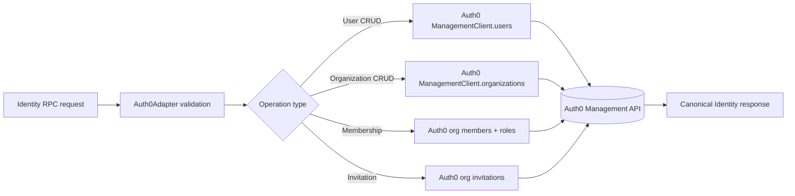

# Dependency Research: auth0

Researched: 2026-04-28
Repository: /home/coder/work/rntme
Domain/ecosystem: npm/auth-identity-sdk
Current version(s) in rntme: 4.28.0 (modules/identity/auth0/package.json; Auth0 identity module)
Latest stable version: 5.8.0 (2026-04-22, npm latest tag / GitHub releases)
Confidence: HIGH

## User Constraints
- Goal: understand current dependencies and migrate rntme to latest safe versions later.
- Output must be written to `docs/research/auth0/README.md`.
- Research-only: do not perform dependency upgrades or runtime code migrations in this issue.
- Look for better-suited libraries/solutions, not only latest version of the current choice.
- Use authoritative current sources: Context7 where applicable, official docs/changelog/releases, npm/GitHub/container registry, migration guides, security advisories.

## Summary

Auth0 Node.js SDK (`auth0` on npm) is the official Management and Authentication API client for Auth0 tenants. rntme currently uses v4.28.0 as the integration boundary for the canonical Identity contract adapter (`@rntme/identity-auth0`).

In September 2025, Auth0 released v5.0.0 (stable), a major rewrite of the Management API client using Fern code generation. v5 introduces breaking changes to Management API method names, signatures, pagination, and response shapes. The Authentication API client is unchanged and remains backward-compatible. The v5 release line also raised minimum Node.js requirements to `^20.19.0 || ^22.12.0 || ^24.0.0`.

The standard expert stack for Auth0-centric backends in 2024–2026 remains the official `auth0` SDK for Management API operations, paired with `jwks-rsa` or `jose` for JWT verification, and `openid-client` or Passport strategies for OAuth/OIDC flows. However, the identity vendor landscape has shifted: Clerk and WorkOS have emerged as strong alternatives with developer-experience-first SDKs, and rntme already includes experimental modules for both (`@rntme/identity-clerk` and `@rntme/identity-workos`).

Primary recommendation: **KEEP + UPGRADE to v5.x, but schedule a migration spike because Management API adapter code requires significant refactoring.** Continue evaluating Clerk and WorkOS via the existing conformance modules for future vendor flexibility.

## Current Usage in rntme

| Package / image / tool | Current version | Used by | Source file(s) | Runtime/dev/build/test | Notes |
|---|---|---|---|---|---|
| `auth0` | 4.28.0 | `@rntme/identity-auth0` | `modules/identity/auth0/package.json` | prod | Management SDK for Auth0 tenant operations |

Verified via:
```bash
grep -r '"auth0"' /home/coder/work/rntme/modules/identity/auth0/package.json
# "auth0": "4.28.0"
```

The `auth0` package is imported in `modules/identity/auth0/src/adapter.ts`:
```ts
import { ManagementClient } from 'auth0';
```

Usage is confined to the Auth0 Management API adapter (`Auth0ManagementAdapter`), which wraps `ManagementClient` methods for users, organizations, members, roles, and invitations. No Authentication API usage is present in this module.

## Latest Versions / Release State

| Channel | Version | Release date | Source | Notes |
|---|---|---|---|---|
| Latest stable | 5.8.0 | 2026-04-22 | npm `latest` tag / GitHub releases | Active development; breaking changes in Management API |
| Legacy v4 | 4.37.0 | 2025-11-19 | npm `legacy-v4` tag / GitHub releases | Last v4 release; maintenance mode |
| Beta | 5.0.0-beta.0 | 2025 | npm `beta` tag | Superseded by stable v5 |

Release cadence: roughly every 2–4 weeks for v5.x patch/minor releases.

## Standard Stack

### Core
| Library | Version | Purpose | Why Standard |
|---|---|---|---|
| `auth0` | 5.8.0 | Auth0 Management & Authentication API client | Official SDK; Fern-generated types; modular sub-clients |
| `jwks-rsa` | ^3.1.0 | JWKS fetching for JWT verification | Industry standard for Auth0 JWKS endpoints |
| `jose` | ^5.x / ^6.x | JWT verification/signing | Modern, zero-dependency alternative to `jsonwebtoken` |
| `openid-client` | ^5.x | OAuth 2.0 / OIDC client | Standard for server-side OAuth flows |

### Supporting
| Library | Version | Purpose | When to Use |
|---|---|---|---|
| `passport-auth0` | ^1.4.0 | Passport strategy for Auth0 | When using Passport.js in Express/Fastify |
| `express-oauth2-jwt-bearer` | ^1.6.0 | Express middleware for JWT auth | Quick Express API protection |

### Alternatives Considered
| Instead of | Could Use | Tradeoff | Recommendation for rntme |
|---|---|---|---|
| `auth0` (Management API) | `@clerk/backend` | Clerk offers user/organization APIs with cleaner DX; pricing model differs | Already have experimental module; evaluate for greenfield projects |
| `auth0` (Management API) | `@workos-inc/node` | WorkOS focuses on SSO/SCIM/directory sync; organizations feature is newer | Already have experimental module; good for enterprise SSO use cases |
| `auth0` (self-hosted) | Keycloak / Authentik | Full self-hosted IAM; higher operational burden | Not recommended unless data residency is a hard requirement |
| `auth0` (Authentication) | `openid-client` + custom | More control, less vendor lock-in | Higher implementation cost; rntme abstracted identity reduces this concern |

Installation / upgrade commands, if eventually recommended:
```bash
# Upgrade to v5 (breaking changes in Management API)
pnpm add auth0@5.8.0

# Or stay on v4 latest for minimal friction
pnpm add auth0@4.37.0

# For gradual migration, v4 legacy client is available via:
# import { ManagementClient } from 'auth0/legacy';
```

## Architecture Patterns

### System Architecture Diagram


### Component Responsibilities
| Component | Responsibility | Implementation mapping | Notes |
|---|---|---|---|
| `Auth0ManagementAdapter` | Wraps Auth0 SDK to implement `Auth0Adapter` interface | `modules/identity/auth0/src/adapter.ts` | Hides SDK version specifics from handlers |
| `createManagementClient` | Factory for `ManagementClient` with env-based config | `modules/identity/auth0/src/adapter.ts` | Supports token or client credentials auth |
| `createAuth0Adapter` | Factory for `Auth0ManagementAdapter` | `modules/identity/auth0/src/adapter.ts` | Injects connection/invitation client ID |
| `createAuth0IdentityModule` | Canonical RPC handlers using adapter | `modules/identity/auth0/src/handlers.ts` | Decoupled from SDK details |
| Event translator | Auth0 log events → canonical events | `modules/identity/auth0/src/events.ts` | Best-effort; depends on log payload shape |

### Recommended Project Structure
```text
modules/identity/auth0/
├── src/
│   ├── adapter.ts        # SDK wrapper / adapter implementation
│   ├── handlers.ts       # Canonical RPC handlers
│   ├── mapping.ts        # Auth0 ↔ canonical type mappers
│   ├── events.ts         # Log event translator
│   ├── capabilities.ts   # Claimed RPCs/events manifest
│   ├── errors.ts         # Error mapping
│   └── conformance.ts    # Mock conformance suite
├── test/
│   ├── unit/             # Adapter/mapping unit tests
│   └── integration/      # Mock conformance tests
└── module.json           # Runtime manifest
```

### Pattern 1: Adapter Wrapper
What: Isolate Auth0 SDK interactions behind an internal adapter interface so SDK version changes do not leak into business logic.
When to use: When wrapping any third-party vendor SDK in a canonical contract module.
Example:
```ts
// Source: rntme modules/identity/auth0/src/adapter.ts (current v4 pattern)
export interface Auth0Adapter {
  getUser(id: string): Promise<Auth0User>;
  listUsers(params: ListParams): Promise<ListResult<Auth0User>>;
  // ... other operations
}

export class Auth0ManagementAdapter implements Auth0Adapter {
  private readonly users: Manager;
  constructor(client: ManagementClient) {
    this.users = client.users as Manager;
  }
  async getUser(id: string): Promise<Auth0User> {
    return (await this.users.get({ id } as never)).data as Auth0User;
  }
}
```

### Pattern 2: Environment-Based Client Factory
What: Centralize SDK client initialization from environment variables with fallback logic.
When to use: When the SDK supports multiple authentication mechanisms (token vs. client credentials).
Example:
```ts
// Source: rntme modules/identity/auth0/src/adapter.ts
export function createManagementClient(options: Auth0ManagementOptions = {}): ManagementClient {
  const domain = options.domain ?? process.env.AUTH0_DOMAIN;
  const token = options.token ?? process.env.AUTH0_MANAGEMENT_TOKEN;
  const clientId = options.clientId ?? process.env.AUTH0_CLIENT_ID;
  const clientSecret = options.clientSecret ?? process.env.AUTH0_CLIENT_SECRET;
  if (!domain) throw new Error('AUTH0_DOMAIN is required');
  if (token) return new ManagementClient({ domain, token });
  if (clientId && clientSecret) return new ManagementClient({ domain, clientId, clientSecret });
  throw new Error('AUTH0_MANAGEMENT_TOKEN or AUTH0_CLIENT_ID/AUTH0_CLIENT_SECRET is required');
}
```

### Anti-Patterns to Avoid
- **Direct SDK usage in handlers**: Always route through an adapter interface to limit blast radius of SDK upgrades.
- **Ignoring pagination**: Auth0 Management API uses offset and checkpoint pagination; omitting `hasMore` / `nextCursor` logic causes silent data truncation.
- **Storing Auth0 tokens in application state**: Management API tokens should be fetched at runtime (M2M flow) or injected via env, never hardcoded or committed.

## Don't Hand-Roll

| Problem | Don't Build | Use Instead | Why |
|---|---|---|---|
| Auth0 Management API client | Raw REST calls with `fetch` | `auth0` SDK (official) | Handles pagination, retries, rate limits, token refresh, and type safety |
| JWT verification from Auth0 | Custom JWT parser | `jwks-rsa` + `jsonwebtoken` or `jose` | JWKS endpoint rotation, algorithm whitelisting, and RSA key handling are error-prone |
| OAuth 2.0 / OIDC flow | Custom OAuth implementation | `openid-client` or Passport strategies | Spec compliance, PKCE, state/nonce validation, and token refresh complexity |
| User metadata merge | Custom deep-merge | SDK-provided `user_metadata` / `app_metadata` APIs | Auth0 has specific merge semantics and size limits |

Key insight: Auth0's Management API has nuanced pagination, rate limiting (100 req/sec per tenant), and token lifecycle behaviors that are tedious to replicate correctly. The official SDK amortizes this complexity across the community.

## Common Pitfalls

### Pitfall 1: v5 Management API Method Name Changes
What goes wrong: After upgrading to v5, `client.users.getAll()` throws `TypeError: getAll is not a function` because it was renamed to `client.users.list()`.
Why it happens: Auth0 rewrote the Management client with Fern code generation and adopted consistent `list/create/get/update/delete` naming.
How to avoid: Audit all `ManagementClient` method calls against the v5 migration guide before upgrading. Use TypeScript strict mode to catch missing methods at compile time.
Warning signs: Type errors after `pnpm add auth0@latest` in adapter code.

### Pitfall 2: Pagination Data Truncation
What goes wrong: `listUsers` returns only the first page (50 items) without indicating more results exist, causing incomplete data in list views.
Why it happens: v4 returns `data` + `total` + pagination info differently than v5's `Page` object with `hasNextPage()`. Custom adapter code may not handle either correctly.
How to avoid: Always use SDK pagination helpers or implement `hasMore`/`nextCursor` in the adapter. Write conformance tests that verify multi-page behavior.
Warning signs: List results never exceed 50 items; user reports missing records.

### Pitfall 3: Rate Limiting on Management API
What goes wrong: Bulk operations (e.g., importing users, listing all organizations) hit Auth0's 100 req/sec rate limit and receive `429 Too Many Requests`.
Why it happens: Auth0 enforces tenant-wide rate limits on Management API endpoints. The SDK does not automatically retry with backoff.
How to avoid: Implement exponential backoff around adapter methods, or use Auth0's bulk import jobs API for large data sets.
Warning signs: Intermittent `429` errors in production; slow response times during bulk operations.

## Code Examples

### Common Operation 1: Create a User (v4 pattern, current)
```ts
// Source: rntme modules/identity/auth0/src/adapter.ts (v4)
async createUser(body: Record<string, unknown>): Promise<Auth0User> {
  return responseData<Auth0User>(
    await this.users.create({ 
      ...(this.connection !== undefined ? { connection: this.connection } : {}), 
      ...body 
    } as never)
  );
}
```

### Common Operation 2: List Users with Pagination (v5 pattern, future)
```ts
// Source: auth0/node-auth0 v5 migration guide
import { ManagementClient } from "auth0";

const client = new ManagementClient({ domain, clientId, clientSecret });

// v5: returns Page object with helper methods
let page = await client.users.list({ q: 'email:"test@example.com"', search_engine: 'v3' });
for (const user of page.data) {
  console.log(user.user_id);
}
while (page.hasNextPage()) {
  page = await page.getNextPage();
}
```

### Common Operation 3: Access Raw Response (v5)
```ts
// Source: auth0/node-auth0 v5 migration guide
// v5 non-paginated responses return data directly
const user = await client.users.get({ id: "auth0|123" });
console.log(user.user_id);

// To access headers/status, use withRawResponse()
const response = await client.users.get({ id: "auth0|123" }).withRawResponse();
console.log(response.status, response.headers, response.data.user_id);
```

## State of the Art (2024-2025)

| Old Approach | Current Approach | When Changed | Impact |
|---|---|---|---|
| `auth0` v4 Management API | `auth0` v5 Management API (Fern-generated) | 2025-09 (v5.0.0 stable) | Breaking method name/signature changes; stronger TypeScript |
| `jsonwebtoken` + `jwks-rsa` | `jose` (Web Crypto API) | 2023–2025 | Modern, zero-dependency, Edge-compatible |
| Auth0 Rules | Auth0 Actions | 2021–2024 | Rules deprecated; Actions are the future of extensibility |
| Auth0 Hooks | Auth0 Actions | 2021–2024 | Hooks deprecated in favor of Actions |
| Embedded Lock / auth0.js | Universal Login / New Universal Login | Ongoing | Security best practice; cross-origin auth discouraged |

New tools/patterns to consider:
- **Auth0 Actions**: Serverless functions for login/registration extensibility (replacement for Rules/Hooks).
- **Auth0 Organizations**: Native multi-tenancy support (used by rntme's identity adapter).
- **Clerk**: Developer-experience-first identity with excellent React/Next.js SDKs.
- **WorkOS**: Enterprise-focused with strong SSO/SCIM/directory sync.

Deprecated/outdated:
- Auth0 Rules (deprecated, migrate to Actions).
- Auth0 Hooks (deprecated, migrate to Actions).
- auth0.js embedded login (discouraged in favor of Universal Login).

## Migration Assessment

| Area | Finding | Impact | Risk | Evidence |
|---|---|---|---|---|
| Breaking changes | v5 Management API method names/signatures changed significantly | HIGH | HIGH | v5 Migration Guide (722 lines of changes) |
| Node.js compatibility | v5 requires `^20.19.0 \|\| ^22.12.0 \|\| ^24.0.0` | MEDIUM | MEDIUM | rntme uses Node 20; verify exact version |
| Authentication API | Unchanged between v4 and v5 | LOW | LOW | Official release notes |
| Legacy client | v4-compatible client available via `auth0/legacy` | LOW | LOW | Official docs |
| Type safety | v5 has stronger TypeScript via Fern generation | LOW | LOW | Migration guide |
| Pagination | v5 uses `Page` objects with `hasNextPage()`/`getNextPage()` | MEDIUM | MEDIUM | Adapter code needs updates |
| Response shape | v5 non-paginated responses omit `.data` wrapper by default | MEDIUM | MEDIUM | Adapter uses `responseData()` helper |
| Security posture | One low-severity advisory from 2020 (header sanitization) | LOW | LOW | GHSA-5jpf-pj32-xx53 |

Migration path/effort:
1. Update `auth0` to v5.x in `modules/identity/auth0/package.json`.
2. Refactor `Auth0ManagementAdapter` to use v5 method names (e.g., `getAll` → `list`, sub-resource moves).
3. Update pagination logic to use v5 `Page` objects.
4. Update `responseData()` helper or remove it (v5 returns data directly for non-paginated endpoints).
5. Update types to use `Management.*` namespace.
6. Run mock conformance tests.
7. Schedule live conformance test against Auth0 sandbox tenant.

Test strategy:
- Mock conformance tests (`test:conformance:mock`) cover adapter behavior.
- Live conformance tests require Auth0 sandbox tenant (currently not wired).
- Add unit tests for pagination edge cases (empty results, multi-page).

## Recommendation

Decision: **KEEP + UPGRADE (with planned spike)**

Rationale:
- Auth0 remains a robust, enterprise-grade identity platform with strong multi-tenancy (Organizations) and management API capabilities.
- v5 is actively maintained; v4 is in maintenance mode (last release 4.37.0 in Nov 2025).
- The `auth0` SDK is the official, supported client; migrating to raw REST or another vendor would increase operational risk.
- rntme's adapter pattern limits blast radius: SDK changes are confined to `adapter.ts`.
- Alternatives (Clerk, WorkOS) are promising but Auth0 offers the most mature Organizations/Memberships/Invitations feature set for B2B SaaS.
- v5 Authentication API is unchanged, so only Management API adapter code needs work.

Follow-up tasks to create later:
1. **Spike**: Migrate `Auth0ManagementAdapter` to auth0 v5 Management API (estimate: 1–2 days).
2. **Update**: Bump `auth0` from `4.28.0` to `5.8.0` in `modules/identity/auth0/package.json`.
3. **Test**: Add multi-page pagination unit tests.
4. **Evaluate**: Run live conformance tests against Auth0 sandbox tenant.
5. **Monitor**: Continue evaluating Clerk and WorkOS via existing experimental modules for future vendor flexibility.

## Open Questions

1. **What Node.js version is rntme targeting in production?**
   - What we know: rntme devDependencies use `@types/node ^20.14.0`.
   - What's unclear: Exact production Node.js runtime version.
   - Recommendation: Verify Node.js version meets v5 requirements (`^20.19.0`) before upgrading.

2. **Does rntme use any Authentication API features from the `auth0` package?**
   - What we know: The identity module only imports `ManagementClient`.
   - What's unclear: Whether other rntme packages use Authentication API.
   - Recommendation: Search monorepo for `AuthenticationClient` or `WebAuth` usage before upgrading.

3. **Should rntme adopt the v4 legacy import path for gradual migration?**
   - What we know: v5 provides `auth0/legacy` for v4-compatible ManagementClient.
   - What's unclear: Whether the team prefers big-bang adapter refactor or gradual cutover.
   - Recommendation: Use legacy path only as a temporary bridge; full v5 migration is cleaner long-term.

## Sources

### Primary (HIGH confidence)
- npm registry (`auth0` package) — version tags, release dates
- GitHub `auth0/node-auth0` releases — v4.37.0 (2025-11-19), v5.0.0 (2025-09-17), v5.8.0 (2026-04-22)
- GitHub `auth0/node-auth0` v5 Migration Guide — comprehensive method mapping and breaking changes
- GitHub `auth0/node-auth0` security advisories — GHSA-5jpf-pj32-xx53

### Secondary (MEDIUM confidence)
- rntme repo source code — `modules/identity/auth0/src/adapter.ts`, `package.json`
- rntme repo architecture — Clerk (`@clerk/backend` 3.4.1) and WorkOS (`@workos-inc/node` ^7.82.0) experimental modules

### Tertiary (LOW confidence - needs validation)
- Auth0 docs (auth0.com/docs) — general platform capabilities and deprecation notices

## Metadata

Research scope:
- Core technology: Auth0 Node.js SDK (`auth0` npm package)
- Ecosystem: Auth0 Management API, Authentication API, JWT verification libraries, identity vendor alternatives
- Patterns: Adapter pattern, SDK versioning isolation, pagination handling
- Pitfalls: Breaking API changes, pagination truncation, rate limiting

Confidence breakdown:
- Standard stack: HIGH — based on official SDK docs and migration guide
- Architecture: HIGH — based on current rntme implementation and adapter pattern
- Pitfalls: HIGH — based on v5 migration guide and known Auth0 API behaviors
- Code examples: HIGH — based on official migration guide and current rntme source

Research date: 2026-04-28
Valid until: 2026-07-28 (auth0 v5 is actively developed; check for new releases quarterly)
Ready for migration planning: yes
