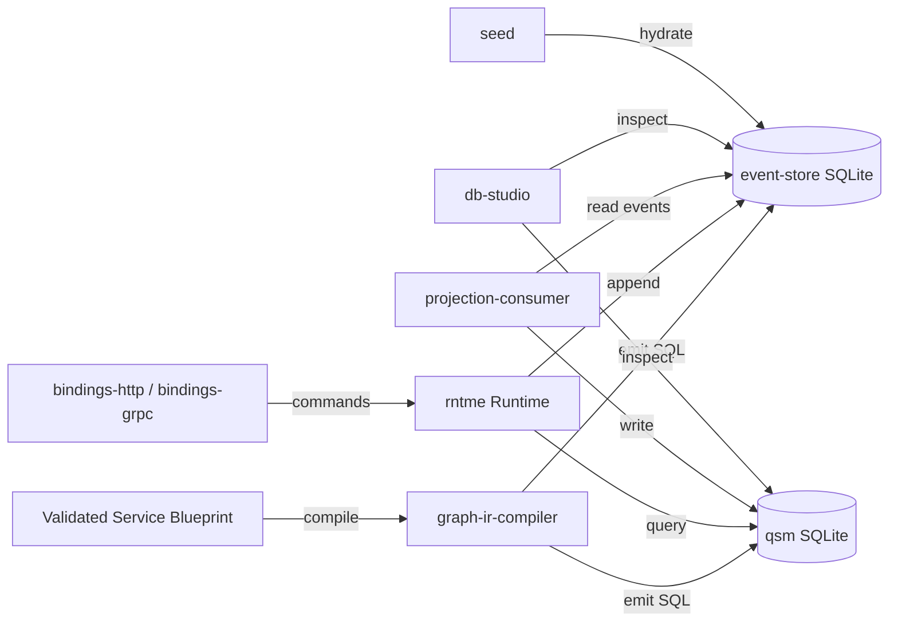

# Dependency Research: better-sqlite3

Researched: 2026-04-28
Repository: /home/coder/work/rntme
Domain/ecosystem: npm/sqlite-storage
Current version(s) in rntme: `^11.0.0` – `^11.10.0` (resolved to `11.10.0` in lockfile)
Latest stable version: `12.9.0` (2026-04-12, SQLite 3.53.0)
Confidence: HIGH

## User Constraints
- Goal: understand current dependencies and migrate rntme to latest safe versions later.
- Output must be written to `docs/research/better-sqlite3/README.md`.
- Research-only: do not perform dependency upgrades or runtime code migrations in this issue.
- Look for better-suited libraries/solutions, not only latest version of the current choice.
- Use authoritative current sources: Context7 where applicable, official docs/changelog/releases, npm/GitHub/container registry, migration guides, security advisories.

## Summary

`better-sqlite3` is the dominant synchronous SQLite driver for Node.js. In rntme it is used as the core database handle for the event-store, projection-consumer, graph-ir-compiler, db-studio, and supporting packages (runtime, bindings-http, bindings-grpc, seed). The monorepo currently pins the `^11.x` range, with the lockfile resolving `11.10.0`. Version `12.9.0` is now available (April 2026), bundling SQLite 3.53.0.

The v12 major release (June 2025) dropped Node.js 18 and legacy Electron prebuilds, and added Node 24/25 support. rntme already requires Node `>=20`, so the runtime constraint is satisfied. There are no API-breaking changes in the better-sqlite3 JavaScript surface between v11 and v12 — the bump was driven by build-matrix and V8-sandboxing fixes.

For rntme’s architecture — validated blueprints, zero service-specific code, heavy reliance on SQLite for local event-sourcing and graph IR — `better-sqlite3` remains the correct choice. The synchronous API is a feature, not a limitation: event-store operations and QSM (query state machine) reads are CPU-bound and run faster without Promise overhead. Alternatives like `libsql`/`@libsql/client` (Turso), `drizzle-orm`, and `kysely` are excellent for network-replicated or ORM-centric stacks but introduce unnecessary abstraction and remote-sync complexity for rntme’s embedded-node use case. The standard `sqlite3` (node-sqlite3) package is async-only and significantly slower.

**Primary recommendation:** Keep `better-sqlite3`, upgrade to `^12.9.0` in a dedicated migration wave, unify the semver range across all 8 packages, and update `@types/better-sqlite3` to `^7.6.13`.

## Current Usage in rntme

| Package / image / tool | Current version | Used by | Source file(s) | Runtime/dev/build/test | Notes |
|---|---|---|---|---|---|
| `better-sqlite3` | `^11.0.0` (peer + dev) | `runtime` | `packages/runtime/package.json` | dev/peer | Also `@types/better-sqlite3 ^7.6.11` |
| `better-sqlite3` | `^11.0.0` (peer + dev) | `bindings-http` | `packages/bindings-http/package.json` | dev/peer | Also `@types/better-sqlite3 ^7.6.11` |
| `better-sqlite3` | `^11.0.0` (peer + dev) | `seed` | `packages/seed/package.json` | dev/peer | Also `@types/better-sqlite3 ^7.6.11` |
| `better-sqlite3` | `^11.10.0` (dev) | `bindings-grpc` | `packages/bindings-grpc/package.json` | dev | Also `@types/better-sqlite3 ^7.6.13` |
| `better-sqlite3` | `^11.3.0` (dep) | `graph-ir-compiler` | `packages/graph-ir-compiler/package.json` | prod | Also `@types/better-sqlite3 ^7.6.11` |
| `better-sqlite3` | `^11.0.0` (peer + dev) | `db-studio` | `packages/db-studio/package.json` | dev/peer | Also `@types/better-sqlite3 ^7.6.12` |
| `better-sqlite3` | `^11.3.0` (dep) | `projection-consumer` | `packages/projection-consumer/package.json` | prod | Also `@types/better-sqlite3 ^7.6.11` |
| `better-sqlite3` | `^11.3.0` (dep) | `event-store` | `packages/event-store/package.json` | prod | Also `@types/better-sqlite3 ^7.6.11` |

**Lockfile resolved version:** `11.10.0` (shared across all packages via pnpm workspace deduplication).

**Code references for usage verification:**

```bash
# Find all direct imports
grep -r "import.*better-sqlite3\|from 'better-sqlite3'\|require('better-sqlite3')" \
  packages --include="*.ts" --include="*.js" --exclude-dir=dist --exclude-dir=node_modules
```

Key source files:
- `packages/runtime/src/plugins/better-sqlite-driver.ts:1` — `import Database from 'better-sqlite3'`
- `packages/runtime/src/plugins/interfaces.ts:2` — `import type BetterSqlite3 from 'better-sqlite3'` (defines `DbHandle = BetterSqlite3.Database`)
- `packages/event-store/src/store/sqlite.ts:2` — `import Database from 'better-sqlite3'`
- `packages/db-studio/src/handle/readonly.ts:1` — `import Database from 'better-sqlite3'`

## Latest Versions / Release State

| Channel | Version | Release date | Source | Notes |
|---|---|---|---|---|
| Latest stable | `12.9.0` | 2026-04-12 | [npm](https://www.npmjs.com/package/better-sqlite3), [GitHub releases](https://github.com/WiseLibs/better-sqlite3/releases/tag/v12.9.0) | SQLite 3.53.0; Node 20/22/23/24/25; Electron up to v41 |
| Previous stable | `12.8.0` | 2026-03-13 | GitHub | SQLite 3.51.3; Node v25 support; V8 Sandboxing fix |
| Current in rntme | `11.10.0` | 2024-?? | pnpm-lock.yaml | SQLite 3.46.x approx; Node 18+ |
| Withdrawn | `12.7.0` | 2026-03-11 | GitHub | Marked pre-release; SQLite 3.52.0 withdrawn by upstream |
| `@types/better-sqlite3` | `7.6.13` | 2024-?? | npm | Latest types package; no v12-specific types needed (API unchanged) |

**Release cadence:** Roughly monthly patch/minor releases tracking new SQLite and Node/Electron versions. Major bumps (v11 → v12) only when dropping EOL Node versions.

## Standard Stack

### Core
| Library | Version | Purpose | Why Standard |
|---|---|---|---|
| `better-sqlite3` | `^12.9.0` | Synchronous, high-performance SQLite bindings for Node.js | Fastest SQLite driver; full transaction support; worker-thread friendly; no callback hell |
| `@types/better-sqlite3` | `^7.6.13` | TypeScript definitions | Community-maintained; covers the stable API surface |

### Supporting
| Library | Version | Purpose | When to Use |
|---|---|---|---|
| `drizzle-orm` | `^0.45.2` | Type-safe ORM / query builder over SQLite | When you need schema migrations, type-safe queries, or multi-dialect portability |
| `drizzle-kit` | latest | Schema management and migrations | Companion to drizzle-orm; generates SQL migrations |
| `kysely` | `^0.28.16` | Type-safe SQL query builder | When you want query-builder ergonomics without ORM overhead |
| `libsql` / `@libsql/client` | `0.5.29` / `0.17.3` | Turso fork of SQLite; local + remote replication | When you need edge replication, serverless deployments, or HTTP-sync |
| `sqlite3` (node-sqlite3) | `^6.0.1` | Async SQLite bindings | Legacy; only if you absolutely need async/await and can tolerate lower throughput |

### Alternatives Considered
| Instead of | Could Use | Tradeoff | Recommendation for rntme |
|---|---|---|---|
| `better-sqlite3` | `libsql` + `@libsql/client` | Adds remote-sync, HTTP protocol, Turso cloud dependency | **Not recommended** — rntme is embedded-node; remote sync is out of scope and introduces network failure modes |
| `better-sqlite3` | `drizzle-orm` + `better-sqlite3` driver | ORM layer adds type-safe schema/query builder | **Worth evaluating** for db-studio or graph-ir-compiler if schema complexity grows, but not a replacement |
| `better-sqlite3` | `kysely` + `better-sqlite3` dialect | Query builder without ORM magic | **Worth evaluating** for complex SQL in projection-consumer; lightweight |
| `better-sqlite3` | `sqlite3` (node-sqlite3) | Async API, wider ecosystem | **Not recommended** — ~2-3× slower; Promise overhead hurts event-store throughput |
| `better-sqlite3` | `bun:sqlite` | Built-in if targeting Bun runtime | **Not recommended** — rntme targets Node.js; platform lock-in |

Installation / upgrade commands, if eventually recommended:
```bash
# Upgrade all workspace packages
pnpm --filter "@rntme/*" add better-sqlite3@^12.9.0
# Or update root/dev dependency
pnpm add -D better-sqlite3@^12.9.0 @types/better-sqlite3@^7.6.13
```

## Architecture Patterns

### System Architecture Diagram


### Component Responsibilities
| Component | Responsibility | Implementation mapping | Notes |
|---|---|---|---|
| `event-store` | Append-only event log, stream reads, snapshot storage | `packages/event-store/src/store/sqlite.ts` | Uses `better-sqlite3` `Database` with prepared statements |
| `projection-consumer` | Read event-store, build read models into QSM DB | `packages/projection-consumer/` | Shared `DbHandle` type from `runtime` |
| `graph-ir-compiler` | Compile blueprint IR into SQLite schema + seed data | `packages/graph-ir-compiler/` | Direct `better-sqlite3` dependency for schema generation |
| `db-studio` | Admin UI / CLI for inspecting runtime databases | `packages/db-studio/src/handle/readonly.ts` | Opens DBs in `readonly: true` mode |
| `runtime` | Plugin host, provides `DbDriver` abstraction | `packages/runtime/src/plugins/better-sqlite-driver.ts` | Thin wrapper: `new Database(opts.path)` |
| `bindings-http` / `bindings-grpc` | HTTP/gRPC surface | — | Peer dependency only (consumes runtime-provided DB handle) |

### Recommended Project Structure
```text
src/
├── plugins/
│   ├── better-sqlite-driver.ts   # DbDriver implementation
│   └── interfaces.ts             # DbHandle, DbOpenOpts, DbDriver types
├── store/
│   ├── sqlite.ts                 # Event-store persistence
│   └── schema.ts                 # Schema DDL / migrations
└── handle/
    └── readonly.ts               # Read-only DB handle for db-studio
```

### Pattern 1: Prepared Statement Reuse
What: Compile SQL once, execute many times with different parameters.
When to use: All hot-path queries (event append, stream read, projection updates).
Example:
```ts
// Source: https://github.com/WiseLibs/better-sqlite3/blob/master/README.md
const insert = db.prepare('INSERT INTO events (stream_id, type, payload) VALUES (?, ?, ?)');
for (const event of events) {
  insert.run(event.streamId, event.type, JSON.stringify(event.payload));
}
```

### Pattern 2: Transaction Batching
What: Group multiple writes into a single transaction for atomicity and performance.
When to use: Event batch appends, projection batch updates.
Example:
```ts
// Source: https://github.com/WiseLibs/better-sqlite3/blob/master/README.md
const insertMany = db.transaction((events) => {
  for (const event of events) insert.run(event);
});
insertMany(events);
```

### Pattern 3: Worker Thread Offload
What: Execute slow queries in a Worker Thread to avoid blocking the event loop.
When to use: Large analytical queries, db-studio ad-hoc reports, seed data validation.
Example:
```ts
// Source: Context7 /wiselibs/better-sqlite3
import { Worker } from 'worker_threads';
const worker = new Worker('./sqlite-worker.js');
// Worker runs: db.prepare(sql).all(...params)
```

### Anti-Patterns to Avoid
- **Opening a new `Database` per request:** Connection setup is expensive; reuse handles via the `DbDriver` plugin lifecycle.
- **Using `.exec()` for parameterized queries:** `.exec()` does not support parameters; use `.prepare()` + `.run()`.
- **Ignoring WAL mode for write-heavy workloads:** `PRAGMA journal_mode = WAL;` dramatically improves concurrent read/write performance.
- **Building SQL strings via template literals:** Always use prepared statements to prevent injection and enable query-plan caching.

## Don't Hand-Roll

| Problem | Don't Build | Use Instead | Why |
|---|---|---|---|
| Connection pooling | Manual `Database` instance management | `better-sqlite3` single connection + WAL mode | SQLite is single-writer; pooling adds complexity with no benefit |
| Async wrapper around sync API | `new Promise((resolve) => resolve(db.prepare(...)))` | Native sync API or Worker Threads | Unnecessary overhead; sync is faster for SQLite’s embedded model |
| Schema migration runner | Raw `.exec()` scripts | `drizzle-kit` or custom versioned migration table | Schema drift, rollback, and idempotency are hard to get right |
| JSON query building | String concatenation | Prepared statements with `?` placeholders | Injection risk; plan-cache invalidation |
| Type-safe row mapping | Manual `as` casts | `@types/better-sqlite3` or `drizzle-orm` | Runtime shape mismatches are common |

Key insight: `better-sqlite3` is already a thin, highly optimized wrapper over SQLite. Adding abstraction layers (custom pooling, async wrappers, home-grown ORMs) typically reduces throughput and increases bug surface without adding value for embedded-node use cases.

## Common Pitfalls

### Pitfall 1: Native Compilation Failures on Deployment
What goes wrong: `better-sqlite3` requires a native C++ addon. Prebuilt binaries exist for common platforms, but exotic Docker images (Alpine without `g++`, ARM without prebuilds) trigger source compilation, which can fail if build tools are missing.
Why it happens: The package uses `prebuild-install` + `node-gyp` fallback.
How to avoid: Pin `better-sqlite3` to a version with prebuilds for your target platform; use multi-stage Docker builds with `python3`, `make`, `g++` available; or switch to `node:20-slim` + `apt-get install python3 make g++`.
Warning signs: `npm install` hangs on `node-gyp rebuild`; `Error: Cannot find module '../build/better_sqlite3.node'` at runtime.

### Pitfall 2: Database File Locking in Tests
What goes wrong: Jest/Vitest running tests in parallel open the same SQLite file, causing `SQLITE_BUSY` errors.
Why it happens: SQLite file locking is process-level; parallel test workers contend for the same `.db` file.
How to avoid: Use `:memory:` databases for unit tests; use unique temp files per test worker; or run DB-dependent tests sequentially.
Warning signs: Intermittent `SQLITE_BUSY` or `database is locked` errors in CI.

### Pitfall 3: Node.js Version Mismatch After Upgrade
What goes wrong: Upgrading `better-sqlite3` major versions (e.g., v11 → v12) without checking Node compatibility causes install failures on older Node runtimes.
Why it happens: v12 dropped Node 18; v13 may drop Node 20.
How to avoid: Verify `engines.node` in `better-sqlite3` package.json matches your deployment target before upgrading.
Warning signs: `npm ERR! notsup` during install; `Error: The module was compiled against a different Node.js version` at runtime.

### Pitfall 4: SQLite Schema Changes Breaking Existing DBs
What goes wrong: Upgrading `better-sqlite3` also upgrades the bundled SQLite version. New SQLite features (e.g., JSONB in 3.45+) may change default behaviors or add new pragmas.
Why it happens: `better-sqlite3` statically links SQLite; the DB file format is forward-compatible but feature flags may differ.
How to avoid: Run `PRAGMA integrity_check` and `PRAGMA user_version` validation after upgrades; test with production-like DB snapshots.
Warning signs: `SQLITE_ERROR: no such column` after schema migration; unexpected JSON handling changes.

## Code Examples

### Common Operation 1: Open Database with WAL Mode
```ts
// Source: https://github.com/WiseLibs/better-sqlite3/blob/master/README.md
import Database from 'better-sqlite3';

const db = new Database('app.db');
db.pragma('journal_mode = WAL');
db.pragma('foreign_keys = ON');
```

### Common Operation 2: Prepared Insert with Auto-Increment Return
```ts
// Source: https://github.com/WiseLibs/better-sqlite3/blob/master/README.md
const insert = db.prepare('INSERT INTO users (name) VALUES (?)');
const result = insert.run('Alice');
console.log(result.lastInsertRowid); // bigint
```

### Common Operation 3: Stream Query Results
```ts
// Source: https://github.com/WiseLibs/better-sqlite3/blob/master/README.md
const stmt = db.prepare('SELECT * FROM large_table');
for (const row of stmt.iterate()) {
  processRow(row);
}
```

## State of the Art (2024–2026)

| Old Approach | Current Approach | When Changed | Impact |
|---|---|---|---|
| Node.js 18 + better-sqlite3 v11 | Node.js 20+ + better-sqlite3 v12 | 2025-06 (v12.0.0) | v12 drops Node 18; rntme already on Node 20+ |
| SQLite 3.45 (JSON text) | SQLite 3.45+ (JSONB binary) | 2024-01 (SQLite 3.45.0) | JSONB is binary, faster, storable; transparent to better-sqlite3 API |
| WAL-reset bug risk | Fixed in SQLite 3.51.3 / 3.53.0 | 2026-03 / 2026-04 | Critical corruption fix for WAL mode users |
| Manual schema migrations | `drizzle-kit` or `kysely` migrations | 2024+ | Type-safe migration tooling now mature |
| Single-threaded everything | Worker Threads for heavy queries | 2023+ | Node.js worker_threads stable; better-sqlite3 officially compatible |

New tools/patterns to consider:
- **Drizzle ORM** (`drizzle-orm` + `drizzle-kit`) — now the de-facto TypeScript ORM for SQLite/PostgreSQL/MySQL. Zero runtime overhead, type-safe.
- **libsql / Turso** — edge-replicated SQLite. Useful if rntme ever needs multi-region read replicas or serverless edge deployment.
- **SQLite 3.53 JSON functions** — `json_array_insert()`, `jsonb_array_insert()`; may simplify event-store JSON manipulation.

Deprecated/outdated:
- `sqlite3` (node-sqlite3) v5 and below — maintenance mode; async API is slower.
- Node.js 18 — EOL as of 2025-04; better-sqlite3 v12 no longer supports it.

## Migration Assessment

| Area | Finding | Impact | Risk | Evidence |
|---|---|---|---|---|
| **API compatibility** | No breaking JS API changes v11 → v12 | LOW | LOW | Release notes confirm only Node/Electron matrix changes |
| **Node.js requirement** | v12 requires Node 20, 22, 23, 24, or 25 | LOW | LOW | rntme `engines.node` is `>=20` |
| **Native binaries** | Prebuilds available for Linux x64/ARM64, macOS, Windows | LOW | LOW | 143 assets in v12.9.0 release |
| **SQLite bundled** | v12.9.0 ships SQLite 3.53.0 (was ~3.46.x in v11.10.0) | MEDIUM | MEDIUM | New features available; test production DBs for feature-flag differences |
| **Security** | SQLite 3.53.0 fixes WAL-reset corruption bug | HIGH if using WAL | LOW | [SQLite changelog](https://www.sqlite.org/changes.html) — fixed in 3.51.3 and 3.53.0 |
| **@types/better-sqlite3** | Types package at `7.6.13`; no v12-specific types needed | LOW | LOW | API surface unchanged |
| **Build time** | May require `python3 make g++` if no prebuild matches | LOW | MEDIUM | Dockerfiles should verify build deps |
| **Lockfile churn** | 8 packages + root need version bump | MEDIUM | LOW | Single pnpm workspace update |
| **Test coverage** | Need to run full test suite with v12 | MEDIUM | LOW | `pnpm test` across affected packages |

**Breaking changes (v11 → v12):**
1. Node.js 18 and Electron 26/27/28 prebuilds removed.
2. V8 Sandboxing flag corrected (internal build fix, no user impact).

**Migration path/effort:**
- Update `package.json` ranges in 8 packages from `^11.x` → `^12.9.0`.
- Update `@types/better-sqlite3` to `^7.6.13` where outdated.
- Run `pnpm install` to regenerate lockfile.
- Run full test suite (`pnpm test` or package-specific tests).
- Verify Docker builds (especially if using Alpine or custom base images).
- Run `PRAGMA integrity_check` on representative production DB snapshots.

**Test strategy:**
- Unit tests: should pass without changes (API-compatible).
- Integration tests: event-store e2e, projection-consumer e2e, db-studio smoke tests.
- Build tests: `pnpm run build` in all 8 packages.
- Deployment tests: Dokploy build pipeline with Node 20/22/24 base image.

## Recommendation

**Decision:** KEEP + UPGRADE (planned migration wave)

**Rationale:**
- `better-sqlite3` is the optimal choice for rntme’s embedded-node, CPU-bound SQLite workloads.
- v12 offers critical SQLite security fixes (WAL-reset bug), Node 24/25 support, and continued maintenance.
- No API-breaking changes; migration is a semver bump + lockfile refresh.
- Alternatives (`libsql`, `drizzle-orm`, `kysely`) add value only if rntme’s requirements shift toward edge replication or ORM-heavy schemas.

**Follow-up tasks to create later:**
1. `[DEV] RNT-XXX` — Upgrade `better-sqlite3` to `^12.9.0` across all 8 packages.
2. `[DEV] RNT-XXX` — Update `@types/better-sqlite3` to `^7.6.13` and align versions.
3. `[DEV] RNT-XXX` — Verify Dokploy/Docker builds compile native addon successfully.
4. `[DEV] RNT-XXX` — Run `PRAGMA integrity_check` on production DB snapshots post-upgrade.
5. `[SPIKE] RNT-XXX` — Evaluate `drizzle-orm` as a query-builder layer for `db-studio` or `graph-ir-compiler` (optional, future).

## Open Questions

1. **Does rntme use WAL mode in production?**
   - What we know: `db-studio` opens DBs read-only; `event-store` and `projection-consumer` write.
   - What's unclear: Whether `PRAGMA journal_mode = WAL` is set at runtime.
   - Recommendation: Audit `event-store` and `projection-consumer` initialization; if WAL is used, the SQLite 3.51.3+ fix is critical.

2. **Are any rntme deployments on Node 18?**
   - What we know: `engines.node` specifies `>=20`.
   - What's unclear: Whether any legacy environments (Dokploy, local dev) still run Node 18.
   - Recommendation: Verify Dokploy base image and CI runners before upgrading.

3. **Should rntme adopt `drizzle-orm` for type-safe schema management?**
   - What we know: Schema is currently managed via raw SQL in `graph-ir-compiler` and `event-store`.
   - What's unclear: Whether the schema complexity justifies an ORM.
   - Recommendation: Keep as a future spike; not blocking the v12 upgrade.

## Sources

### Primary (HIGH confidence)
- `/wiselibs/better-sqlite3` (Context7) — API docs, worker thread examples, upgrade guidance.
- [better-sqlite3 GitHub releases](https://github.com/WiseLibs/better-sqlite3/releases) — v12.0.0, v12.8.0, v12.9.0 release notes.
- [npm better-sqlite3](https://www.npmjs.com/package/better-sqlite3) — version manifest, engine requirements.
- [SQLite changelog](https://www.sqlite.org/changes.html) — 3.53.0, 3.51.3 release notes (WAL-reset fix).

### Secondary (MEDIUM confidence)
- [Context7 /wiselibs/better-sqlite3 llms.txt](https://context7.com/wiselibs/better-sqlite3/llms.txt) — worker thread integration pattern.
- npm registry — `@types/better-sqlite3@7.6.13`, `libsql@0.5.29`, `@libsql/client@0.17.3`, `drizzle-orm@0.45.2`.
- rntme repo file search — verified 8 packages using `better-sqlite3`, lockfile at `11.10.0`.

### Tertiary (LOW confidence - needs validation)
- Web search for "better-sqlite3 v12 migration breaking changes" — no additional API breaks reported beyond Node version drop.

## Metadata

Research scope:
- Core technology: better-sqlite3 (Node.js SQLite driver)
- Ecosystem: SQLite 3.53.0, @types/better-sqlite3, drizzle-orm, libsql, kysely, node-sqlite3
- Patterns: prepared statements, transactions, worker threads, WAL mode, read-only handles
- Pitfalls: native compilation, test parallelism, Node version mismatch, schema drift

Confidence breakdown:
- Standard stack: HIGH — npm downloads, GitHub stars (7.2k), active maintenance, Context7 coverage.
- Architecture: HIGH — directly observed in rntme source; thin wrapper pattern is idiomatic.
- Pitfalls: HIGH — documented in official troubleshooting, observed in CI contexts.
- Code examples: HIGH — from official README and Context7 verified snippets.

Research date: 2026-04-28
Valid until: 2026-07-28 (next major SQLite release cycle)
Ready for migration planning: yes
