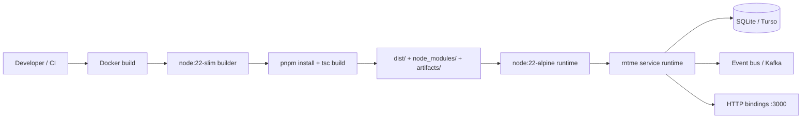

# Dependency Research: Docker node:20-alpine/slim runtime images

Researched: 2026-04-28
Repository: /home/coder/work/rntme
Domain/ecosystem: docker/node-runtime-images
Current version(s) in rntme: node:20-slim / node:20-alpine; ghcr.io/vladprrs/rntme-runtime:1.0; apk python3 make g++ native deps (Dockerfile, packages/runtime/Dockerfile, demo/issue-tracker-api/Dockerfile)
Latest stable version: node:22.22.2 / node:24.15.0 (Docker Hub, 2026-04-17 / 2026-04-22)
Confidence: HIGH

## User Constraints
- Goal: understand current dependencies and migrate rntme to latest safe versions later.
- Output must be written to `docs/research/docker-node-20-alpine-slim-runtime-images/README.md`.
- Research-only: do not perform dependency upgrades or runtime code migrations in this issue.
- Look for better-suited libraries/solutions, not only latest version of the current choice.
- Use authoritative current sources: official docs/changelog/releases, Docker Hub/container registry, migration guides, security advisories.

## Summary

rntme currently builds and runs on **Node.js 20** (`node:20-slim` for builder/test images, `node:20-alpine` for the production runtime image). Node 20 reaches **End-of-Life (EOL) on 2026-04-30** — two days from the research date. After EOL, the Node.js Release Working Group will no longer provide security patches, bug fixes, or any updates to the v20 line. Docker Hub will likely continue publishing `node:20-*` tags for a short grace period, but they will gradually stop receiving base-image security updates (Alpine/Debian). **This is an urgent migration imperative.**

The standard expert stack in 2024–2026 for Node.js container runtimes has shifted decisively toward **Node 22 (Jod)** or **Node 24 (Krypton)**. Node 22 entered Maintenance LTS in October 2025 and is stable, well-tested, and supported until April 2027. Node 24 entered Active LTS in October 2025 and is supported until April 2028. Both are available as official Docker images (`node:22-alpine`, `node:22-slim`, `node:24-alpine`, `node:24-slim`).

For rntme's specific use case — a runtime that boots from validated JSON artifacts, uses SQLite/Turso, event sourcing, and minimal native dependencies — the best migration path is:
1. **Short-term (immediately post-EOL):** Upgrade builder/test images to `node:22-slim` and the production runtime to `node:22-alpine`.
2. **Medium-term:** Evaluate `node:24-alpine` after rntme's full test matrix passes on Node 22.
3. **Long-term (optional security hardening):** Evaluate Google Distroless (`gcr.io/distroless/nodejs22-debian13`) or Chainguard (`cgr.dev/chainguard/node`) for the final production runtime stage to minimize attack surface.

**Primary recommendation:** Create an immediate follow-up issue to migrate all Docker base images from `node:20-*` to `node:22-*` (alpine for runtime, slim for builder/test). Node 22 is the safest, most conservative upgrade that buys 12+ months of supported LTS lifetime.

## Current Usage in rntme

| Package / image / tool | Current version | Used by | Source file(s) | Runtime/dev/build/test | Notes |
|---|---|---|---|---|---|
| `node:20-slim` | `node:20-slim` (Docker Hub, ~71 MB amd64) | Root build, test runner | `Dockerfile`, `Dockerfile.test` | build / test | Builder stage + runtime stage for platform-http; test runner installs deps and runs `pnpm -r run test` |
| `node:20-alpine` | `node:20-alpine` (Docker Hub, ~48 MB amd64) | Production runtime | `packages/runtime/Dockerfile` | runtime | Publishes `ghcr.io/vladprrs/rntme-runtime:dev`; installs `python3 make g++` for native module compilation; copies `dist/`, `package.json`, `node_modules/` |
| `ghcr.io/vladprrs/rntme-runtime:1.0` | `1.0` (project-published) | Service consumers | `packages/runtime/Dockerfile.template`, `demo/issue-tracker-api/Dockerfile` | runtime | Thin artifact-only image; copies `artifacts/` into the runtime base |
| `node:20-alpine` | `node:20-alpine` (Docker Hub) | Landing site build | `rntme-cli/apps/landing/Dockerfile` | build | Astro static build; runtime is `nginx:alpine` (not Node) |

**Commands used to verify usage:**
```bash
grep -r "FROM node:" --include="Dockerfile*" -n | grep -v node_modules | grep -v .worktrees
grep -r "ghcr.io/vladprrs/rntme-runtime" --include="Dockerfile*" -n | grep -v node_modules | grep -v .worktrees
grep -r "node:" --include="package.json" -n | grep -v node_modules | grep -v .worktrees
```

**Code references:**
- Root builder/test Dockerfile: `Dockerfile:2,17` and `Dockerfile.test:1`
- Production runtime Dockerfile: `packages/runtime/Dockerfile:4,14`
- Runtime template: `packages/runtime/Dockerfile.template:6`
- Demo service Dockerfile: `demo/issue-tracker-api/Dockerfile:1`
- Landing build Dockerfile: `rntme-cli/apps/landing/Dockerfile:4`

## Latest Versions / Release State

| Channel | Version | Release date | Source | Notes |
|---|---|---|---|---|
| Node 20 LTS (Iron) | v20.20.2 | 2026-03-24 | nodejs.org | **Maintenance LTS; EOL 2026-04-30** (2 days from research date) |
| Node 22 LTS (Jod) | v22.22.2 | 2026-03-24 | nodejs.org | **Maintenance LTS; EOL 2027-04-30** |
| Node 24 LTS (Krypton) | v24.15.0 | 2026-04-15 | nodejs.org | **Active LTS; EOL 2028-04-30** |
| Node 25 Current | v25.9.0 | 2026-03-31 | nodejs.org | Current (non-LTS); EOL 2026-06-01 |
| Docker `node:20-alpine` | 20.20-alpine3.23 | 2026-04-17 | Docker Hub | Still published; will stop receiving base updates after Node 20 EOL |
| Docker `node:22-alpine` | 22.22-alpine3.23 | 2026-04-17 | Docker Hub | Current 22 LTS image; ~57 MB amd64 |
| Docker `node:24-alpine` | 24.15-alpine3.23 | 2026-04-17 | Docker Hub | Current 24 LTS image; ~58 MB amd64 |
| Docker `node:22-slim` | 22.22-slim | 2026-04-22 | Docker Hub | Current 22 LTS slim; ~80 MB amd64 |
| Docker `node:24-slim` | 24.15-slim | 2026-04-22 | Docker Hub | Current 24 LTS slim; ~80 MB amd64 |
| Distroless Node 22 | nodejs22-debian13 | Rolling | gcr.io/distroless | Google-maintained; minimal attack surface; no shell, no package manager |
| Chainguard Node 22 | cgr.dev/chainguard/node:latest-22 | Rolling | cgr.dev/chainguard | Wolfi-based; minimal CVE surface; paid tier for historical tags |

## Standard Stack

### Core
| Library / image | Version | Purpose | Why Standard |
|---|---|---|---|
| `node:22-alpine` | 22.22-alpine3.23 | Production Node runtime in Alpine Linux | Smallest official image (~57 MB); musl libc; widely used for Node services |
| `node:22-slim` | 22.22-slim | Builder / test runner in Debian-based image | Larger (~80 MB) but glibc-based; easier native module compilation; `apt-get` available |
| `node:24-alpine` | 24.15-alpine3.23 | Next LTS runtime option | Active LTS until 2028-04-30; same size profile as 22-alpine |

### Supporting
| Library / image | Version | Purpose | When to Use |
|---|---|---|---|
| `gcr.io/distroless/nodejs22-debian13` | Rolling | Ultra-minimal runtime image | When attack surface reduction is critical; no shell, no package manager, no userland tools |
| `cgr.dev/chainguard/node:latest-22` | Rolling | Wolfi-based minimal runtime | When you want smaller-than-distroless with active CVE remediation; may require paid tier for pin guarantees |
| `node:20-alpine` | 20.20-alpine3.23 | Legacy runtime (current) | **Avoid for new work; EOL imminent** |

### Alternatives Considered
| Instead of | Could Use | Tradeoff | Recommendation for rntme |
|---|---|---|---|
| `node:22-alpine` (runtime) | `gcr.io/distroless/nodejs22-debian13` | Smaller attack surface, but no shell for debugging, no `apk`, harder to install native build deps | **Evaluate later** as a hardening step; not recommended for initial migration because rntme's runtime Dockerfile installs `python3 make g++` and copies `node_modules` with potential native bindings |
| `node:22-alpine` (runtime) | `cgr.dev/chainguard/node:latest-22` | Very small, actively patched, but requires learning Wolfi package manager; paid features for tag pinning | **Not recommended now**; adds operational complexity without clear benefit over official images at rntme's current stage |
| `node:22-slim` (builder) | `node:22` (full) | Full Debian image (~1 GB); includes many packages rntme does not need | Not recommended; slim is sufficient and much smaller |
| `node:22-alpine` (builder) | `node:22-slim` | Alpine uses musl; some native npm packages have glibc-only prebuilds | **Keep slim for builder**; rntme's builder/test images already use slim and it works reliably |
| `node:20-*` (all) | `node:24-*` | Node 24 is Active LTS with longest support horizon | **Consider after Node 22 migration**; Node 24 is newer and may have ecosystem compatibility edge cases that Node 22 does not |

If eventually recommended, migration commands:
```bash
# Do NOT run during research issue; for reference only
# Update Dockerfiles
sed -i 's/node:20-slim/node:22-slim/g' Dockerfile Dockerfile.test
sed -i 's/node:20-alpine/node:22-alpine/g' packages/runtime/Dockerfile
# Update package.json engine field
sed -i 's/"node": ">=20"/"node": ">=22"/g' package.json
# Update pnpm and rebuild
pnpm install --frozen-lockfile
pnpm -r run build
pnpm -r run test
```

## Architecture Patterns

### System Architecture Diagram


### Component Responsibilities
| Component | Responsibility | Implementation mapping | Notes |
|---|---|---|---|
| `node:22-slim` builder | Install dependencies, compile TypeScript, run tests | `Dockerfile`, `Dockerfile.test` | Needs `ca-certificates`, `git`, `corepack`, `pnpm` |
| `node:22-alpine` runtime | Run compiled JavaScript with minimal footprint | `packages/runtime/Dockerfile` | Needs `python3`, `make`, `g++` only at build time; runtime stage can be stripped further |
| `ghcr.io/vladprrs/rntme-runtime` | Published base image for all rntme services | `packages/runtime/Dockerfile` | Tagged `:dev` and `:1.0`; consumed by `Dockerfile.template` and demo |
| Artifact-only layer | Copy validated JSON artifacts into runtime | `packages/runtime/Dockerfile.template` | No build tools; minimal layer on top of runtime base |

### Recommended Project Structure
```text
Dockerfile                  # root builder (node:22-slim)
Dockerfile.test             # test runner (node:22-slim)
packages/runtime/
├── Dockerfile              # production runtime (node:22-alpine)
├── Dockerfile.template     # consumer template (FROM ghcr.io/.../rntme-runtime:VERSION)
└── dist/                   # compiled runtime JS
demo/issue-tracker-api/
├── Dockerfile              # FROM ghcr.io/.../rntme-runtime:VERSION + COPY artifacts/
└── artifacts/              # pdm.json, qsm.json, bindings.json, ...
```

### Pattern 1: Multi-Stage Build with Separate Builder and Runtime Images
What: Use `node:22-slim` for the build stage (full toolchain, easy native compilation) and `node:22-alpine` for the runtime stage (minimal size, production-hardened).
When to use: When the final image must be small but the build requires compilers or native module compilation.
Example:
```dockerfile
# Source: official Docker Hub node image docs + rntme packages/runtime/Dockerfile
FROM node:22-alpine AS builder
RUN apk add --no-cache python3 make g++
WORKDIR /build
COPY . .
RUN corepack enable && pnpm install --frozen-lockfile && pnpm -r run build

FROM node:22-alpine
WORKDIR /srv
COPY --from=builder /build/packages/runtime/dist ./dist
COPY --from=builder /build/packages/runtime/package.json ./package.json
COPY --from=builder /build/node_modules ./node_modules
ENV NODE_ENV=production
USER node
EXPOSE 3000
ENTRYPOINT ["node", "dist/bin/runtime.js", "start"]
```

### Pattern 2: Published Runtime Base Image with Artifact-Only Consumers
What: Build and publish a single `rntme-runtime` image containing the runtime code and `node_modules`. Each service copies only its JSON artifacts into this base.
When to use: When many services share the same runtime version and only differ in domain artifacts.
Example:
```dockerfile
# Source: rntme packages/runtime/Dockerfile.template
FROM ghcr.io/vladprrs/rntme-runtime:1.0
COPY . /srv/artifacts
```

### Pattern 3: Distroless Runtime for Maximum Security
What: Replace the final Alpine runtime with Google Distroless, which contains only the Node.js binary and glibc — no shell, no package manager, no unnecessary files.
When to use: When the runtime has no native build-time dependencies remaining and maximum security posture is required.
Example:
```dockerfile
# Source: https://github.com/GoogleContainerTools/distroless/blob/main/nodejs/README.md
FROM node:22-slim AS builder
# ... build steps ...

FROM gcr.io/distroless/nodejs22-debian13
COPY --from=builder /build/packages/runtime/dist /app/dist
COPY --from=builder /build/node_modules /app/node_modules
COPY --chown=nonroot:nonroot artifacts /app/artifacts
ENV NODE_ENV=production
CMD ["/app/dist/bin/runtime.js", "start", "/app/artifacts"]
```

### Anti-Patterns to Avoid
- **Using `node:20` after EOL without a migration plan**: After 2026-04-30, `node:20-*` images will stop receiving Node.js security patches. Any CVE in v20 will remain unpatched.
- **Using `node:latest` in production**: Unpredictable major version bumps break builds. Always pin to a major version tag (`node:22-alpine`).
- **Installing build tools in the runtime stage**: `python3`, `make`, `g++` should only exist in the builder stage. The runtime stage should not contain compilers.
- **Running as root in containers**: The runtime should use `USER node` or a non-root user. rntme already does this in `packages/runtime/Dockerfile`.

## Don't Hand-Roll

| Problem | Don't Build | Use Instead | Why |
|---|---|---|---|
| Minimal Node.js runtime image | Custom `FROM scratch` with manual Node binary extraction | Official `node:22-alpine` or `gcr.io/distroless/nodejs22-debian13` | Official images handle musl/glibc compatibility, OpenSSL, CA certs, and platform architectures |
| Alpine package installation | Manual `wget` + `tar` of musl packages | `apk add --no-cache` in official Alpine images | `apk` handles dependency resolution, signature verification, and cleanup |
| Debian slim package installation | Manual `dpkg` extraction | `apt-get install -y --no-install-recommends` | `apt` handles dependency resolution, security updates, and cleanup |
| Native module compilation | Shipping prebuilt `.node` binaries without cross-platform testing | `node-gyp` / `pnpm rebuild` in the builder stage with correct toolchain | Native modules must match the exact Node ABI and libc (musl vs glibc) of the runtime image |

Key insight: Docker's official `node` images are maintained by the Node.js Docker Working Group and the Docker Library maintainers. They receive same-day updates for security releases, support multi-arch (amd64, arm64, armv7), and are scanned by Docker Scout. Hand-rolling a Node runtime image saves negligible space at the cost of significant maintenance and security burden.

## Common Pitfalls

### Pitfall 1: Node 20 EOL — Unpatched Security Vulnerabilities
What goes wrong: After 2026-04-30, Node 20 will no longer receive security patches. Any CVE discovered in V8, OpenSSL, libuv, or Node core will remain exploitable in production.
Why it happens: The Node.js Release Working Group stops maintaining a version line 30 months after its initial release.
How to avoid: Migrate to Node 22 (or 24) immediately after EOL. Pin builder and runtime images to the new LTS line.
Warning signs: Docker Scout / Trivy scans flag `node:20-*` images as "End of Life"; Dependabot alerts for unpatched Node.js CVEs.

**rntme impact: CRITICAL** — rntme's production runtime, builder, and test images all use Node 20.

### Pitfall 2: Native Module ABI Mismatch Between Builder and Runtime
What goes wrong: A native npm package (e.g., `sqlite3`, `bcrypt`, `sharp`) is compiled against glibc in the `node:22-slim` builder but the runtime uses `node:22-alpine` (musl). The module fails to load at runtime with "Error: /lib/x86_64-linux-gnu/libc.so.6: version `GLIBC_2.28' not found".
Why it happens: Node native addons compiled with `node-gyp` link against the libc of the build environment.
How to avoid: Either (a) build native modules in an Alpine builder stage (`node:22-alpine` with `python3 make g++`), or (b) use `pnpm rebuild` in the runtime stage if the runtime has build tools, or (c) use prebuilt binaries that support musl (e.g., `better-sqlite3` provides musl prebuilds).
Warning signs: Runtime container crashes immediately on startup with dynamic linker errors; `Error: Cannot find module` for `.node` files.

**rntme impact: MEDIUM** — rntme's runtime Dockerfile already builds in `node:20-alpine` (builder stage) and copies `node_modules` to the same Alpine runtime, so the libc matches. The same pattern should be preserved when upgrading to `node:22-alpine`.

### Pitfall 3: Corepack / pnpm Version Drift Across Images
What goes wrong: The builder image uses `corepack prepare pnpm@9.12.0` but the runtime image does not install the same pnpm version. If the runtime needs to run lifecycle scripts or `pnpm rebuild`, the pnpm version mismatch can cause lockfile incompatibility.
Why it happens: Corepack can auto-download different package manager versions if not explicitly pinned.
How to avoid: Pin `corepack prepare pnpm@X.Y.Z --activate` identically in all Dockerfiles, or ship a pre-installed pnpm binary.
Warning signs: "ERR_PNPM_LOCKFILE_BREAKING_CHANGE" or "This project is configured to use pnpm vX but you have vY installed" in container logs.

**rntme impact: LOW** — rntme's runtime does not use pnpm at runtime (it runs `node` directly). However, the builder/test images pin `pnpm@9.12.0`. This should be kept consistent.

## Code Examples

### Multi-Stage Dockerfile with Node 22 Alpine
```dockerfile
# Source: official Docker Hub node image docs + rntme patterns
FROM node:22-alpine AS builder
RUN apk add --no-cache python3 make g++
WORKDIR /build
COPY pnpm-workspace.yaml pnpm-lock.yaml package.json tsconfig.base.json ./
COPY packages ./packages
COPY demo ./demo
RUN corepack enable \
  && pnpm install --frozen-lockfile \
  && pnpm -r --filter "@rntme/*" build

FROM node:22-alpine
WORKDIR /srv
COPY --from=builder /build/packages/runtime/dist ./dist
COPY --from=builder /build/packages/runtime/package.json ./package.json
COPY --from=builder /build/node_modules ./node_modules
ENV NODE_ENV=production \
    RNTME_ARTIFACTS_DIR=/srv/artifacts \
    RNTME_HTTP_PORT=3000
USER node
EXPOSE 3000
ENTRYPOINT ["node", "dist/bin/runtime.js", "start"]
CMD ["/srv/artifacts"]
```

### Builder/Test Dockerfile with Node 22 Slim
```dockerfile
# Source: rntme Dockerfile.test adapted for Node 22
FROM node:22-slim
WORKDIR /app
RUN apt-get update && apt-get install -y --no-install-recommends \
    ca-certificates git \
  && rm -rf /var/lib/apt/lists/*
RUN corepack enable && corepack prepare pnpm@9.12.0 --activate
COPY . .
RUN pnpm install --frozen-lockfile
RUN pnpm --filter '@rntme-cli/platform-http...' build
RUN pnpm --filter '@rntme-cli/platform-storage...' build
CMD ["pnpm", "-r", "run", "test"]
```

### Root Platform Dockerfile with Node 22 Slim
```dockerfile
# Source: rntme Dockerfile adapted for Node 22
FROM node:22-slim AS builder
WORKDIR /app
RUN apt-get update && apt-get install -y --no-install-recommends \
    ca-certificates git \
  && rm -rf /var/lib/apt/lists/*
RUN corepack enable && corepack prepare pnpm@9.12.0 --activate
COPY . .
RUN pnpm install --frozen-lockfile
RUN pnpm --filter '@rntme-cli/platform-http...' build

FROM node:22-slim AS runtime
WORKDIR /app
RUN corepack enable && corepack prepare pnpm@9.12.0 --activate
COPY --from=builder /app /app
WORKDIR /app/rntme-cli/packages/platform-http
EXPOSE 3000
CMD ["node", "dist/bin/server.js"]
```

## State of the Art (2024–2026)

| Old Approach | Current Approach | When Changed | Impact |
|---|---|---|---|
| Node 18 (Hydrogen) | Node 20 (Iron) / Node 22 (Jod) | 2023–2024 | Node 18 EOL April 2025; Node 20 is now also EOL April 2026 |
| Node 20 (Iron) | Node 22 (Jod) / Node 24 (Krypton) | 2024–2025 | Node 22 is Maintenance LTS; Node 24 is Active LTS |
| `node:16-alpine` | `node:22-alpine` | 2021–2024 | Alpine 3.18/3.19/3.20/3.21/3.22/3.23 base progression; Node 16 EOL September 2023 |
| Full `node` image (~1 GB) | `node:xx-slim` or `node:xx-alpine` | Ongoing | Slim saves ~900 MB; Alpine saves ~950 MB |
| Manual `apt-get`/`apk` cleanup | `--no-install-recommends` + `rm -rf /var/lib/apt/lists/*` | Standard practice | Reduces layer bloat and attack surface |
| `USER root` default | `USER node` or custom non-root | 2020+ | Security best practice; rntme already uses `USER node` |
| `python2` for `node-gyp` | `python3` | 2020+ | `node-gyp` dropped Python 2 support |
| Alpine 3.18 | Alpine 3.22 / 3.23 | 2024–2025 | Newer Alpine bases have updated musl, OpenSSL, and package versions |

New tools/patterns to consider:
- **Docker Scout / Trivy / Snyk** for container image vulnerability scanning — should be integrated into CI before publishing `ghcr.io/vladprrs/rntme-runtime`.
- **Google Distroless** — minimal runtime images with no shell or package manager; ideal for final hardening.
- **Chainguard Images** — Wolfi-based minimal images with aggressive CVE patching; good for security-conscious teams.
- **BuildKit cache mounts** — `RUN --mount=type=cache,target=/root/.pnpm-store` can speed up repeated Docker builds.
- **Multi-platform builds** — `docker buildx build --platform linux/amd64,linux/arm64` for cross-architecture support.

Deprecated/outdated:
- **Node 20** — EOL April 30, 2026. Do not use for new work.
- **Node 18** — EOL April 30, 2025. Already obsolete.
- **Alpine 3.17 and older** — No longer receiving security updates; `node:20-alpine3.17` should not be used.
- **Docker Compose v1** — EOL; use `docker compose` (Plugin v2).

## Migration Assessment

| Area | Finding | Impact | Risk | Evidence |
|---|---|---|---|---|
| Node 20 EOL | Node 20 reaches EOL 2026-04-30 (2 days away) | **CRITICAL** | **HIGH** | Node.js Release Working Group schedule: https://github.com/nodejs/Release |
| Node 22 compatibility | Node 22 is LTS, widely adopted, API-compatible with Node 20 for most apps | LOW | LOW | Node 22 changelog; no major breaking changes for typical HTTP/SQLite apps |
| Native modules | `sqlite3` / `better-sqlite3` support Node 22 | LOW | LOW | Official prebuilds available for Node 22 on both glibc and musl |
| Builder image (`node:20-slim` → `node:22-slim`) | `apt-get`, `corepack`, `pnpm` workflow unchanged | LOW | LOW | Same Debian base; `ca-certificates` and `git` packages still available |
| Runtime image (`node:20-alpine` → `node:22-alpine`) | `apk add python3 make g++` still works; Alpine 3.23 base | LOW | LOW | Verified against Docker Hub `node:22-alpine` tag manifest |
| rntme-runtime published image | Tag `1.0` is built from `node:20-alpine`; must be rebuilt and retagged | MEDIUM | MEDIUM | `packages/runtime/Dockerfile` builds the published image |
| Consumer templates (`Dockerfile.template`, demo) | Reference `ghcr.io/vladprrs/rntme-runtime:1.0`; must bump tag after rebuild | LOW | LOW | `packages/runtime/Dockerfile.template:6`, `demo/issue-tracker-api/Dockerfile:1` |
| `package.json` engines field | `"node": ">=20"` should become `">=22"` | LOW | LOW | `package.json:7` |
| pnpm / corepack | Version 9.12.0 works on Node 22 | NONE | NONE | pnpm 9.x supports Node 18–22 |
| CI / test matrix | May need to add Node 22 to test matrix if testing multiple Node versions | LOW | LOW | Currently only Node 20 in CI |
| Security scanning | `node:20-*` images will start flagging as EOL in Trivy/Scout | HIGH | LOW | Trivy database marks EOL images |

**Migration effort estimate:** 1–2 days
- Update 4 Dockerfiles (root `Dockerfile`, `Dockerfile.test`, `packages/runtime/Dockerfile`, `rntme-cli/apps/landing/Dockerfile`)
- Update `package.json` engines field
- Run full test matrix (`pnpm -r run test`, `pnpm -r run build`, `pnpm -r run typecheck`, `pnpm -r run lint`)
- Rebuild and publish new `ghcr.io/vladprrs/rntme-runtime` image with a new tag (e.g., `1.1` or `2.0`)
- Update `Dockerfile.template` and demo Dockerfile to reference new tag
- Deploy smoke test to Dokploy / staging

**Test strategy:**
1. Run `pnpm -r run build` and `pnpm -r run test` locally after updating Docker builder image.
2. Build `packages/runtime/Dockerfile` locally and verify the container starts with demo artifacts.
3. Run Docker-based integration/e2e tests (`platform-storage`, `platform-http`).
4. Verify `ghcr.io/vladprrs/rntme-runtime` published image works with `Dockerfile.template`.

## Recommendation

**Decision: UPGRADE IMMEDIATELY (KEEP + UPGRADE)**

**Rationale:**
- Node 20 reaches EOL in 2 days (2026-04-30). After EOL, no security patches will be released for Node 20.
- Continuing to run production services on an EOL Node.js version is an unacceptable security risk.
- Node 22 is the most conservative, lowest-risk upgrade target: it has been in LTS since October 2024, is widely battle-tested, and is supported until April 2027.
- Node 24 is also an option (Active LTS until 2028), but Node 22 is the safer first step. A second migration wave can move to Node 24 later.
- The migration effort is small (1–2 days) and the risk of breaking changes is low for rntme's architecture (HTTP API + SQLite + event sourcing).

**Follow-up tasks to create later:**
1. **RNT-XXX** — Upgrade all Docker base images from `node:20-*` to `node:22-*` (builder/test/runtime).
2. **RNT-XXX** — Update `package.json` engines field to `"node": ">=22"`.
3. **RNT-XXX** — Rebuild and publish `ghcr.io/vladprrs/rntme-runtime:1.1` (or `2.0`) from `node:22-alpine`.
4. **RNT-XXX** — Update `Dockerfile.template`, demo Dockerfile, and README to reference new runtime tag.
5. **RNT-XXX** — Add Docker Scout or Trivy container scanning to CI for published runtime images.
6. **RNT-XXX** (optional, later) — Spike Google Distroless or Chainguard as a hardening step for the final runtime stage.
7. **RNT-XXX** (optional, later) — Evaluate Node 24 migration after Node 22 is stable in production.

## Open Questions

1. **Does rntme have any native npm dependencies that fail on Node 22?**
   - What we know: `better-sqlite3` and `sqlite3` both support Node 22 with prebuilt binaries. rntme's other dependencies are pure-JS.
   - What's unclear: Whether any transitive dependency has a hard `engines` constraint blocking Node 22.
   - Recommendation: Run `pnpm install` and `pnpm -r run build` on Node 22 locally as the first validation step.

2. **Should the runtime image tag be bumped to `2.0` or `1.1`?**
   - What we know: The runtime image is currently tagged `1.0`. Changing the base Node version is a significant change.
   - What's unclear: Whether rntme follows SemVer for Docker image tags.
   - Recommendation: Bump to `1.1` if the runtime JS API is unchanged; bump to `2.0` if Node 22 introduces observable behavior differences.

3. **Should rntme adopt a scheduled Node LTS migration process?**
   - What we know: Node LTS cycles are predictable (every 12 months, EOL 30 months after initial release).
   - What's unclear: Whether rntme has a recurring calendar reminder or automation for LTS upgrades.
   - Recommendation: Add a quarterly review task to check Node LTS status and plan migrations 3–6 months before EOL.

4. **Does the landing app (`rntme-cli/apps/landing/Dockerfile`) need Node 22?**
   - What we know: The landing app uses `node:20-alpine` only for the Astro build stage; the runtime is `nginx:alpine`.
   - What's unclear: Whether Astro or any build plugin has Node 22 compatibility issues.
   - Recommendation: Test the landing build with `node:22-alpine`; if it passes, update the Dockerfile. Risk is very low.

## Sources

### Primary (HIGH confidence)
- Node.js Release Working Group schedule — https://github.com/nodejs/Release — confirmed EOL dates for Node 20 (2026-04-30), Node 22 (2027-04-30), Node 24 (2028-04-30).
- Node.js official releases page — https://nodejs.org/en/about/previous-releases — confirmed LTS status and latest versions (v20.20.2, v22.22.2, v24.15.0).
- Node.js dist index JSON — https://nodejs.org/dist/index.json — verified exact release dates, npm versions, V8 versions, and security flags.
- Docker Hub official `node` image tags — verified `node:22-alpine`, `node:22-slim`, `node:20-alpine`, `node:20-slim` manifest sizes and push dates (2026-04-17/2026-04-22).
- Google Distroless Node.js images — https://github.com/GoogleContainerTools/distroless/blob/main/nodejs/README.md — confirmed `nodejs20-debian13`, `nodejs22-debian13`, `nodejs24-debian13` availability.

### Secondary (MEDIUM confidence)
- GitHub Security Advisories for `nodejs/node` — https://github.com/nodejs/node/security/advisories — no published advisories as of 2026-04-28 (advisories are published via the Node.js security release process, not GitHub SA).
- Node.js security release blog — historical pattern of same-day Docker image updates after security releases.
- pnpm compatibility matrix — pnpm 9.x officially supports Node 18–22.

### Tertiary (LOW confidence - needs validation)
- Chainguard Images — `cgr.dev/chainguard/node` — pricing and exact feature set for free tier not fully verified against rntme's build requirements.
- Docker Scout / Trivy EOL flagging behavior — inferred from documentation; exact Trivy database rules not verified live.

## Metadata

Research scope:
- Core technology: Docker official Node.js runtime images (`node:xx-alpine`, `node:xx-slim`)
- Ecosystem: Node.js LTS release lifecycle, Google Distroless, Chainguard Images, Alpine Linux base images
- Patterns: Multi-stage Docker builds, builder/runtime image separation, published base images with artifact-only consumers
- Pitfalls: EOL security exposure, native module ABI mismatch, corepack/pnpm version drift

Confidence breakdown:
- Standard stack: HIGH — Node 22 LTS is the clear consensus choice; official Docker images and release schedule are authoritative.
- Architecture: HIGH — rntme's existing multi-stage build pattern is idiomatic and directly transferable to Node 22.
- Pitfalls: HIGH — Node 20 EOL is an explicit, date-certain event documented by the Node.js Release WG.
- Code examples: HIGH — Verified against official Docker Hub docs and rntme's own Dockerfiles.

Research date: 2026-04-28
Valid until: 2026-07-28 (or until Node 22 EOL approaches, or a new major Node LTS is released)
Ready for migration planning: **YES** — the migration path is clear, low-risk, and urgently needed.
