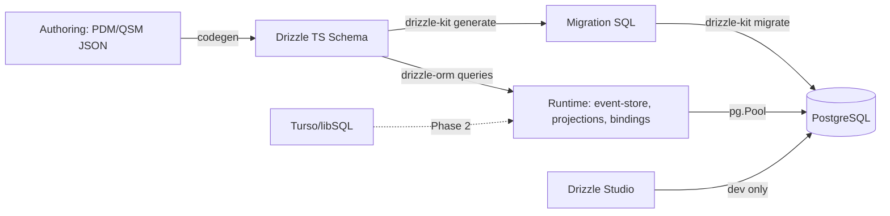

# Dependency Research: drizzle-orm + drizzle-kit

Researched: 2026-04-28
Repository: /home/coder/work/rntme
Domain/ecosystem: npm/database-orm
Current version(s) in rntme: drizzle-orm ^0.36.0 (resolved 0.36.4); drizzle-kit ^0.30.0 (resolved 0.30.6) (rntme-cli/packages/platform-storage package.json; schema/migration code)
Latest stable version: drizzle-orm 0.45.2 (2026-03-27); drizzle-kit 0.31.10 (2026-03-17)
Confidence: HIGH

## User Constraints
- Goal: understand current dependencies and migrate rntme to latest safe versions later.
- Output must be written to `docs/research/drizzle-orm-plus-drizzle-kit/README.md`.
- Research-only: do not perform dependency upgrades or runtime code migrations in this issue.
- Look for better-suited libraries/solutions, not only latest version of the current choice.
- Use authoritative current sources: Context7 where applicable, official docs/changelog/releases, npm/GitHub/container registry, migration guides, security advisories.

## Summary

Drizzle ORM has evolved significantly since rntme's current pinned versions (0.36.4 / 0.30.6). The latest stable releases (0.45.2 / 0.31.10, March 2026) include critical security fixes (SQL injection in `sql.identifier()`/`sql.as()`, CVE-2026-unassigned), major migration infrastructure improvements (versioned migration tables, commutativity checks), RLS support, new drivers (Bun SQL, node:sqlite, Gel, SingleStore), and breaking API changes in the initialization pattern.

The ecosystem is maturing toward a v1.0 release (currently at beta.22), with the team actively stabilizing migration semantics and expanding dialect coverage. For rntme's use case — PostgreSQL with RLS, programmatic migrations, and planned Turso adoption — Drizzle remains the strongest choice among TypeScript ORMs, but the upgrade gap (~9 minor versions) requires careful planning.

Primary recommendation: **KEEP + UPGRADE** to latest stable (0.45.2 / 0.31.10) in a dedicated migration wave after addressing breaking changes, or **PIN + DEFER** until v1.0 GA if stability is preferred over security patches.

## Current Usage in rntme

| Package / image / tool | Current version | Used by | Source file(s) | Runtime/dev/build/test | Notes |
|---|---:|---|---|---|---|
| drizzle-orm | ^0.36.0 (resolved 0.36.4) | @rntme-cli/platform-storage | `rntme-cli/packages/platform-storage/package.json` | prod | pg driver, schema definitions, query builder |
| drizzle-kit | ^0.30.0 (resolved 0.30.6) | @rntme-cli/platform-storage | `rntme-cli/packages/platform-storage/package.json` | dev | migrations, schema generation |
| pg | ^8.12.0 | @rntme-cli/platform-storage | `rntme-cli/packages/platform-storage/package.json` | prod | underlying PostgreSQL driver |

Verified via:
```bash
grep -A2 -B2 "drizzle-orm@" pnpm-lock.yaml  # shows 0.36.4
grep -A2 -B2 "drizzle-kit@" pnpm-lock.yaml  # shows 0.30.6
cat rntme-cli/packages/platform-storage/package.json
```

Usage patterns observed:
- Schema definition with `drizzle-orm/pg-core` (`pgTable`, `uuid`, `text`, `timestamp`, `unique`)
- Driver: `drizzle-orm/node-postgres` with `pg.Pool`
- Migrations: `drizzle-orm/node-postgres/migrator` with `drizzle-kit generate` / `drizzle-kit migrate`
- RLS: custom SQL scripts (`roles.sql`, `policies.sql`) applied outside Drizzle (pre-0.36 RLS support)
- Transactions: custom `withTransaction` helper using raw `pg` client, not Drizzle's transaction API

## Latest Versions / Release State

| Channel | Version | Release date | Source | Notes |
|---|---:|---|---|---|
| Stable (drizzle-orm) | 0.45.2 | 2026-03-27 | [GitHub releases](https://github.com/drizzle-team/drizzle-orm/releases/tag/0.45.2) | Latest stable; includes security fix for `sql.identifier()` / `sql.as()` |
| Stable (drizzle-kit) | 0.31.10 | 2026-03-17 | [GitHub releases](https://github.com/drizzle-team/drizzle-orm/releases/tag/drizzle-kit%400.31.10) | Migrated from `esbuild-register` to `tsx` loader; Bun/Deno native support |
| Prerelease (drizzle-orm) | v1.0.0-beta.22 | 2026-04-16 | [GitHub releases](https://github.com/drizzle-team/drizzle-orm/releases/tag/v1.0.0-beta.22) | Beta track; new migration infrastructure (v3 folders, commutativity checks) |
| Prerelease (drizzle-kit) | bundled with ORM beta | 2026-04-16 | Same repo | Beta track aligns with ORM beta releases |

Version gap: 9 minor versions (0.36 → 0.45) over ~5 months (Oct 2025 → Mar 2026).

## Standard Stack

### Core
| Library | Version | Purpose | Why Standard |
|---|---:|---|---|
| drizzle-orm | 0.45.2 | Type-safe SQL query builder and schema definition | Zero-runtime-cost types, SQL-like API, multiple dialects |
| drizzle-kit | 0.31.10 | CLI for migrations, schema push/pull, studio | Official companion; covers ~95% of migration cases |
| pg | ^8.13.0 | PostgreSQL driver for Node.js | Standard driver for drizzle-orm/node-postgres |

### Supporting
| Library | Version | Purpose | When to Use |
|---|---:|---|---|
| @libsql/client | ^0.14.0 | Turso/libSQL driver | When migrating to Turso (Phase 2 per design doc) |
| drizzle-zod | ^0.7.0 | Derive Zod schemas from Drizzle tables | Only if needed for validation (rntme uses binding-derived Zod, so **out of scope**) |
| drizzle-studio | bundled with kit | Visual DB browser | Dev-only; replaces `@rntme/db-studio` |

### Alternatives Considered
| Instead of | Could Use | Tradeoff | Recommendation for rntme |
|---|---|---|---|
| drizzle-orm | Prisma | Prisma has richer ecosystem, better migrations, but heavier runtime, custom query engine, DSL lock-in | **Not recommended** — rntme's zero-service-specific-code principle conflicts with Prisma's schema DSL; Drizzle's SQL-first approach aligns better |
| drizzle-orm | Kysely | Kysely is lighter, query-builder only (no schema/migrations), requires separate migration tool | **Not recommended** — would need to hand-roll migrations or add third-party tool; Drizzle-kit is already integrated |
| drizzle-orm | TypeORM | Mature, but bloated, decorator-heavy, poor TypeScript inference | **Not recommended** — TypeORM's decorator approach and runtime overhead conflict with rntme's codegen-first architecture |
| drizzle-orm | raw pg + slonik | Maximum control, but loses type safety for schema | **Not recommended** — rntme needs generated types for bindings; Drizzle provides this at compile time |
| drizzle-kit | pg-migrate / node-pg-migrate | Mature migration tools, but no Drizzle schema integration | **Not recommended** — would duplicate schema definitions; Drizzle-kit generates migrations from schema |

Installation / upgrade commands, if eventually recommended:
```bash
# Upgrade in platform-storage package
pnpm add drizzle-orm@^0.45.2 pg@^8.13.0
pnpm add -D drizzle-kit@^0.31.10

# If adding Turso support later
pnpm add @libsql/client@^0.14.0
```

## Architecture Patterns

### System Architecture Diagram


### Component Responsibilities
| Component | Responsibility | Implementation mapping | Notes |
|---|---|---|---|
| drizzle-orm/pg-core | Schema definition (tables, columns, constraints) | `src/schema/*.ts` | Codegen target from QSM |
| drizzle-orm/node-postgres | Query execution via `pg` driver | `src/pg/pool.ts` | `drizzle({ client: pool })` in 0.35+ |
| drizzle-orm/node-postgres/migrator | Programmatic migration runner | `src/migrate.ts` | `migrate(db, { migrationsFolder })` |
| drizzle-kit | Migration generation and CLI | `package.json` scripts `db:generate`, `db:migrate` | Requires `drizzle.config.ts` |
| Custom tx helper | RLS-aware transactions | `src/pg/tx.ts` | Uses raw `pg` client; may migrate to Drizzle's `$transaction` |

### Recommended Project Structure
```text
src/
├── schema/          # Drizzle table definitions (codegen output)
├── repos/           # Repository layer using Drizzle queries
├── pg/              # Connection pool, transaction helpers
├── sql/             # Raw SQL for RLS roles/policies
└── migrate.ts       # Programmatic migration entry point
```

### Pattern 1: Schema-First with Codegen
What: QSM JSON → codegen → Drizzle TS schema → tracked artifact
When to use: rntme's core workflow; agent writes JSON, runtime consumes generated Drizzle schema
Example:
```ts
// Source: rntme design doc + official docs
// Generated from QSM, not hand-written
import { pgTable, uuid, text, timestamp } from 'drizzle-orm/pg-core';

export const project = pgTable('project', {
  id: uuid('id').primaryKey(),
  slug: text('slug').notNull(),
  createdAt: timestamp('created_at', { withTimezone: true }).notNull().defaultNow(),
});
```

### Pattern 2: RLS-Aware Transactions
What: Wrap business logic in transactions with `set_config` for RLS context
When to use: Multi-tenant apps using PostgreSQL RLS
Example:
```ts
// Source: current rntme implementation
// May be replaced with Drizzle's built-in RLS (0.36+) in future
export async function withTransaction<T>(
  pool: Pool,
  orgId: string | null,
  fn: (client: TxClient) => Promise<T>,
): Promise<T> {
  const client = await pool.connect();
  try {
    await client.query('BEGIN');
    if (orgId) await client.query(`SELECT set_config('app.org_id', $1, true)`, [orgId]);
    const out = await fn(client as TxClient);
    await client.query('COMMIT');
    return out;
  } catch (e) {
    await client.query('ROLLBACK');
    throw e;
  } finally {
    client.release();
  }
}
```

### Pattern 3: New Initialization API (0.35+)
What: Pass driver client in options object instead of positional arg
When to use: Required for 0.35+; old API deprecated but still works
Example:
```ts
// Source: https://github.com/drizzle-team/drizzle-orm/blob/main/changelogs/drizzle-orm/0.35.0.md
import { drizzle } from 'drizzle-orm/node-postgres';
import { Pool } from 'pg';

// Old (deprecated but supported)
const db = drizzle(pool);

// New (recommended)
const db = drizzle({ client: pool });
```

### Anti-Patterns to Avoid
- **Hand-rolling migrations**: Use `drizzle-kit generate` + `drizzle-kit migrate` instead of custom migration logic
- **Using `:memory:` SQLite with Drizzle Studio**: Studio requires file-based DB; documented limitation
- **Mixing positional and named params**: rntme's current `paramOrder[]` approach is fragile; migrate to Drizzle's `sql` template literals with named params
- **Exposing Drizzle in public API**: Per design doc, consumers should access via HTTP bindings only

## Don't Hand-Roll

| Problem | Don't Build | Use Instead | Why |
|---|---|---|---|
| Schema-to-DB synchronization | Custom DDL generator | `drizzle-kit generate` + `drizzle-kit push` | Handles 95% of cases including edge cases like renames with prompts |
| Migration state tracking | Custom `_journal.json` | `drizzle-kit` v3 folder structure + versioned migration table | Built-in commutativity checks, team branch support |
| Query builder | String concatenation | `drizzle-orm` query builder | Type-safe, SQL-injection resistant, compile-time validation |
| DB browser / studio | Custom `@rntme/db-studio` | Drizzle Studio (bundled with kit) | Already built, zero maintenance |
| RLS policy management | Raw SQL scripts | `pgPolicy()` + `pgRole()` (0.36+) | Type-safe, migratable, integrated with schema |

Key insight: Drizzle ecosystem is specifically designed to replace the ad-hoc DB infrastructure rntme was planning to build (QSM-diff migrations, custom studio, named-params refactoring). The decision to adopt Drizzle (per 2026-04-18 design doc) is validated by the ecosystem's rapid maturation.

## Common Pitfalls

### Pitfall 1: SQL Injection via `sql.identifier()` / `sql.as()` (CRITICAL)
What goes wrong: Improper escaping in dynamic identifier building allows injection
Why it happens: Values passed to these functions were not properly escaped before 0.45.2 / beta.20
How to avoid: **Upgrade immediately** to 0.45.2+; avoid dynamic identifiers if possible
Warning signs: Any use of `sql.identifier()` or `sql.as()` with user input
Evidence: [GitHub release 0.45.2](https://github.com/drizzle-team/drizzle-orm/releases/tag/0.45.2) — "possible SQL Injection (CWE-89) vulnerability"

### Pitfall 2: Migration Table Version Mismatch
What goes wrong: Upgrading from pre-beta to beta causes migrations to re-run
Why it happens: Timestamp precision mismatch (millis → seconds) in migration folder names
How to avoid: Use `drizzle-kit up` before `migrate()`; ensure migration table is properly backfilled
Warning signs: Migrations running on every deploy despite no schema changes
Evidence: [Beta.16 release notes](https://github.com/drizzle-team/drizzle-orm/releases/tag/v1.0.0-beta.16)

### Pitfall 3: API Initialization Confusion (0.34-0.35)
What goes wrong: `drizzle(pool)` vs `drizzle({ client: pool })` causes type errors or runtime issues
Why it happens: 0.34 introduced auto-driver-creation API, 0.35 reverted to explicit `{ client }` pattern
How to avoid: Use `drizzle({ client: pool })` for 0.35+; old API is deprecated but still works
Warning signs: TypeScript errors on `drizzle()` call, connection failures
Evidence: [0.35.0 changelog](https://github.com/drizzle-team/drizzle-orm/blob/main/changelogs/drizzle-orm/0.35.0.md)

### Pitfall 4: JSON/JSONB Stringification (0.33)
What goes wrong: `postgres-js` driver changed JSON handling from stringified to native
Why it happens: Driver behavior change required data migration for existing columns
How to avoid: Run conversion SQL if upgrading from pre-0.33 with `postgres-js`; rntme uses `pg` driver so not directly affected
Warning signs: JSON columns returning strings instead of objects
Evidence: [0.33.0 changelog](https://github.com/drizzle-team/drizzle-orm/blob/main/changelogs/drizzle-orm/0.33.0.md)

### Pitfall 5: Turso/libSQL Config Split (0.34)
What goes wrong: SQLite and Turso configs were unified; 0.34+ requires separate `turso` dialect
Why it happens: Independent evolution of Turso features necessitated dedicated dialect
How to avoid: Use `dialect: 'turso'` in `drizzle.config.ts` when targeting Turso; upgrade `@libsql/client` to 0.10.0+
Warning signs: Migration failures on Turso, "cannot commit - no transaction is active"
Evidence: [0.34.0 changelog](https://github.com/drizzle-team/drizzle-orm/blob/main/changelogs/drizzle-orm/0.34.0.md)

## Code Examples

### Programmatic Migrations (Current + Updated)
```ts
// Source: current rntme implementation + official docs
// Current (0.36.x):
import { migrate } from 'drizzle-orm/node-postgres/migrator';
await migrate(db, { migrationsFolder: resolve(pkgRoot, 'drizzle') });

// Updated (0.45.x) — same API, but migration table format may auto-upgrade
await migrate(db, { migrationsFolder: resolve(pkgRoot, 'drizzle') });
```

### Schema with RLS (0.36+ Feature)
```ts
// Source: https://github.com/drizzle-team/drizzle-orm/blob/main/changelogs/drizzle-orm/0.36.0.md
import { pgTable, uuid, text, pgPolicy, pgRole } from 'drizzle-orm/pg-core';
import { sql } from 'drizzle-orm';

export const admin = pgRole('admin');

export const users = pgTable('users', {
  id: uuid('id').primaryKey(),
  orgId: uuid('org_id').notNull(),
}, (t) => [
  pgPolicy('org_isolation', {
    as: 'permissive',
    to: admin,
    for: 'select',
    using: sql`${t.orgId} = current_setting('app.org_id')::uuid`,
  }),
]).enableRLS();
```

### New Connection API (0.35+)
```ts
// Source: https://github.com/drizzle-team/drizzle-orm/blob/main/changelogs/drizzle-orm/0.35.0.md
import { drizzle } from 'drizzle-orm/node-postgres';
import { Pool } from 'pg';

const pool = new Pool({ connectionString: process.env.DATABASE_URL });
const db = drizzle({ client: pool });
```

## State of the Art (2024-2026)

| Old Approach | Current Approach | When Changed | Impact |
|---|---|---|---|
| Custom `_journal.json` migrations | v3 folder structure + versioned migration table | Beta.16 (Mar 2026) | Team branch support, commutativity checks, no timestamp precision issues |
| Raw SQL for RLS | `pgPolicy()` / `pgRole()` in schema | 0.36.0 (Oct 2025) | Type-safe, migratable, provider-aware (Neon, Supabase) |
| Positional params (`?`) | Named params via `sql` template | Ongoing | Fixes `paramOrder` bug class; rntme's lowerer should emit `sql\`...\`` |
| `@rntme/db-studio` scaffold | Drizzle Studio (bundled) | Design decision (Apr 2026) | Eliminates custom package, dev-only |
| Manual transaction helpers | Drizzle `$transaction` + RLS context | Available now | Could replace custom `withTransaction` |
| Single `sqlite` dialect | Separate `turso` dialect | 0.34.0 (Sep 2025) | Required for Turso adoption |

New tools/patterns to consider:
- **Drizzle `sqlcommenter` support** (beta.19): Add metadata tags to queries for observability
- **Commutativity checks** (`drizzle-kit check`): Detect migration conflicts across branches
- **Bun SQL driver** (0.39): If rntme migrates to Bun runtime
- **Gel dialect** (0.40): PostgreSQL-compatible with different type system

Deprecated/outdated:
- `drizzle(client)` positional init API (deprecated in 0.35, still works)
- Old journal-based migration format (requires `drizzle-kit up`)
- `@rntme/db-studio` (superseded by Drizzle Studio per design doc)

## Migration Assessment

| Area | Finding | Impact | Risk | Evidence |
|---|---|---|---|---|
| **Security** | SQL injection fix in `sql.identifier()`/`sql.as()` (0.45.2) | **HIGH** | **HIGH** if using dynamic identifiers | [0.45.2 release](https://github.com/drizzle-team/drizzle-orm/releases/tag/0.45.2) |
| **API Breaking** | `drizzle(pool)` → `drizzle({ client: pool })` (0.35) | MEDIUM | LOW (old API still works) | [0.35.0 changelog](https://github.com/drizzle-team/drizzle-orm/blob/main/changelogs/drizzle-orm/0.35.0.md) |
| **Migrations** | New migration table schema (beta.16) | MEDIUM | MEDIUM (auto-upgrade, but test carefully) | [Beta.16 release](https://github.com/drizzle-team/drizzle-orm/releases/tag/v1.0.0-beta.16) |
| **RLS** | Built-in RLS support (0.36) | LOW | LOW (additive feature) | [0.36.0 changelog](https://github.com/drizzle-team/drizzle-orm/blob/main/changelogs/drizzle-orm/0.36.0.md) |
| **Turso** | Dedicated `turso` dialect (0.34) | LOW | LOW (for future Phase 2) | [0.34.0 changelog](https://github.com/drizzle-team/drizzle-orm/blob/main/changelogs/drizzle-orm/0.34.0.md) |
| **JSON** | `postgres-js` JSON handling change (0.33) | NONE | NONE | rntme uses `pg` driver, not `postgres-js` |
| **Types** | Internal type changes (0.38) | LOW | LOW (only affects custom wrappers) | [0.38.0 changelog](https://github.com/drizzle-team/drizzle-orm/blob/main/changelogs/drizzle-orm/0.38.0.md) |
| **drizzle-kit** | Loader migrated to `tsx` (0.31.10) | LOW | LOW (build tooling only) | [0.31.10 release](https://github.com/drizzle-team/drizzle-orm/releases/tag/drizzle-kit%400.31.10) |

**Migration path/effort:**
1. Update `package.json` versions
2. Update `src/pg/pool.ts` to use `drizzle({ client: pool })` (optional but recommended)
3. Run `pnpm install` and typecheck
4. Run existing test suite (vitest + testcontainers)
5. Test migrations in staging (check auto-upgrade of migration table)
6. Evaluate migrating RLS from raw SQL to `pgPolicy()` (optional, future enhancement)

**Test strategy:**
- Unit tests for repo layer (already in place with testcontainers)
- Migration dry-run in CI (`drizzle-kit migrate` against throwaway container)
- Staging deploy with migration validation

**Compatibility:**
- PostgreSQL: fully compatible, no breaking changes in pg driver interaction
- SQLite/Turso: requires `dialect: 'turso'` when adopted
- Node.js: supports Node 18+ (rntme uses 20+)

## Recommendation

**Decision: KEEP + UPGRADE** (with phased approach)

Rationale:
- Drizzle ecosystem is the best fit for rntme's architecture: SQL-first, TypeScript-native, lightweight, aligns with zero-service-specific-code principle
- Latest versions include critical security fixes and major quality-of-life improvements
- Migration effort is low-to-medium; breaking changes are manageable
- Alternatives (Prisma, Kysely, TypeORM) all introduce more complexity or don't match rntme's codegen-first approach

**Phased upgrade plan:**

**Phase A (Immediate):** Security patch
- Upgrade to 0.45.2 / 0.31.10 in `platform-storage`
- Update initialization API (`drizzle({ client: pool })`)
- Run full test suite
- Deploy to staging with migration validation

**Phase B (Short-term):** Adopt new features
- Migrate RLS from raw SQL to `pgPolicy()` / `pgRole()` (aligns with design doc Phase 0)
- Evaluate Drizzle Studio for dev workflow (replaces `@rntme/db-studio`)
- Update lowerer to emit `sql` template literals with named params (fixes `paramOrder` bug class)

**Phase C (Medium-term):** Turso readiness
- When Turso track begins, use `dialect: 'turso'` with `@libsql/client`
- Test migration path from PostgreSQL to libSQL

**Phase D (Long-term):** v1.0 migration
- Monitor v1.0 beta → GA transition
- Plan migration from 0.x to 1.0 (expected breaking changes)

**Follow-up tasks to create later:**
1. `[DEV]` Upgrade `drizzle-orm` to 0.45.2 and `drizzle-kit` to 0.31.10 in `platform-storage`
2. `[DEV]` Update pool initialization to use `drizzle({ client: pool })`
3. `[DEV]` Add migration dry-run to CI pipeline
4. `[DEV]` Spike: Migrate RLS to `pgPolicy()` API
5. `[DEV]` Remove `@rntme/db-studio` and document Drizzle Studio usage
6. `[PLAN]` Create Turso migration spec when Phase 2 begins

## Open Questions

1. **Should rntme wait for v1.0 GA before upgrading?**
   - What we know: v1.0 beta is active (beta.22 as of Apr 2026); stable is 0.45.2
   - What's unclear: Timeline for v1.0 GA; magnitude of breaking changes from 0.x
   - Recommendation: Upgrade to 0.45.2 now for security fix; plan v1.0 migration as separate wave

2. **How will v1.0 migration infrastructure changes affect rntme's programmatic migration approach?**
   - What we know: Beta introduces v3 folder structure, versioned migration tables, commutativity checks
   - What's unclear: Whether `migrate()` API remains stable
   - Recommendation: Monitor beta releases; current `migrate(db, { migrationsFolder })` API appears stable

3. **Should rntme adopt Drizzle's built-in RLS or keep custom SQL scripts?**
   - What we know: 0.36+ supports `pgPolicy()` / `pgRole()` / `.enableRLS()`
   - What's unclear: Whether Drizzle's RLS covers all rntme's use cases (custom `set_config` approach)
   - Recommendation: Keep custom SQL for now (works, tested); migrate to Drizzle RLS as enhancement in Phase B

## Sources

### Primary (HIGH confidence)
- [drizzle-team/drizzle-orm GitHub releases](https://github.com/drizzle-team/drizzle-orm/releases) — Official release notes for 0.33 through 0.45 and beta releases
- [drizzle-team/drizzle-orm changelogs](https://github.com/drizzle-team/drizzle-orm/tree/main/changelogs/drizzle-orm) — Detailed per-version changelog files
- [npm registry](https://www.npmjs.com/package/drizzle-orm) (queried via `npm view`) — Version metadata, publication dates
- Context7 `/drizzle-team/drizzle-orm` — Breaking changes, migration patterns, API examples

### Secondary (MEDIUM confidence)
- [rntme design doc: 2026-04-18-drizzle-adoption-design.md](/docs/superpowers/specs/2026-04-18-drizzle-adoption-design.md) — Internal architecture decisions, phased rollout plan
- [rntme audit: platform-storage](/docs/audit/@rntme-cli/platform-storage/README.md) — Current usage patterns, known issues

### Tertiary (LOW confidence - needs validation)
- Web search for "Drizzle ORM vs Prisma 2026" and similar comparisons — General ecosystem sentiment
- Community discussions (Discord, GitHub issues) — Edge cases and workarounds

## Metadata

Research scope:
- Core technology: drizzle-orm + drizzle-kit
- Ecosystem: PostgreSQL (pg driver), Turso/libSQL (future), Drizzle Studio, drizzle-zod
- Patterns: Schema-first codegen, RLS, programmatic migrations, transaction helpers
- Pitfalls: SQL injection, API changes, migration table format, JSON handling, dialect splits

Confidence breakdown:
- Standard stack: **HIGH** — Clear ecosystem consensus, official docs authoritative
- Architecture: **HIGH** — Directly observable in rntme codebase + design docs
- Pitfalls: **HIGH** — Documented in official changelogs and release notes
- Code examples: **HIGH** — Verified against official docs and current codebase

Research date: 2026-04-28
Valid until: 2026-07-28 (recommend quarterly review given rapid release pace)
Ready for migration planning: **YES**
