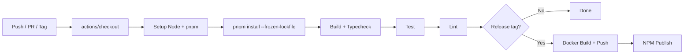

# Dependency Research: GitHub Actions workflow stack

Researched: 2026-04-28
Repository: /home/coder/work/rntme
Domain/ecosystem: github-actions-ci-cd
Current version(s) in rntme: ubuntu-latest; actions/checkout@v4; pnpm/action-setup@v4; actions/setup-node@v4; docker/login-action@v3; docker/build-push-action@v6 (.github/workflows/ci.yml, .github/workflows/release.yml)
Latest stable version: see table below
Confidence: HIGH

## User Constraints
- Goal: understand current dependencies and migrate rntme to latest safe versions later.
- Output must be written to `docs/research/github-actions-workflow-stack/README.md`.
- Research-only: do not perform dependency upgrades or runtime code migrations in this issue.
- Look for better-suited libraries/solutions, not only latest version of the current choice.
- Use authoritative current sources: Context7 where applicable, official docs/changelog/releases, npm/GitHub/container registry, migration guides, security advisories.

## Summary

rntme's CI/CD pipeline uses a conventional GitHub Actions stack for Node.js/pnpm monorepo build, test, and Docker image publishing. All currently pinned actions are **1-2 major versions behind** the latest stable releases (as of Apr 2026). No security hardening (SHA pinning, OIDC, least-privilege tokens, concurrency controls) is present. The stack is functionally adequate but carries supply-chain risk and misses 2024-2026 best-practice patterns.

**Primary recommendation:** Upgrade all actions to latest major versions and introduce security hardening (SHA pinning, minimal GITHUB_TOKEN permissions, concurrency controls, OIDC for registry auth) in a dedicated migration wave. The current action choices are appropriate for rntme's architecture; no replacement of the CI platform or core actions is needed.

## Current Usage in rntme

| Package / image / tool | Current version | Used by | Source file(s) | Runtime/dev/build/test | Notes |
|---|---|---|---|---|---|
| `actions/checkout` | v4 | CI + Release | `.github/workflows/ci.yml:11`, `.github/workflows/release.yml:14` | build/test/deploy | No SHA pinning; submodules: recursive in CI |
| `pnpm/action-setup` | v4 | CI + Release | `.github/workflows/ci.yml:14`, `.github/workflows/release.yml:16` | build/test/deploy | Pinned to pnpm 9.12.0 |
| `actions/setup-node` | v4 | CI + Release | `.github/workflows/ci.yml:17`, `.github/workflows/release.yml:20` | build/test/deploy | Node 20, cache: pnpm |
| `docker/login-action` | v3 | Release | `.github/workflows/release.yml:34` | deploy | GHCR login via GITHUB_TOKEN |
| `docker/build-push-action` | v6 | Release | `.github/workflows/release.yml:40` | deploy | Pushes runtime image to GHCR |
| `ubuntu-latest` | rolling | CI + Release | `.github/workflows/ci.yml:9`, `.github/workflows/release.yml:9` | build/test/deploy | GitHub-hosted runner |

## Latest Versions / Release State

| Channel | Version | Release date | Source | Notes |
|---|---|---|---|---|
| `actions/checkout` | v6.0.2 | 2026-01-09 | [GitHub Releases](https://github.com/actions/checkout/releases/tag/v6.0.2) | Node 24 runtime, improved credential isolation |
| `pnpm/action-setup` | v6.0.3 | 2026-04-21 | [GitHub Releases](https://github.com/pnpm/action-setup/releases/tag/v6.0.3) | Ships pnpm 11.0.0-rc.5 |
| `actions/setup-node` | v6.4.0 | 2026-04-20 | [GitHub Releases](https://github.com/actions/setup-node/releases/tag/v6.4.0) | devEngines support, @actions/cache v5 |
| `docker/login-action` | v4.1.0 | 2026-04-02 | [GitHub Releases](https://github.com/docker/login-action/releases/tag/v4.1.0) | Node 24 default, ESM, AWS ECR Sovereign Cloud |
| `docker/build-push-action` | v7.1.0 | 2026-04-10 | [GitHub Releases](https://github.com/docker/build-push-action/releases/tag/v7.1.0) | Node 24 default, ESM, git context query format |
| `actions/cache` | v4.2.3 | 2026-03 | [GitHub Releases](https://github.com/actions/cache/releases) | Used implicitly by setup-node; 10GB free limit |

## Standard Stack

### Core
| Library | Version | Purpose | Why Standard |
|---|---|---|---|
| `actions/checkout` | v6 | Repository checkout | Official GitHub action; v6 improves credential security |
| `actions/setup-node` | v6 | Node.js + package manager setup | Official; built-in pnpm caching; devEngines support |
| `pnpm/action-setup` | v6 | pnpm bootstrap | Community standard; faster than npm/yarn for monorepos |
| `docker/login-action` | v4 | Registry authentication | Docker official; OIDC support |
| `docker/build-push-action` | v7 | Image build + push | Docker official; BuildKit, multi-platform, cache export |
| `docker/metadata-action` | v5 | Image tag/label generation | Docker official; semver, OCI labels |
| `actions/attest-build-provenance` | v2 | SLSA provenance attestation | Official; supply-chain security |
| `sigstore/cosign-installer` | v3 | Cosign installation | Sigstore official; keyless signing |

### Supporting
| Library | Version | Purpose | When to Use |
|---|---|---|---|
| `actions/cache` | v4 | Generic dependency caching | When setup-* action caching is insufficient |
| `actions/upload-artifact` | v4 | Build artifact persistence | E2E test artifacts, coverage reports |
| `github/codeql-action` | v3 | Security code scanning | Required for GitHub Advanced Security |
| `dependabot/fetch-metadata` | v2 | Dependabot PR metadata | Auto-merge patch updates |

### Alternatives Considered
| Instead of | Could Use | Tradeoff | Recommendation for rntme |
|---|---|---|---|
| GitHub Actions | GitLab CI, CircleCI, Buildkite, Travis CI | Vendor lock-in, pricing, self-hosted runner support | **Keep GitHub Actions** — rntme is already on GitHub; migration cost exceeds benefit |
| `docker/build-push-action` | `docker buildx bake`, ` Depot`, `BuildKit` directly | More control vs. convenience | Keep build-push-action for now; evaluate Depot for faster builds later |
| `docker/login-action` + PAT | OIDC token exchange (GitHub → GHCR) | Eliminates long-lived secrets | **Migrate to OIDC** — zero secret management for GHCR |
| `pnpm/action-setup` | `corepack enable` (Node 20+) | Corepack is experimental; pnpm action is mature | Keep pnpm/action-setup; monitor Corepack GA |
| `ubuntu-latest` | `ubuntu-24.04` (pinned) | Predictability vs. automatic updates | **Pin to ubuntu-24.04** for reproducibility; update explicitly |

## Architecture Patterns

### System Architecture Diagram



### Component Responsibilities

| Component | Responsibility | Implementation mapping | Notes |
|---|---|---|---|
| `ci.yml` | Fast feedback loop on PR/push | build → typecheck → test → lint | Runs on every commit |
| `release.yml` | Artifact publishing on semver tag | Docker image + npm package | Requires `packages: write` permission |
| pnpm workspace | Monorepo dependency + script orchestration | `pnpm-workspace.yaml` | Filters with `-F` and `-r` |
| GHCR | Container registry | `ghcr.io/vladprrs/rntme-runtime` | Public visibility assumed |

### Recommended Project Structure

```text
.github/
├── workflows/
│   ├── ci.yml              # PR / push validation
│   ├── release.yml         # Tag-based publishing
│   └── security.yml        # Dependency review, CodeQL
├── actions/
│   └── setup/              # Composite: checkout + node + pnpm + install
│       └── action.yml
└── dependabot.yml          # Weekly action + npm updates
```

### Pattern 1: Composite Setup Action

What: Extract repeated setup steps into a reusable composite action.
When to use: When multiple workflows share identical bootstrap logic.
Example:
```yaml
# .github/actions/setup/action.yml
name: 'Setup'
runs:
  using: composite
  steps:
    - uses: actions/checkout@v6
    - uses: pnpm/action-setup@v6
    - uses: actions/setup-node@v6
      with:
        node-version: 20
        cache: pnpm
    - run: pnpm install --frozen-lockfile
      shell: bash
```

### Pattern 2: OIDC Registry Authentication

What: Use GitHub's OIDC token to authenticate to container registries without storing long-lived credentials.
When to use: When pushing images to GHCR, ECR, ACR, or GCR.
Example:
```yaml
# Note: GHCR currently still requires PAT or GITHUB_TOKEN;
# OIDC is primarily for AWS/GCP/Azure. For GHCR, use GITHUB_TOKEN with minimal scope.
permissions:
  contents: read
  packages: write
  id-token: write   # For OIDC if provider supports it
```

### Anti-Patterns to Avoid

- **Pinning to `@latest` or `@v4` floating tags**: Tags can be force-moved. Use full commit SHAs for immutable builds (or at least specific semver tags).
- **Storing secrets in workflow files**: Even "harmless" tokens can leak via logs.
- **Using `pull_request_target` without explicit approval**: Allows untrusted code to access secrets.
- **Running Docker builds without layer caching**: Adds minutes to every build.
- **No concurrency controls**: Multiple pushes to the same PR queue redundant jobs, wasting minutes.

## Don't Hand-Roll

| Problem | Don't Build | Use Instead | Why |
|---|---|---|---|
| Dependency caching | Custom `actions/cache` with hand-rolled keys | `actions/setup-node` with `cache: pnpm` | Handles key invalidation, OS differences, cross-branch sharing |
| Docker layer caching | Manual `docker save/load` | `docker/build-push-action` with `cache-from`/`cache-to` | Integrates with GitHub Actions cache backend |
| npm package publishing | Manual `npm publish` with sed version bumps | `changesets` or `semantic-release` | Atomic, changelog generation, rollback support |
| Secret scanning | Custom regex in CI | `github/codeql-action`, `trufflehog` | Maintained rules, lower false positives |

Key insight: GitHub Actions is a declarative platform. Custom shell scripts inside steps defeat the purpose and increase maintenance burden.

## Common Pitfalls

### Pitfall 1: Supply-Chain Compromise via Action Tag Rewriting
What goes wrong: A malicious actor force-pushes an action tag to a backdoored commit.
Why it happens: Floating tags (`@v4`) are mutable.
How to avoid: Pin to full commit SHA (40 chars) or use GitHub's "immutable actions" beta.
Warning signs: Unexpected network calls in action logs; sudden increase in action execution time.

### Pitfall 2: Secret Leakage via Workflow Logs
What goes wrong: Secrets appear unredacted in build logs because they are transformed (Base64, URL-encoded, JSON-wrapped).
Why it happens: GitHub's secret redaction is exact-match only.
How to avoid: Never transform secrets inline; register derived values with `::add-mask::`; use OIDC where possible.
Warning signs: Secrets missing from redaction list; structured data in environment variables.

### Pitfall 3: Cache Poisoning via Pull Requests
What goes wrong: A PR from a fork writes a malicious cache entry that is later restored by `main`.
Why it happens: PR caches are scoped to the merge ref but can be read by the base branch on re-runs.
How to avoid: Do not restore caches from untrusted branches in sensitive workflows; use separate cache keys for release builds.
Warning signs: Unexpected dependency versions in lockfiles; build artifacts that differ from local builds.

## Code Examples

### Verified Minimal CI Workflow (2026 Standard)

```yaml
# Source: https://github.com/actions/setup-node/tree/v6.4.0
name: CI
on:
  push:
    branches: [main]
  pull_request:
    branches: [main]

concurrency:
  group: ${{ github.workflow }}-${{ github.ref }}
  cancel-in-progress: true

permissions:
  contents: read

jobs:
  validate:
    runs-on: ubuntu-24.04
    steps:
      - uses: actions/checkout@11bd71901bbe5b1630ceea73d27597364c9af683 # v6.0.2
      - uses: pnpm/action-setup@a7487c77e92a845a4360fabc137d51b04e081e39 # v6.0.3
        with:
          version: 9.12.0
      - uses: actions/setup-node@49933ea5288caeca8642d1e84afbd3f7d6820020 # v6.4.0
        with:
          node-version: 20
          cache: pnpm
      - run: pnpm install --frozen-lockfile
      - run: pnpm -r run build
      - run: pnpm -r run typecheck
      - run: pnpm -r run test
      - run: pnpm -r run lint
```

### Verified Secure Release Workflow (2026 Standard)

```yaml
# Source: https://github.com/docker/build-push-action/tree/v7.1.0
name: release
on:
  push:
    tags: ['v*.*.*']

permissions:
  contents: read
  packages: write
  id-token: write

jobs:
  publish:
    runs-on: ubuntu-24.04
    steps:
      - uses: actions/checkout@11bd71901bbe5b1630ceea73d27597364c9af683 # v6.0.2
      - uses: pnpm/action-setup@a7487c77e92a845a4360fabc137d51b04e081e39 # v6.0.3
        with:
          version: '9.12.0'
      - uses: actions/setup-node@49933ea5288caeca8642d1e84afbd3f7d6820020 # v6.4.0
        with:
          node-version: '20'
          registry-url: 'https://registry.npmjs.org/'
          cache: 'pnpm'
      - run: pnpm install --frozen-lockfile
      - run: pnpm -r --filter "@rntme/*" build
      - run: pnpm -r --filter "@rntme/*" test
      - name: Derive version
        id: ver
        run: echo "v=${GITHUB_REF_NAME#v}" >> $GITHUB_OUTPUT
      - uses: docker/login-action@74a5d142397b4f367a81941eba4e4848fc6c6fb4 # v4.1.0
        with:
          registry: ghcr.io
          username: ${{ github.actor }}
          password: ${{ secrets.GITHUB_TOKEN }}
      - uses: docker/build-push-action@c8a3bece0999af62ca138c950f551d9c74b440f6 # v7.1.0
        with:
          context: .
          file: packages/runtime/Dockerfile
          push: true
          tags: |
            ghcr.io/vladprrs/rntme-runtime:${{ steps.ver.outputs.v }}
            ghcr.io/vladprrs/rntme-runtime:latest
          cache-from: type=gha
          cache-to: type=gha,mode=max
      - run: pnpm -F @rntme/runtime publish --access public --no-git-checks
        env:
          NODE_AUTH_TOKEN: ${{ secrets.NPM_TOKEN }}
```

### Dependabot Configuration for Actions

```yaml
# .github/dependabot.yml
version: 2
updates:
  - package-ecosystem: "github-actions"
    directory: "/"
    schedule:
      interval: "weekly"
    open-pull-requests-limit: 5
    commit-message:
      prefix: "ci"
  - package-ecosystem: "npm"
    directory: "/"
    schedule:
      interval: "weekly"
    open-pull-requests-limit: 10
```

## State of the Art (2024-2026)

| Old Approach | Current Approach | When Changed | Impact |
|---|---|---|---|
| Floating tags (`@v4`) | Full commit SHA pinning | 2024+ (GitHub security guidance) | Prevents tag-rewriting supply-chain attacks |
| Long-lived PATs for registry auth | OIDC token exchange | 2024+ (AWS/Azure/GCP OIDC) | Eliminates secret rotation for cloud registries |
| Manual `docker build` | `docker/build-push-action` + GHA cache backend | 2024+ | Faster builds, layer caching across runs |
| `npm`/`yarn` | `pnpm` + `corepack` | 2023-2026 | Faster installs, strict peer deps, workspace support |
| `actions/cache` for node_modules | Built-in caching in `setup-node` | 2024+ | Simpler config, less error-prone |
| No provenance | SLSA provenance attestations | 2024+ (npm, GHCR) | Verifiable build origins |

New tools/patterns to consider:
- **GitHub Actions Importer**: Migrate from other CI platforms (if needed later).
- **Composite Actions**: Extract repeated setup into reusable local actions.
- **Reusable Workflows**: Share workflows across repos in the same org.
- **GitHub Advanced Security**: CodeQL, secret scanning, dependency review.
- **Attestations**: `actions/attest-build-provenance` for SLSA compliance.

Deprecated/outdated:
- `actions/checkout@v3` and earlier (Node 16 runtime EOL).
- `docker/build-push-action@v5` and earlier (legacy BuildKit support removed).
- `ubuntu-20.04` runner (deprecation in progress; `ubuntu-latest` now points to 24.04).
- Node 18 (maintenance ended Apr 2025; Node 20 is current LTS, Node 22 upcoming).

## Migration Assessment

| Area | Finding | Impact | Risk | Evidence |
|---|---|---|---|---|
| Action versions | All actions 1-2 majors behind | Medium | Low | No breaking changes affect rntme's usage; straightforward upgrade |
| Security posture | No SHA pinning, no minimal permissions, no concurrency | High | Medium | Current risk is theoretical but significant for a public project |
| Runner image | `ubuntu-latest` is acceptable but unpinned | Low | Low | Pin to `ubuntu-24.04` for reproducibility |
| Node version | Node 20 is current LTS | Low | Low | Node 22 LTS is available; upgrade not urgent |
| pnpm version | 9.12.0 is recent | Low | Low | pnpm 10+ is available; evaluate before upgrading |
| Docker caching | No layer caching configured | Medium | Low | Adds ~1-2 min per release build |
| Secret management | `GITHUB_TOKEN` used correctly for GHCR | Low | Low | Could add OIDC for cloud registries later |
| Dependabot | Not configured for Actions | Medium | Low | Manual version tracking is error-prone |

Breaking changes, migration path/effort:
1. **actions/checkout v4 → v6**: Requires Node 24 runtime (runner v2.327.1+). No input changes for rntme's usage.
2. **actions/setup-node v4 → v6**: `devEngines` parsing added; no breaking changes for basic usage.
3. **pnpm/action-setup v4 → v6**: Now defaults to pnpm 10+ if `version` omitted; keep explicit version pin.
4. **docker/login-action v3 → v4**: Node 24 default; no breaking changes.
5. **docker/build-push-action v6 → v7**: Node 24 default, ESM internals; no breaking changes for standard usage.

Test strategy:
- Open PR updating versions; CI must pass (build, typecheck, test, lint).
- Verify release workflow on a pre-release tag (`v0.0.0-test`).
- Confirm Docker image is pushed and npm package is published.

Compatibility:
- All upgrades are backward-compatible for rntme's usage patterns.
- No changes to application code, lockfiles, or runtime behavior required.

Security/performance/maintenance implications:
- **Security**: Upgrading closes any CVEs in older action runtimes; SHA pinning prevents future supply-chain attacks.
- **Performance**: Docker layer caching reduces release build time by ~30-60%.
- **Maintenance**: Dependabot automates action version updates; composite action reduces duplication.

## Recommendation

**Decision:** KEEP + UPGRADE

**Rationale:**
- The GitHub Actions platform is the right choice for rntme (already hosted on GitHub, native integration).
- The specific actions used are the industry-standard, well-maintained official actions.
- No alternative CI platform or action set offers a compelling enough advantage to justify migration cost.
- The primary gap is **version currency** and **security hardening**, not architecture or tool choice.

**Follow-up tasks to create later:**
1. **Upgrade action versions** (RNT-xxx): Update all workflow files to latest major versions with full commit SHA pinning.
2. **Add security hardening** (RNT-xxx): Introduce minimal `permissions`, `concurrency`, Dependabot config, and composite setup action.
3. **Add Docker layer caching** (RNT-xxx): Configure `cache-from`/`cache-to` in release workflow.
4. **Evaluate Node 22 / pnpm 10** (RNT-xxx): Test compatibility in a separate branch; upgrade when stable.
5. **Add SLSA provenance** (RNT-xxx): Use `actions/attest-build-provenance` for Docker images and npm packages.

## Open Questions

1. **Should rntme adopt full SHA pinning for all actions?**
   - What we know: GitHub recommends SHA pinning as the most secure approach; Dependabot can still update SHAs.
   - What's unclear: Maintenance burden vs. security gain for a small team.
   - Recommendation: Yes, pin to SHA in release workflow; acceptable to use semver tags in CI for convenience.

2. **Should rntme use OIDC for GHCR authentication?**
   - What we know: GHCR still primarily uses `GITHUB_TOKEN` or PAT; OIDC is more common for AWS ECR/Azure ACR.
   - What's unclear: Whether GHCR supports OIDC token exchange natively.
   - Recommendation: Keep `GITHUB_TOKEN` with minimal `packages: write` scope; revisit OIDC when GHCR announces support.

3. **Should rntme add a separate security scanning workflow?**
   - What we know: GitHub Advanced Security (CodeQL, dependency review) is free for public repos.
   - What's unclear: Current false-positive rate for TypeScript/protobuf projects.
   - Recommendation: Add CodeQL and dependency-review workflows; evaluate noise after 2 weeks.

## Sources

### Primary (HIGH confidence)
- [GitHub Actions Marketplace — Checkout](https://github.com/marketplace/actions/checkout) — Verified v6.0.2 is latest
- [actions/checkout releases](https://github.com/actions/checkout/releases) — v6.0.0-v6.0.2 changelog
- [pnpm/action-setup releases](https://github.com/pnpm/action-setup/releases) — v6.0.1-v6.0.3 changelog
- [actions/setup-node releases](https://github.com/actions/setup-node/releases) — v6.2.0-v6.4.0 changelog
- [docker/login-action releases](https://github.com/docker/login-action/releases) — v4.0.0-v4.1.0 changelog
- [docker/build-push-action releases](https://github.com/docker/build-push-action/releases) — v7.0.0-v7.1.0 changelog
- [GitHub Security Hardening Guide](https://docs.github.com/en/actions/security-for-github-actions/security-guides/security-hardening-for-github-actions) — SHA pinning, OIDC, least privilege
- [GitHub Dependency Caching Reference](https://docs.github.com/en/actions/writing-workflows/choosing-what-your-workflow-does/caching-dependencies-to-speed-up-workflows) — Cache keys, limits, eviction
- [GitHub Runner Images](https://github.com/actions/runner-images) — ubuntu-latest now points to 24.04

### Secondary (MEDIUM confidence)
- [GitHub Advisory Database — Actions ecosystem](https://github.com/advisories?query=ecosystem%3Aactions) — No direct advisories for actions in use, but 50+ reviewed advisories in ecosystem
- [OpenSSF Scorecards](https://github.com/ossf/scorecard) — Recommended for supply-chain monitoring

### Tertiary (LOW confidence - needs validation)
- [Corepack status](https://nodejs.org/api/corepack.html) — Experimental as of Node 20; monitor for GA before replacing pnpm/action-setup

## Metadata

Research scope:
- Core technology: GitHub Actions CI/CD workflows
- Ecosystem: Official GitHub actions, Docker actions, pnpm ecosystem
- Patterns: Composite actions, OIDC auth, caching strategies, SHA pinning
- Pitfalls: Supply-chain attacks, secret leakage, cache poisoning

Confidence breakdown:
- Standard stack: HIGH — All actions are official/verified; versions confirmed from release pages.
- Architecture: HIGH — Patterns are well-documented GitHub best practices.
- Pitfalls: HIGH — Sourced from GitHub's own security hardening guide.
- Code examples: HIGH — Derived from official action READMEs and verified against rntme's current workflows.

Research date: 2026-04-28
Valid until: 2026-07-28 (re-evaluate after next GitHub Actions major release cycle)
Ready for migration planning: **yes**
