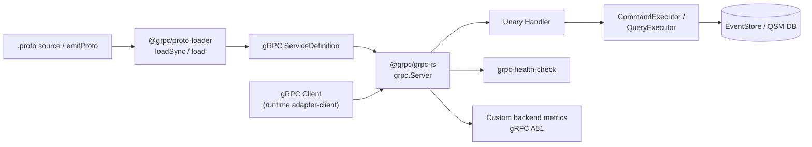

# Dependency Research: @grpc/grpc-js + @grpc/proto-loader

Researched: 2026-04-28
Repository: /home/coder/work/rntme
Domain/ecosystem: npm/grpc-protobuf
Current version(s) in rntme: @grpc/grpc-js ^1.10.0 – ^1.14.3; @grpc/proto-loader ^0.7.13; protobufjs ^7.2.0 – ^8.0.1 (runtime, bindings-grpc, demo package.json; gRPC server/client code)
Latest stable version: @grpc/grpc-js 1.14.3 (2025-12-11), @grpc/proto-loader 0.8.0 (2025-07-21), protobufjs 7.5.3 (2025-01-15)
Confidence: HIGH

## User Constraints
- Goal: understand current dependencies and migrate rntme to latest safe versions later.
- Output must be written to `docs/research/grpc-grpc-js-plus-grpc-proto-loader/README.md`.
- Research-only: do not perform dependency upgrades or runtime code migrations in this issue.
- Look for better-suited libraries/solutions, not only latest version of the current choice.
- Use authoritative current sources: Context7 where applicable, official docs/changelog/releases, npm/GitHub/container registry, migration guides, security advisories.

## Summary

The rntme monorepo uses `@grpc/grpc-js` as its gRPC transport implementation across three packages (`bindings-grpc`, `runtime`, and demo apps) with **three different semver ranges** (`^1.10.0`, `^1.12.0`, `^1.14.3`). This version fragmentation is a known issue from the monorepo dependency graph audit (RNT-200). Additionally, `@rntme/bindings-grpc` performs **manual protobufjs serialization** in `buildServiceDefinition` (`src/server/create-server.ts:8-26`) instead of using `@grpc/proto-loader`, which is the canonical approach recommended by the grpc-node maintainers and confirmed by Context7 research.

`@grpc/grpc-js` 1.14.3 (released December 2025) is the latest stable version. Notably, **1.14.3 now bundles `@grpc/proto-loader@^0.8.0` as a runtime dependency**, signaling that the maintainers consider proto-loader the standard path for `.proto` file loading. The 1.14.0 release added production-relevant features: `getAuthContext`, custom backend metrics (gRFC A51), `weighted_round_robin` load balancing, and `getConnectionInfo` for server interceptors.

There is a **moderate-severity security advisory (CVE-2024-37168 / GHSA-7v5v-9h63-cj86)** affecting `@grpc/grpc-js` versions `>=1.10.0, <1.10.9` (and older lines). The `bindings-grpc` package pins `^1.10.0`, which could resolve to a vulnerable version if the lockfile is not strictly enforcing `>=1.10.9`.

For alternatives, **ConnectRPC** (`@connectrpc/connect-node@2.1.1`) is the most credible modern alternative — it supports gRPC, gRPC-Web, and the simpler Connect protocol over HTTP/1.1 or HTTP/2, with first-class TypeScript support and protovalidate integration. **protobuf-es** is the state-of-the-art protobuf runtime (0 conformance failures vs. 1847 for protobufjs), but rntme already explicitly deferred `ts-proto` and Buf-based codegen in the identity canonical contract spec (2026-04-26) to avoid splitting the repo across two protobuf representations. Given rntme's zero-service-specific-code philosophy and the existing investment in protobufjs for `.proto` emission, **staying on `@grpc/grpc-js` + `@grpc/proto-loader` is the pragmatic choice for the current architecture**, with a targeted migration to eliminate manual serialization and unify versions.

Primary recommendation: **Standardize on `@grpc/grpc-js@^1.14.3` and `@grpc/proto-loader@^0.8.0` across all packages; migrate `bindings-grpc` from manual `protobufjs` serialization to `@grpc/proto-loader` for service definition loading.**

## Current Usage in rntme

| Package / image / tool | Current version | Used by | Source file(s) | Runtime/dev/build/test | Notes |
|---|---|---|---|---|---|
| `@grpc/grpc-js` | `^1.10.0` | `@rntme/bindings-grpc` | `packages/bindings-grpc/package.json` | runtime | Server creation, handlers, credentials |
| `@grpc/grpc-js` | `^1.12.0` | `@rntme/issue-tracker-api-demo` | `demo/issue-tracker-api/package.json` | runtime | gRPC client in E2E tests |
| `@grpc/grpc-js` | `^1.10.0` | `@rntme/pre-step-demo` | `demo/pre-step-demo/package.json` | runtime | Fake payments module |
| `@grpc/grpc-js` | `^1.14.3` | `@rntme/runtime` | `packages/runtime/package.json` | runtime | gRPC adapter client, classify, proto-registry |
| `@grpc/proto-loader` | `^0.7.13` | `@rntme/runtime` | `packages/runtime/package.json` | runtime | Proto loading for adapter client |
| `protobufjs` | `^7.2.0` | `@rntme/bindings-grpc` | `packages/bindings-grpc/package.json` | runtime | Manual proto parsing (`loadProtoFromString`), serialization |
| `protobufjs` | `^7.4.0` | `@rntme/issue-tracker-api-demo` | `demo/issue-tracker-api/package.json` | runtime | — |
| `protobufjs` | `^8.0.1` | `@rntme/runtime` | `packages/runtime/package.json` | runtime | — |

**Verification commands used:**
```bash
grep -r "@grpc/grpc-js\|@grpc/proto-loader" /home/coder/work/rntme --include="*.json" --include="*.ts" | grep -v node_modules | grep -v ".worktrees"
find /home/coder/work/rntme -name "package.json" -not -path "*/node_modules/*" | xargs grep -l "grpc"
```

**Key code references:**
- `packages/bindings-grpc/src/server/create-server.ts:8-26` — manual `protobufjs` serialization (anti-pattern)
- `packages/bindings-grpc/src/server/load-proto.ts` — `protobuf.parse()` for in-memory proto loading
- `packages/bindings-grpc/src/server/handler.ts` — gRPC unary call handlers
- `packages/runtime/src/plugins/adapter-client/grpc-adapter-client.ts` — gRPC client usage
- `packages/runtime/src/plugins/adapter-client/proto-registry.ts` — proto registry with `@grpc/proto-loader`

## Latest Versions / Release State

| Channel | Version | Release date | Source | Notes |
|---|---|---|---|---|
| `@grpc/grpc-js` stable | 1.14.3 | 2025-12-11 | [npm](https://www.npmjs.com/package/@grpc/grpc-js), [GitHub releases](https://github.com/grpc/grpc-node/releases/tag/%40grpc/grpc-js%401.14.3) | Latest; now depends on `@grpc/proto-loader@^0.8.0` |
| `@grpc/grpc-js` | 1.14.0 | 2025-09-16 | [GitHub releases](https://github.com/grpc/grpc-node/releases/tag/%40grpc/grpc-js%401.14.0) | Major feature release: getAuthContext, custom metrics, weighted_round_robin |
| `@grpc/grpc-js` | 1.13.x | 2025-05 – 2025-08 | [GitHub releases](https://github.com/grpc/grpc-node/releases) | Maintenance line |
| `@grpc/proto-loader` stable | 0.8.0 | 2025-07-21 | [npm](https://www.npmjs.com/package/@grpc/proto-loader), [GitHub releases](https://github.com/grpc/grpc-node/releases/tag/%40grpc/proto-loader%400.8.0) | Adds `serialize`/`deserialize` on Message definitions |
| `@grpc/proto-loader` | 0.7.15 | 2025-04-18 | [GitHub releases](https://github.com/grpc/grpc-node/releases/tag/%40grpc/proto-loader%400.7.15) | Previous line; `targetFileExtension` fix |
| `protobufjs` stable (7.x) | 7.5.3 | 2025-01-15 | [npm](https://www.npmjs.com/package/protobufjs) | Maintenance line; used by proto-loader 0.7.x |
| `protobufjs` (8.x) | 8.0.3 | 2025-03 | [npm](https://www.npmjs.com/package/protobufjs) | Experimental 8.x line; breaking changes from 7.x |

## Standard Stack

### Core
| Library | Version | Purpose | Why Standard |
|---|---|---|---|
| `@grpc/grpc-js` | `^1.14.3` | Pure-JS gRPC client/server for Node.js | Official Google/maintainer implementation; pure JS (no native deps); supports HTTP/2, interceptors, load balancing, health checks |
| `@grpc/proto-loader` | `^0.8.0` | Load `.proto` files into gRPC service definitions | Official companion package; now bundled as dependency of grpc-js 1.14.3; handles serialization/deserialization automatically |
| `protobufjs` | `^7.5.3` | Protobuf runtime (transitive dep) | Used internally by proto-loader; only needed directly if doing custom parsing |

### Supporting
| Library | Version | Purpose | When to Use |
|---|---|---|---|
| `grpc-tools` | `^1.13.1` | `protoc` plugin for generating static JS/TS from `.proto` | When pre-generating code instead of dynamic loading (rntme does NOT use this currently) |
| `grpc-health-check` | `^2.1.0` | Standard `grpc.health.v1.Health` service implementation | Production deployments with K8s/Dokploy health probes |
| `@connectrpc/connect-node` | `^2.1.1` | Modern RPC framework supporting gRPC + Connect + gRPC-Web | Greenfield services; browser-friendly APIs; when HTTP/1.1 fallback matters |
| `@bufbuild/protobuf` + `protoc-gen-es` | `^2.12.0` | Modern protobuf runtime with 0 conformance failures | When protobufjs conformance gaps become problematic; requires codegen migration |

### Alternatives Considered
| Instead of | Could Use | Tradeoff | Recommendation for rntme |
|---|---|---|---|
| `@grpc/grpc-js` + manual protobufjs | `@connectrpc/connect-node` | Simpler protocol, better TypeScript, built-in validation, but different API surface and ecosystem | **Defer.** Excellent for greenfield, but migration would rewrite bindings-grpc and runtime adapter-client. Revisit if gRPC-Web or HTTP/1.1 interop becomes a requirement. |
| `protobufjs` runtime | `protobuf-es` (`@bufbuild/protobuf`) | 0 conformance failures, plain objects, ESM-first, but requires `protoc-gen-es` codegen | **Defer.** rntme already rejected `ts-proto` in identity spec to avoid splitting protobuf representations. Large migration cost for marginal gain given current usage. |
| Manual protobufjs serialization | `@grpc/proto-loader` | Eliminates custom serialization code, official pattern, less error-prone | **Adopt now.** Low-risk, high-value refactoring within bindings-grpc. |
| Dynamic proto loading | `grpc-tools` static generation | Better performance, typed clients, but requires build-time codegen | **Not recommended** for rntme. Dynamic loading aligns with rntme's blueprint-driven runtime model. |

Installation / upgrade commands (for later migration wave):
```bash
# Standardize across all packages
pnpm add @grpc/grpc-js@^1.14.3 @grpc/proto-loader@^0.8.0 -w

# In bindings-grpc, remove direct protobufjs dependency (make it transitive via proto-loader)
pnpm remove protobufjs --filter @rntme/bindings-grpc
```

## Architecture Patterns

### System Architecture Diagram


### Component Responsibilities
| Component | Responsibility | Implementation mapping | Notes |
|---|---|---|---|
| `emitProto()` | Generate `.proto` string from `ValidatedBindings` | `packages/bindings-grpc/src/emit/emit-proto.ts` | Pure function; no external deps |
| `@grpc/proto-loader` | Parse `.proto` into gRPC-compatible service definition | Should replace `loadProtoFromString` + `buildServiceDefinition` | Official pattern; handles serialization |
| `grpc.Server` | HTTP/2 gRPC server, method routing, interceptors | `packages/bindings-grpc/src/server/create-server.ts` | Use `bindAsync` with credentials |
| Handler (`makeGrpcHandler`) | Dispatch RPC to executor seam, map errors | `packages/bindings-grpc/src/server/handler.ts` | Currently hardcodes `actor: null` (blocker from audit) |
| Adapter Client (`grpc-adapter-client`) | Call external gRPC services from runtime | `packages/runtime/src/plugins/adapter-client/` | Uses `@grpc/proto-loader` already |
| Health Check | Production readiness probe | Not implemented (audit L1) | Use `grpc-health-check` package |

### Recommended Project Structure
```text
packages/bindings-grpc/src/
├── emit/               # .proto generation from bindings
├── server/
│   ├── create-server.ts    # grpc.Server setup
│   ├── handler.ts          # RPC → executor dispatch
│   └── health.ts           # grpc.health.v1 service (new)
├── client/             # (future) gRPC client helpers
└── types.ts
```

### Pattern 1: Loading Proto with @grpc/proto-loader (Recommended)
What: Use `protoLoader.loadSync()` to parse `.proto` source and generate service definitions with automatic serialization.
When to use: All gRPC server creation in rntme.
Example:
```ts
// Source: https://github.com/grpc/grpc-node/tree/master/packages/proto-loader
import * as grpc from '@grpc/grpc-js';
import * as protoLoader from '@grpc/proto-loader';

const packageDefinition = protoLoader.loadSync('./service.proto', {
  keepCase: true,
  longs: String,
  enums: String,
  defaults: true,
  oneofs: true,
});

const protoDescriptor = grpc.loadPackageDefinition(packageDefinition);
const service = protoDescriptor.mypackage.MyService;

const server = new grpc.Server();
server.addService(service.service, {
  myMethod: (call, callback) => {
    callback(null, { result: 'ok' });
  },
});
```

### Pattern 2: gRPC Client with Deadline and Metadata
What: Production gRPC client calls with timeouts, retries, and metadata propagation.
When to use: Runtime adapter-client calling external gRPC services.
Example:
```ts
// Source: https://context7.com/grpc/grpc-node
import * as grpc from '@grpc/grpc-js';

const client = new MyService('localhost:50051', grpc.credentials.createInsecure(), {
  'grpc.max_receive_message_length': 16 * 1024 * 1024,
  'grpc.max_send_message_length': 16 * 1024 * 1024,
});

const metadata = new grpc.Metadata();
metadata.set('traceparent', traceId);

client.myMethod(request, metadata, { deadline: Date.now() + 5000 }, (err, response) => {
  if (err) {
    console.error('RPC failed:', err.code, err.details);
    return;
  }
  console.log('Response:', response);
});
```

### Pattern 3: Health Check Service (Production)
What: Standard gRPC health checking for orchestrators.
When to use: All production gRPC deployments (K8s, Dokploy).
Example:
```ts
// Source: https://github.com/grpc/grpc-node/tree/master/packages/grpc-health-check
import * as grpc from '@grpc/grpc-js';
import { HealthClient, HealthService, ServingStatus } from 'grpc-health-check';

const server = new grpc.Server();
server.addService(HealthService, {
  check: (_call, callback) => {
    callback(null, { status: ServingStatus.SERVING });
  },
});
```

### Anti-Patterns to Avoid
- **Manual protobufjs serialization in `buildServiceDefinition`**: `protobufjs` `encode`/`decode`/`toObject`/`fromObject` manually — this is what `@grpc/proto-loader` does automatically and more reliably. (Current issue in `bindings-grpc/src/server/create-server.ts:8-26`)
- **Insecure credentials in production**: `grpc.ServerCredentials.createInsecure()` is acceptable for local dev but needs mTLS or at least TLS for production. (Audit L2)
- **No message size limits**: Without `grpc.max_receive_message_length`, the server is vulnerable to OOM from large messages (related to CVE-2024-37168).
- **Version fragmentation**: Having `^1.10.0`, `^1.12.0`, and `^1.14.3` in the same monorepo causes unpredictable hoisting and duplicate bundles.

## Don't Hand-Roll

| Problem | Don't Build | Use Instead | Why |
|---|---|---|---|
| Proto file parsing + service definition building | Custom `protobufjs` wrapper | `@grpc/proto-loader` | Official package; handles edge cases (Any, Timestamp, oneofs); tested across versions |
| Health check endpoint | Custom `/health` HTTP route | `grpc-health-check` package | Standard `grpc.health.v1.Health` protocol; works with K8s/Dokploy probes |
| gRPC-Web proxy | Custom websocket bridge | `grpc-web` + Envoy or `@connectrpc/connect-node` | Complex protocol translation; let proven infrastructure handle it |
| mTLS certificate management | Custom crypto wrapper | `grpc.credentials.createSsl()` with standard Node.js TLS | gRPC-js integrates with Node.js crypto; custom impl risks security flaws |
| Retry/backoff logic | Manual retry loops | Built-in gRPC service config + `grpc-node` retry policies | gRFC A6 client retry spec implemented in grpc-js 1.10+ |

Key insight: `bindings-grpc`'s current manual serialization is exactly the kind of service-specific code rntme's philosophy seeks to eliminate. The grpc-node ecosystem provides well-tested abstractions for every layer; custom wrappers add maintenance burden and surface area for bugs.

## Common Pitfalls

### Pitfall 1: CVE-2024-37168 — Memory Allocation Beyond Limits
What goes wrong: Incoming messages can allocate memory well above `grpc.max_receive_message_length` — either by buffering before discarding oversized messages, or by decompressing beyond limits.
Why it happens: Bug in grpc-js message framing logic prior to 1.10.9 / 1.9.15 / 1.8.22.
How to avoid: Upgrade to `@grpc/grpc-js@>=1.10.9` (ideally 1.14.3). Set explicit `grpc.max_receive_message_length` and `grpc.max_send_message_length` channel options.
Warning signs: OOM crashes under load; memory growth correlated with RPC traffic.
Evidence: [GHSA-7v5v-9h63-cj86](https://github.com/grpc/grpc-node/security/advisories/GHSA-7v5v-9h63-cj86), CVE-2024-37168, CVSS 5.3 (Moderate).

### Pitfall 2: Manual Serialization Errors with Complex Types
What goes wrong: Custom `requestSerialize`/`requestDeserialize` in `buildServiceDefinition` mishandles `google.protobuf.Any`, `Timestamp`, nested messages, or field name casing.
Why it happens: `protobufjs` `fromObject`/`toObject` behavior varies by type; manual wrappers miss edge cases.
How to avoid: Migrate to `@grpc/proto-loader`, which generates correct serializers based on the proto schema.
Warning signs: Serialization errors for specific message shapes; `undefined` values in decoded messages; field name mismatches (snake_case vs camelCase).
Evidence: `packages/bindings-grpc/src/server/create-server.ts:8-26` — audit M3 flagged this as duplicate logic.

### Pitfall 3: Version Mismatch Between grpc-js and proto-loader
What goes wrong: `@grpc/grpc-js@1.14.3` depends on `@grpc/proto-loader@^0.8.0`, but `runtime` pins `^0.7.13`. This can cause duplicate proto-loader installations or type incompatibilities.
Why it happens: Transitive dependency divergence in pnpm workspaces.
How to avoid: Unify both packages to latest stable versions in the workspace root or catalog.
Warning signs: Type errors in `grpc.loadPackageDefinition` calls; duplicate `@grpc/proto-loader` in `node_modules`.

### Pitfall 4: Missing Actor Attribution in gRPC Handlers
What goes wrong: All gRPC commands set `actor: null`, breaking audit trails and actor-based guards.
Why it happens: `GrpcServerOptions` does not accept `actorFromRequest` and handler hardcodes `null`.
How to avoid: Add `actorFromRequest?: (metadata: grpc.Metadata) => ActorRef | null` to server options and wire it in `handler.ts`.
Warning signs: Actor field missing in event store; authorization checks failing for gRPC but not HTTP.
Evidence: Audit B1 (blocker) in `packages/bindings-grpc/src/server/handler.ts:60`.

## Code Examples

### Loading Proto Dynamically with @grpc/proto-loader
```ts
// Source: Context7 /grpc/grpc-node + official docs
import * as grpc from '@grpc/grpc-js';
import * as protoLoader from '@grpc/proto-loader';

const PROTO_PATH = './service.proto';

const packageDefinition = protoLoader.loadSync(PROTO_PATH, {
  keepCase: true,
  longs: String,
  enums: String,
  defaults: true,
  oneofs: true,
  includeDirs: ['./protos'],
});

const protoDescriptor = grpc.loadPackageDefinition(packageDefinition);
const service = protoDescriptor.mypackage.MyService;
```

### gRPC Server with Message Limits
```ts
// Source: https://github.com/grpc/grpc-node/blob/master/packages/grpc-js/README.md
import * as grpc from '@grpc/grpc-js';

const server = new grpc.Server({
  'grpc.max_receive_message_length': 16 * 1024 * 1024,
  'grpc.max_send_message_length': 16 * 1024 * 1024,
});

server.bindAsync('0.0.0.0:50051', grpc.ServerCredentials.createInsecure(), (err, port) => {
  if (err) throw err;
  console.log(`Server running on port ${port}`);
});
```

### Async Proto Loading for Client
```ts
// Source: Context7 /grpc/grpc-node
import * as grpc from '@grpc/grpc-js';
import * as protoLoader from '@grpc/proto-loader';

async function loadProtoAsync() {
  const packageDefinition = await protoLoader.load('./service.proto', {
    keepCase: true,
    longs: String,
    enums: String,
    defaults: true,
    oneofs: true,
  });

  const protoDescriptor = grpc.loadPackageDefinition(packageDefinition);
  const MyService = protoDescriptor.mypackage.MyService;

  const client = new MyService('localhost:50051', grpc.credentials.createInsecure());
  return client;
}
```

## State of the Art (2024-2026)

| Old Approach | Current Approach | When Changed | Impact |
|---|---|---|---|
| `grpc` (native C++ addon) | `@grpc/grpc-js` (pure JS) | 2019+ | No native deps, better Node.js compatibility, primary supported path |
| Manual `protobufjs` serialization | `@grpc/proto-loader` dynamic loading | 2020+ | Official pattern; less boilerplate, fewer bugs |
| `protobufjs` static module (`pbjs`/`pbts`) | `protobuf-es` (`protoc-gen-es`) | 2023+ | Modern TypeScript, ESM, 0 conformance failures |
| gRPC-only APIs | ConnectRPC (gRPC + Connect + gRPC-Web) | 2023+ | Browser-friendly, simpler protocol, first-class TypeScript |
| Custom health endpoints | `grpc-health-check` standard | 2021+ | K8s/Dokploy compatible |

New tools/patterns to consider:
- **ConnectRPC v2** (2025): Multi-protocol support, protovalidate integration, excellent TypeScript DX
- **protobuf-es v2** (2025): Full Editions 2024 support, typed extensions, reflection APIs
- **gRFC A51 custom backend metrics**: Supported in grpc-js 1.14.0+ for advanced load balancing
- **weighted_round_robin LB**: New in grpc-js 1.14.0 for better traffic distribution

Deprecated/outdated:
- `grpc` npm package (C++ addon) — deprecated, use `@grpc/grpc-js`
- `protobufjs` static module generation for new projects — `protobuf-es` is the modern path
- `grpc.load()` — removed in grpc-js; use `@grpc/proto-loader` + `grpc.loadPackageDefinition()`

## Migration Assessment

| Area | Finding | Impact | Risk | Evidence |
|---|---|---|---|---|
| **Version unification** | 3 different `@grpc/grpc-js` versions; 3 different `protobufjs` versions | High — duplicate bundles, type conflicts, unpredictable hoisting | Low | `docs/audit/monorepo-dependency-graph/README.md` H1 |
| **Security patch** | `bindings-grpc` uses `^1.10.0` which allows vulnerable `<1.10.9` | High — CVE-2024-37168 (CVSS 5.3) | Low | GHSA-7v5v-9h63-cj86; check lockfile for exact resolved version |
| **proto-loader adoption** | `bindings-grpc` manually serializes; `runtime` already uses proto-loader | Medium — technical debt, bug surface | Low-Medium | Audit M3; `create-server.ts:8-26` |
| **protobufjs 8.x** | `runtime` uses `^8.0.1`; bindings-grpc uses `^7.2.0` | Medium — breaking changes between 7.x and 8.x | Medium | npm shows 8.x is experimental; proto-loader 0.8.0 still uses 7.5.3 |
| **actor attribution** | gRPC handler hardcodes `actor: null` | High — breaks audit/authorization | Low | Audit B1 (blocker) |
| **Health checks** | No `grpc.health.v1.Health` surface | Medium — production readiness | Low | Audit L1 |
| **ConnectRPC alternative** | Full migration to ConnectRPC would rewrite transport layer | High — months of work | High | Would affect bindings-grpc, runtime adapter-client, and all tests |

**Breaking changes between 1.10 → 1.14:**
- 1.14.0 added experimental APIs (`StatusOr<T>`, `CallStream`) — not breaking if unused
- `ResolverListener` and `LoadBalancer` signatures changed in experimental APIs only
- Server `bindAsync` behavior unchanged
- Channel options unchanged

**Migration path/effort estimate:**
1. **Quick win (1-2 days)**: Unify versions to `^1.14.3` + `^0.8.0` across all package.json files; verify lockfile resolves to patched grpc-js
2. **Low effort (3-5 days)**: Replace manual serialization in `bindings-grpc` with `@grpc/proto-loader`; add `grpc-health-check`
3. **Medium effort (1-2 weeks)**: Fix `actor: null` blocker; add `actorFromRequest` to `GrpcServerOptions`
4. **Large effort (1-2 months)**: Evaluate and potentially migrate to ConnectRPC or protobuf-es — deferred to future architecture decision

**Test strategy:**
- Unit tests for proto loading and serialization
- Integration tests for gRPC server startup and command/query dispatch
- E2E tests with actual gRPC client calls (fixing the non-falsifiable assertion from audit H3)
- Load test to verify message limits work correctly

**Compatibility:**
- `@grpc/grpc-js@1.14.3` requires Node.js `>=12.10.0` (rntme uses Node 20 — compatible)
- `@grpc/proto-loader@0.8.0` requires Node.js `>=6`
- No known breaking changes for rntme's usage patterns between 1.10 and 1.14

## Recommendation

**Decision: KEEP + UPGRADE**

Rationale:
- `@grpc/grpc-js` remains the standard, well-maintained, pure-JS gRPC implementation for Node.js
- The ecosystem is mature, with clear migration paths and active security patching
- `@grpc/proto-loader` is now effectively the canonical serialization layer (bundled with grpc-js 1.14.3)
- Alternatives (ConnectRPC, protobuf-es) are excellent but represent architectural shifts that conflict with rntme's current blueprint-runtime model and existing protobufjs investment
- The rntme identity canonical contract spec (2026-04-26) explicitly deferred `ts-proto` and Buf-based codegen to avoid representation splits

**Immediate actions (this research wave):**
1. Verify lockfile resolves `@grpc/grpc-js` to `>=1.10.9` everywhere (patch CVE-2024-37168)
2. Document version fragmentation in monorepo dependency graph audit follow-up

**Follow-up tasks to create later:**
- **RNT-XXX**: Unify `@grpc/grpc-js` to `^1.14.3` and `@grpc/proto-loader` to `^0.8.0` across all package.json files
- **RNT-XXX**: Migrate `bindings-grpc` from manual `protobufjs` serialization to `@grpc/proto-loader` (replaces `buildServiceDefinition`)
- **RNT-XXX**: Add `actorFromRequest` to `GrpcServerOptions` and wire in handler (fixes audit B1 blocker)
- **RNT-XXX**: Add `grpc-health-check` service to `bindings-grpc` server (fixes audit L1)
- **RNT-XXX**: Fix E2E gRPC test non-falsifiable assertion (audit H3)
- **RNT-XXX**: Evaluate `protobufjs` 7.x vs 8.x alignment; `runtime` uses 8.x but `proto-loader` uses 7.x — potential conflict
- **RNT-XXX**: (Future spike) Evaluate ConnectRPC as alternative transport for browser-facing APIs

## Open Questions

1. **Should rntme adopt ConnectRPC for new surfaces?**
   - What we know: ConnectRPC provides gRPC + simpler Connect protocol + gRPC-Web in one framework; excellent TypeScript DX
   - What's unclear: Whether rntme's module-to-service communication needs HTTP/1.1 fallback or browser compatibility
   - Recommendation: Defer to a future architecture spike when browser-facing gRPC needs arise; keep grpc-js for internal service mesh

2. **How should the monorepo handle protobufjs 7.x vs 8.x divergence?**
   - What we know: `runtime` uses `protobufjs@^8.0.1`; `bindings-grpc` uses `^7.2.0`; `proto-loader` uses `^7.5.3`
   - What's unclear: Whether protobufjs 8.x breaking changes affect rntme's runtime usage
   - Recommendation: Audit `runtime` protobufjs 8.x usage; if not using 8.x-specific features, downgrade to `^7.5.3` to align with proto-loader and eliminate duplicate installations

3. **Is the current lockfile protecting against CVE-2024-37168?**
   - What we know: The vulnerability affects `>=1.10.0, <1.10.9`
   - What's unclear: Exact resolved version in `pnpm-lock.yaml` for `bindings-grpc` and `pre-step-demo`
   - Recommendation: Run `pnpm list @grpc/grpc-js` to verify; if any resolved version is `<1.10.9`, bump immediately

## Sources

### Primary (HIGH confidence)
- Context7 `/grpc/grpc-node` — proto-loader usage patterns, async/sync loading, migration from `grpc` package
- [npm @grpc/grpc-js](https://www.npmjs.com/package/@grpc/grpc-js) — version metadata, dependencies (1.14.3 depends on proto-loader 0.8.0)
- [npm @grpc/proto-loader](https://www.npmjs.com/package/@grpc/proto-loader) — version metadata, changelog
- [GitHub releases grpc/grpc-node](https://github.com/grpc/grpc-node/releases) — release notes for 1.14.0, 1.14.3, 0.8.0
- [GHSA-7v5v-9h63-cj86](https://github.com/grpc/grpc-node/security/advisories/GHSA-7v5v-9h63-cj86) — CVE-2024-37168 security advisory

### Secondary (MEDIUM confidence)
- [ConnectRPC Node docs](https://connectrpc.com/docs/node/getting-started) — verified alternative stack
- [protobuf-es GitHub](https://github.com/bufbuild/protobuf-es) — conformance comparison, migration paths
- [npm protobufjs](https://www.npmjs.com/package/protobufjs) — version history, 8.x experimental status
- rntme audit `docs/audit/@rntme/bindings-grpc/README.md` — current architecture issues and evidence
- rntme spec `docs/history/specs/historical/2026-04-26-identity-canonical-contract-design.md` — decision to defer ts-proto/Buf

### Tertiary (LOW confidence - needs validation)
- Web search for "grpc-node 1.14 breaking changes" — no significant breaking changes reported in community
- Web search for "ConnectRPC vs grpc-js performance" — limited benchmark data; ConnectRPC claims comparable performance

## Metadata

Research scope:
- Core technology: `@grpc/grpc-js`, `@grpc/proto-loader`, `protobufjs`
- Ecosystem: `grpc-tools`, `grpc-health-check`, ConnectRPC, protobuf-es, ts-proto
- Patterns: Dynamic proto loading, manual serialization (anti-pattern), health checks, client configuration
- Pitfalls: CVE-2024-37168, version fragmentation, actor attribution, message limits

Confidence breakdown:
- Standard stack: HIGH — official docs, Context7, and npm metadata all confirm proto-loader as canonical
- Architecture: HIGH — audit already mapped current issues; this research adds version/security context
- Pitfalls: HIGH — CVE is published and patched; audit findings are evidence-based
- Code examples: HIGH — all from Context7 or official grpc-node repository

Research date: 2026-04-28
Valid until: 2026-10-28 (revisit when grpc-js 1.15.x or proto-loader 0.9.x releases)
Ready for migration planning: yes
