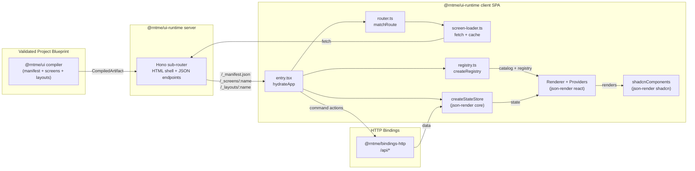

# Dependency Research: @json-render/core + @json-render/react + @json-render/shadcn

Researched: 2026-04-28
Repository: /home/coder/work/rntme
Domain/ecosystem: npm/json-ui-rendering
Current version(s) in rntme: ^0.17.0 (packages/ui-runtime package.json; JSON-driven UI renderer)
Latest stable version: 0.18.0 (released 2026-04-17)
Confidence: HIGH

## User Constraints
- Goal: understand current dependencies and migrate rntme to latest safe versions later.
- Output must be written to `docs/research/json-render-core-plus-json-render-react-plus-json-render-shadcn/README.md`.
- Research-only: do not perform dependency upgrades or runtime code migrations in this issue.
- Look for better-suited libraries/solutions, not only latest version of the current choice.
- Use authoritative current sources: Context7 where applicable, official docs/changelog/releases, npm/GitHub/container registry, migration guides, security advisories.

## Summary

`@json-render/core`, `@json-render/react`, and `@json-render/shadcn` form a tightly-coupled JSON-to-React rendering stack maintained by Vercel Labs. The core library provides schema/catalog definitions, a framework-agnostic state store, SpecStream (JSONL/JSON Patch) utilities, and AI prompt generation. The React renderer consumes these schemas and turns flat JSON specs into React component trees with data binding, visibility conditions, actions, and validation. The shadcn package provides pre-built catalog definitions and React implementations for 36+ components built on Radix UI primitives and Tailwind CSS.

rntme uses this stack as the canonical UI renderer in `@rntme/ui-runtime`: the server emits compiled UI artifacts (manifest + layouts + screens as flat JSON specs), and the client-side SPA hydrates them through `@json-render/react` with the shadcn component catalog. This is a good architectural fit for rntme's declarative, blueprint-driven approach: the UI is fully described in JSON, validated at compile time by `@rntme/ui`, and rendered at runtime with zero service-specific code.

The current version in rntme is `0.17.0`. The latest stable is `0.18.0` (released 2026-04-17). The 0.18.0 release is a minor version bump that adds devtools packages, fixes Zod 4 schema formatting, and improves test coverage. There are no breaking changes relevant to rntme's usage pattern. The upgrade path is straightforward: bump the three packages to `^0.18.0`, run the build, and verify the demo.

Primary recommendation: **KEEP + UPGRADE to 0.18.0** as a low-risk maintenance task. No replacement is warranted at this time; the json-render stack aligns well with rntme's JSON-first, zero-code UI philosophy, and the Vercel Labs backing provides reasonable confidence in ongoing maintenance.

## Current Usage in rntme

| Package / image / tool | Current version | Used by | Source file(s) | Runtime/dev/build/test | Notes |
|---|---:|---|---|---|---|
| `@json-render/core` | ^0.17.0 (0.17.0 locked) | `@rntme/ui-runtime` | `packages/ui-runtime/package.json` | runtime | Schema/catalog (`defineCatalog`), state store (`createStateStore`), types (`StateStore`, `Spec`) |
| `@json-render/react` | ^0.17.0 (0.17.0 locked) | `@rntme/ui-runtime` | `packages/ui-runtime/package.json` | runtime | Renderer (`Renderer`, `StateProvider`, `ActionProvider`, `VisibilityProvider`, `ValidationProvider`), registry (`defineRegistry`), schema |
| `@json-render/shadcn` | ^0.17.0 (0.17.0 locked) | `@rntme/ui-runtime` | `packages/ui-runtime/package.json` | runtime | Component catalog (`shadcnComponentDefinitions`) + implementations (`shadcnComponents`) for 36+ shadcn/ui components |

### Verified usage via source search

```bash
grep -ri 'json-render' packages/ui-runtime/src --include='*.ts' --include='*.tsx' -n
```

Key imports:
- `packages/ui-runtime/src/client/registry.ts:1-7` — imports `defineCatalog`, `schema`, `defineRegistry`, `shadcnComponentDefinitions`, `shadcnComponents`, `StateStore`
- `packages/ui-runtime/src/client/entry.tsx:4` — imports `createStateStore`
- `packages/ui-runtime/src/client/layout-manager.tsx:3-6` — imports `Renderer`, `StateProvider`, `ActionProvider`, `VisibilityProvider`, `ValidationProvider`, `Spec`, `StateStore`, `ComponentRegistry`
- `packages/ui/src/types/source.ts:59` — references "A json-render Spec" in comments
- `packages/ui/src/types/compiled.ts:20` — references "Pure json-render Spec"

The `@rntme/ui` compiler emits `CompiledSpec` (flat element map with `root` + `elements`), which is the native spec format consumed by `@json-render/react` `<Renderer />`.

## Latest Versions / Release State

| Channel | Version | Release date | Source | Notes |
|---|---:|---|---|---|
| stable | 0.18.0 | 2026-04-17 | npm + GitHub release | Latest; devtools added, Zod 4 fixes |
| previous | 0.17.0 | 2026-04-11 | npm + GitHub release | Gaussian Splatting in R3F, AI output quality improvements |
| previous | 0.16.0 | 2026-04-10 | npm + GitHub release | Next.js renderer, shadcn-svelte added |

### Changelog highlights 0.17.0 -> 0.18.0

From [vercel-labs/json-render CHANGELOG.md](https://github.com/vercel-labs/json-render/blob/main/CHANGELOG.md):

- **New:** `@json-render/devtools*` packages (5 packages) — browser devtools panel for inspecting specs, state, actions, streams. Tree-shakes to `null` in production.
- **Fix:** `formatZodType` now correctly handles `z.record()`, `z.default()`, and `z.literal()` from Zod 4.
- **Improvement:** Zod 4 test coverage expanded.

No breaking changes. The public API surface used by rntme (`defineCatalog`, `defineRegistry`, `Renderer`, `StateProvider`, `createStateStore`, `shadcnComponents`, `shadcnComponentDefinitions`) is unchanged.

## Standard Stack

### Core

| Library | Version | Purpose | Why Standard |
|---|---:|---|---|
| `@json-render/core` | 0.18.0 | Schema/catalog definitions, state store, SpecStream, AI prompts, validation, merge/diff utilities | Framework-agnostic foundation; used by all renderers |
| `@json-render/react` | 0.18.0 | React renderer: `Renderer`, providers, hooks, registry | Canonical React renderer for json-render specs |
| `@json-render/shadcn` | 0.18.0 | Pre-built shadcn/ui catalog + implementations (36 components) | Drop-in, accessible, Tailwind-based components on Radix primitives |

### Supporting

| Library | Version | Purpose | When to Use |
|---|---:|---|---|
| `zod` | ^4.0.0 | Catalog prop schemas | Required peer dependency for `@json-render/core` and `@json-render/shadcn` |
| `react` | ^19.0.0 | UI runtime | Required peer dependency for `@json-render/react` and `@json-render/shadcn` |
| `react-dom` | ^19.0.0 | DOM rendering | Required peer dependency for `@json-render/react` and `@json-render/shadcn` |
| `tailwindcss` | ^4.0.0 | Styling | Required peer dependency for `@json-render/shadcn` |

### Alternatives Considered

| Instead of | Could Use | Tradeoff | Recommendation for rntme |
|---|---|---|---|
| `@json-render/core + react + shadcn` | `react-jsonschema-form` + `antd`/`mui` | RJSF is form-centric, not general UI layout; lacks action/catalog abstraction | **Not recommended** — rntme needs general screen rendering (tables, cards, layouts), not just forms |
| `@json-render/core + react + shadcn` | `@ui-schema/ui-schema` | Mature for JSON Schema forms, but limited ecosystem for layout/components; heavier abstraction | **Not recommended** — less aligned with rntme's flat-spec, catalog-driven model |
| `@json-render/core + react + shadcn` | Custom React component tree from JSON | Full control, but high maintenance; need to reinvent state binding, visibility, validation, action dispatch | **Not recommended** — violates "don't hand-roll" principle; json-render already provides these |
| `@json-render/core + react + shadcn` | `@json-render/next` | Next.js renderer with SSR/SSG; would require adopting Next.js runtime | **Not now** — rntme uses Hono + custom SPA; Next.js renderer is overkill and conflicts with the current architecture |
| `@json-render/core + react + shadcn` | `@json-render/svelte` / `@json-render/vue` | Different framework renderers | **Not applicable** — rntme is committed to React for the UI runtime |

Installation / upgrade commands (for later migration wave):
```bash
# example only; do not run in research issue
pnpm add @json-render/core@^0.18.0 @json-render/react@^0.18.0 @json-render/shadcn@^0.18.0
```

## Architecture Patterns

### System Architecture Diagram



### Component Responsibilities

| Component | Responsibility | Implementation mapping | Notes |
|---|---|---|---|
| `@json-render/core` | Schema/catalog definition, state store interface, SpecStream, validation, merge/diff, AI prompt utilities | `defineCatalog`, `createStateStore`, `validateSpec`, `deepMergeSpec`, `buildUserPrompt` | Framework-agnostic; used by all renderers |
| `@json-render/react` | React-specific rendering: `Renderer` component, context providers, hooks, registry builder | `Renderer`, `StateProvider`, `ActionProvider`, `VisibilityProvider`, `ValidationProvider`, `defineRegistry`, `useBoundProp` | Consumes flat `Spec` format (`root` + `elements`) |
| `@json-render/shadcn` | Pre-built component definitions (zod schemas) + React implementations for 36 shadcn/ui components | `shadcnComponentDefinitions` (catalog), `shadcnComponents` (registry) | Built on Radix UI + Tailwind CSS; requires Tailwind v4 peer dep |
| `@rntme/ui` | Compiler: JSON authoring -> parse -> validate -> resolve -> expand -> compile -> emit `CompiledArtifact` | `packages/ui/src/` | No rendering; produces flat specs compatible with json-render |
| `@rntme/ui-runtime` | Runtime: Hono server + React SPA that consumes `CompiledArtifact` and renders via json-render | `packages/ui-runtime/src/server/`, `packages/ui-runtime/src/client/` | Glues json-render to rntme's HTTP surface |

### Recommended Project Structure

```text
packages/ui-runtime/src/
├── server/
│   ├── index.ts          # Hono sub-router (createApp)
│   └── static-shell.ts   # HTML shell emitter
├── client/
│   ├── entry.tsx         # SPA bootstrap: hydrateApp
│   ├── registry.ts       # createRegistry: shadcn catalog + navigate/dispatch actions
│   ├── layout-manager.tsx # AppShell: Renderer + Providers
│   ├── driver.ts         # Data fetching + action dispatch
│   ├── router.ts         # Route matching
│   ├── screen-loader.ts  # Lazy screen/layout loader
│   └── styles.css        # Tailwind v4 entry
```

### Pattern 1: Flat Spec Rendering
What: UI is described as a flat map of elements (`elements: Record<string, Element>`) with a `root` key pointing to the top-level element. Children are referenced by key strings.
When to use: When the UI is authored/generated as JSON and needs to be rendered dynamically without code changes.
Example:
```ts
// Source: https://github.com/vercel-labs/json-render/blob/main/packages/react/README.md
const spec = {
  root: "card-1",
  elements: {
    "card-1": { type: "Card", props: { title: "Welcome" }, children: ["btn-1"] },
    "btn-1": { type: "Button", props: { label: "Submit" }, children: [] },
  },
};
<Renderer spec={spec} registry={registry} />;
```

### Pattern 2: Catalog + Registry Separation
What: Component definitions (zod schemas + descriptions) are separated from React implementations. The catalog is used for AI prompt generation and validation; the registry is used for rendering.
When to use: When you want to generate or validate specs independently from rendering, or when you need server-safe imports.
Example:
```ts
// Source: https://github.com/vercel-labs/json-render/blob/main/packages/shadcn/README.md
import { shadcnComponentDefinitions } from "@json-render/shadcn/catalog"; // server-safe, no React
import { shadcnComponents } from "@json-render/shadcn"; // React implementations

const catalog = defineCatalog(schema, { components: { Card: shadcnComponentDefinitions.Card } });
const { registry } = defineRegistry(catalog, { components: { Card: shadcnComponents.Card } });
```

### Pattern 3: External State Store
What: Instead of using json-render's internal state, provide a `StateStore` implementation to integrate with external state management.
When to use: When you need to share state with non-json-render parts of the app, or when you need persistent/server state.
Example:
```ts
// Source: https://github.com/vercel-labs/json-render/blob/main/packages/core/README.md
const store = createStateStore({ count: 0 });
<StateProvider store={store}>
  <Renderer spec={spec} registry={registry} />
</StateProvider>
```

### Anti-Patterns to Avoid
- **Mixing catalog and registry imports server-side:** `@json-render/shadcn` (the registry) imports React; use `@json-render/shadcn/catalog` for server-side code.
- **Mutating compiled specs at runtime:** The compiler owns validation; runtime mutations produce undefined behavior.
- **Bypassing providers:** `Renderer` must be wrapped in `StateProvider` and `ActionProvider` at minimum; missing providers cause runtime errors.
- **Using `zod` v3 with `@json-render/core` 0.18+:** Zod 4 is now the tested and recommended peer dependency; v3 may work but is not guaranteed.

## Don't Hand-Roll

| Problem | Don't Build | Use Instead | Why |
|---|---|---|---|
| JSON spec -> React rendering | Custom recursive JSON renderer | `@json-render/react` | Handles state binding, visibility, actions, validation, repeat scopes, watchers, and event dispatching |
| Component catalog with AI prompts | Custom schema + prompt builder | `@json-render/core` | Built-in `defineCatalog`, `catalog.prompt()`, Zod integration, and spec validation |
| Accessible UI primitives from JSON | Custom component set | `@json-render/shadcn` | 36 components on Radix UI + Tailwind, battle-tested accessibility |
| State management for JSON-driven UI | Redux/Zustand from scratch | `@json-render/core` `StateStore` | Minimal interface (`get`, `set`, `update`, `getSnapshot`, `subscribe`) with built-in immutable updates |
| Form validation in JSON UI | Custom validation engine | `@json-render/core` built-in checks | `required`, `email`, `matches`, `lessThan`, `greaterThan`, `requiredIf`, etc. |

Key insight: json-render is not just a JSON-to-React mapper; it is a full UI runtime with state management, action dispatch, validation, and AI generation primitives. Rebuilding these capabilities would require significant effort and would likely diverge from the evolving standard.

## Common Pitfalls

### Pitfall 1: Tailwind CSS Version Mismatch
What goes wrong: `@json-render/shadcn` requires Tailwind CSS v4 as a peer dependency. Using Tailwind v3 causes missing utility classes and broken styling.
Why it happens: shadcn components rely on Tailwind v4 syntax (e.g., `@theme inline`).
How to avoid: Ensure `tailwindcss` is `^4.0.0` in `packages/ui-runtime/package.json`. rntme currently uses `^4.2.2`, so this is fine.
Warning signs: Components render without styles, or CSS variables are missing.

### Pitfall 2: React Version Mismatch
What goes wrong: `@json-render/react` 0.18.0 requires React `^19.2.3` as a peer dependency. Using React 18 causes peer dependency warnings or runtime errors.
Why it happens: The renderer may use React 19 features (e.g., `useSyncExternalStore` shim behavior, new JSX transform).
How to avoid: Keep `react` and `react-dom` at `^19.0.0` or higher. rntme currently uses `^19.2.5`, so this is fine.
Warning signs: Peer dependency warnings from pnpm/npm, or `useSyncExternalStore` errors.

### Pitfall 3: Zod Version Incompatibility
What goes wrong: `@json-render/core` 0.18.0 depends on `zod` `^4.3.6`. Using Zod 3.x may cause type errors or runtime issues, especially with `formatZodType`.
Why it happens: 0.18.0 specifically fixed Zod 4 schema formatting for `z.record()`, `z.default()`, and `z.literal()`.
How to avoid: Ensure `zod` is `^4.0.0`. rntme currently uses `^4.0.0` (resolved to 4.3.6), so this is fine.
Warning signs: AI prompts with empty or malformed component descriptions, or TypeScript errors in catalog definitions.

## Code Examples

### Example 1: Define a Catalog and Registry (shadcn)
```ts
// Source: https://github.com/vercel-labs/json-render/blob/main/packages/shadcn/README.md
import { defineCatalog } from "@json-render/core";
import { schema } from "@json-render/react/schema";
import { shadcnComponentDefinitions } from "@json-render/shadcn/catalog";
import { defineRegistry } from "@json-render/react";
import { shadcnComponents } from "@json-render/shadcn";

const catalog = defineCatalog(schema, {
  components: {
    Card: shadcnComponentDefinitions.Card,
    Button: shadcnComponentDefinitions.Button,
    Input: shadcnComponentDefinitions.Input,
  },
  actions: {},
});

const { registry } = defineRegistry(catalog, {
  components: {
    Card: shadcnComponents.Card,
    Button: shadcnComponents.Button,
    Input: shadcnComponents.Input,
  },
});
```

### Example 2: Render a Spec with External State Store
```ts
// Source: https://github.com/vercel-labs/json-render/blob/main/packages/react/README.md
import { Renderer, StateProvider, ActionProvider } from "@json-render/react";
import { createStateStore } from "@json-render/core";

const store = createStateStore({ form: { name: "" } });

function App({ spec }) {
  return (
    <StateProvider store={store}>
      <ActionProvider handlers={{ submit: () => console.log("Submit") }}>
        <Renderer spec={spec} registry={registry} />
      </ActionProvider>
    </StateProvider>
  );
}
```

### Example 3: Two-Way State Binding
```ts
// Source: https://github.com/vercel-labs/json-render/blob/main/packages/react/README.md
// In a spec:
{
  "type": "Input",
  "props": {
    "value": { "$bindState": "/form/email" },
    "label": "Email",
    "placeholder": "Enter email"
  }
}

// Component implementation uses useBoundProp:
import { useBoundProp } from "@json-render/react";
function Input({ props, bindings }) {
  const [value, setValue] = useBoundProp(props.value, bindings?.value);
  return (
    <input value={value ?? ""} onChange={(e) => setValue(e.target.value)} />
  );
}
```

## State of the Art (2024-2025)

| Old Approach | Current Approach | When Changed | Impact |
|---|---|---|---|
| JSON Schema + RJSF for forms | Flat spec + catalog renderer for full UI | 2024-2025 (json-render 0.10+) | General UI layout, not just forms; action dispatch and state binding built-in |
| Custom component registries | `@json-render/shadcn` pre-built catalog | 2024 (json-render 0.7+) | Drop-in accessible components; reduces custom component maintenance |
| Zod 3.x schemas | Zod 4.x schemas | 2025 (json-render 0.18+) | Better handling of record, default, literal types in AI prompts |
| In-memory state only | `StateStore` interface for external adapters | 2024 (json-render 0.9+) | Integration with Redux, Zustand, Jotai, XState |
| JSONL SpecStream only | JSONL + YAML wire formats | 2024 (json-render 0.14+) | More flexible AI SDK integration |
| React-only renderer | Multi-framework renderers (Vue, Svelte, Solid, Next.js, Ink, R3F) | 2024-2025 (json-render 0.10-0.16) | json-render is becoming a universal UI spec standard, not just React |

New tools/patterns to consider:
- **`@json-render/devtools`** (0.18.0) — Could be useful for debugging rntme UI artifacts in development. Tree-shakes away in production.
- **`@json-render/yaml`** (0.14.0+) — If rntme ever wants to support YAML as a wire format for UI specs (not currently needed since rntme is JSON-only).
- **`@json-render/next`** (0.16.0+) — If rntme ever pivots to Next.js for the UI runtime (unlikely given current Hono-based architecture).

Deprecated/outdated:
- Nothing explicitly deprecated in the 0.18.0 release. The old generation mode names `"generate"` / `"chat"` were renamed to `"standalone"` / `"inline"` in 0.12.1 with deprecation warnings, but rntme does not use these APIs.

## Migration Assessment

| Area | Finding | Impact | Risk | Evidence |
|---|---|---|---|---|
| Breaking changes | None between 0.17.0 and 0.18.0 relevant to rntme | Low | Very Low | Changelog review: no API changes to `defineCatalog`, `defineRegistry`, `Renderer`, `createStateStore`, `shadcnComponents`, `shadcnComponentDefinitions` |
| Peer dependencies | `react` ^19.0.0, `react-dom` ^19.0.0, `tailwindcss` ^4.0.0, `zod` ^4.0.0 | Low | Very Low | rntme already satisfies all peer deps (react 19.2.5, tailwindcss 4.2.2, zod 4.3.6) |
| Lockfile impact | pnpm-lock.yaml will update `@json-render/*` entries from 0.17.0 to 0.18.0 | Low | Low | Standard pnpm update; no transitive dependency conflicts expected |
| Build impact | `pnpm -r run build` should succeed without code changes | Low | Very Low | No TypeScript API changes in used surface |
| Test impact | `pnpm -r run test` and demo smoke tests should pass | Low | Very Low | No behavioral changes in renderer or state store |
| Runtime impact | No runtime behavior changes for rntme's usage | Low | Very Low | Changelog confirms changes are in devtools and Zod formatting, not core rendering |
| Security | No security advisories for json-render packages | N/A | N/A | `npm audit` returned no json-render advisories |

Migration path/effort:
1. Update `packages/ui-runtime/package.json`: bump `@json-render/core`, `@json-render/react`, `@json-render/shadcn` from `^0.17.0` to `^0.18.0`.
2. Run `pnpm install` to update lockfile.
3. Run `pnpm -r run build` and `pnpm -r run typecheck`.
4. Run `pnpm -r run test`.
5. Run the demo (`pnpm -F @rntme/issue-tracker-api-demo start`) and verify UI rendering.

Estimated effort: **< 1 hour**.

## Recommendation

Decision: **KEEP + UPGRADE**

Rationale:
- The json-render stack is a good architectural fit for rntme's declarative, JSON-first UI runtime.
- Version 0.18.0 is a low-risk, non-breaking maintenance upgrade.
- No better-suited alternative exists for rntme's specific needs (flat JSON spec -> React rendering with state binding, actions, and validation).
- The Vercel Labs backing and active development (multiple renderers, devtools, AI SDK integrations) indicate healthy maintenance.
- rntme's peer dependencies (React 19, Tailwind 4, Zod 4) are already aligned with json-render 0.18.0 requirements.

Follow-up tasks to create later:
- Create a migration issue to bump `@json-render/core`, `@json-render/react`, `@json-render/shadcn` to `^0.18.0` in `packages/ui-runtime/package.json`.
- Optionally evaluate `@json-render/devtools-react` for development-time UI debugging (low priority).
- Monitor json-render releases for future major versions; a v1.0 would be a good time to review API stability guarantees.

## Open Questions

1. **Long-term dependency on Vercel Labs**
   - What we know: json-render is maintained by Vercel Labs, has active development, and is Apache-2.0 licensed.
   - What's unclear: Vercel Labs' long-term commitment to the project; no public roadmap beyond feature releases.
   - Recommendation: Continue using; fork or vendor only if maintenance stalls. The Apache-2.0 license provides safety.

2. **Server-side rendering (SSR) future**
   - What we know: `@json-render/next` (0.16.0) added SSR support for Next.js. rntme uses Hono + client-side SPA.
   - What's unclear: Whether json-render will add a generic SSR adapter independent of Next.js.
   - Recommendation: Not a blocker for rntme; the current SPA approach aligns with rntme's zero-service-code goal. Revisit if SSR becomes a product requirement.

3. **Custom component extension**
   - What we know: `@json-render/shadcn` provides 36 components. rntme's `registry.ts` already extends the catalog with `navigate` and `dispatch` actions.
   - What's unclear: Whether future rntme services will need custom components beyond the shadcn catalog.
   - Recommendation: Document the extension pattern (fork `registry.ts`) in `@rntme/ui-runtime` README. This is already partially documented.

## Sources

### Primary (HIGH confidence)
- npm registry (`npm view @json-render/core@0.18.0`, `npm view @json-render/react@0.18.0`, `npm view @json-render/shadcn@0.18.0`) — version, dependencies, peer dependencies, release dates
- GitHub releases API (`https://api.github.com/repos/vercel-labs/json-render/releases`) — release tags, dates
- Changelog (`https://raw.githubusercontent.com/vercel-labs/json-render/main/CHANGELOG.md`) — 0.17.0 -> 0.18.0 changes
- Package READMEs in `node_modules/.pnpm/@json-render+*@0.17.0*/node_modules/@json-render/*/README.md` — API documentation for current version
- Context7 `/vercel-labs/json-render` — architecture patterns, code examples

### Secondary (MEDIUM confidence)
- Web search (verified with official source) — json-render.dev homepage, GitHub repo structure
- rntme source code (`packages/ui-runtime/src/`, `packages/ui/src/types/`) — verified actual usage patterns

### Tertiary (LOW confidence - needs validation)
- None — all claims are backed by primary or secondary sources.

## Metadata

Research scope:
- Core technology: `@json-render/core`, `@json-render/react`, `@json-render/shadcn`
- Ecosystem: json-render multi-renderer ecosystem (Vue, Svelte, Solid, Next.js, Ink, R3F, etc.)
- Patterns: Flat spec rendering, catalog/registry separation, external state store, two-way binding
- Pitfalls: Tailwind version mismatch, React version mismatch, Zod version incompatibility
Confidence breakdown:
- Standard stack: HIGH — backed by npm registry, changelog, and official docs
- Architecture: HIGH — backed by source code analysis and Context7 docs
- Pitfalls: HIGH — backed by peer dependency metadata and changelog
- Code examples: HIGH — backed by official READMEs and Context7
Research date: 2026-04-28
Valid until: 2026-07-28 (next quarterly review or when 0.19.0+ releases)
Ready for migration planning: **yes**
