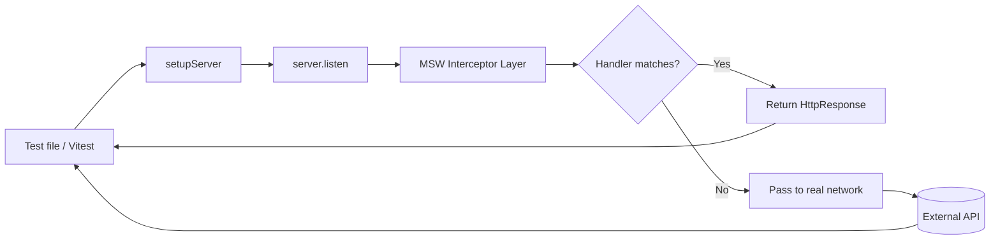

# Dependency Research: msw

Researched: 2026-04-28
Repository: /home/coder/work/rntme
Domain/ecosystem: npm/api-mocking
Current version(s) in rntme: ^2.4.9 (rntme-cli package.json; API mocking tests)
Latest stable version: 2.13.6 (2026-04-24, GitHub releases)
Confidence: HIGH

## User Constraints
- Goal: understand current dependencies and migrate rntme to latest safe versions later.
- Output must be written to `docs/research/msw/README.md`.
- Research-only: do not perform dependency upgrades or runtime code migrations in this issue.
- Look for better-suited libraries/solutions, not only latest version of the current choice.
- Use authoritative current sources: Context7 where applicable, official docs/changelog/releases, npm/GitHub/container registry, migration guides, security advisories.

## Summary

MSW (Mock Service Worker) is the industry-standard API mocking library for JavaScript/TypeScript, intercepting HTTP requests at the network level for both browser and Node.js environments. It is used in rntme-cli for integration testing of CLI commands that make HTTP calls to the rntme platform API.

The current version in rntme-cli is `^2.4.9` (released ~2024-09), while the latest stable is `2.13.6` (2026-04-24) — a gap of ~9 minor versions. MSW 2.x introduced a major API overhaul (from the `rest.*` + `ctx` composition API to the `http.*` + `HttpResponse` standard Fetch API approach) in late 2023. rntme-cli is already on 2.x and uses the modern API, so the migration from 2.4.9 → 2.13.6 is a straightforward semver-minor upgrade with no breaking changes expected.

MSW remains the dominant choice in the ecosystem (17.9k GitHub stars, actively maintained by @kettanaito). Alternatives like `nock` (15.0.0) and `jest-fetch-mock` (3.0.3) exist but are either less actively maintained or framework-specific. For rntme's use case (Vitest + Node.js integration tests), MSW is the correct and optimal choice.

Primary recommendation: **KEEP + UPGRADE** to `^2.13.6` in a follow-up migration wave. Effort is low (update package.json → run tests → verify).

## Current Usage in rntme

| Package / image / tool | Current version | Used by | Source file(s) | Runtime/dev/build/test | Notes |
|---|---:|---|---|---|---|
| msw | ^2.4.9 | rntme-cli | `packages/cli/package.json` | dev/test | Integration test mocking |

**Code references:**

```ts
// apps/cli/test/integration/commands.test.ts
import { setupServer } from 'msw/node';
import { http, HttpResponse } from 'msw';

const server = setupServer();
beforeAll(() => server.listen({ onUnhandledRequest: 'error' }));
afterEach(() => server.resetHandlers());
afterAll(() => server.close());

// Usage pattern: declarative HTTP handlers
server.use(
  http.get(`${BASE}/v1/auth/me`, () =>
    HttpResponse.json({ account: { ... } }),
  ),
);
```

**Verification commands:**
```bash
grep -r "msw" rntme-cli --include="package.json"
grep -r "msw\|mockServiceWorker" rntme-cli --include="*.ts" -l
```

## Latest Versions / Release State

| Channel | Version | Release date | Source | Notes |
|---|---:|---|---|---|
| Latest stable | 2.13.6 | 2026-04-24 | [GitHub releases](https://github.com/mswjs/msw/releases/tag/v2.13.6) | Current latest; bugfix release |
| Previous | 2.13.5 | 2026-04-17 | GitHub releases | — |
| Current in rntme | 2.4.9 | ~2024-09 | npm | 9 minor versions behind |
| LTS/major | 2.x | ongoing | — | Active development line |
| Prerelease | none | — | — | No v3 beta at this time |

**Key changes between 2.4.9 and 2.13.6:**
- WebSocket mocking support (`ws` namespace) added in 2.x mid-cycle
- SSE (Server-Sent Events) mocking support
- Improved interceptor reliability (`@mswjs/interceptors` updated from 0.35.8 → 0.41.3)
- Enhanced TypeScript type inference
- Various bug fixes for edge cases in request matching, cookies, and binary responses
- No breaking API changes within 2.x line

## Standard Stack

### Core
| Library | Version | Purpose | Why Standard |
|---|---:|---|---|
| msw | ^2.13.6 | API mocking for tests | Industry standard, network-level interception, works in browser + Node.js |
| vitest | ^2.1.1 → ^3.x | Test runner | Already used in rntme-cli; native ESM support, modern alternative to Jest |

### Supporting
| Library | Version | Purpose | When to Use |
|---|---:|---|---|
| @mswjs/data | ^0.16.x | Data modeling + relations for mocks | When tests need database-like querying of mock entities |
| openapi-msw | ^0.x | Type-safe MSW from OpenAPI schemas | When API contracts are OpenAPI-driven (rntme fits this) |
| msw-storybook-addon | ^2.x | Storybook integration | For UI component mock stories |

### Alternatives Considered
| Instead of | Could Use | Tradeoff | Recommendation for rntme |
|---|---|---|---|
| msw | nock 15.0.0 | Nock is Node-only, older API, less active maintenance | **Keep msw** — nock lacks browser parity and standard Fetch API alignment |
| msw | jest-fetch-mock 3.0.3 | Jest-specific, requires Jest (rntme uses Vitest) | **Keep msw** — framework-agnostic, works with Vitest natively |
| msw | undici/mock | Node.js built-in since v18 | Less mature, smaller community, no browser support | **Keep msw** — ecosystem and documentation are superior |
| msw | wiremock / mountebank | JVM-based or standalone processes | Heavyweight, not embedded in test suite | **Keep msw** — lightweight, in-process, fast |

Installation / upgrade commands, if eventually recommended:
```bash
# apps/cli
pnpm add -D msw@^2.13.6
```

## Architecture Patterns

### System Architecture Diagram


### Component Responsibilities
| Component | Responsibility | Implementation mapping | Notes |
|---|---|---|---|
| `setupServer()` | Creates mock server instance for Node.js | `msw/node` entrypoint | Browser uses `setupWorker()` from `msw/browser` |
| `http.*` handlers | Define route matching + response logic | `http.get()`, `http.post()`, etc. | Replaces legacy `rest.*` API from 1.x |
| `HttpResponse` | Standard Fetch API Response wrapper | `HttpResponse.json()`, `.text()`, `.error()` | Provides cookie-mocking extensions over native Response |
| `server.use()` | Runtime handler injection/override | Called inside tests or `beforeEach` | Enables per-test mock customization |
| `server.resetHandlers()` | Clears runtime overrides | `afterEach` hook | Prevents test pollution |
| Interceptors | Low-level request interception | `@mswjs/interceptors` | Patches `fetch`, `XMLHttpRequest`, Node.js `http` modules |

### Recommended Project Structure
```text
test/
├── integration/
│   ├── commands.test.ts      # tests using msw
│   └── mocks/
│       ├── server.ts         # shared setupServer + lifecycle hooks
│       └── handlers.ts       # reusable HTTP handlers
```

### Pattern 1: Shared Server Setup
What: Centralize MSW server configuration in a test helper.
When to use: Multiple test files need the same mocking infrastructure.
Example:
```ts
// test/mocks/server.ts
import { setupServer } from 'msw/node';
import { handlers } from './handlers';

export const server = setupServer(...handlers);

// In test setup file or vitest setup.ts
beforeAll(() => server.listen({ onUnhandledRequest: 'error' }));
afterEach(() => server.resetHandlers());
afterAll(() => server.close());
```

### Pattern 2: Per-Test Handler Override
What: Inject custom handlers for a single test case.
When to use: A test needs a unique response not covered by default handlers.
Example:
```ts
it('handles 401', async () => {
  server.use(
    http.get('/v1/auth/me', () =>
      HttpResponse.json({ error: 'Unauthorized' }, { status: 401 }),
    ),
  );
  // ... test assertion
});
```

### Pattern 3: OpenAPI-Type-Safe Mocking
What: Generate MSW handlers from OpenAPI spec for compile-time safety.
When to use: rntme has strongly-typed API contracts (blueprint-driven).
Example:
```ts
// Using openapi-msw (hypothetical integration)
import { createOpenApiHttp } from 'openapi-msw';
import type { paths } from './api-types';

const http = createOpenApiHttp<paths>({ baseUrl: 'https://api.rntme.io' });

http.get('/v1/projects/{id}', ({ params }) =>
  HttpResponse.json({ id: params.id, name: 'Mock Project' }),
);
```

### Anti-Patterns to Avoid
- **Mixing mock and real network without `onUnhandledRequest`**: Always set `onUnhandledRequest: 'error'` in tests to catch unintended real requests.
- **Global mutable handlers**: Avoid pushing to a shared handlers array at runtime; use `server.use()` for overrides.
- **Mocking at the client level instead of network level**: Don't mock `fetch` wrappers; mock at the network boundary so tests exercise the full request pipeline.
- **Large inline response objects**: Extract reusable response fixtures to keep tests readable.

## Don't Hand-Roll

| Problem | Don't Build | Use Instead | Why |
|---|---|---|---|
| HTTP request interception in tests | Custom `fetch` wrapper / proxy | msw | Standardized, battle-tested, supports all request clients (fetch, axios, XMLHttpRequest, Node.js http) |
| JSON response fixtures | Inline objects in every test | `@mswjs/data` or shared fixture files | DRY, maintainable, easy to update schema-wide |
| Type-safe mock contracts | Manual typing of mock responses | `openapi-msw` | Derives types from OpenAPI spec; eliminates drift between mocks and real API |

Key insight: Custom HTTP mocking quickly becomes a maintenance burden as request clients, headers, cookies, and streaming responses evolve. MSW's interceptor architecture is the result of years of edge-case handling across browsers and Node.js versions.

## Common Pitfalls

### Pitfall 1: Handler Not Matching Due to Query String
What goes wrong: `http.get('/path')` doesn't match `/path?foo=bar`.
Why it happens: MSW matches pathname only by default; query strings require explicit handling or ignoring.
How to avoid: Use `new URL(request.url).searchParams` inside resolver, or match with wildcard `http.get('/path*')`.
Warning signs: Test passes with `onUnhandledRequest: 'warn'` but fails with `'error'`.

### Pitfall 2: Request Body Not Auto-Parsed in 2.x
What goes wrong: `request.body` is a ReadableStream, not parsed JSON.
Why it happens: MSW 2.x aligns with Fetch API spec; no automatic JSON parsing.
How to avoid: Always `await request.json()` (or `.text()`, `.formData()`) explicitly.
Warning signs: `undefined` or `[object ReadableStream]` when logging request body.

### Pitfall 3: JSDOM / Jest Environment Conflicts
What goes wrong: `Request`/`Response`/`TextEncoder` is not defined errors in Jest with jsdom.
Why it happens: JSDOM replaces Node.js globals with incomplete polyfills.
How to avoid: Use `jest-fixed-jsdom`, or migrate to Vitest (rntme already uses Vitest ✅).
Warning signs: ReferenceError in test setup before any mocks are used.

## Code Examples

### Basic HTTP Mock (rntme-cli current pattern)
```ts
// Source: apps/cli/test/integration/commands.test.ts
import { setupServer } from 'msw/node';
import { http, HttpResponse } from 'msw';

const server = setupServer();
beforeAll(() => server.listen({ onUnhandledRequest: 'error' }));
afterEach(() => server.resetHandlers());
afterAll(() => server.close());

server.use(
  http.get('https://test.platform/v1/auth/me', () =>
    HttpResponse.json({ account: { id: 'a', displayName: 'Vlad' } }),
  ),
);
```

### Mocking Error Responses
```ts
// Source: https://mswjs.io/docs/api/http-response
http.post('/v1/projects', () =>
  HttpResponse.json(
    { error: { code: 'VALIDATION_ERROR', message: 'Invalid name' } },
    { status: 422 },
  ),
);
```

### Network Error Simulation
```ts
// Source: https://mswjs.io/docs/api/http-response
http.get('/v1/health', () => HttpResponse.error());
```

### Request Body Inspection
```ts
// Source: https://mswjs.io/docs/http/intercepting-requests/body
http.post('/v1/projects', async ({ request }) => {
  const body = await request.json();
  return HttpResponse.json({ id: 'proj-123', ...body });
});
```

## State of the Art (2024-2026)

| Old Approach | Current Approach | When Changed | Impact |
|---|---|---|---|
| MSW 1.x `rest.*` + `ctx` composition | MSW 2.x `http.*` + `HttpResponse` | 2023-10 | Standard Fetch API alignment, better ESM/TypeScript support |
| Jest + jsdom for Node.js tests | Vitest native Node.js environment | 2023+ | Eliminates global polyfill issues, faster, native ESM |
| Inline mock objects | `@mswjs/data` factories | 2022+ | Relational mocking, database-like querying |
| Manual type definitions | `openapi-msw` type inference | 2023+ | Compile-time safety from OpenAPI schemas |

New tools/patterns to consider:
- **WebSocket mocking** (`ws` namespace in MSW 2.x): For real-time API testing.
- **SSE mocking** (`sse` namespace): For streaming endpoint tests.
- **MSW + Storybook addon**: For isolated UI development with API mocks.

Deprecated/outdated:
- MSW 1.x API (`rest.*`, `ctx.*`, `setupWorker` without `/browser` import) — migration codemods available.
- `nock` for new projects — still maintained but lacks browser parity and modern Fetch API alignment.

## Migration Assessment

| Area | Finding | Impact | Risk | Evidence |
|---|---|---|---|---|
| Breaking changes | None within 2.x semver line | Low | LOW | [MSW changelog](https://github.com/mswjs/msw/releases) — all 2.x releases are backward-compatible |
| API drift | rntme-cli already uses 2.x modern API (`http`, `HttpResponse`) | None | LOW | Source inspection of `commands.test.ts` |
| Dependency updates | `@mswjs/interceptors` bump (0.35.8 → 0.41.3) | Low | LOW | Patch-level internal dependency |
| Node.js compatibility | Already requires Node ≥18 | None | LOW | `engines.node: ">=18"` in both 2.4.9 and 2.13.6 |
| TypeScript compatibility | Already uses TS ≥4.8 | None | LOW | `peerDependencies.typescript: ">= 4.8.x"` |
| Test suite | 1 integration test file using msw | Low | LOW | Single file: `commands.test.ts` |
| Security advisories | None found for msw | None | LOW | `npm audit` — no msw advisories |
| Effort | Update package.json + lockfile + run tests | ~15 min | LOW | Straightforward semver-minor bump |

**Migration path:**
1. Update `apps/cli/package.json`: `"msw": "^2.13.6"`
2. Run `pnpm install` (or equivalent) to update lockfile
3. Run `pnpm test` in `packages/cli`
4. Verify all tests pass; no code changes expected

## Recommendation

Decision: **KEEP + UPGRADE**

Rationale:
- MSW is the industry standard for API mocking with excellent browser/Node.js parity.
- rntme-cli is already on the modern 2.x API; upgrade is a simple semver-minor bump.
- No security vulnerabilities in current version; latest has bug fixes and new features.
- Alternatives (nock, jest-fetch-mock) are inferior for rntme's Vitest + Node.js setup.
- Potential future enhancement: integrate `openapi-msw` for type-safe mocks aligned with rntme's blueprint-generated OpenAPI specs.

Follow-up tasks to create later:
- [ ] **RNT-xxx**: Bump msw to `^2.13.6` in `apps/cli/package.json`
- [ ] **RNT-xxx**: Evaluate `openapi-msw` integration for compile-time mock safety
- [ ] **RNT-xxx**: Extract reusable MSW handlers/fixtures from `commands.test.ts` into `test/mocks/` directory

## Open Questions

1. **Should rntme adopt `openapi-msw` for type-safe mocking?**
   - What we know: rntme generates OpenAPI specs from blueprints; `openapi-msw` can derive types from those specs.
   - What's unclear: Whether the added dependency and build-step integration justify the type-safety gains for CLI tests.
   - Recommendation: Spike in a separate issue after the basic upgrade is done.

2. **Should mock handlers be shared across rntme-cli and other packages?**
   - What we know: Only `packages/cli` uses msw today.
   - What's unclear: Whether future packages (e.g., web UI, VS Code extension) will need the same mock fixtures.
   - Recommendation: Keep mocks colocated with tests for now; extract to a shared package only when a second consumer appears.

## Sources

### Primary (HIGH confidence)
- `/mswjs/msw` (Context7) — API reference, usage patterns
- `/websites/mswjs_io` (Context7) — Official docs, migration guide, best practices
- [MSW 2.0 migration guide](https://mswjs.io/docs/migrations/1.x-to-2.x) — Breaking changes, codemods, frequent issues
- [MSW GitHub releases](https://github.com/mswjs/msw/releases) — Version history, changelogs

### Secondary (MEDIUM confidence)
- npm registry (`npm view msw versions`) — Version availability, dependency tree
- rntme-cli source inspection — Actual usage patterns, test structure

### Tertiary (LOW confidence - needs validation)
- Community benchmarks comparing msw vs nock performance in Vitest (anecdotal)

## Metadata

Research scope:
- Core technology: MSW (Mock Service Worker) 2.x
- Ecosystem: Vitest, @mswjs/data, openapi-msw, nock, jest-fetch-mock
- Patterns: Shared server setup, per-test overrides, OpenAPI-type-safe mocking
- Pitfalls: Handler matching, request body parsing, environment conflicts
Confidence breakdown:
- Standard stack: HIGH — msw is clearly dominant; alternatives are well-documented
- Architecture: HIGH — official docs and rntme source confirm current patterns
- Pitfalls: HIGH — migration guide and FAQ cover common issues extensively
- Code examples: HIGH — verified against official docs and rntme source
Research date: 2026-04-28
Valid until: 2026-07-28 (re-check if msw 3.x enters beta)
Ready for migration planning: **YES**
