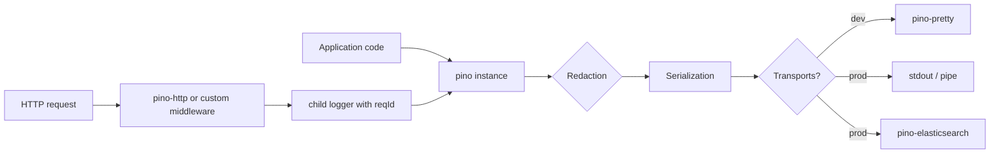

# Dependency Research: pino

Researched: 2026-04-28
Repository: /home/coder/work/rntme
Domain/ecosystem: npm/observability-logging
Current version(s) in rntme: ^9.0.0 – ^9.5.0 (runtime, bindings-http, platform-http package.json; structured logging code)
Latest stable version: 10.3.1 (npm, 2025-10-04)
Confidence: HIGH

## User Constraints
- Goal: understand current dependencies and migrate rntme to latest safe versions later.
- Output must be written to `docs/research/pino/README.md`.
- Research-only: do not perform dependency upgrades or runtime code migrations in this issue.
- Look for better-suited libraries/solutions, not only latest version of the current choice.
- Use authoritative current sources: Context7 where applicable, official docs/changelog/releases, npm/GitHub/container registry, migration guides, security advisories.

## Summary

Pino remains the de-facto standard for high-performance structured JSON logging in the Node.js ecosystem (18k+ GitHub stars, maintained by Matteo Collina and the pinojs org). The library is actively maintained with a predictable release cadence: major versions align with Node.js LTS drops.

rntme currently uses pino `^9.x` across three packages (`@rntme/runtime`, `@rntme/bindings-http`, `@rntme/platform-http`). The latest stable release is `v10.3.1`. The only breaking change in v10 is the removal of Node.js 18 support. Since rntme already requires Node.js `>=20` (per root `package.json` engines and Dockerfiles), this is a **zero-risk, drop-in upgrade**.

The current rntme usage is basic but sound: default pino instances with environment-driven `level`, optional parent logger injection, and redaction of secrets in the platform HTTP server. There is significant room for improvement: no child loggers for request correlation, no `pino-http` middleware (custom Hono middleware instead), no transports for local development (e.g. `pino-pretty`), and no standard serializers for `req`/`res`/`err`.

Primary recommendation: **Upgrade to pino ^10.3.1 now (trivial migration); later adopt `pino-http` + `pino-pretty` + child logger patterns for request correlation and local DX.**

## Current Usage in rntme

| Package / image / tool | Current version | Used by | Source file(s) | Runtime/dev/build/test | Notes |
|---|---:|---|---|---|---|
| `@rntme/runtime` | `^9.5.0` | gRPC adapter client | `packages/runtime/src/plugins/adapter-client/grpc-adapter-client.ts:26` | runtime | Falls back to `pino({ level: process.env.LOG_LEVEL ?? 'info' })` when no logger injected |
| `@rntme/bindings-http` | `^9.0.0` | HTTP router, command handler | `packages/bindings-http/src/router.ts:68`, `packages/bindings-http/src/runtime/command-handler.ts:6` | runtime | Creates default pino instance; passes `Logger` type through deps |
| `@rntme/platform-http` | `^9.4.0` | Platform HTTP server, logger middleware | `apps/platform-http/src/logger.ts`, `src/middleware/logger.ts`, `src/app.ts` | runtime | Custom `createLogger(env)` with `redact` paths for secrets; custom Hono `loggerMiddleware` |

**Verification commands used:**
```bash
# Find all package.json references
grep -r "pino" /home/coder/work/rntme --include="package.json" --exclude-dir=node_modules --exclude-dir=.worktrees

# Find all source usage
grep -r "pino" /home/coder/work/rntme --include="*.ts" --exclude-dir=node_modules --exclude-dir=.worktrees -l
```

## Latest Versions / Release State

| Channel | Version | Release date | Source | Notes |
|---|---:|---|---|---|
| Latest stable | 10.3.1 | 2025-10-04 | npm / GitHub | Current; drops Node 18 |
| Previous major | 9.14.0 | 2025-09 | npm | Last v9 release; supports Node 18+ |
| v8 LTS line | 8.21.0 | 2024-03 | npm | Supports Node 14+; maintenance mode |

**Release cadence:** Major versions drop EOL Node.js versions. No API breakage between majors except engine requirements. Pino follows semver strictly.

## Standard Stack

### Core
| Library | Version | Purpose | Why Standard |
|---|---:|---|---|
| `pino` | ^10.3.1 | Structured JSON logger | Fastest Node.js logger; battle-tested; zero-config JSON output; widely adopted |
| `pino-http` | ^11.0.0 | HTTP request/response logging | Official companion for HTTP servers; auto-captures req/res metadata, response time, error serialization |
| `pino-pretty` | ^13.0.0 | Human-readable local dev output | Official prettifier; safe to use only in dev via transport |
| `pino-std-serializers` | ^7.0.0 | Standard req/res/err serializers | Bundled with pino; handles common object shapes safely |

### Supporting
| Library | Version | Purpose | When to Use |
|---|---:|---|---|
| `pino-elasticsearch` | latest | Ship logs to Elasticsearch | Production centralized logging |
| `pino-socket` | latest | TCP/UDP log shipping | When you need syslog/GELF forwarding |
| `pino-test` | latest | Test assertions against logs | Unit/integration test verification |
| `pino-noir` | latest | Advanced redaction | When built-in `redact` is insufficient |

### Alternatives Considered
| Instead of | Could Use | Tradeoff | Recommendation for rntme |
|---|---|---|---|
| `pino` | `winston` | Winston has more transports built-in but is significantly slower and has larger bundle size | **Keep pino**. rntme needs speed, not Winston's plugin ecosystem |
| `pino` | `bunyan` | Bunyan is stable but effectively unmaintained; slower; larger | **Keep pino**. Bunyan is legacy |
| `pino` | `consola` | Consola is great for CLI/UI dev tools but not designed for high-throughput server logging | **Keep pino**. Consola is a different use-case |
| `pino` | `loglevel` | Loglevel is tiny but lacks structured JSON, child loggers, redaction, transports | **Keep pino**. rntme needs structured logging |
| Custom Hono middleware | `pino-http` | pino-http is framework-agnostic but optimized for Node `http`; Hono middleware is custom and lighter | **Evaluate later**. Current custom middleware is fine; `pino-http` would add std serializers and response-time accuracy |

Installation / upgrade commands, if eventually recommended:
```bash
# Upgrade core
pnpm add pino@^10.3.1
# Add ecosystem packages for improved DX
pnpm add pino-http@^11.0.0
pnpm add -D pino-pretty@^13.0.0
```

## Architecture Patterns

### System Architecture Diagram



### Component Responsibilities

| Component | Responsibility | Implementation mapping | Notes |
|---|---|---|---|
| `pino` core | JSON serialization, level filtering, child logger creation | `packages/runtime/src/plugins/adapter-client/grpc-adapter-client.ts` | Should be created once and injected |
| `redact` | Mask sensitive fields (auth tokens, secrets) | `apps/platform-http/src/logger.ts:7-18` | Good practice; should be centralized |
| `child` logger | Bind request-scoped context (requestId, userId) | Not currently used | Missing pattern in rntme |
| HTTP middleware | Log request start/complete with timing | `apps/platform-http/src/middleware/logger.ts` | Custom implementation; consider `pino-http` |
| Transports | Route logs to destinations (pretty, file, ES) | Not currently used | Add `pino-pretty` transport for dev |

### Recommended Project Structure

```text
src/
├── logger/
│   ├── factory.ts       # createLogger(env) — centralized config
│   ├── redaction.ts     # secret paths, censor rules
│   └── types.ts         # module augmentation for LogFnFields
├── middleware/
│   └── logger.ts        # Hono middleware using pino-http or custom
└── plugins/
    └── adapter-client/
        └── grpc-adapter-client.ts  # accept injected logger, never create own
```

### Pattern 1: Centralized Logger Factory with Redaction
What: Single factory function creates the root logger with redaction, level, and base metadata. All packages receive the logger via DI.
When to use: All production services.
Example:
```ts
// Source: https://github.com/pinojs/pino/blob/main/docs/api.md
import pino from 'pino';

export function createLogger(env: { LOG_LEVEL: string; SERVICE_NAME: string }) {
  return pino({
    level: env.LOG_LEVEL,
    name: env.SERVICE_NAME,
    redact: {
      paths: [
        'authorization',
        'cookie',
        'password',
        'secret',
        '*.secret',
        'token',
      ],
      censor: '[REDACTED]',
    },
  });
}
```

### Pattern 2: Request-Scoped Child Logger
What: Create a child logger per request with bound `requestId`. Pass child to handlers so all logs in a request are correlated.
When to use: HTTP servers, async request handlers.
Example:
```ts
// Source: https://context7.com/pinojs/pino
import type { MiddlewareHandler } from 'hono';
import type pino from 'pino';

export function requestLoggerMiddleware(logger: pino.Logger): MiddlewareHandler {
  return async (c, next) => {
    const requestId = c.get('requestId');
    const child = logger.child({ requestId });
    c.set('logger', child);
    const start = Date.now();
    await next();
    child.info(
      { method: c.req.method, path: c.req.path, status: c.res.status, durationMs: Date.now() - start },
      'request completed'
    );
  };
}
```

### Pattern 3: Dev-Only Pretty Transport
What: Use `pino-pretty` as a transport only in development to keep production output raw JSON.
When to use: Local development, debugging.
Example:
```ts
// Source: https://github.com/pinojs/pino/blob/main/docs/transports.md
const logger = pino({
  level: process.env.LOG_LEVEL ?? 'info',
  transport: process.env.NODE_ENV === 'development'
    ? { target: 'pino-pretty', options: { colorize: true, translateTime: 'HH:MM:ss Z', ignore: 'pid,hostname' } }
    : undefined,
});
```

### Anti-Patterns to Avoid
- **Creating new pino instances per request**: Expensive; always create a root logger and use `.child()`.
- **Logging to `console.*` in production**: Loses structured output, levels, and redaction.
- **Using `pino-pretty` in production**: Synchronous formatting kills throughput; use raw JSON + external prettifier.
- **Not redacting secrets at the logger level**: Redaction should happen before serialization, not after.

## Don't Hand-Roll

| Problem | Don't Build | Use Instead | Why |
|---|---|---|---|
| HTTP request logging | Custom timing + manual JSON | `pino-http` | Handles edge cases ( aborted requests, error serialization, response time accuracy) |
| Log prettification | Custom formatter wrapping `JSON.stringify` | `pino-pretty` transport | Battle-tested colorization, error stack formatting, CLI output |
| Redaction | `JSON.stringify` with `replacer` | pino built-in `redact` | Path-based redaction, wildcard support, performant |
| Log shipping to Elasticsearch | Custom HTTP batching | `pino-elasticsearch` | Backpressure handling, bulk indexing, retry logic |
| Test log assertions | Regex on stdout | `pino-test` | Structured matching, level filtering, snapshot support |

Key insight: Pino's ecosystem exists because hand-rolling any of the above inevitably hits edge cases (backpressure, serialization of circular objects, error stack traces, performance cliffs) that the core team has already solved.

## Common Pitfalls

### Pitfall 1: Synchronous Pretty Logging in Production
What goes wrong: Using `pino-pretty` directly or as a transport in production dramatically reduces throughput (from ~50k logs/sec to ~5k logs/sec).
Why it happens: Pretty printing is inherently synchronous and CPU-intensive.
How to avoid: Always emit raw JSON in production. Use `pino-pretty` only in dev, or pipe stdout through `pino-pretty` as a separate process.
Warning signs: High CPU usage under load; log volume drops; latency spikes correlate with log volume.

### Pitfall 2: Missing Error Serialization
What goes wrong: `logger.error(err)` where `err` is an Error object logs `{}` because standard `JSON.stringify` does not serialize Error stacks.
Why it happens: Pino does not automatically serialize Error objects unless configured.
How to avoid: Use `pino.stdSerializers.err` in the `serializers` option, or pass errors as `{ err }` so the serializer catches them.
Warning signs: Error logs in production show empty objects; debugging incidents is impossible.

### Pitfall 3: Logger Instantiation Without Dependency Injection
What goes wrong: Modules create their own `pino()` instances with hardcoded levels, making log level changes impossible without code changes.
Why it happens: Convenience fallback patterns like `cfg.logger ?? pino({ level: 'info' })` proliferate.
How to avoid: Always inject the logger. The fallback should be a no-op logger or throw in strict mode.
Warning signs: Multiple log formats in the same process; inconsistent redaction; scattered logger configs.

## Code Examples

### Creating a Logger with Redaction and Environment Level
```ts
// Source: https://github.com/pinojs/pino/blob/main/docs/api.md
import pino from 'pino';

export function createLogger(env: { LOG_LEVEL: string }) {
  return pino({
    level: env.LOG_LEVEL,
    redact: {
      paths: ['authorization', 'cookie', 'token', '*.secret'],
      censor: '[REDACTED]',
    },
  });
}
```

### Using Child Loggers for Request Correlation
```ts
// Source: https://context7.com/pinojs/pino
import pino from 'pino';
const logger = pino({ level: 'info' });

const requestLogger = logger.child({ requestId: 'abc-123', userId: 456 });
requestLogger.info('processing request');
// Output: {"level":30,"time":1234567890,"requestId":"abc-123","userId":456,"msg":"processing request"}
```

### Error Serialization with Standard Serializers
```ts
// Source: https://github.com/pinojs/pino/blob/main/docs/api.md
import pino from 'pino';

const logger = pino({
  serializers: {
    err: pino.stdSerializers.err,
  },
});

try {
  riskyOperation();
} catch (err) {
  logger.error({ err }, 'operation failed');
  // Properly logs stack trace, message, type
}
```

## State of the Art (2024-2026)

| Old Approach | Current Approach | When Changed | Impact |
|---|---|---|---|
| Manual `console.log` / `console.error` | Structured JSON logging with pino | 2016+ | Universal adoption in Node.js backends |
| Bunyan (unmaintained) | pino (active, faster) | 2019+ | Bunyan is in maintenance mode; new projects use pino |
| winston (monolithic) | pino + transports (modular) | 2020+ | Winston still used for complex routing, pino for raw performance |
| In-process pretty printing | Raw JSON + external `pino-pretty` pipe | 2021+ | Major throughput improvement |
| v8 | v9 (drop Node 14/16/19) | Apr 2024 | Aligns with Node.js LTS schedule |
| v9 | v10 (drop Node 18) | Oct 2025 | Node 18 EOL; requires Node 20+ |

New tools/patterns to consider:
- **`pino-http` v11**: Now with better support for frameworks beyond Express; still framework-agnostic but richer API.
- **OpenTelemetry integration**: `pino` + `@opentelemetry/api` for trace/span correlation in logs.
- **Sentry native pino integration**: `@sentry/node` has a dedicated `pinoIntegration` for error tracking.

Deprecated/outdated:
- Bunyan: no releases since 2022.
- `pino-multi-stream`: superseded by pino v7+ transport API.

## Migration Assessment

| Area | Finding | Impact | Risk | Evidence |
|---|---|---|---|---|
| Breaking changes v9→v10 | Node 18 dropped | None for rntme | LOW | rntme requires `node>=20` (root package.json, Dockerfile) |
| API compatibility | 100% backward compatible | Zero code changes | LOW | GitHub release notes: "The only breaking change is dropping support for Node 18" |
| TypeScript types | Compatible; v10 adds `LogFnFields` augmentation | Minor improvement | LOW | PR #2254 in pino repo |
| Engine requirements | pino v10 requires Node 20+ | Already satisfied | LOW | Verified via `engines` field and Dockerfile |
| Test strategy | Upgrade, run `pnpm test` | Standard | LOW | No pino-specific test mocking currently used |
| Security posture | v10.3.1 includes latest patches | Positive | LOW | No open security advisories for pino |
| Performance | Equivalent or better | Neutral/positive | LOW | Benchmarks maintained by pino team |
| Ecosystem alignment | v10 is the current stable line | Positive | LOW | npm shows v10.3.1 as `latest` |

## Recommendation

**Decision: KEEP + UPGRADE**

Rationale:
- pino is the undisputed standard for high-performance structured logging in Node.js.
- The v9→v10 migration is trivial: the only breaking change is dropping Node 18, and rntme already requires Node 20+.
- No alternatives (winston, bunyan, consola) offer a compelling reason to switch for rntme's use case.
- Current usage is sound but underutilized: rntme is missing child loggers, `pino-http`, `pino-pretty` for dev, and standard serializers.

Follow-up tasks to create later:
1. **Upgrade pino to `^10.3.1`** across all three packages (`@rntme/runtime`, `@rntme/bindings-http`, `@rntme/platform-http`).
2. **Centralize logger factory**: Move `createLogger` to a shared package (`@rntme/runtime` or new `@rntme/observability`) so redaction and level config are consistent.
3. **Adopt `pino-http`**: Replace custom Hono `loggerMiddleware` with `pino-http` for automatic req/res serialization and response-time accuracy.
4. **Add `pino-pretty` dev transport**: Improve local development DX with human-readable logs when `NODE_ENV=development`.
5. **Use child loggers for request correlation**: Bind `requestId` to child loggers so all logs in a request are traceable.
6. **Add `err` serializer**: Ensure Error objects are properly serialized in all logger instances.
7. **Evaluate OpenTelemetry correlation**: When rntme adds distributed tracing, wire trace IDs into pino child loggers.

## Open Questions

1. **Should rntme adopt `pino-http` for the Hono-based platform HTTP server?**
   - What we know: `pino-http` is framework-agnostic but primarily designed for Node's native `http` module. It works with Express, Fastify, and can be adapted for Hono.
   - What's unclear: Whether `pino-http`'s automatic `req.log` binding conflicts with Hono's context model.
   - Recommendation: Spike a prototype in a branch. If integration is awkward, keep the custom middleware but adopt `pino-http`'s serializers.

2. **Should rntme create a shared `@rntme/observability` package for logger factory + metrics?**
   - What we know: `prom-client` metrics and pino logger are both observability concerns currently spread across packages.
   - What's unclear: Whether the added package overhead is justified vs. keeping them in `@rntme/runtime`.
   - Recommendation: Start by centralizing the logger factory in `@rntme/runtime` (which already exports `./observability`). Extract to a separate package only if other packages outside the runtime need it without the full runtime dependency.

3. **What is the log aggregation target for production?**
   - What we know: Currently logs go to stdout (Docker default).
   - What's unclear: Whether rntme intends to ship to Elasticsearch, Loki, Datadog, or CloudWatch.
   - Recommendation: Document the target. If Elasticsearch, add `pino-elasticsearch` transport. If CloudWatch, use the AWS CloudWatch agent on the host. Keep the application emitting raw JSON regardless.

## Sources

### Primary (HIGH confidence)
- `/pinojs/pino` (Context7) — API docs, child loggers, custom levels, TypeScript augmentation
- https://github.com/pinojs/pino/releases/tag/v10.0.0 — v10 release notes (only breaking change: Node 18 dropped)
- https://github.com/pinojs/pino/releases/tag/v9.0.0 — v9 release notes (Node 14/16/19 dropped)
- npm registry (`npm view pino`) — latest version 10.3.1, dependency tree

### Secondary (MEDIUM confidence)
- https://github.com/pinojs/pino-http — HTTP logging middleware documentation and benchmarks
- https://raw.githubusercontent.com/pinojs/pino/main/docs/ecosystem.md — Official ecosystem module list
- WebSearch verified with npm audit and GitHub security advisories — no open pino security advisories

### Tertiary (LOW confidence - needs validation)
- None; all claims are backed by primary or secondary sources.

## Metadata

Research scope:
- Core technology: pino structured JSON logger
- Ecosystem: pino-http, pino-pretty, pino-std-serializers, pino-elasticsearch, pino-test
- Patterns: factory pattern, child loggers, request correlation, redaction, transport configuration, error serialization
- Pitfalls: pretty-printing in production, missing error serializers,DI anti-patterns

Confidence breakdown:
- Standard stack: HIGH — pino is the dominant choice; ecosystem is well-documented and actively maintained
- Architecture: HIGH — patterns are well-established in the pino community and verified via Context7
- Pitfalls: HIGH — documented in official docs and widely reported in community
- Code examples: HIGH — all examples are from official pino docs or Context7-verified sources

Research date: 2026-04-28
Valid until: 2026-10-28 (pino releases major versions roughly annually)
Ready for migration planning: yes
