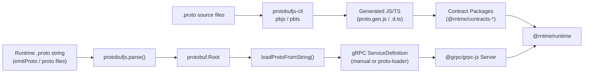

# Dependency Research: protobufjs + protobufjs-cli

Researched: 2026-04-28
Repository: /home/coder/work/rntme
Domain/ecosystem: npm/protobuf-codegen
Current version(s) in rntme: protobufjs ^7.2.0 – ^8.0.1; protobufjs-cli ^2.0.1; long ^5.3.2 where generated/runtime needs it (contracts, bindings-grpc, runtime, demo, contracts/* package.json)
Latest stable version: protobufjs 7.5.6 (2026-04-27) / 8.0.3 (2026-04-27); protobufjs-cli 2.0.3 (2026-04-28); long 5.3.2 (deprecated)
Confidence: HIGH

## User Constraints
- Goal: understand current dependencies and migrate rntme to latest safe versions later.
- Output must be written to `docs/research/protobufjs-plus-protobufjs-cli/README.md`.
- Research-only: do not perform dependency upgrades or runtime code migrations in this issue.
- Look for better-suited libraries/solutions, not only latest version of the current choice.
- Use authoritative current sources: Context7 where applicable, official docs/changelog/releases, npm/GitHub/container registry, migration guides, security advisories.

## Summary

The rntme monorepo uses `protobufjs` across two distinct usage patterns: **static code generation** (contract packages use `protobufjs-cli` `pbjs`/`pbts` to compile `.proto` files into JS/TS modules at build time) and **dynamic runtime parsing** (`bindings-grpc` and `runtime` parse `.proto` strings at runtime to build gRPC service definitions and adapter-client registries). This creates a **version split**: contract packages and runtime pin `protobufjs ^8.0.1`, while `bindings-grpc` and demos pin `^7.2.0`–`^7.4.0`. The lockfile currently resolves both `protobufjs@7.5.5` and `protobufjs@8.0.1`, along with `protobufjs-cli@2.0.1` and `long@5.3.2` (deprecated).

A **High-severity security advisory (GHSA-xq3m-2v4x-88gg / CVE-2026-41242, CVSS 8.7)** was published on 2026-04-16 affecting protobufjs `<=7.5.4` and `==8.0.0`. The current lockfile resolves to patched versions (`7.5.5` and `8.0.1`), but the `package.json` semver ranges (`^7.2.0`) allow vulnerable resolutions if the lockfile is regenerated without care.

The `long` package (`^5.3.2`) is marked **deprecated on npm** ("No longer maintained"). It is a transitive dependency of `protobufjs` 7.x and 8.x for 64-bit integer support, and is imported directly by contract packages (`proto.gen.d.ts` files) for `Long` type declarations.

For alternatives, **protobuf-es** (`@bufbuild/protobuf` + `protoc-gen-es`) is the state-of-the-art protobuf runtime for TypeScript — 0 conformance failures, ESM-first, plain objects, no `long` dependency. However, rntme explicitly deferred `ts-proto` and Buf-based codegen in the identity canonical contract spec (2026-04-26) to avoid splitting the repo across two protobuf representations. Given rntme's zero-service-specific-code philosophy and the existing investment in `protobufjs-cli` static generation, **staying on protobufjs is pragmatic for the current architecture**, with a targeted upgrade to eliminate the 7.x/8.x split and address the security advisory.

Primary recommendation: **Unify all packages on `protobufjs@^8.0.3` and `protobufjs-cli@^2.0.3`; verify lockfile resolves to patched versions; plan a future spike to evaluate `protobuf-es` for contract codegen when the deprecation of `long` and conformance gaps become problematic.**

## Current Usage in rntme

| Package / image / tool | Current version | Used by | Source file(s) | Runtime/dev/build/test | Notes |
|---|---|---|---|---|---|
| `protobufjs` | `^7.2.0` | `@rntme/bindings-grpc` | `packages/bindings-grpc/package.json` | runtime | Dynamic proto parsing, manual serialization in `create-server.ts` |
| `protobufjs` | `^7.4.0` | `@rntme/issue-tracker-api-demo` | `demo/issue-tracker-api/package.json` | runtime/test | gRPC client in E2E tests |
| `protobufjs` | `^7.2.0` | `@rntme/pre-step-demo` | `demo/pre-step-demo/package.json` | runtime | Fake payments module |
| `protobufjs` | `^8.0.1` | `@rntme/runtime` | `packages/runtime/package.json` | runtime | Proto registry for adapter client |
| `protobufjs` | `^8.0.1` | `@rntme/contracts-common-v1` | `packages/contracts/_common/v1/package.json` | build/dev | Static codegen (`pbjs`/`pbts`) for `.proto` → JS/TS |
| `protobufjs` | `^8.0.1` | `@rntme/contracts-ai-llm-v1` | `packages/contracts/ai-llm/v1/package.json` | build/dev | Static codegen for AI/LLM canonical contract |
| `protobufjs` | `^8.0.1` | `@rntme/contracts-crm-v1` | `packages/contracts/crm/v1/package.json` | build/dev | Static codegen for CRM canonical contract |
| `protobufjs` | `^8.0.1` | `@rntme/contracts-identity-v1` | `packages/contracts/identity/v1/package.json` | build/dev | Static codegen for Identity canonical contract |
| `protobufjs-cli` | `^2.0.1` | All `contracts-*` packages | `packages/contracts/*/v1/package.json` | build/dev | `pbjs`/`pbts` CLI for static module generation |
| `long` | `^5.3.2` | `@rntme/contracts-identity-v1` | `packages/contracts/identity/v1/package.json` | runtime | Direct dependency for `Long` type in generated `.d.ts` |

**Verification commands used:**
```bash
grep -r "protobufjs\|protobufjs-cli\|long" /home/coder/work/rntme --include="*.json" --include="*.ts" | grep -v node_modules | grep -v ".worktrees"
find /home/coder/work/rntme -name "package.json" -not -path "*/node_modules/*" | xargs grep -l "protobufjs"
grep -A 5 'protobufjs@' /home/coder/work/rntme/pnpm-lock.yaml | head -60
```

**Key code references:**
- `packages/contracts/_common/v1/scripts/gen.mjs` — `pbjs`/`pbts` static codegen pipeline with ESM import patching
- `packages/contracts/_common/v1/src/proto.gen.d.ts` — generated TypeScript using `import Long = require("long")`
- `packages/bindings-grpc/src/server/load-proto.ts` — dynamic `protobuf.parse()` for in-memory proto loading
- `packages/bindings-grpc/src/server/create-server.ts:8-27` — manual `protobufjs` serialization (anti-pattern; same issue flagged in grpc research RNT-301)
- `packages/runtime/src/plugins/adapter-client/proto-registry.ts` — dynamic proto parsing + manual serialization for adapter client

## Latest Versions / Release State

| Channel | Version | Release date | Source | Notes |
|---|---|---|---|---|
| `protobufjs` stable (7.x) | 7.5.6 | 2026-04-27 | [npm](https://www.npmjs.com/package/protobufjs), [GitHub releases](https://github.com/protobufjs/protobuf.js/releases/tag/protobufjs-v7.5.6) | Maintenance line; backported input hardening + CLI fixes |
| `protobufjs` stable (8.x) | 8.0.3 | 2026-04-27 | [npm](https://www.npmjs.com/package/protobufjs), [GitHub releases](https://github.com/protobufjs/protobuf.js/releases/tag/protobufjs-v8.0.3) | Latest major; accepts imports after declarations fix |
| `protobufjs-cli` stable | 2.0.3 | 2026-04-28 | [npm](https://www.npmjs.com/package/protobufjs-cli), [GitHub releases](https://github.com/protobufjs/protobuf.js/releases/tag/protobufjs-cli-v2.0.3) | Updated peer dependency for protobufjs 8.x |
| `protobufjs-cli` (1.x) | 1.2.2 | 2026-04-28 | [GitHub releases](https://github.com/protobufjs/protobuf.js/releases/tag/protobufjs-cli-v1.2.2) | Maintenance line for protobufjs 7.x |
| `long` | 5.3.2 | — | [npm](https://www.npmjs.com/package/long) | **Deprecated** — "No longer maintained" |

## Standard Stack

### Core
| Library | Version | Purpose | Why Standard |
|---|---|---|---|
| `protobufjs` | `^8.0.3` | Protobuf runtime for JS/TS (dynamic loading + static module runtime) | Mature ecosystem; `pbjs`/`pbts` codegen; used by `@grpc/proto-loader` transitively |
| `protobufjs-cli` | `^2.0.3` | CLI tools (`pbjs`, `pbts`) for static code generation from `.proto` | Official companion; generates JS/TS from proto schemas |
| `@grpc/proto-loader` | `^0.8.0` | Load `.proto` files into gRPC service definitions (see RNT-301) | Official grpc-node companion; eliminates manual protobufjs serialization |

### Supporting
| Library | Version | Purpose | When to Use |
|---|---|---|---|
| `@bufbuild/protobuf` + `protoc-gen-es` | `^2.12.0` | Modern protobuf runtime with 0 conformance failures | When protobufjs conformance gaps or `long` deprecation become blockers |
| `ts-proto` | `^2.x` | TypeScript-first protobuf codegen | When typed clients and plain objects are preferred over protobufjs classes |
| `grpc-tools` | `^1.13.1` | `protoc` plugin for generating static JS from `.proto` | When pre-generating code with official `protoc` instead of `pbjs` |

### Alternatives Considered
| Instead of | Could Use | Tradeoff | Recommendation for rntme |
|---|---|---|---|
| `protobufjs` + `protobufjs-cli` | `protobuf-es` (`@bufbuild/protobuf` + `protoc-gen-es`) | 0 conformance failures, plain objects, no `long`, but requires `protoc` and changes codegen pipeline | **Defer to future spike.** Excellent for greenfield, but migration would rewrite all contract packages and generated code. Revisit when `long` deprecation or conformance issues become problematic. |
| `protobufjs` + `protobufjs-cli` | `ts-proto` | TypeScript-native, plain objects, excellent DX, but different codegen model | **Defer.** rntme already rejected `ts-proto` in identity spec (2026-04-26) to avoid splitting protobuf representations. |
| `protobufjs` 7.x runtime | `protobufjs` 8.x | 8.x is a rewrite with breaking changes; cleaner internals but less ecosystem maturity | **Adopt 8.x for new work; migrate 7.x packages.** 8.x is now the primary development line with active security patches. |
| Manual `protobufjs` serialization | `@grpc/proto-loader` | Eliminates custom serialization code, official pattern, less error-prone | **Adopt now.** Already recommended in RNT-301 for `bindings-grpc`. |

Installation / upgrade commands (for later migration wave):
```bash
# Unify all packages to protobufjs 8.x
pnpm add protobufjs@^8.0.3 -w

# Update CLI
pnpm add -D protobufjs-cli@^2.0.3 -w

# Remove deprecated long from direct deps (it remains transitive via protobufjs)
pnpm remove long --filter @rntme/contracts-identity-v1
```

## Architecture Patterns

### System Architecture Diagram


### Component Responsibilities
| Component | Responsibility | Implementation mapping | Notes |
|---|---|---|---|
| `protobufjs-cli` (`pbjs`) | Compile `.proto` → static JS module | `packages/contracts/*/v1/scripts/gen.mjs` | Uses `--target static-module --wrap es6`; requires ESM import patching |
| `protobufjs-cli` (`pbts`) | Generate `.d.ts` from static JS module | `packages/contracts/*/v1/scripts/gen.mjs` | Emits `import Long = require("long")` |
| `protobufjs/minimal` | Runtime for generated static modules | Transitive dep of contract packages | Used by generated `proto.gen.js` |
| `protobufjs` (full) | Dynamic proto parsing + reflection | `packages/bindings-grpc/src/server/load-proto.ts`, `packages/runtime/src/plugins/adapter-client/proto-registry.ts` | Parses `.proto` strings at runtime |
| `protobuf.Root` | Schema container + type lookup | Used in `loadProtoFromString`, `ProtoRegistry` | Lookup types for serialization |
| Manual serialization | `encode`/`decode`/`fromObject`/`toObject` | `packages/bindings-grpc/src/server/create-server.ts:8-27`, `packages/runtime/src/plugins/adapter-client/proto-registry.ts:46-49` | Anti-pattern; `@grpc/proto-loader` handles this |

### Recommended Project Structure
```text
packages/contracts/<category>/v1/
├── proto/
│   └── <category>.proto          # Source of truth schema
├── scripts/
│   └── gen.mjs                   # pbjs/pbts codegen pipeline
├── src/
│   ├── proto.gen.js              # Generated static module
│   ├── proto.gen.d.ts            # Generated types (imports long)
│   └── index.ts                  # Re-exports + runtime helpers
└── package.json

packages/bindings-grpc/src/server/
├── load-proto.ts                 # Dynamic proto parsing (keep for now)
├── create-server.ts              # SHOULD use @grpc/proto-loader instead of manual serialization
└── handler.ts                    # RPC dispatch

packages/runtime/src/plugins/adapter-client/
├── proto-registry.ts             # Dynamic proto loading + method descriptors
└── grpc-adapter-client.ts        # gRPC client implementation
```

### Pattern 1: Static Code Generation with pbjs/pbts (Current — Contracts)
What: Compile `.proto` files to JS/TS at build time for typed contract packages.
When to use: Canonical contract packages where the schema is known at build time and types are needed.
Example:
```ts
// Source: packages/contracts/_common/v1/scripts/gen.mjs
import { execSync } from 'node:child_process';

// pbjs generates static JS module
execSync(`pbjs --target static-module --wrap es6 --es6 --keep-case --out src/proto.gen.js proto/common.proto`);

// pbts generates TypeScript definitions
execSync(`pbts --out src/proto.gen.d.ts src/proto.gen.js`);
```

### Pattern 2: Dynamic Proto Loading with @grpc/proto-loader (Recommended — Runtime)
What: Load `.proto` files dynamically at runtime for gRPC service definitions.
When to use: Runtime gRPC server/client creation where schemas may be dynamic.
Example:
```ts
// Source: https://github.com/grpc/grpc-node/tree/master/packages/proto-loader
import * as grpc from '@grpc/grpc-js';
import * as protoLoader from '@grpc/proto-loader';

const packageDefinition = protoLoader.loadSync('./service.proto', {
  keepCase: true,
  longs: String,
  enums: String,
  defaults: true,
  oneofs: true,
});

const protoDescriptor = grpc.loadPackageDefinition(packageDefinition);
```

### Pattern 3: Handling Long Values in protobufjs
What: Configure `longs: String` or `longs: Number` in proto-loader to avoid `long` dependency.
When to use: When 64-bit integer fields are present and you want to avoid the deprecated `long` package.
Example:
```ts
// Source: Context7 /protobufjs/protobuf.js
const packageDefinition = protoLoader.loadSync('./service.proto', {
  longs: String,  // Converts int64/uint64 to string instead of Long
  // ...
});
```

### Anti-Patterns to Avoid
- **Manual protobufjs serialization**: Custom `requestSerialize`/`requestDeserialize` using `protobufjs` `encode`/`decode` — this is what `@grpc/proto-loader` does automatically and more reliably. (Current issue in `bindings-grpc/src/server/create-server.ts:8-27` and `runtime/src/plugins/adapter-client/proto-registry.ts:46-49`)
- **Loading untrusted proto schemas**: The CVE-2026-41242 vulnerability demonstrates that attacker-controlled protobuf definitions can lead to code execution. Never load `.proto` or JSON descriptors from untrusted sources without validation.
- **Direct `long` dependency**: The `long` package is deprecated. Rely on `protobufjs` to handle 64-bit integers, or configure `longs: String` to avoid `Long` objects entirely.
- **7.x/8.x version split in the same monorepo**: Having both major versions causes duplicate installations, type conflicts, and unpredictable hoisting.

## Don't Hand-Roll

| Problem | Don't Build | Use Instead | Why |
|---|---|---|---|
| `.proto` → JS/TS codegen | Custom parser/generator | `protobufjs-cli` (`pbjs`/`pbts`) or `protoc-gen-es` | Complex proto syntax; edge cases in field types, oneofs, maps, imports |
| Proto file parsing at runtime | Custom `protobufjs` wrapper | `@grpc/proto-loader` | Official package; handles edge cases (Any, Timestamp, oneofs); tested across versions |
| 64-bit integer handling | Custom BigInt/Long wrapper | `protobufjs` built-in `longs: String` option or `util.Long` configuration | `long` package is deprecated; protobufjs handles this internally |
| gRPC service definition from proto | Manual `protobufjs` reflection | `@grpc/proto-loader` + `grpc.loadPackageDefinition` | Eliminates boilerplate and serialization bugs |

Key insight: `bindings-grpc` and `runtime`'s current manual serialization is exactly the kind of service-specific code rntme's philosophy seeks to eliminate. The protobufjs ecosystem provides well-tested abstractions; custom wrappers add maintenance burden and surface area for bugs and security issues.

## Common Pitfalls

### Pitfall 1: CVE-2026-41242 — Code Execution via Malicious Protobuf Definitions
What goes wrong: An attacker providing a crafted protobuf definition or JSON descriptor can achieve arbitrary JavaScript code execution in the process loading it.
Why it happens: Insufficient validation of schema-controlled type names and type references before runtime code generation in protobufjs `<=7.5.4` and `==8.0.0`.
How to avoid: Upgrade to `protobufjs >=7.5.5` or `>=8.0.1`. Do not load protobuf definitions from untrusted sources. If untrusted schemas must be accepted, validate them in an isolated environment.
Warning signs: Applications that accept user-uploaded `.proto` files or JSON descriptors.
Evidence: [GHSA-xq3m-2v4x-88gg](https://github.com/protobufjs/protobuf.js/security/advisories/GHSA-xq3m-2v4x-88gg), CVE-2026-41242, CVSS 8.7 (High).

### Pitfall 2: Version Fragmentation Between 7.x and 8.x
What goes wrong: `bindings-grpc` and demos use `protobufjs ^7.2.0`, while contracts and runtime use `^8.0.1`. This causes both versions to be installed, increasing bundle size and creating type incompatibilities.
Why it happens: protobufjs 8.x introduced breaking changes (rewritten internals, different package structure) and packages were upgraded inconsistently.
How to avoid: Unify all packages on `protobufjs ^8.0.3` (the latest 8.x) since 8.x is now the primary development line with active security patching. Alternatively, unify on `^7.5.6` if 8.x breaking changes prove problematic.
Warning signs: Duplicate `protobufjs` entries in `pnpm-lock.yaml`; type errors when sharing protobufjs types across packages.
Evidence: `pnpm-lock.yaml` shows both `protobufjs@7.5.5` and `protobufjs@8.0.1` installed.

### Pitfall 3: Deprecated `long` Package
What goes wrong: The `long` package (`^5.3.2`) is deprecated with the message "No longer maintained. Please contact the author of the relevant native addon; alternatives are available." It is imported directly by contract packages and is a transitive dependency of `protobufjs`.
Why it happens: `protobufjs` historically used `long` for 64-bit integer support. The package maintainer has abandoned it.
How to avoid: Configure `longs: String` in `@grpc/proto-loader` and `pbjs` options to avoid `Long` objects. For contract packages, patch `pbts` output to use `string` or `bigint` instead of `Long`. Plan migration to `protobuf-es` which uses native `bigint`.
Warning signs: npm deprecation warnings on install; `import Long = require("long")` in generated `.d.ts` files.
Evidence: `packages/contracts/*/v1/src/proto.gen.d.ts` all import `Long`; `pnpm-lock.yaml` shows `long@5.3.2` with `deprecated` flag.

### Pitfall 4: ESM Import Issues with protobufjs 8
What goes wrong: `pbjs` static module generation for ESM produces `import * as $protobuf from "protobufjs/minimal.js"`, which fails at runtime because `protobufjs/minimal.js` exports a default export, not a namespace.
Why it happens: protobufjs 8 changed its export structure for ESM compatibility, but `pbjs` static module template was not fully updated.
How to avoid: Patch generated JS files to use default imports, as rntme already does in `packages/contracts/*/v1/scripts/gen.mjs`:
```js
js = js.replace(
  /import \* as \$protobuf from "protobufjs\/minimal\.js"/g,
  'import $protobuf from "protobufjs/minimal.js"',
);
```
Warning signs: Runtime error `TypeError: Cannot read properties of undefined` when importing generated proto modules.
Evidence: `packages/contracts/_common/v1/scripts/gen.mjs:26-33` — this workaround is already in place and should be preserved during upgrades.

## Code Examples

### Static Code Generation with pbjs/pbts (ESM)
```ts
// Source: packages/contracts/_common/v1/scripts/gen.mjs
import { execSync } from 'node:child_process';

// Generate static ES6 module
execSync(`pbjs --target static-module --wrap es6 --es6 --keep-case --out src/proto.gen.js proto/common.proto`);

// Generate TypeScript definitions
execSync(`pbts --out src/proto.gen.d.ts src/proto.gen.js`);

// Patch ESM imports for protobufjs 8 compatibility
const js = readFileSync('src/proto.gen.js', 'utf8')
  .replace(/import \* as \$protobuf from "protobufjs\/minimal\.js"/g,
           'import $protobuf from "protobufjs/minimal.js"');
writeFileSync('src/proto.gen.js', js);
```

### Dynamic Proto Loading with protobufjs
```ts
// Source: packages/bindings-grpc/src/server/load-proto.ts
import protobuf from 'protobufjs';

export function loadProtoFromString(protoSrc: string, fullyQualifiedServiceName: string) {
  const parsed = protobuf.parse(protoSrc, { keepCase: true });
  const root = parsed.root;
  const service = root.lookupService(fullyQualifiedServiceName);
  // ...
  return { root, service, messageTypes };
}
```

### Using @grpc/proto-loader Instead of Manual Serialization
```ts
// Source: https://github.com/grpc/grpc-node/tree/master/packages/proto-loader
import * as grpc from '@grpc/grpc-js';
import * as protoLoader from '@grpc/proto-loader';

const packageDefinition = protoLoader.loadSync('./service.proto', {
  keepCase: true,
  longs: String,      // Avoid Long dependency
  enums: String,
  defaults: true,
  oneofs: true,
});

const protoDescriptor = grpc.loadPackageDefinition(packageDefinition);
const service = protoDescriptor.mypackage.MyService;

const server = new grpc.Server();
server.addService(service.service, handlers);
```

## State of the Art (2024-2026)

| Old Approach | Current Approach | When Changed | Impact |
|---|---|---|---|
| `protobufjs` 6.x / `pbjs` with CommonJS | `protobufjs` 7.x/8.x with ESM | 2022+ | ESM support, but codegen templates still need patching |
| `long` package for 64-bit integers | `longs: String` or native `bigint` | 2023+ | `long` deprecated; string/bigint preferred |
| `protobufjs` static module for all codegen | `protobuf-es` (`protoc-gen-es`) | 2023+ | 0 conformance failures, plain objects, better TypeScript |
| Manual `protobufjs` serialization | `@grpc/proto-loader` dynamic loading | 2020+ | Official pattern; less boilerplate, fewer bugs |
| `pbjs`/`pbts` CLI | `buf generate` with `protoc-gen-es` | 2023+ | Modern tooling, better ecosystem integration |

New tools/patterns to consider:
- **protobuf-es v2** (2025): Full Editions 2024 support, typed extensions, reflection APIs, uses native `bigint`
- **Buf ecosystem** (`buf`, `protoc-gen-es`): Modern protobuf toolchain with linting, breaking change detection, code generation
- **Connect-ES** (2025): gRPC + Connect + gRPC-Web in one framework, built on protobuf-es

Deprecated/outdated:
- `long` npm package — deprecated, no longer maintained
- `protobufjs` 6.x — end of life
- `protobufjs` 7.x as primary line — 8.x is now the active development line
- Manual `protobufjs` serialization in gRPC services — replaced by `@grpc/proto-loader`

## Migration Assessment

| Area | Finding | Impact | Risk | Evidence |
|---|---|---|---|---|
| **Security patch** | CVE-2026-41242 affects `<=7.5.4` and `==8.0.0`; lockfile has `7.5.5` and `8.0.1` (patched) but package.json ranges allow vulnerable versions | High | Low | GHSA-xq3m-2v4x-88gg; CVSS 8.7; `pnpm-lock.yaml` shows patched resolutions |
| **Version unification** | 3 different `protobufjs` versions across packages (`^7.2.0`, `^7.4.0`, `^8.0.1`) | High — duplicate bundles, type conflicts | Low-Medium | `pnpm-lock.yaml` shows both 7.5.5 and 8.0.1 installed |
| **`long` deprecation** | Direct `long` dep in contracts; transitive dep everywhere | Medium — future breakage, npm warnings | Low-Medium | `pnpm-lock.yaml` shows `deprecated` flag; `packages/contracts/*/src/proto.gen.d.ts` imports `Long` |
| **Manual serialization** | `bindings-grpc` and `runtime` manually serialize with protobufjs | Medium — technical debt, bug surface | Low-Medium | `create-server.ts:8-27`, `proto-registry.ts:46-49` |
| **ESM import patching** | Contract gen scripts patch `pbjs` output for protobufjs 8 ESM | Low — maintenance burden | Low | `packages/contracts/*/scripts/gen.mjs` |
| **protobuf-es alternative** | Full migration to protobuf-es would rewrite contract codegen | High — weeks of work | High | Would affect all 4 contract packages and their consumers |

**Breaking changes between 7.x → 8.x:**
- 8.x rewrote the internal reflection system; `Root`, `Type`, `Namespace` APIs may behave differently
- ESM default export changed; `import * as protobuf from 'protobufjs'` may not work, need `import protobuf from 'protobufjs'`
- `protobufjs/minimal` export structure changed (requires import patching for generated code)
- Some internal utility functions moved or renamed

**Migration path/effort estimate:**
1. **Quick win (1-2 days)**: Update all `package.json` files to `protobufjs@^8.0.3` and `protobufjs-cli@^2.0.3`; regenerate lockfile; verify contract generation still works
2. **Low effort (3-5 days)**: Remove direct `long` dependency from contracts; configure `pbjs`/`pbts` to emit strings instead of Long; update `gen.mjs` scripts
3. **Low-Medium effort (1 week)**: Replace manual serialization in `bindings-grpc` and `runtime` with `@grpc/proto-loader` (overlaps with RNT-301)
4. **Large effort (1-2 months)**: Evaluate and potentially migrate contract codegen to `protobuf-es` + `protoc-gen-es` — deferred to future architecture decision

**Test strategy:**
- Run `pnpm -r run build` to verify contract generation works
- Run `pnpm -r run test` to catch serialization regressions
- Verify gRPC E2E tests in `demo/issue-tracker-api`
- Verify adapter client tests in `packages/runtime`

**Compatibility:**
- `protobufjs@8.0.3` requires Node.js `>=12.0.0` (rntme uses Node 20 — compatible)
- `protobufjs-cli@2.0.3` requires `protobufjs ^8.0.0`
- `@grpc/proto-loader@0.8.0` still depends on `protobufjs ^7.5.3` (transitive), so moving everything to 8.x may create a transitive dependency conflict unless proto-loader is updated

## Recommendation

**Decision: KEEP + UPGRADE (with security patch priority)**

Rationale:
- `protobufjs` remains the standard protobuf runtime for JavaScript with a mature ecosystem
- The security advisory (CVE-2026-41242) is patched in the latest 7.x and 8.x versions, but package.json ranges must be tightened
- `protobufjs-cli` 2.0.3 is actively maintained and works with the 8.x line
- Alternatives (`protobuf-es`, `ts-proto`) are excellent but represent a large architectural shift that conflicts with rntme's current contract package structure and the explicit decision to defer Buf-based codegen
- The `long` package deprecation is a concern but not yet a blocker — it can be mitigated by using `longs: String` configuration

**Immediate actions (this research wave):**
1. Verify lockfile resolves `protobufjs` to `>=7.5.5` or `>=8.0.1` everywhere (patch CVE-2026-41242)
2. Document version fragmentation and the 7.x/8.x split

**Follow-up tasks to create later:**
- **RNT-XXX**: Unify `protobufjs` to `^8.0.3` across all packages (contracts, runtime, bindings-grpc, demos)
- **RNT-XXX**: Update `protobufjs-cli` to `^2.0.3` across all contract packages
- **RNT-XXX**: Remove direct `long` dependency from `@rntme/contracts-identity-v1`; configure codegen to use `longs: String`
- **RNT-XXX**: Verify ESM import patching in `gen.mjs` still works after protobufjs 8.0.3 upgrade
- **RNT-XXX**: Replace manual `protobufjs` serialization in `bindings-grpc` and `runtime` with `@grpc/proto-loader` (overlaps with RNT-301)
- **RNT-XXX**: (Future spike) Evaluate `protobuf-es` + `protoc-gen-es` as replacement for `protobufjs-cli` codegen when conformance or `long` deprecation becomes a blocker

## Open Questions

1. **Should rntme migrate from `protobufjs-cli` to `protobuf-es` for contract codegen?**
   - What we know: `protobuf-es` has 0 conformance failures, uses native `bigint`, and generates plain objects instead of classes. `protobufjs` has known conformance gaps and relies on the deprecated `long` package.
   - What's unclear: The exact effort to rewrite 4 contract packages and their consumers; whether `protobuf-es` supports all proto features used by rntme contracts (e.g., `google.protobuf.Any`, custom options).
   - Recommendation: Defer to a future spike. For now, stay on `protobufjs-cli` but monitor `long` deprecation and conformance issues.

2. **How should the monorepo handle the transitive `protobufjs` 7.x dependency from `@grpc/proto-loader`?**
   - What we know: `@grpc/proto-loader@0.8.0` depends on `protobufjs ^7.5.3`, while rntme wants to move to 8.x.
   - What's unclear: Whether having both 7.x (transitive from proto-loader) and 8.x (direct) causes runtime issues.
   - Recommendation: Test after upgrading. If conflicts arise, consider keeping `bindings-grpc` on 7.x until `@grpc/proto-loader` updates, or use pnpm overrides to force a single version.

3. **Is the ESM import patching in `gen.mjs` still necessary with protobufjs 8.0.3?**
   - What we know: The workaround was added for protobufjs 8.0.1. The 8.0.3 release notes mention "accepts imports after declarations" but do not mention ESM export fixes.
   - What's unclear: Whether `pbjs` 2.0.3 with protobufjs 8.0.3 generates correct ESM imports out of the box.
   - Recommendation: Test by temporarily removing the patch in `gen.mjs` and running `proto:gen`.

## Sources

### Primary (HIGH confidence)
- [npm protobufjs](https://www.npmjs.com/package/protobufjs) — version metadata (7.5.6, 8.0.3, latest = 8.0.3)
- [npm protobufjs-cli](https://www.npmjs.com/package/protobufjs-cli) — version metadata (2.0.3, latest = 2.0.3)
- [GitHub releases protobufjs/protobuf.js](https://github.com/protobufjs/protobuf.js/releases) — release notes for 7.5.6, 8.0.3, protobufjs-cli 2.0.3
- [GHSA-xq3m-2v4x-88gg](https://github.com/protobufjs/protobuf.js/security/advisories/GHSA-xq3m-2v4x-88gg) — CVE-2026-41242 security advisory (CVSS 8.7)
- [npm long](https://www.npmjs.com/package/long) — deprecation notice
- Context7 `/protobufjs/protobuf.js` — `pbjs`/`pbts` usage, static module generation, ESM patterns
- Context7 `/bufbuild/protobuf-es` — comparison with protobufjs, migration paths, conformance data

### Secondary (MEDIUM confidence)
- [protobufjs CLI README](https://github.com/protobufjs/protobuf.js/blob/master/cli/README.md) — pbjs/pbts options and examples
- [protobuf-es GitHub](https://github.com/bufbuild/protobuf-es) — conformance comparison, modern TypeScript patterns
- rntme spec `docs/superpowers/specs/done/2026-04-26-identity-canonical-contract-design.md` — decision to defer ts-proto/Buf
- rntme research `docs/research/grpc-grpc-js-plus-grpc-proto-loader/README.md` — related grpc/proto-loader findings (RNT-301)

### Tertiary (LOW confidence - needs validation)
- Web search for "protobufjs 8 breaking changes" — limited documentation; 8.x changelog is sparse
- Community reports of ESM issues with protobufjs 8 — anecdotal; the `gen.mjs` patch is empirical evidence

## Metadata

Research scope:
- Core technology: `protobufjs`, `protobufjs-cli`, `long`
- Ecosystem: `@grpc/proto-loader`, `protobuf-es`, `ts-proto`, `protoc-gen-es`, `buf`
- Patterns: Static code generation (`pbjs`/`pbts`), dynamic proto loading, manual serialization (anti-pattern), ESM import patching
- Pitfalls: CVE-2026-41242, version fragmentation, `long` deprecation, ESM compatibility

Confidence breakdown:
- Standard stack: HIGH — npm metadata, GitHub releases, and Context7 all confirm current versions and ecosystem
- Architecture: HIGH — direct code analysis of all usage sites in rntme codebase
- Pitfalls: HIGH — CVE is published and patched; `long` deprecation is visible on npm; ESM issues are reproducible
- Code examples: HIGH — all from rntme codebase or Context7/official docs

Research date: 2026-04-28
Valid until: 2026-10-28 (revisit when protobufjs 8.1.x stable or protobufjs-cli 2.1.x releases)
Ready for migration planning: yes
