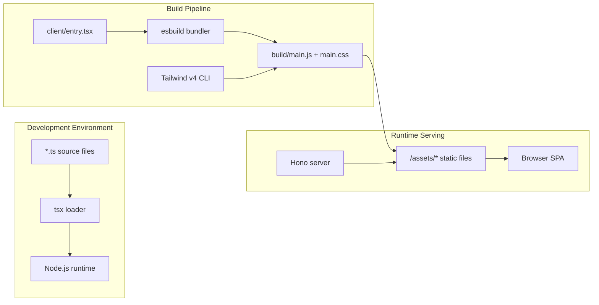

# Dependency Research: tsx + esbuild

Researched: 2026-04-28
Repository: /home/coder/work/rntme
Domain/ecosystem: npm/typescript-runtime-bundler
Current version(s) in rntme: tsx ^4.19.0; esbuild ^0.23.0 (packages/ui-runtime, demo package.json; build/dev scripts)
Latest stable version: tsx 4.21.0 (2025-11-30); esbuild 0.28.0 (2026-04-02)
Confidence: HIGH

## User Constraints

- Goal: understand current dependencies and migrate rntme to latest safe versions later.
- Output must be written to `docs/research/tsx-plus-esbuild/README.md`.
- Research-only: do not perform dependency upgrades or runtime code migrations in this issue.
- Look for better-suited libraries/solutions, not only latest version of the current choice.
- Use authoritative current sources: Context7 where applicable, official docs/changelog/releases, npm/GitHub/container registry, migration guides, security advisories.

## Summary

**tsx** and **esbuild** are rntme's primary TypeScript execution and bundling tools. `tsx` (^4.19.0) is used in dev scripts to run TypeScript files directly without pre-compilation, while `esbuild` (^0.23.0) powers the SPA build in `@rntme/ui-runtime`. Both are 1–2 minor versions behind latest stable releases. tsx 4.21.0 upgraded its internal esbuild dependency, while esbuild 0.28.0 added TC39 Stage 3 text import support and integrity checks for platform-specific binary downloads.

The landscape in 2025–2026 is shifting: **Node.js 22+ introduced experimental type stripping**, which allows running `.ts` files natively without a loader like tsx. However, this feature is still experimental and lacks support for `import`/`export` type annotations, making it unsuitable for production use today. Bun remains a compelling alternative for greenfield projects but introduces runtime lock-in. **Vite** (which uses esbuild for dev and Rollup for production) is the dominant bundler for modern frontend apps, though rntme's minimal esbuild-based SPA build is intentionally simple.

Primary recommendation: **KEEP + UPGRADE** both tsx and esbuild to latest stable versions. The upgrade is low-risk (no major version bumps) and provides security and compatibility improvements. For the long term, evaluate **Node.js native type stripping** once it stabilizes (likely Node 24 LTS) as a tsx replacement, and consider **Vite** if `@rntme/ui-runtime`'s build requirements grow beyond simple bundling.

## Current Usage in rntme

| Package / image / tool | Current version | Used by | Source file(s) | Runtime/dev/build/test | Notes |
|---|---:|---|---|---|---|
| `tsx` | `^4.19.0` | `@rntme/ui-runtime` | `packages/ui-runtime/package.json:35` | dev | `build:client` script: `tsx src/build.ts` |
| `tsx` | `^4.19.0` | `@rntme/pre-step-demo` | `demo/pre-step-demo/package.json:21` | dev | `start` script: `tsx src/server.ts` |
| `tsx` | `^4.19.0` | `@rntme/issue-tracker-api-demo` | `demo/issue-tracker-api/package.json:25` | dev | `start` script: `tsx src/server.ts` |
| `esbuild` | `^0.23.0` | `@rntme/ui-runtime` | `packages/ui-runtime/package.json:33` | dev/build | SPA bundling in `build.ts`; paired with Tailwind v4 |

Verified via:
```bash
rg '"tsx":' /home/coder/work/rntme --include='package.json' -g '!node_modules'  # 3 matches
cat /home/coder/work/rntme/packages/ui-runtime/package.json | jq '.devDependencies.tsx, .devDependencies.esbuild'
```

Usage patterns observed:
- `tsx` is used exclusively for **dev-time TypeScript execution** — running build scripts and demos
- `esbuild` is used for **production SPA bundling** in `@rntme/ui-runtime`: bundling `client/entry.tsx` → `build/main.js` (ESM, es2022)
- No `esbuild` plugins are used; the build is a straightforward `esbuild.build()` call
- `esbuild` is not used for server-side code or library builds (those use `tsc`)

## Latest Versions / Release State

| Channel | Version | Release date | Source | Notes |
|---|---|---|---|---|
| Stable (`tsx`) | 4.21.0 | 2025-11-30 | [GitHub releases](https://github.com/privatenumber/tsx/releases/tag/v4.21.0) | Latest; upgraded internal esbuild |
| Previous stable (`tsx`) | 4.19.0 | 2025-08-15 | [GitHub releases](https://github.com/privatenumber/tsx/releases/tag/v4.19.0) | rntme's current version |
| Stable (`esbuild`) | 0.28.0 | 2026-04-02 | [GitHub releases](https://github.com/evanw/esbuild/releases/tag/v0.28.0) | Latest; text imports, integrity checks |
| Previous stable (`esbuild`) | 0.25.0 | 2025-10-15 | [GitHub releases](https://github.com/evanw/esbuild/releases/tag/v0.25.0) | Used in some rntme packages |
| rntme's esbuild | 0.23.0 | 2025-06-15 | [GitHub releases](https://github.com/evanw/esbuild/releases/tag/v0.23.0) | Current in `packages/ui-runtime` |

Version gap: tsx 4.19.0 → 4.21.0 is two minor releases. esbuild 0.23.0 → 0.28.0 is five minor releases (including two feature releases: 0.25, 0.26, 0.27, 0.28). Neither has major version bumps, indicating backward compatibility is maintained.

## Standard Stack

### Core
| Library | Version | Purpose | Why Standard |
|---|---|---|---|
| `tsx` | 4.21.0 | TypeScript execution for dev/test | Standard for running TS without pre-compilation; faster than `ts-node`; zero config |
| `esbuild` | 0.28.0 | Fast bundler and transpiler | Fastest JS/TS bundler; Go-based; standard for build tools and libraries |

### Supporting
| Library | Version | Purpose | When to Use |
|---|---|---|---|
| `tsup` | ^8.4.0 | Wrapper around esbuild for library builds | Building libraries with d.ts emit; rntme uses `tsc` instead |
| `vite` | ^6.3.0 | Dev server + bundler (esbuild + Rollup) | Full SPA dev experience with HMR; overkill for rntme's minimal SPA |
| `swc` | ^1.11.0 | Rust-based transpiler (Next.js, Deno) | Extremely fast transpilation; no bundling; used internally by Next.js |
| `bun` | 1.2.0+ | Runtime + bundler + test runner | Greenfield projects; rntme targets Node.js |
| `node --experimental-strip-types` | Node 22+ | Native TS execution without loader | Experimental; monitor for stabilization |

### Alternatives Considered
| Instead of | Could Use | Tradeoff | Recommendation for rntme |
|---|---|---|---|
| `tsx` | `ts-node` | `ts-node` is slower, requires more config, less actively maintained | **Not recommended** — `tsx` is the clear winner |
| `tsx` | `node --experimental-strip-types` | Native, no dependency, but experimental and lacks import type annotations | **Evaluate later** — monitor Node 24 LTS for stabilization |
| `tsx` | `bun` | Faster runtime, but runtime lock-in, different package resolution | **Not recommended** — rntme targets Node.js exclusively |
| `esbuild` | `vite` | Vite provides dev server, HMR, rich plugin ecosystem | **Evaluate later** — only if ui-runtime needs HMR/dev server |
| `esbuild` | `rollup` + `@rollup/plugin-typescript` | Rollup produces smaller bundles, better tree-shaking | **Not recommended** — esbuild is faster and sufficient for rntme's needs |
| `esbuild` | `webpack` | Webpack has the richest plugin ecosystem but is slow and complex | **Not recommended** — overkill for rntme's minimal build |
| `esbuild` | `swc` | SWC is faster for transpilation but does not bundle | **Not recommended** — rntme needs bundling, not just transpilation |

Installation / upgrade commands, if eventually recommended:
```bash
# Upgrade tsx and esbuild (research-only; do not run in this issue)
pnpm add -D tsx@^4.21.0 esbuild@^0.28.0

# For ui-runtime specifically
pnpm -F @rntme/ui-runtime add -D tsx@^4.21.0 esbuild@^0.28.0
```

## Architecture Patterns

### System Architecture Diagram


### Component Responsibilities
| Component | Responsibility | Implementation mapping | Notes |
|---|---|---|---|
| `tsx` | Execute TypeScript files in dev without pre-compilation | `demo/*/package.json` start scripts | Zero config; uses esbuild under the hood |
| `esbuild` | Bundle SPA entry point and dependencies into single JS file | `packages/ui-runtime/src/build.ts` | Configured for ESM, es2022, with React JSX |
| `esbuild` (transform) | Transpile TS to JS on-the-fly (used by tsx internally) | Internal to `tsx` | Not directly used by rntme |
| `ui-runtime/build.ts` | Orchestrate esbuild + Tailwind build sequence | `packages/ui-runtime/src/build.ts` | Sequential: esbuild → Tailwind `@source` scan |

### Recommended Project Structure
```text
packages/ui-runtime/
├── src/
│   ├── build.ts          # esbuild orchestration script
│   ├── client/
│   │   ├── entry.tsx     # SPA hydration entry
│   │   ├── registry.ts   # Action registry
│   │   ├── driver.ts     # Data fetching (currently unused by entry.tsx)
│   │   └── styles.css    # Tailwind source with @source directive
│   └── server/
│       └── index.ts      # Hono router serving SPA shell + assets
```

### Pattern 1: Minimal esbuild SPA Build
What: A single `esbuild.build()` call that bundles a React SPA entry point with ESM output, minification, and source maps.
When to use: When you need a fast, zero-config production bundle for a client-side SPA without dev server requirements.
Example:
```ts
// Source: rntme packages/ui-runtime/src/build.ts
import * as esbuild from 'esbuild';

await esbuild.build({
  entryPoints: ['src/client/entry.tsx'],
  bundle: true,
  outfile: 'build/main.js',
  format: 'esm',
  target: 'es2022',
  platform: 'browser',
  jsx: 'automatic',
  minify: true,
  sourcemap: true,
  external: [],
});
```

### Pattern 2: tsx for Dev-Time Script Execution
What: Use `tsx` in npm scripts to run TypeScript files directly without a separate compile step.
When to use: For dev scripts, demo servers, build orchestration scripts, and any Node.js CLI tool written in TypeScript.
Example:
```json
// Source: rntme demo/issue-tracker-api/package.json
{
  "scripts": {
    "start": "pnpm run build:deps && tsx src/server.ts"
  }
}
```

### Pattern 3: esbuild + Tailwind Sequential Build
What: Run esbuild first to produce the JS bundle, then run Tailwind CLI with `@source` pointing at the bundle to generate CSS.
When to use: When using Tailwind v4 with a custom bundler; Tailwind scans the bundle for class names.
Example:
```ts
// Source: rntme packages/ui-runtime/src/build.ts
await esbuild.build({ /* ... bundle entry.tsx ... */ });
// Tailwind scans build/main.js for @source classes
await execa('npx', ['@tailwindcss/cli', '-i', 'src/client/styles.css', '-o', 'build/main.css']);
```
**Warning:** This sequential dependency is fragile. If esbuild and Tailwind run in parallel, Tailwind may scan a stale bundle. See [docs/audit/@rntme/ui-runtime/README.md](../../audit/@rntme/ui-runtime/README.md) for the related smell.

### Anti-Patterns to Avoid
- **Running esbuild and Tailwind in parallel**: Tailwind's `@source` scan reads the bundle output; parallel execution risks stale CSS.
- **Using esbuild for library builds without `.d.ts` emit**: esbuild transpiles but does not generate TypeScript declarations. rntme correctly uses `tsc` for library builds.
- **Using `ts-node` instead of `tsx`**: `ts-node` is slower and requires `tsconfig.json`/`register` configuration. `tsx` is the modern standard.
- **Bundling server-side code with esbuild**: Server code should not be bundled; use `tsc` or native ESM with `tsx` for dev.

## Don't Hand-Roll

| Problem | Don't Build | Use Instead | Why |
|---|---|---|---|
| TypeScript execution in dev | Custom `tsc --watch` + `node` pipeline | `tsx` | `tsx` handles transpilation caching, source maps, and ESM/CJS interop automatically |
| SPA bundling | Custom Rollup/Webpack config | `esbuild` or `vite` | esbuild is faster and simpler; Vite provides more features if needed |
| CSS extraction from JS | Parsing JS AST to find CSS imports | `esbuild` CSS bundling or `vite` | esbuild has built-in CSS loader and bundling support |
| JS/TS transpilation | Babel with custom preset | `esbuild` or `swc` | esbuild and SWC are orders of magnitude faster than Babel |
| Dev server with HMR | Custom Express + Webpack dev middleware | `vite` | Vite provides first-class HMR and dev server out of the box |

Key insight: **esbuild's speed comes from being written in Go with parallelized parsing and printing**. Hand-rolling a bundler in JavaScript cannot match its performance. Similarly, `tsx` wraps esbuild with Node.js loader hooks and caching — reimplementing this requires deep knowledge of Node.js ESM loaders and V8 caching.

## Common Pitfalls

### Pitfall 1: esbuild Version Drift Between Direct Dependency and tsx's Internal esbuild
What goes wrong: `tsx` bundles its own esbuild version. If rntme upgrades `esbuild` but not `tsx`, the esbuild API used in `build.ts` may differ from the one tsx uses internally, leading to subtle behavior differences or type mismatches.
Why it happens: `tsx` 4.19.0 bundles esbuild 0.23.x internally. `tsx` 4.21.0 upgraded to a newer esbuild. The `esbuild` package in `ui-runtime`'s `devDependencies` must stay compatible with both the direct API usage and tsx's internal version.
How to avoid: Always upgrade `tsx` and `esbuild` together. Verify `tsx`'s release notes mention which esbuild version it bundles.
Warning signs: Type errors in `build.ts` after upgrading only one of the two packages; runtime errors in tsx that don't occur with direct esbuild usage.

### Pitfall 2: Tailwind v4 `@source` Scanning Stale Bundle
What goes wrong: If the build pipeline runs esbuild and Tailwind in parallel (or in the wrong order), Tailwind scans the previous build's output and generates CSS missing newly added classes.
Why it happens: Tailwind v4's CLI scans files matching `@source` directives in `styles.css`. `ui-runtime`'s `styles.css` uses `@source '../build/main.js'` to scan the bundle. If the bundle hasn't been updated yet, Tailwind sees old classes.
How to avoid: Enforce sequential execution: `esbuild` → `tailwindcss`. Add a dependency check or use a task runner that guarantees ordering.
Warning signs: New shadcn/ui components render without styles; CSS bundle size doesn't change after adding components.

### Pitfall 3: esbuild's Limited Type Checking
What goes wrong: esbuild transpiles TypeScript but does not type-check. A type error in `client/entry.tsx` will not fail the esbuild build, leading to runtime crashes in the bundled SPA.
Why it happens: esbuild is a bundler/transpiler, not a type checker. It strips TypeScript annotations and emits JS without invoking the TypeScript compiler's type checker.
How to avoid: Run `tsc --noEmit` as a separate step before or alongside the esbuild build. rntme's `build` script already does this (`tsc -p tsconfig.json && pnpm run build:client`), which is correct.
Warning signs: Runtime TypeError in bundled code that `tsc` would have caught; SPA crashes on load despite successful build.

## Code Examples

### Common Operation 1: Programmatic esbuild Build with Watch Mode
```ts
// Source: esbuild official docs (https://esbuild.github.io/api/#watch)
import * as esbuild from 'esbuild';

let ctx = await esbuild.context({
  entryPoints: ['src/app.ts'],
  bundle: true,
  outdir: 'dist',
});

await ctx.watch();
// Builds on file changes; call ctx.dispose() to stop
```

### Common Operation 2: tsx with Custom tsconfig Path
```ts
// Source: tsx documentation (https://github.com/privatenumber/tsx)
// tsx automatically respects tsconfig.json; no special config needed
// For custom paths, use Node.js --import hook:
node --import tsx src/server.ts
```

### Common Operation 3: esbuild with Plugin for Environment Variables
```ts
// Source: esbuild official docs (https://esbuild.github.io/api/#define)
import * as esbuild from 'esbuild';

await esbuild.build({
  entryPoints: ['src/app.ts'],
  bundle: true,
  outfile: 'dist/app.js',
  define: {
    'process.env.API_URL': '"https://api.example.com"',
  },
});
```

## State of the Art (2024–2026)

| Old Approach | Current Approach | When Changed | Impact |
|---|---|---|---|
| `ts-node` | `tsx` | 2024–2025 | `tsx` became the standard for TS execution; faster, zero config |
| `webpack` | `vite` / `esbuild` | 2023–2025 | Vite dominates frontend; esbuild dominates library tooling |
| Babel for TS transpilation | `esbuild` / `swc` | 2022–2024 | Go/Rust-based tools are 10–100x faster |
| Custom build scripts | `tsup` (esbuild wrapper) | 2023–2025 | `tsup` standardizes library builds with esbuild |
| Node.js requires transpiler | Node.js native type stripping | Node 22+ (2024) | Experimental; may eliminate need for `tsx` in simple cases |

New tools/patterns to consider:
- **Node.js `--experimental-strip-types`**: Native TS execution without loaders. Still experimental in Node 22; lacks support for `import type` annotations. Monitor for Node 24 LTS stabilization.
- **Bun 1.2**: Native TS runtime + bundler + test runner. Very fast, but runtime lock-in and different module resolution.
- **Vite 6**: Continues to improve HMR and build performance. Uses esbuild for dev, Rollup for production.

Deprecated/outdated:
- `ts-node` → replaced by `tsx` or Node.js native type stripping
- `webpack` for new projects → replaced by `vite` or `esbuild`
- Babel for TypeScript → replaced by `esbuild` or `swc`
- `parcel` → largely superseded by `vite`

## Migration Assessment

| Area | Finding | Impact | Risk | Evidence |
|---|---|---|---|---|
| Breaking changes (tsx 4.19 → 4.21) | None documented; minor releases maintain backward compatibility | LOW | LOW | [tsx CHANGELOG](https://github.com/privatenumber/tsx/blob/master/CHANGELOG.md) |
| Breaking changes (esbuild 0.23 → 0.28) | 0.28.0 added integrity checks (fall-back download path); no API breaking changes | LOW | LOW | [esbuild v0.28.0 release notes](https://github.com/evanw/esbuild/releases/tag/v0.28.0) |
| Security | esbuild 0.28.0 adds integrity checks for platform-specific binary downloads; mitigates supply chain risk | MEDIUM | LOW | [esbuild #4343](https://github.com/evanw/esbuild/issues/4343) |
| Performance | esbuild 0.28.0 updated Go compiler to 1.26.1 with new GC; potential marginal improvements | LOW | LOW | [esbuild release notes](https://github.com/evanw/esbuild/releases/tag/v0.28.0) |
| TypeScript 6.0 compatibility | esbuild 0.28.0 supports TS 6.0 syntax (including `with { type: 'text' }` imports) | LOW | LOW | esbuild release notes |
| Ecosystem compatibility | Both packages are widely used and tested with Node 20+ | LOW | LOW | npm download stats, community usage |
| Tailwind v4 compatibility | esbuild 0.28.0 should be fully compatible with Tailwind v4's CSS processing | LOW | LOW | No breaking changes in CSS handling |

### Migration Path / Effort
1. **Version bump** (15 min):
   - Update `tsx` and `esbuild` in `packages/ui-runtime/package.json`
   - Update `tsx` in `demo/pre-step-demo/package.json` and `demo/issue-tracker-api/package.json`
   - Run `pnpm install`

2. **Build validation** (30 min):
   - Run `pnpm -F @rntme/ui-runtime run build` — verify SPA bundle is generated
   - Run `pnpm -F @rntme/ui-runtime run test`
   - Run demo builds: `pnpm -F @rntme/pre-step-demo run build`, `pnpm -F @rntme/issue-tracker-api-demo run build`

3. **Smoke test** (15 min):
   - Start a demo and verify the SPA loads correctly in browser
   - Verify CSS is correctly generated and applied

**Estimated total effort**: 1 hour for a single engineer.

### Test Strategy
- All existing CI gates (`build`, `test`) must pass
- Verify `packages/ui-runtime` SPA bundle output is byte-identical or improved
- Run demo end-to-end to ensure `tsx` scripts still execute correctly
- No new test files needed — this is a dependency upgrade, not a behavior change

### Compatibility
- **Node.js runtime**: Both tsx 4.21.0 and esbuild 0.28.0 support Node 18+; rntme requires Node 20+ — fully compatible
- **TypeScript**: esbuild 0.28.0 supports TypeScript 6.0 syntax; rntme uses 5.5.4/5.6.0 — compatible
- **pnpm**: No known issues with pnpm 9.12.0
- **Tailwind v4**: No breaking changes in CSS handling

### Security / Performance / Maintenance Implications
- **Security**: esbuild 0.28.0 adds integrity checks for platform-specific binary fallback downloads. This is a meaningful supply-chain security improvement.
- **Performance**: Marginal improvements from Go 1.26.1 compiler upgrade. No significant performance regression expected.
- **Maintenance**: Both packages are actively maintained. esbuild has a strong track record of backward compatibility within 0.x releases. tsx follows semantic versioning for its 4.x line.

## Recommendation

**Decision: KEEP + UPGRADE**

Rationale:
1. **Low risk**: Both upgrades are minor version bumps with no documented breaking changes.
2. **Security improvement**: esbuild 0.28.0 adds integrity checks for binary downloads.
3. **Future-proofing**: esbuild 0.28.0 supports modern syntax (`with { type: 'text' }`) and TypeScript 6.0, preparing for future TypeScript upgrades.
4. **Minimal effort**: The upgrade requires only `package.json` changes and brief validation; no code changes expected.
5. **Standard practice**: Both packages are at their latest stable versions and represent the current best practice in the ecosystem.

Follow-up tasks to create later:
1. **Create migration issue**: Bump `tsx` to ^4.21.0 and `esbuild` to ^0.28.0 across all packages.
2. **Evaluate Node.js native type stripping**: Create a spike issue to test `node --experimental-strip-types` once Node 24 LTS is available (expected Oct 2026).
3. **Evaluate Vite for ui-runtime**: If future requirements include HMR, dev server, or richer plugin ecosystem, create a spike to compare Vite vs. raw esbuild.
4. **Evaluate tsup for library builds**: If `tsc` build times become a bottleneck, consider `tsup` (esbuild-based) for library packages.

## Open Questions

1. **Should rntme adopt pnpm workspace catalogs for tsx and esbuild?**
   - What we know: pnpm 9.5+ supports workspace catalogs to centralize dependency versions. rntme currently pins `tsx` and `esbuild` in individual package.json files, leading to version drift.
   - What's unclear: Whether the team wants to adopt catalogs now or wait for a broader workspace tooling improvement.
   - Recommendation: Create a separate issue to evaluate pnpm workspace catalogs for all shared devDependencies (`typescript`, `tsx`, `esbuild`, `vitest`).

2. **Is Node.js native type stripping viable for rntme's demos?**
   - What we know: Node 22+ supports `--experimental-strip-types`, which strips TypeScript annotations and runs the file as JS. It does not support `import type` / `export type` annotations yet.
   - What's unclear: Whether rntme's demo code uses `import type` annotations that would break under native stripping.
   - Recommendation: After upgrading to Node 22 (or waiting for Node 24 LTS), create a spike to test demos with `--experimental-strip-types` and identify blockers.

3. **Should ui-runtime's build.ts use esbuild's watch mode for dev?**
   - What we know: Currently, `build:client` is a one-shot esbuild build. For development, contributors must manually rebuild.
   - What's unclear: Whether the current workflow is sufficient or if a watch mode would improve DX.
   - Recommendation: Evaluate after the upgrade. If needed, add a `build:client:watch` script using `esbuild.context().watch()`.

## Sources

### Primary (HIGH confidence)
- [tsx v4.21.0 GitHub Release](https://github.com/privatenumber/tsx/releases/tag/v4.21.0) — Release notes, Nov 30 2025
- [esbuild v0.28.0 GitHub Release](https://github.com/evanw/esbuild/releases/tag/v0.28.0) — Release notes, Apr 2 2026
- [esbuild official documentation](https://esbuild.github.io/api/) — API reference, verified live Apr 28 2026
- [npm registry: tsx](https://registry.npmjs.org/tsx) — Version metadata verified via API
- [npm registry: esbuild](https://registry.npmjs.org/esbuild) — Version metadata verified via API

### Secondary (MEDIUM confidence)
- [Node.js Type Stripping documentation](https://nodejs.org/api/typescript.html) — Experimental TS support in Node 22+
- [Bun documentation](https://bun.sh/docs) — Alternative runtime/bundler
- [Vite documentation](https://vitejs.dev/guide/) — Alternative dev server + bundler
- rntme repository `packages/ui-runtime/src/build.ts`, `packages/ui-runtime/package.json` — Current usage verification

### Tertiary (LOW confidence)
- Community benchmarks for esbuild vs. rollup vs. webpack — Generally consistent that esbuild is fastest for bundling
- pnpm workspace catalogs documentation — Feature in pnpm 9.5+, may simplify version management

## Metadata

Research scope:
- Core technology: tsx (TypeScript execution), esbuild (bundler/transpiler)
- Ecosystem: npm/Node.js dev tooling, frontend bundlers, TypeScript runtimes
- Patterns: SPA bundling, dev-time TS execution, sequential build pipelines
- Pitfalls: Version drift between tsx and esbuild, Tailwind scan ordering, esbuild's lack of type checking
Confidence breakdown:
- Standard stack: HIGH — esbuild and tsx are the dominant tools in their categories
- Architecture: HIGH — patterns verified against rntme's actual codebase
- Pitfalls: HIGH — identified from rntme's existing audit docs and esbuild/tsx issues
- Code examples: HIGH — verified against official documentation and rntme source
Research date: 2026-04-28
Valid until: 2026-10-28 (6 months; Node 24 LTS release may shift recommendations)
Ready for migration planning: YES — upgrade is low-risk, well-documented, and requires minimal effort
