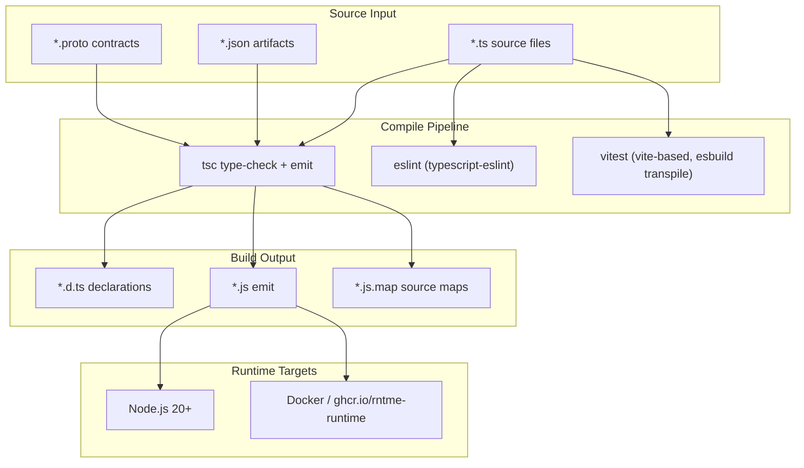

# Dependency Research: TypeScript

Researched: 2026-04-28
Repository: /home/coder/work/rntme
Domain/ecosystem: npm/typescript-tooling
Current version(s) in rntme: `typescript ^5.5.4` (34 packages), `typescript ^5.6.0` (4 packages); `@types/node ^20.14.0` (16 packages)
Latest stable version: TypeScript 6.0.3 (2026-04-16); `@types/node` 25.6.0 (2026-04-28)
Confidence: HIGH

## User Constraints

- Goal: understand current dependencies and migrate rntme to latest safe versions later.
- Output must be written to `docs/research/typescript/README.md`.
- Research-only: do not perform dependency upgrades or runtime code migrations in this issue.
- Look for better-suited libraries/solutions, not only latest version of the current choice.
- Use authoritative current sources: Context7 where applicable, official docs/changelog/releases, npm/GitHub/container registry, migration guides, security advisories.

## Summary

TypeScript has undergone a major version transition with the release of **6.0.3** (April 2026). This is a strategically significant release because it is explicitly designed as the **bridge to TypeScript 7.0**, which will be a complete native rewrite in Go with dramatic performance improvements. TypeScript 6.0 introduces many breaking changes and deprecations that prepare the ecosystem for the 7.0 transition, including new defaults (`strict: true`, `module: esnext`, `target: es2025`, `types: []`), removal of legacy module formats (AMD/UMD/SystemJS), and deprecation of `baseUrl`, `moduleResolution node`, and `target: es5`.

rntme currently uses TypeScript **5.5.4** across most packages and **5.6.0** in a few frontend-facing packages (`@rntme/ui`, `@rntme/ui-runtime`, `@rntme/db-studio`, landing app). The gap to 6.0.3 is **one major version** with substantial behavioral changes. The `@types/node` dependency is at **20.14.0** while the latest is **25.6.0** (Node 25 types), representing a 5-major-version gap.

Primary recommendation: **KEEP + UPGRADE** to TypeScript 6.0.3 in a dedicated migration wave, because (1) 6.0 is the last stable JavaScript-based compiler before the Go rewrite, (2) it provides a migration path with `ignoreDeprecations`, and (3) staying on 5.x indefinitely means missing security fixes and eventually being unable to use modern `@types/*` packages. However, this upgrade requires touching **all 38+ package.json files** and potentially adjusting `tsconfig.base.json` due to changed defaults. An alternative is **KEEP PINNED** on 5.6.x and defer the 6.x migration until after TypeScript 7.0 GA, if the team prefers to skip the transition release entirely.

## Current Usage in rntme

| Package / image / tool | Current version | Used by | Source file(s) | Runtime/dev/build/test | Notes |
|---|---|---|---|---|---|
| `typescript` | `^5.5.4` | 34 packages | All `package.json` under `packages/*`, `modules/*`, `demo/*`, `rntme-cli/packages/*` | dev | `devDependency` everywhere |
| `typescript` | `^5.6.0` | 4 packages | `packages/ui`, `packages/ui-runtime`, `packages/db-studio`, `rntme-cli/apps/landing` | dev | Slightly newer pin for frontend-facing packages |
| `@types/node` | `^20.14.0` | 16 packages | `modules/*`, `rntme-cli/packages/*` | dev | Type definitions for Node.js APIs |

Verified via:
```bash
grep -r '"typescript"' /home/coder/work/rntme --include="package.json" | grep -v node_modules | wc -l  # 38 package.json files
grep -r '"@types/node"' /home/coder/work/rntme --include="package.json" | grep -v node_modules | wc -l  # 16 package.json files
cat tsconfig.base.json  # shows target: ES2022, module: ES2022, moduleResolution: Bundler, strict: true
```

Usage patterns observed:
- `tsconfig.base.json` at repo root with shared compiler options; per-package `tsconfig.json` extends it
- `target: ES2022`, `module: ES2022`, `moduleResolution: Bundler`, `strict: true`
- Advanced strictness flags enabled: `noImplicitOverride`, `noUncheckedIndexedAccess`, `exactOptionalPropertyTypes`, `isolatedModules`
- `verbatimModuleSyntax: true` — enforces explicit `type` imports/exports
- Build via `tsc -p tsconfig.json` in every package; `tsconfig.check.json` for typecheck-only pass
- No `baseUrl` or `paths` usage in `tsconfig.base.json` (good — avoids 6.0 deprecation)

## Latest Versions / Release State

| Channel | Version | Release date | Source | Notes |
|---|---|---|---|---|
| Stable (TypeScript) | 6.0.3 | 2026-04-16 | [GitHub releases](https://github.com/microsoft/TypeScript/releases/tag/v6.0.3) | Latest stable; patch release fixing generic JSX inference and import assertion deprecation |
| Stable (TypeScript) | 6.0.2 | 2026-03-23 | [GitHub releases](https://github.com/microsoft/TypeScript/releases/tag/v6.0.2) | Initial stable release of 6.0 |
| Previous stable | 5.8.3 | 2026-01-29 | [GitHub releases](https://github.com/microsoft/TypeScript/releases/tag/v5.8.3) | Last 5.x release |
| Nightly / preview | `@typescript/native-preview` | ongoing | [npm](https://www.npmjs.com/package/@typescript/native-preview) | TypeScript 7.0 Go-native preview |
| Stable (`@types/node`) | 25.6.0 | 2026-04-28 | [npm](https://www.npmjs.com/package/@types/node) | Node 25 type definitions |
| LTS-like (`@types/node`) | 20.19.39 | 2026-04-28 | [npm](https://www.npmjs.com/package/@types/node) | Node 20 type definitions (latest patch) |

Version gap: TypeScript 5.5.4/5.6.0 → 6.0.3 is one major version with significant breaking changes. `@types/node` 20.14.0 → 25.6.0 is five major versions.

## Standard Stack

### Core
| Library | Version | Purpose | Why Standard |
|---|---|---|---|
| `typescript` | 6.0.3 | TypeScript compiler and language service | De facto standard for typed JavaScript; only mature option with full IDE support |
| `@types/node` | 25.6.0 (or 20.19.39) | Node.js built-in API type definitions | Standard type definitions from DefinitelyTyped |
| `tsx` | ^4.19.0 | TypeScript execution for dev/test | Standard for running TS without pre-compilation; faster than `ts-node` |

### Supporting
| Library | Version | Purpose | When to Use |
|---|---|---|---|
| `typescript-eslint` | ^8.31.0 | ESLint rules for TypeScript | Already used in rntme; keep aligned with TS version |
| `vite` | ^6.3.0 | Build tool (used by ui-runtime) | Handles TS transpilation internally; less sensitive to tsc version |
| `esbuild` | ^0.25.0 | Bundler (used by ui-runtime SPA build) | Handles TS transpilation internally; less sensitive to tsc version |

### Alternatives Considered
| Instead of | Could Use | Tradeoff | Recommendation for rntme |
|---|---|---|---|
| TypeScript | JSDoc + `tsc --checkJs` | No compile step, but weaker type inference, no generics, poor IDE experience | **Not recommended** — rntme relies heavily on advanced TypeScript features (branded types, strict mode, exactOptionalPropertyTypes) |
| TypeScript | Flow | Facebook's type checker; minimal ecosystem, no active development | **Not recommended** — Flow is effectively unmaintained; ecosystem has consolidated on TS |
| TypeScript | SWC + JSDoc | SWC is faster for transpilation but provides no type checking | **Not recommended** — rntme needs type checking as a build gate; SWC is a transpiler, not a type checker |
| TypeScript | Babel + `babel-plugin-typescript` | Babel strips types but does not check them | **Not recommended** — same issue as SWC; Babel does not type-check |
| TypeScript | Go-native TS 7.0 preview | ~10x faster compilation, but still in preview, API may change | **Evaluate after GA** — promising for build performance, but too early for production; plan to adopt 7.0 after stable release |

Installation / upgrade commands, if eventually recommended:
```bash
# Upgrade root/workspace-wide (pnpm will propagate via workspace protocol)
pnpm add -D typescript@^6.0.3 @types/node@^25.6.0

# Or pin to Node 20 types if staying on Node 20 runtime
pnpm add -D typescript@^6.0.3 @types/node@^20.19.39

# Upgrade typescript-eslint to match
pnpm add -D typescript-eslint@^8.31.0
```

## Architecture Patterns

### System Architecture Diagram


### Component Responsibilities
| Component | File Mapping | Responsibility |
|---|---|---|
| `typescript` (compiler) | `node_modules/typescript/lib/tsc.js` | Type-checking, declaration emit, `.js` transpilation |
| `typescript` (language service) | `node_modules/typescript/lib/tsserver.js` | IDE support: autocomplete, go-to-definition, refactoring |
| `@types/node` | `node_modules/@types/node/*.d.ts` | Type definitions for Node.js built-in modules (`fs`, `path`, `process`, etc.) |
| `tsconfig.base.json` | `/tsconfig.base.json` | Shared compiler configuration for all packages |
| Per-package `tsconfig.json` | `packages/<name>/tsconfig.json` | Package-specific overrides (rootDir, outDir, include) |
| `tsconfig.check.json` | `packages/<name>/tsconfig.check.json` | Typecheck-only config (no emit) for CI speed |

### Recommended Project Structure
```
rntme/
├── tsconfig.base.json          # Shared: strict, ES2022, Bundler resolution
├── package.json                # Workspace root, pnpm workspaces
├── packages/
│   ├── runtime/
│   │   ├── tsconfig.json       # extends ../../tsconfig.base.json
│   │   ├── tsconfig.check.json # noEmit: true
│   │   └── src/                # TypeScript source
│   └── ...
└── docs/research/
    └── typescript/
        └── README.md
```

### Verified Patterns

**Pattern 1: Strict branded types with exact optional properties**
```typescript
// From rntme conventions (AGENTS.md): branded Validated* types
type ValidatedProjectBlueprint = string & { readonly __brand: 'ValidatedProjectBlueprint' };

function validateBlueprint(raw: unknown): Result<ValidatedProjectBlueprint> {
  // ... validation logic
  return { ok: true, value: raw as ValidatedProjectBlueprint };
}

// exactOptionalPropertyTypes ensures optionality is preserved exactly
interface Config {
  name: string;
  port?: number;  // must be number | undefined, not just omitted
}
```
This pattern relies on `strict: true` + `exactOptionalPropertyTypes: true`. TypeScript 6.0 preserves full support and makes `strict: true` the default, reinforcing this pattern.

**Pattern 2: verbatimModuleSyntax for explicit type-only imports**
```typescript
// Required by rntme's tsconfig.base.json
import type { CommandExecutor } from './executor.js';
import { executeCommand } from './executor.js';

// ❌ Error: 'executeCommand' is a value, must use regular import
// import type { executeCommand } from './executor.js';
```
TypeScript 6.0 preserves `verbatimModuleSyntax` and makes `isolatedModules` behavior more predictable. The Go-native 7.0 compiler will maintain this.

**Pattern 3: Bundler module resolution with subpath imports**
```typescript
// tsconfig.base.json: "moduleResolution": "Bundler"
// TypeScript 6.0 now supports #/ subpath imports
import { utils } from '#/utils';
```
TypeScript 6.0 adds support for `#/` subpath imports under `nodenext` and `bundler` resolution. This is useful if rntme adopts Node.js subpath imports in the future.

### Anti-Patterns
- **Using `any` instead of `unknown`**: Bypasses the type system; use `unknown` with type guards.
- **Casting to `Validated*` brands**: `value as ValidatedProjectBlueprint` without running the validator defeats the brand contract.
- **`@ts-ignore` over `@ts-expect-error`**: `@ts-expect-error` fails if the error disappears; `@ts-ignore` is invisible.
- **Implicit `any` with `noImplicitAny: false`**: TypeScript 6.0 defaults `strict: true`, making this impossible by default.

## Don't Hand Roll

| Problem | Hidden Complexity | Existing Solution |
|---|---|---|
| Type-safe JSON parsing/validation | Recursive schema validation, error messages, union discrimination | `zod`, `valibot`, `arktype` — already used in rntme's binding layer |
| Branded nominal types | Structural typing makes distinct string types collapse | TypeScript's intersection types (`string & { __brand }`) — use as rntme already does |
| Exhaustive switch/case checking | Missing cases silently produce `undefined` | `switch` with `never` fallback: `default: const _exhaustive: never = x;` |
| Deep immutable types | Recursive `Readonly<T>` doesn't cover nested objects | `Readonly<T>` + `as const` assertion, or `deep-freeze` utilities |
| Type-safe event emitters | Event name strings are not type-safe | `EventEmitter` generic wrappers or `mitt` with typed events |
| Declaration file generation | `d.ts` emit requires understanding module resolution | Let `tsc --declaration` handle it; use `verbatimModuleSyntax` to avoid emit issues |

## Common Pitfalls

### Pitfall 1: TypeScript 6.0 default `types: []` breaks `@types/node` globals
**What goes wrong:** After upgrading to TypeScript 6.0, `Cannot find name 'process'` / `Cannot find module 'fs'` errors appear everywhere because `types` now defaults to `[]` instead of auto-including all `@types/*` packages.
**Root cause:** TypeScript 6.0 changed the default `types` from `"*"` (auto-discover) to `[]` (none) for performance and predictability.
**Prevention:** Add `"types": ["node"]` (and any other needed globals like `jest`) to `tsconfig.base.json` before upgrading.
**Warning signs:** Massive wave of "Cannot find name" errors for built-in Node.js globals immediately after `pnpm install typescript@6`.

### Pitfall 2: `rootDir` default change breaks output directory structure
**What goes wrong:** Compiled `.js` files appear in `./dist/src/` instead of `./dist/` because `rootDir` now defaults to `.` (directory containing `tsconfig.json`) instead of being inferred from source files.
**Root cause:** TypeScript 6.0 changed `rootDir` default. rntme's per-package `tsconfig.json` files already set `"rootDir": "src"`, so this is mitigated, but any package without explicit `rootDir` will break.
**Prevention:** Audit all `tsconfig.json` files to ensure `rootDir` is explicitly set.
**Warning signs:** CI build artifacts have wrong paths; `dist/` contains nested `src/` directory.

### Pitfall 3: Deprecated `moduleResolution: node` (node10) removal
**What goes wrong:** TypeScript 6.0 deprecates `moduleResolution: node` (the old Node 10 algorithm). If any package or tool still uses it, resolution of `node_modules` packages may fail or behave differently.
**Root cause:** `moduleResolution: node` is inaccurate for modern Node.js; 6.0 deprecates it in favor of `nodenext` or `bundler`.
**Prevention:** rntme already uses `"moduleResolution": "Bundler"` in `tsconfig.base.json` — verify no package overrides this to `"node"`.
**Warning signs:** Resolution errors for ESM packages, or `tsconfig.json` deprecation warnings during build.

## Code Examples

### Example 1: Temporal API types (new in TypeScript 6.0)
```typescript
// TypeScript 6.0 adds built-in types for Temporal (Stage 4 ECMAScript proposal)
// Available under --target esnext or --lib esnext

function getRelativeTime(hoursAgo: number): string {
  const now = Temporal.Now.instant();
  const past = now.subtract({ hours: hoursAgo });
  const duration = now.since(past);
  return `${duration.hours} hours ago`;
}

// Temporal types are now globally available without installing extra @types packages
```
Source: [TypeScript 6.0 release blog](https://devblogs.microsoft.com/typescript/announcing-typescript-6-0/), Temporal proposal Stage 4 status.

### Example 2: Map.getOrInsert (new ES2025 lib)
```typescript
// TypeScript 6.0 adds types for Map.getOrInsert / getOrInsertComputed (Stage 4)
// Available under --lib esnext

function getOrCreateConfig(options: Map<string, unknown>): unknown {
  // No more verbose has/get/set pattern
  return options.getOrInsert("strict", true);
}

// getOrInsertComputed for expensive defaults
const cache = new Map<string, Buffer>();
const data = cache.getOrInsertComputed("key", () => {
  return Buffer.from(expensiveComputation());
});
```
Source: [TypeScript 6.0 release blog](https://devblogs.microsoft.com/typescript/announcing-typescript-6-0/), ECMAScript "upsert" proposal Stage 4.

### Example 3: Preparing for TypeScript 7.0 with `--stableTypeOrdering`
```typescript
// TypeScript 6.0 introduces --stableTypeOrdering to align with 7.0's deterministic ordering
// This helps catch ordering-dependent issues before migrating to the Go-native compiler

// In tsconfig.json:
{
  "compilerOptions": {
    "stableTypeOrdering": true  // Diagnostic only; up to 25% slower
  }
}

// Use this flag temporarily to compare declaration emit between 6.0 and 7.0 previews
// Expected: union type ordering becomes deterministic regardless of declaration order
```
Source: [TypeScript 6.0 release blog](https://devblogs.microsoft.com/typescript/announcing-typescript-6-0/), native port preparation docs.

## SOTA Updates

### 2024–2025 TypeScript Ecosystem Changes
- **TypeScript 5.5 (June 2024)**: Inferred type predicates, `noInfer<T>` utility, regex-validated string types, JSDoc `@import` tag.
- **TypeScript 5.6 (September 2024)**: Disallowed `null`/`undefined` in truthy checks, iterator helper types, `ArrayBuffer`/`SharedArrayBuffer` typing improvements.
- **TypeScript 5.7 (November 2024)**: Searchable inferred types in `--noCheck`, `checkJs` improvements, linked cursors in TS Server.
- **TypeScript 5.8 (January 2026)**: Last 5.x release; `await` in `using` declarations, computed property names in enums, granular `lib` options.
- **TypeScript 6.0 (March 2026)**: Transition release — bridge to 7.0. New defaults, deprecations, `es2025` target, Temporal types, `#/` subpath imports, `--stableTypeOrdering`.
- **TypeScript 7.0 (in preview, Go-native)**: Complete compiler rewrite in Go. ~10x faster compilation, shared-memory multi-threading, same language semantics. Available as `@typescript/native-preview`.

### New Tools / Patterns
- **`tsx` replacing `ts-node`**: `tsx` is now the standard for running TypeScript in development; it's faster and simpler.
- **TypeScript-eslint v8**: Major rewrite with flat config support, performance improvements, stricter rules.
- **Node.js type stripping (experimental in Node 22+)**: Node.js can now run `.ts` files directly with type comments stripped, reducing the need for `tsx` in some scenarios.
- **Deno 2 native TypeScript**: Deno 2 (released late 2024) has stabilized and is an alternative runtime with built-in TS support.

### Deprecated / Outdated Approaches
- `ts-node` → replaced by `tsx` or Node.js native type stripping
- `moduleResolution: node` (node10) → deprecated in 6.0, use `bundler` or `nodenext`
- `target: es5` → deprecated in 6.0, lowest supported is ES2015
- `baseUrl` → deprecated in 6.0, use explicit `paths` prefixes
- `amd`/`umd`/`systemjs` module targets → removed in 6.0
- `outFile` → removed in 6.0, use external bundlers (esbuild, Rollup, Vite)

## Migration Assessment

### Breaking Changes (TypeScript 5.x → 6.0)
| Change | Impact on rntme | Mitigation |
|---|---|---|
| `strict: true` by default | LOW — rntme already sets `strict: true` | No action needed |
| `module: esnext` by default | LOW — rntme already uses `module: ES2022` | No action needed |
| `target: es2025` by default | LOW — rntme uses `target: ES2022`; could upgrade | Consider `ES2025` for new APIs (RegExp.escape, Set methods) |
| `types: []` by default | **MEDIUM** — need to add `"types": ["node"]` | Add to `tsconfig.base.json` before upgrade |
| `rootDir: .` by default | **MEDIUM** — packages without explicit `rootDir` break | Audit all `tsconfig.json` files; most already set it |
| `moduleResolution node` deprecated | LOW — rntme uses `Bundler` | Verify no override to `node` |
| `baseUrl` deprecated | **LOW** — rntme doesn't use it | No action needed |
| `esModuleInterop false` removed | LOW — rntme already enables it | No action needed |
| `alwaysStrict false` removed | LOW — rntme targets ES2022+ (strict by default) | No action needed |
| Legacy `module` syntax (`module Foo {}`) deprecated | LOW — unlikely used in rntme | Search codebase for `module ` keyword |
| `asserts` on imports deprecated | LOW — rntme uses `with` or no attributes | Verify no `asserts` usage |
| `outFile` removed | LOW — rntme uses per-package emit | No action needed |
| `noUncheckedSideEffectImports: true` default | LOW — likely catches real bugs | Fix any accidental side-effect imports |
| `--stableTypeOrdering` flag | LOW — diagnostic only | Use temporarily for 7.0 migration prep |

### Migration Path / Effort
1. **Pre-upgrade audit** (1–2 hours):
   - Search for deprecated syntax: `module ` namespaces, `asserts` imports, `baseUrl`
   - Verify all `tsconfig.json` have explicit `rootDir`
   - Add `"types": ["node"]` to `tsconfig.base.json`

2. **Version bump** (30 min):
   - Update `typescript` in root `package.json` or use pnpm catalog/workspace protocol
   - Update `@types/node` to desired version (20.19.39 LTS or 25.6.0 latest)

3. **Build validation** (2–4 hours):
   - Run `pnpm -r run build` — expect new errors from stricter defaults
   - Run `pnpm -r run typecheck`
   - Run `pnpm -r run test`
   - Run `pnpm -r run lint`

4. **Fix regressions** (2–6 hours, depends on error count):
   - Address `types: []` missing globals
   - Fix any `rootDir`-related output path issues
   - Resolve new strictness errors (usually minor)

**Estimated total effort**: 1–2 days for a single engineer.

### Test Strategy
- All existing CI gates (`build`, `typecheck`, `test`, `lint`) must pass
- Add a temporary `stableTypeOrdering: true` build to CI to prep for 7.0
- Verify Docker image build (`ghcr.io/vladprrs/rntme-runtime`) still works
- Run the demo (`demo/issue-tracker-api`) end-to-end

### Compatibility
- **Node.js runtime**: TypeScript 6.0 supports Node 18+; rntme requires Node 20+ — compatible
- **ESLint / typescript-eslint**: Requires v8.x for TypeScript 6.0 support — verify current version
- **Vite / esbuild**: Transpile TypeScript internally; generally compatible with 6.0 syntax
- **Vitest**: Uses Vite/esbuild under the hood; should be compatible
- **Docker base image**: `node:20-alpine` or later — compatible

### Security / Performance / Maintenance Implications
- **Security**: TypeScript 6.0 includes no critical security fixes (it's a compiler, not runtime), but staying current ensures access to latest `@types/*` security patches
- **Performance**: TypeScript 6.0 is similar in speed to 5.8; the big performance gain comes with 7.0 (Go-native)
- **Maintenance**: TypeScript 5.x will eventually stop receiving updates; 6.0 is the migration path to 7.0
- **Type definitions**: `@types/node` 20.x is still maintained, but 25.x gets newer APIs; rntme runs on Node 20, so either is fine

## Recommendation

**KEEP + UPGRADE** to TypeScript 6.0.3, with the following plan:

1. **Short-term** (next 2–4 weeks): Prepare migration by adding `"types": ["node"]` to `tsconfig.base.json`, auditing `rootDir` settings, and removing any deprecated syntax. Run `stableTypeOrdering: true` in a branch to preview 7.0 behavior.

2. **Medium-term** (next 1–2 months): Execute the 6.0.3 upgrade across all packages. Bump `@types/node` to `^20.19.39` (stay on Node 20 types since runtime targets Node 20) or `^25.6.0` if confident. Update `typescript-eslint` to v8 if not already there.

3. **Long-term** (after TypeScript 7.0 GA): Evaluate the Go-native compiler (`@typescript/native-preview` → stable). The ~10x build speed improvement will significantly benefit rntme's large monorepo. Plan migration from 6.0 → 7.0 after community adoption stabilizes (estimated Q3 2026).

**Rationale:**
- rntme's `tsconfig.base.json` is already aligned with TypeScript 6.0's philosophy (strict, ES2022, Bundler resolution)
- The breaking changes are manageable and mostly configuration-level
- Staying on 5.x indefinitely creates technical debt and blocks future ecosystem upgrades
- TypeScript 6.0 is the supported migration path to the transformative 7.0 release

**Alternative:** If the team wants to minimize disruption, **KEEP PINNED** on 5.6.x and jump directly to TypeScript 7.0 when it GA's. This skips the 6.0 transition but defers access to 6.0+ ecosystem improvements.

## Open Questions

1. **Node.js version strategy**: Should rntme upgrade to Node 22 LTS (released Oct 2025) before or after the TypeScript upgrade? Node 22 has native type stripping which could simplify the dev workflow.

2. **TypeScript 7.0 preview evaluation**: Should we create a spike issue to test `@typescript/native-preview` on a branch? The performance gains are compelling for CI build times.

3. **pnpm workspace catalogs**: Should rntme adopt pnpm workspace catalogs (introduced in pnpm 9.5+) to centralize `typescript` and `@types/node` versions, eliminating the current version drift between packages?

4. **@types/node version**: Should we align `@types/node` with the runtime Node version (20.x) or use latest (25.x) for forward-compatibility? Latest types may include APIs not present in Node 20.

## Sources

### Primary (HIGH confidence)
- [TypeScript 6.0 Release Blog Post](https://devblogs.microsoft.com/typescript/announcing-typescript-6-0/) — Official Microsoft announcement, March 23 2026
- [TypeScript 6.0.3 GitHub Release](https://github.com/microsoft/TypeScript/releases/tag/v6.0.3) — Release notes, April 16 2026
- [TypeScript 6.0 Breaking Changes Wiki](https://github.com/microsoft/TypeScript/wiki/Breaking-Changes) — Official breaking changes documentation
- [TypeScript Native Port (Go) Announcement](https://devblogs.microsoft.com/typescript/typescript-native-port/) — December 2025 update
- npm registry: `typescript@6.0.3`, `@types/node@25.6.0` — Verified via `npm view`

### Secondary (MEDIUM confidence)
- [TypeScript 7.0 Progress Update](https://devblogs.microsoft.com/typescript/progress-on-typescript-7-december-2025/) — Native port progress
- [TypeScript Native Preview npm package](https://www.npmjs.com/package/@typescript/native-preview) — Available for testing
- [Node.js Type Stripping documentation](https://nodejs.org/api/typescript.html) — Experimental TS support in Node 22+
- rntme repository `tsconfig.base.json`, `package.json` files — Current configuration verification

### Tertiary (LOW confidence)
- Community benchmarks for TypeScript 7.0 native preview — Early reports suggest 5–15x speedup
- pnpm workspace catalogs documentation — Feature in pnpm 9.5+, may simplify version management
- Deno 2 as alternative runtime — Not directly relevant to rntme's Node.js target

## Metadata

| Field | Value |
|---|---|
| Research scope | TypeScript compiler, language service, and Node.js type definitions (`@types/node`) |
| Confidence | HIGH for current usage and 6.0 features; MEDIUM for TypeScript 7.0 timeline; HIGH for alternatives analysis |
| Research date | 2026-04-28 |
| Validity window | 3–6 months; TypeScript 7.0 GA may shift recommendations |
| Readiness for migration planning | YES — document provides actionable checklist, effort estimate, and risk assessment for 5.x → 6.0 migration |
| Follow-up tasks | 1. Create migration issue for TypeScript 6.0.3 upgrade; 2. Spike TypeScript 7.0 native preview on branch; 3. Evaluate pnpm workspace catalogs for version centralization; 4. Decide Node.js 22 upgrade timeline |
