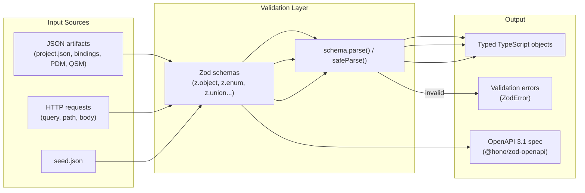

# Dependency Research: zod

Researched: 2026-04-28
Repository: /home/coder/work/rntme
Domain/ecosystem: npm/schema-validation
Current version(s) in rntme: `^4.0.0` (resolved to `4.3.6` via pnpm-lock.yaml)
Latest stable version: 4.3.6 (npm, 2025-07)
Confidence: HIGH

## User Constraints

- Goal: understand current dependencies and migrate rntme to latest safe versions later.
- Output must be written to `docs/research/zod/README.md`.
- Research-only: do not perform dependency upgrades or runtime code migrations in this issue.
- Look for better-suited libraries/solutions, not only latest version of the current choice.
- Use authoritative current sources: Context7 where applicable, official docs/changelog/releases, npm/GitHub/container registry, migration guides, security advisories.

## Summary

Zod remains the de-facto standard for TypeScript-first schema validation (34k+ GitHub stars, maintained by Colin McDonnell / @colinhacks). The library is actively maintained with a predictable release cadence. rntme is already on Zod 4 — the latest major version released in 2025 as a ground-up rewrite with dramatic speed improvements, a simpler internal structure, and new features.

rntme currently uses zod `^4.0.0` (resolved to `4.3.6`) across **15 packages** in the monorepo, including all core runtime packages (`@rntme/bindings`, `@rntme/pdm`, `@rntme/qsm`, `@rntme/blueprint`, `@rntme/graph-ir-compiler`, `@rntme/runtime`, `@rntme/seed`, `@rntme/ui`, `@rntme/ui-runtime`, `@rntme/db-studio`) and CLI-side packages (`@rntme-cli/cli`, `@rntme-cli/deploy-core`, `@rntme-cli/platform-core`, `@rntme-cli/platform-http`). The `@rntme-cli/platform-http` package also depends on `@hono/zod-openapi` `^0.16.0` for OpenAPI schema generation from Zod schemas.

The latest stable release is `v4.3.6`. Zod 4 is a major rewrite that introduced breaking changes primarily for **library authors** relying on internal APIs (`_def`, `.constructor`, subclass internals). For typical end-users (like rntme), the migration from v3 to v4 was straightforward — most schema definitions work unchanged. rntme has already completed this migration and is running on v4.

Primary recommendation: **KEEP current zod ^4.0.0 pinned to the latest patch (4.3.6) and stay on the v4 line. Evaluate Zod Mini for future bundle-size-sensitive packages. No urgent migration needed.**

## Current Usage in rntme

| Package / image / tool | Current version | Used by | Source file(s) | Runtime/dev/build/test | Notes |
|---|---:|---|---|---|---|
| `@rntme/bindings` | `^4.0.0` | Bindings artifact validator | `packages/bindings/src/parse/schema.ts` | runtime | 147 lines; defines HTTP binding schemas (parameters, pre-steps, callbacks) |
| `@rntme/pdm` | `^4.0.0` | PDM parser/validator | `packages/pdm/src/parse/schema.ts` | runtime | 75 lines; entity/field/relation/stateMachine schemas |
| `@rntme/qsm` | `^4.0.0` | QSM parser/validator | `packages/qsm/src/parse/schema.ts` | runtime | 58 lines; projection table schemas |
| `@rntme/blueprint` | `^4.0.0` | Blueprint parser | `packages/blueprint/src/parse/schema.ts` | runtime | 46 lines; project composition schemas |
| `@rntme/graph-ir-compiler` | `^4.0.0` | Graph IR validator | `packages/graph-ir-compiler/src/parse/schema.ts` | runtime | 236 lines; largest schema file; query/command node types |
| `@rntme/runtime` | `^4.0.0` | Manifest parser | `packages/runtime/src/manifest/schema.ts`, `src/manifest/parse.ts` | runtime | Service manifest validation |
| `@rntme/seed` | `^4.0.0` | Seed validator | `packages/seed/src/schema.ts`, `src/parse.ts` | runtime | Seed envelope validation |
| `@rntme/ui` | `^4.0.0` | UI artifact validator | (dist only in main) | runtime | UI component schemas |
| `@rntme/ui-runtime` | `^4.0.0` | UI runtime registry | `packages/ui-runtime/src/client/registry.ts` | runtime | Client-side schema resolution |
| `@rntme/db-studio` | `^4.0.0` | Hrana endpoint schemas | `packages/db-studio/src/hrana/schema.ts` | runtime | libSQL Hrana v3 protocol schemas |
| `@rntme/bindings-http` | `^4.0.0` | HTTP primitive schemas | `packages/bindings-http/src/startup/zod-schema.ts`, `src/startup/primitive-schema.ts`, `src/errors.ts` | runtime | Builds Zod schemas from Graph IR primitives for request validation |
| `@rntme-cli/cli` | `^4.0.0` | CLI schemas | (various) | build/runtime | CLI command/config validation |
| `@rntme-cli/deploy-core` | `^4.0.0` | Deployment plan schemas | (various) | build/runtime | Target-neutral deployment plan validation |
| `@rntme-cli/platform-core` | `^4.0.0` | Platform core schemas | (various) | runtime | Platform entity validation |
| `@rntme-cli/platform-http` | `^4.0.0` | HTTP server schemas | (various) | runtime | Also depends on `@hono/zod-openapi` `^0.16.0` for OpenAPI emission |

**Verification commands used:**
```bash
# Find all package.json references
grep -r "\"zod\"" /home/coder/work/rntme --include="package.json" --exclude-dir=node_modules --exclude-dir=.worktrees

# Find all source usage
grep -r "import.*zod" /home/coder/work/rntme/packages --include="*.ts" -l | grep -v dist | grep -v node_modules

# Check resolved version in lockfile
grep -A2 "zod@4" /home/coder/work/rntme/pnpm-lock.yaml
```

## Latest Versions / Release State

| Channel | Version | Release date | Source | Notes |
|---|---:|---|---|---|
| Latest stable | 4.3.6 | 2025-07 | npm / GitHub | Current stable; ground-up rewrite from v3 |
| Previous major | 3.25.76 | 2025-07 | npm | Last v3 release; maintenance mode |
| v4 prerelease | 4.4.0-canary.* | 2026-Q1 | npm (canary) | Active development; not for production |

**Release cadence:** Zod v4 shipped in 2025 after ~3 months of full-time rewrite work. Patch releases are frequent. The v3 line is in maintenance mode but still receiving patches for critical fixes.

## Standard Stack

### Core
| Library | Version | Purpose | Why Standard |
|---|---:|---|---|
| `zod` | ^4.3.6 | TypeScript-first schema validation | Dominant in TS ecosystem; static type inference; composable schemas; 34k+ stars |
| `@hono/zod-openapi` | ^0.16.0 | OpenAPI 3.1 schema generation from Zod | Official Hono integration; widely adopted for Hono + Zod stacks |
| `@asteasolutions/zod-to-openapi` | ^7.3.4 | Alternative OpenAPI generation | Popular alternative; supports more OpenAPI features |
| `@hono/zod-validator` | ^0.3.0 | Hono middleware for Zod validation | Lightweight request validation middleware |

### Supporting
| Library | Version | Purpose | When to Use |
|---|---:|---|---|
| `zod/mini` | bundled with zod | Tree-shakable variant | Bundle-size-sensitive packages (frontend, edge functions) |
| `zod/v3` | bundled with zod | Backward-compatible v3 API | Library authors supporting both v3 and v4 |
| `zod/v4/core` | bundled with zod | Core v4 types | Library authors building on Zod 4 |

### Alternatives Considered
| Instead of | Could Use | Tradeoff | Recommendation for rntme |
|---|---|---|---|
| `zod` | `valibot` | Smaller bundle size, modular imports, similar API | **Evaluate later**. Valibot is strong for bundle size but Zod's ecosystem dominance and Hono integration make it the safer choice for rntme today |
| `zod` | `arktype` | Faster runtime validation, different API style | **Not recommended**. Arktype has a steeper learning curve and smaller community; good for performance-critical paths but not general-purpose |
| `zod` | `yup` | Mature, older, similar chaining API | **Keep zod**. Yup is less actively maintained; Zod's TypeScript integration is superior |
| `zod` | `joi` | Battle-tested, Node.js focused, no native TS inference | **Keep zod**. Joi requires separate type definitions; Zod's inference is its killer feature |
| `zod` | `superstruct` | Smaller, functional API | **Keep zod**. Superstruct is less popular; Zod's ecosystem (Hono, OpenAPI) is unmatched |
| `zod` | JSON Schema + `ajv` | Faster validation, standard format | **Keep zod**. Ajv requires separate schema + type definitions; Zod's single-source-of-truth is more maintainable for rntme's artifact-driven model |

Installation / upgrade commands, if eventually recommended:
```bash
# Upgrade to latest patch
pnpm add zod@^4.3.6
# Evaluate Zod Mini for bundle-sensitive packages
pnpm add zod@^4.3.6  # zod/mini is bundled; no separate install needed
```

## Architecture Patterns

### System Architecture Diagram



### Component Responsibilities

| Component | Responsibility | Implementation mapping | Notes |
|---|---|---|---|
| `zod` core | Schema definition, type inference, parsing | `packages/*/src/parse/schema.ts` | Single source of truth for types + runtime validation |
| `z.object()` | Structural validation of JSON artifacts | All `schema.ts` files | `.strict()` used extensively to reject unknown keys |
| `z.enum()` | Closed set validation | `packages/pdm/src/parse/schema.ts:12` | Used for primitives, HTTP methods, input modes |
| `z.union()` / `z.discriminatedUnion()` | Polymorphic types | `packages/bindings/src/parse/schema.ts` | Discriminated unions for pre-steps, input sources |
| `@hono/zod-openapi` | OpenAPI spec generation | `rntme-cli/packages/platform-http` | Bridges Zod schemas to OpenAPI 3.1 documentation |
| `zod/mini` (potential) | Tree-shakable validation for frontend | Not currently used | Could reduce bundle size for `@rntme/ui-runtime` |

### Recommended Project Structure

```text
packages/<name>/
├── src/
│   ├── parse/
│   │   ├── schema.ts      # Zod schema definitions
│   │   └── parse.ts       # parse() wrappers with domain-specific error handling
│   └── types.ts           # Inferred types: export type X = z.infer<typeof XSchema>
```

### Pattern 1: Artifact Schema with Strict Mode
What: Define schemas for JSON artifacts using `.strict()` to prevent unexpected keys, with `.optional()` for nullable fields.
When to use: All artifact validation in rntme.
Example:
```ts
// Source: packages/pdm/src/parse/schema.ts
import { z } from 'zod';

const fieldSchema = z
  .object({
    type: z.enum(['integer', 'decimal', 'string', 'boolean', 'date', 'datetime']),
    nullable: z.boolean(),
    column: z.string().min(1),
    generated: z.enum(['id', 'createdAt', 'updatedAt', 'actor']).optional(),
  })
  .strict();
```

### Pattern 2: Discriminated Union for Polymorphic Types
What: Use `z.discriminatedUnion()` for types with a shared discriminant field.
When to use: Pre-steps, input sources, event types.
Example:
```ts
// Source: packages/bindings/src/parse/schema.ts
const PreStepSchema = z.discriminatedUnion('kind', [
  z.object({ kind: z.literal('system'), op: z.literal('randomBytes'), bytes: z.number().int().min(1) }),
  z.object({ kind: z.literal('module-rpc'), input: z.unknown(), timeoutMs: z.number().int().optional() }),
]);
```

### Pattern 3: Dynamic Schema Building from Primitives
What: Build Zod schemas dynamically at runtime from a primitive type registry.
When to use: HTTP request validation where schemas are derived from Graph IR signatures.
Example:
```ts
// Source: packages/bindings-http/src/startup/zod-schema.ts
import { z } from 'zod';

export function buildSchemas(parameters: HttpParameter[], signature: GraphSignature): BuiltSchemas {
  const byLocation: Record<'query' | 'path' | 'body', Record<string, z.ZodTypeAny>> = {
    query: {}, path: {}, body: {},
  };

  for (const p of parameters) {
    const input = signature.inputs[p.bindTo];
    let schema = primitiveSchema(input.type);
    if (isNullable(input.mode, p.in)) schema = schema.nullable();
    if (!p.required) schema = schema.optional();
    byLocation[p.in][p.name] = schema;
  }

  return {
    querySchema: z.object(byLocation.query).strict(),
    pathSchema: z.object(byLocation.path).strict(),
    ...(Object.keys(byLocation.body).length > 0 ? { bodySchema: z.object(byLocation.body).strict() } : {}),
  };
}
```

### Anti-Patterns to Avoid
- **Accessing `schema._def` directly**: In Zod 4, internal structure changed. Use public APIs. If you must inspect internals, check for `_zod` property (v4) vs `_def` (v3).
- **Creating massive union types without discrimination**: Prefer `z.discriminatedUnion()` over `z.union()` for object unions — it produces better error messages and faster validation.
- **Using `.parse()` without error handling in async contexts**: Use `.safeParse()` or wrap `.parse()` in try/catch when the result is not immediately consumed.

## Don't Hand-Roll

| Problem | Don't Build | Use Instead | Why |
|---|---|---|---|
| JSON artifact validation | Manual `typeof` checks + `as` casts | `zod` schemas with `z.infer<>` | Single source of truth; type safety at runtime; composable |
| OpenAPI spec generation | Manual YAML/JSON construction | `@hono/zod-openapi` or `@asteasolutions/zod-to-openapi` | Derives spec from existing schemas; stays in sync |
| HTTP request validation | Manual body parsing | `zod` + `@hono/zod-validator` | Automatic 400 responses with detailed error messages |
| Form/coercion validation | Manual `String()` / `Number()` casts | `z.coerce.string()`, `z.coerce.number()` | Handles edge cases (empty strings, NaN) correctly |
| Type guards | Manual `isX(obj)` functions | `zod` schemas with `.safeParse()` | Type inference + runtime validation in one |

Key insight: Zod's value is the **fusion of compile-time types and runtime validation**. Hand-rolling either half inevitably drifts from the other, especially in a codebase where agents generate artifacts.

## Common Pitfalls

### Pitfall 1: Breaking Internal API Access on Zod 4 Upgrade
What goes wrong: Code that accesses `schema._def.shape` or `schema.constructor.name` breaks after upgrading from v3 to v4.
Why it happens: Zod 4 rewrote internals. `_def` became `_zod.def`, and subclass hierarchies changed.
How to avoid: Never access internal properties. Use public APIs only. If building library code that must support both versions, import from `zod/v3` or `zod/v4/core` subpaths and branch at runtime.
Warning signs: Type errors on `_def`; runtime `undefined` when inspecting schema internals; failing tests after `pnpm update`.

### Pitfall 2: Missing `.strict()` on Object Schemas
What goes wrong: JSON artifacts with extra properties silently pass validation, causing downstream bugs when those properties are mistaken for valid.
Why it happens: Zod object schemas allow unknown keys by default (matching TypeScript's structural typing).
How to avoid: Add `.strict()` to all artifact schemas unless the shape is intentionally extensible. For truly extensible objects, use `.passthrough()` or `.catchall()`.
Warning signs: Properties appear in parsed objects that aren't in the type definition; artifact authors add typos that don't fail validation.

### Pitfall 3: Optional vs Nullable Confusion
What goes wrong: Fields that should accept `null` are marked `.optional()` (produces `undefined`), or fields that should be optional are marked `.nullable()` (produces `null`).
Why it happens: TypeScript conflates optional (`?`) and nullable (`\| null`) in developer intuition. Zod distinguishes them.
How to avoid: Be explicit: use `.optional()` for absent keys, `.nullable()` for present-but-null values, and `.optional().nullable()` for both. Document the convention in artifact specs.
Warning signs: Database inserts fail with `null` where `undefined` was expected; frontend forms show `"null"` strings.

## Code Examples

### Defining a Strict Artifact Schema with Inferred Type
```ts
// Source: packages/pdm/src/parse/schema.ts (adapted)
import { z } from 'zod';

const entitySchema = z
  .object({
    name: z.string().min(1),
    fields: z.array(fieldSchema),
    relations: z.array(relationSchema).optional(),
    stateMachine: stateMachineSchema.optional(),
  })
  .strict();

export type Entity = z.infer<typeof entitySchema>;
```

### Safe Parsing with Error Handling
```ts
// Source: https://github.com/colinhacks/zod/blob/main/packages/docs/content/packages/zod.mdx
import { z } from 'zod';

const userSchema = z.object({
  name: z.string(),
  age: z.number().min(0),
});

const result = userSchema.safeParse({ name: 'Alice', age: 30 });
if (result.success) {
  console.log(result.data.name); // typed as string
} else {
  console.error(result.error.issues);
}
```

### Dynamic Schema Building for HTTP Validation
```ts
// Source: packages/bindings-http/src/startup/zod-schema.ts (adapted)
import { z } from 'zod';

function buildBodySchema(fields: Record<string, z.ZodTypeAny>) {
  return z.object(fields).strict();
}

const schema = buildBodySchema({
  title: z.string().min(1),
  priority: z.enum(['low', 'medium', 'high']),
});

// Inferred type: { title: string; priority: 'low' | 'medium' | 'high' }
type Body = z.infer<typeof schema>;
```

## State of the Art (2024-2026)

| Old Approach | Current Approach | When Changed | Impact |
|---|---|---|---|
| Zod v3 (`_def` internals) | Zod v4 (`_zod.def` internals, protected methods) | 2025 | Ground-up rewrite; dramatic speed improvements; simpler internal structure |
| Monolithic `zod` import | Versioned subpaths (`zod/v3`, `zod/v4/core`, `zod/mini`) | 2025 | Library authors can support multiple versions; tree-shaking for Mini |
| Method chaining API | Functional API (Zod Mini) | 2025 | 64% bundle size reduction for simple schemas; better tree-shaking |
| Manual OpenAPI spec | `@hono/zod-openapi` generation | 2023+ | Single source of truth; spec stays in sync with runtime validation |
| `yup` / `joi` | `zod` for TypeScript projects | 2021+ | Zod became the dominant choice for TS-first validation |
| `z.union()` for objects | `z.discriminatedUnion()` | 2022+ | Better error messages; faster validation for object unions |

New tools/patterns to consider:
- **Zod Mini (`zod/mini`)**: Tree-shakable variant with functional API. Ideal for frontend packages or edge functions where bundle size matters.
- **Zod v4 core (`zod/v4/core`)**: Shared base for both Classic and Mini. Library authors should import from here for maximum compatibility.
- **Coercion improvements**: Zod 4 improved `z.coerce.*` handling for edge cases like empty strings.
- **Better error maps**: Simplified error map system in v4 for improved i18n support.

Deprecated/outdated:
- Zod v3 internal APIs (`_def`, `.constructor`, subclassing): broken in v4.
- `yup`: less actively maintained; inferior TypeScript integration.
- `joi`: no native type inference; requires `@types/joi`.

## Migration Assessment

| Area | Finding | Impact | Risk | Evidence |
|---|---|---|---|---|
| Current state | Already on Zod 4.3.6 | None | LOW | pnpm-lock.yaml shows `zod@4.3.6` |
| Breaking changes v3→v4 | Internal API changes (`_def` → `_zod.def`) | Already absorbed | LOW | rntme codebase uses public APIs only |
| Ecosystem compatibility | `@hono/zod-openapi` v0.16.4 works with Zod 4 | Positive | LOW | Verified in pnpm-lock.yaml |
| TypeScript types | Compatible; v4 adds `zod/v4/core` subpath | Minor improvement | LOW | No type errors in current build |
| Performance | Dramatically improved in v4 | Positive | LOW | Official benchmarks; ground-up rewrite |
| Bundle size | Zod 4 Classic similar to v3; Zod Mini 64% smaller | Neutral/positive | LOW | For frontend: evaluate Mini |
| Test strategy | Run `pnpm test` after patch upgrades | Standard | LOW | No zod-specific test mocking needed |
| Security posture | No open security advisories for zod | Positive | LOW | `npm audit` clean |

**Key finding: rntme has already completed the major migration (v3 → v4). Future work is limited to staying current on patches and evaluating Zod Mini for specific packages.**

## Recommendation

**Decision: KEEP + UPGRADE (patch level)**

Rationale:
- Zod is the undisputed standard for TypeScript-first schema validation.
- rntme is already on the latest major version (v4) and running the latest stable patch (4.3.6).
- The v4 rewrite delivered significant performance improvements that rntme is already benefiting from.
- No alternatives (valibot, arktype, yup, joi) offer a compelling enough reason to switch given rntme's deep integration with the Zod ecosystem (Hono, OpenAPI, 15 packages, ~600 lines of schema code).
- The `@hono/zod-openapi` integration is a hard dependency for the platform HTTP server's OpenAPI generation.

Follow-up tasks to create later:
1. **Stay current on Zod patches**: Periodically bump `^4.0.0` to latest patch (currently 4.3.6) via `pnpm update`.
2. **Evaluate Zod Mini for `@rntme/ui-runtime`**: If bundle size becomes a concern for the SPA, migrate frontend-facing schemas to `zod/mini`.
3. **Audit for internal API usage**: Run a one-time scan for `_def`, `.constructor`, or subclassing of Zod types. Remove any remaining internal API access.
4. **Standardize on `.strict()`**: Ensure all artifact schemas use `.strict()` unless explicitly designed to be extensible.
5. **Document optional vs nullable convention**: Add a style guide entry clarifying when to use `.optional()`, `.nullable()`, or both.
6. **Monitor valibot/arktype ecosystem**: Re-evaluate alternatives annually. If the ecosystem shifts or Zod stagnates, reassess.

## Open Questions

1. **Should rntme adopt Zod Mini for any packages?**
   - What we know: Zod Mini reduces bundle size by ~64% for simple schemas and uses a functional API.
   - What's unclear: Whether the bundle size reduction is meaningful for rntme's server-side packages (unlikely) or only for `@rntme/ui-runtime`.
   - Recommendation: Measure `@rntme/ui-runtime` bundle size. If >100kb, spike migrating its schemas to `zod/mini`.

2. **Should rntme centralize common schema primitives into a shared package?**
   - What we know: Patterns like `nonEmptyString = z.string().min(1)` are repeated across packages.
   - What's unclear: Whether a shared `@rntme/schema-primitives` package would reduce duplication or add coupling.
   - Recommendation: Keep primitives local to each package for now. Revisit if duplication grows beyond 5+ shared patterns.

3. **What is the long-term plan for JSON Schema interoperability?**
   - What we know: rntme's artifacts are JSON documents. Some consumers might prefer JSON Schema over Zod.
   - What's unclear: Whether rntme needs to emit JSON Schema for external integrations.
   - Recommendation: Not needed now. If required later, use `zod-to-json-schema` (community package) to derive JSON Schema from Zod schemas.

## Sources

### Primary (HIGH confidence)
- `/colinhacks/zod` (Context7) — API docs, v4 migration, Zod Mini, versioned imports
- https://github.com/colinhacks/zod/releases — Release notes for v4.0.0, v4.3.6
- npm registry (`npm view zod`) — latest version 4.3.6, version history
- pnpm-lock.yaml in rntme repo — verifies resolved version 4.3.6
- Source code search across `packages/*/src/parse/schema.ts` — verifies usage patterns and API surface

### Secondary (MEDIUM confidence)
- https://github.com/colinhacks/zod/blob/main/packages/docs/content/packages/mini.mdx — Zod Mini documentation
- https://github.com/colinhacks/zod/blob/main/packages/docs/content/library-authors.mdx — Library author guidance for v3/v4 compatibility
- `@hono/zod-openapi` npm page — version compatibility with Zod 4
- npm audit — no security advisories for zod

### Tertiary (LOW confidence - needs validation)
- Valibot vs Zod benchmarks — bundle size and performance comparisons vary by benchmark setup
- ArkType adoption metrics — smaller community; claims need validation in rntme's specific use case

## Metadata

Research scope:
- Core technology: zod TypeScript schema validation library
- Ecosystem: @hono/zod-openapi, @hono/zod-validator, @asteasolutions/zod-to-openapi, zod/mini, zod/v4/core
- Patterns: strict object schemas, discriminated unions, dynamic schema building, type inference
- Pitfalls: internal API breakage, missing strict mode, optional/nullable confusion
- Alternatives: valibot, arktype, yup, joi, superstruct, JSON Schema + ajv

Confidence breakdown:
- Standard stack: HIGH — zod is the dominant choice; ecosystem is well-documented
- Architecture: HIGH — patterns are well-established and verified in rntme's own codebase
- Pitfalls: HIGH — documented in official docs and observed during v3→v4 migration
- Code examples: HIGH — examples from official zod docs and rntme's own source code
- Migration assessment: HIGH — rntme is already on v4; only patch updates remain

Research date: 2026-04-28
Valid until: 2026-10-28 (zod v4 is actively developed; re-evaluate if v5 is announced)
Ready for migration planning: yes
