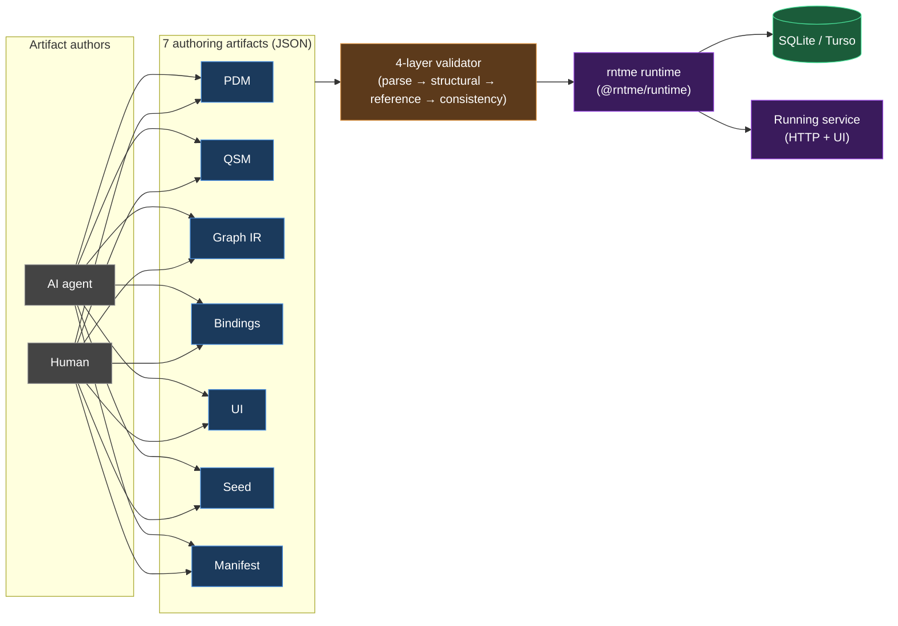
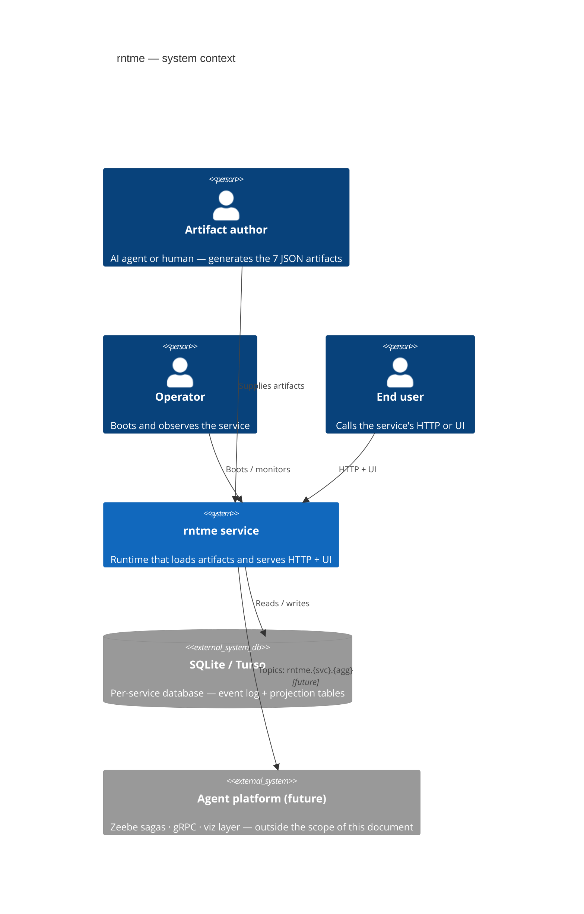
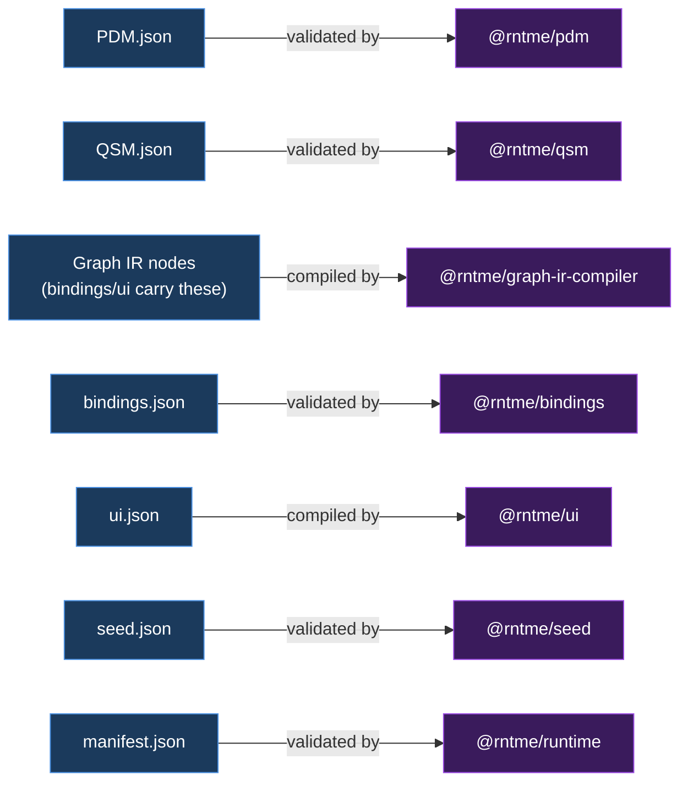
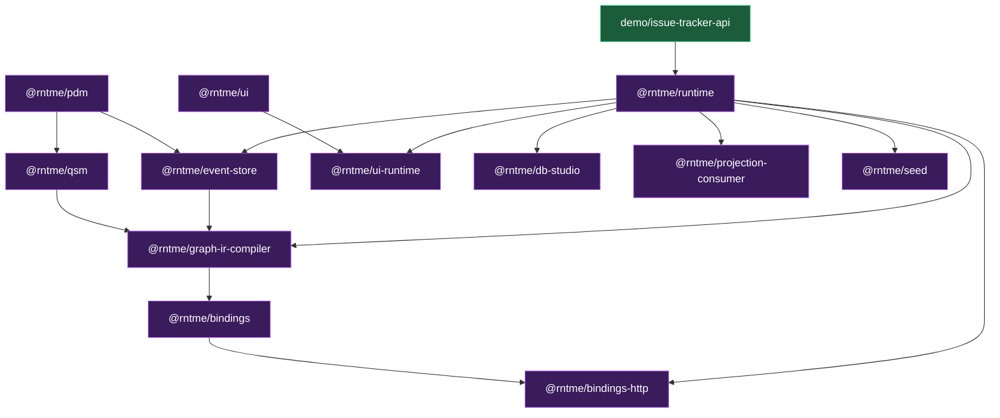
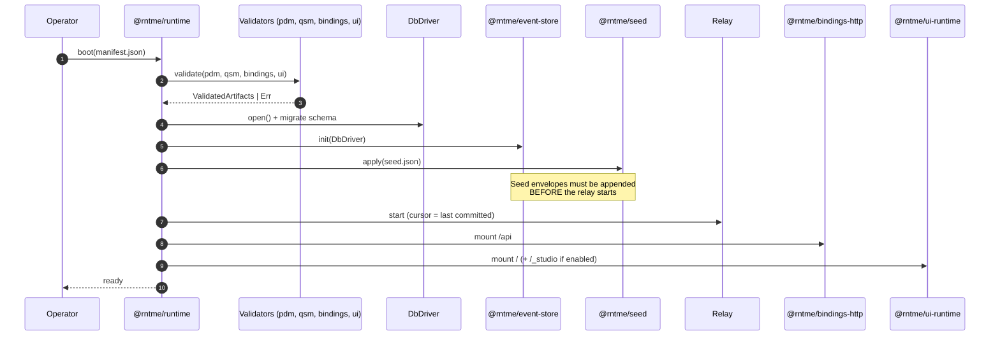
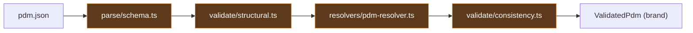
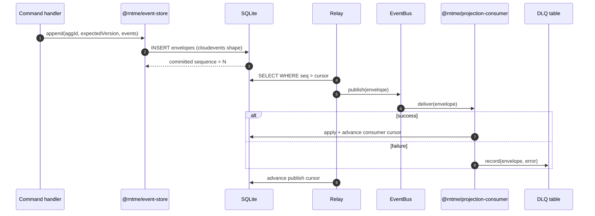
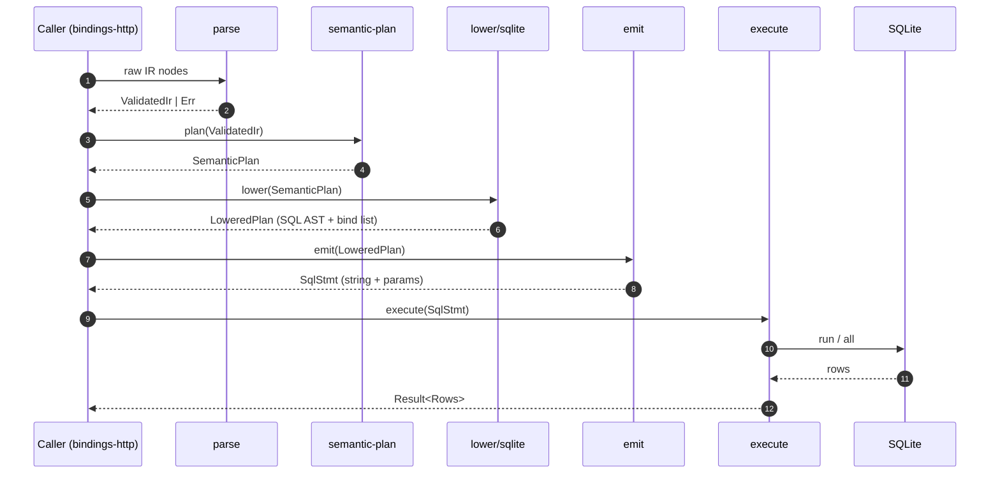
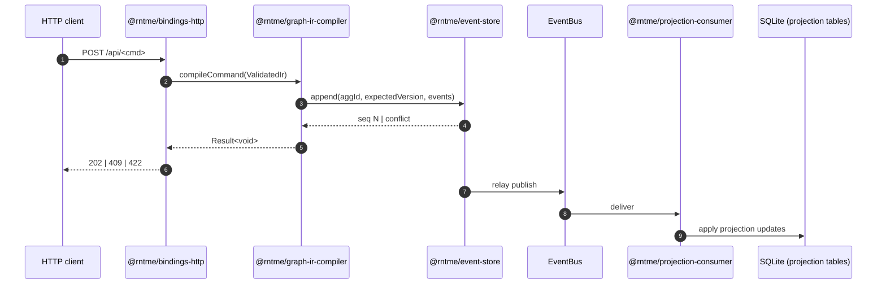
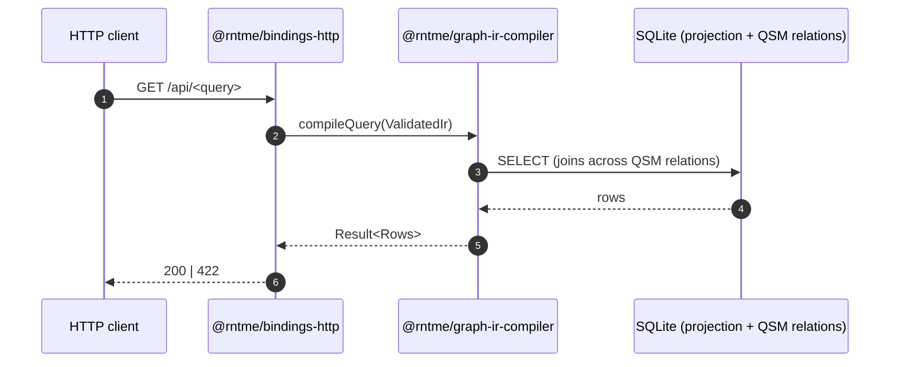

# Architecture Overview Document Implementation Plan

> **For agentic workers:** REQUIRED SUB-SKILL: Use superpowers:subagent-driven-development (recommended) or superpowers:executing-plans to implement this plan task-by-task. Steps use checkbox (`- [ ]`) syntax for tracking.

**Goal:** Produce `docs/architecture.md` — a single top-down architecture document (~1500–2200 lines) for rntme, framed as an artifact-driven runtime, with hybrid C4 (L1–L4), 7 interleaved sequence diagrams, a ~25-entry abstractions catalog, and a diagnostic observations section across 9 lenses.

**Architecture:** Incremental writing with a git commit per major block and an explicit user review checkpoint between blocks. Each block is self-contained — the file is valid markdown after every task, even if not yet complete. The file lives at `docs/architecture.md` (repo-tracked). All diagrams are inline mermaid; no external renderers.

**Tech Stack:** Markdown + inline mermaid (C4Context, C4Container, flowchart, sequenceDiagram, erDiagram, stateDiagram-v2).

**Spec:** `docs/superpowers/specs/2026-04-18-architecture-overview-design.md`.

**Branch:** continues on `feat/d5-hybrid-idempotency-derived-projections` unless reviewer prefers a dedicated branch; the spec has already landed on this branch.

**Conventions that apply to every task:**
- Reference files as `packages/<pkg>/src/…` — no line numbers (they drift).
- Node names in diagrams match code symbols exactly (e.g. `@rntme/graph-ir-compiler`, not "compiler").
- Each mermaid diagram is followed by a 1–3 sentence caption naming what it shows.
- Each diagram ≤ 30 nodes and ≤ 10 actors.
- Colour palette declared once at the top of the file (single HTML comment block or a `%%{ init: ... }%%` directive reused); artifacts share one colour, validators another, storage a third.
- Use `**bold**` for abstraction names when first introduced; use inline `` `code` `` for file paths and symbol names.
- Every file path referenced in prose must exist; validate with `ls <path>` or `test -e <path>` if uncertain.
- No TBD / TODO / placeholder text left in the committed file at any task boundary.

**Mermaid render verification (used in many tasks):**
- Preferred: `npx -y @mermaid-js/mermaid-cli -i docs/architecture.md -o /tmp/arch.svg` if network-available.
- Fallback: visual preview in a markdown viewer (VS Code preview pane, GitHub preview, or https://mermaid.live).
- Minimum automated check: `grep -n '```mermaid' docs/architecture.md | wc -l` equals the count of ` ``` ` closures inside mermaid blocks.

---

## Task 1: Create skeleton and palette declaration

**Files:**
- Create: `docs/architecture.md`

- [ ] **Step 1: Create the file with the full table of contents and section skeleton**

Write exactly this content to `docs/architecture.md`:

````markdown
<!--
Architecture overview for rntme.
Spec: docs/superpowers/specs/2026-04-18-architecture-overview-design.md
Cutoff date: 2026-04-18. Later specs are folded in via subsequent bumps, not
retroactively.

Diagram colour palette (use the `classDef` lines below inside mermaid blocks
where styling is desired — copy, do not invent new colours):

  classDef artifact   fill:#1b3a5c,stroke:#4a90e2,color:#fff;
  classDef validator  fill:#5c3a1b,stroke:#e29a4a,color:#fff;
  classDef storage    fill:#1b5c3a,stroke:#4ae29a,color:#fff;
  classDef runtime    fill:#3a1b5c,stroke:#9a4ae2,color:#fff;
  classDef external   fill:#444,stroke:#999,color:#fff;
-->

# rntme — Architecture Overview

> Status: in progress (writing per plan `docs/superpowers/plans/2026-04-18-architecture-overview.md`).
>
> Spec: `docs/superpowers/specs/2026-04-18-architecture-overview-design.md`.
>
> Primary framing: rntme is an artifact-driven runtime for AI-agent-generated services. CQRS, event-sourcing, SQLite, Turso, branded `Validated*` types, and plugin seams are **consequences** of that goal, not the identity of the system. See `rntme_vision_framing` memory.

## Table of contents

1. [Executive summary](#1-executive-summary)
2. [L1 — System Context](#2-l1--system-context)
3. [L2 — Containers](#3-l2--containers)
4. [L3 — Components](#4-l3--components)
5. [L4 — Code](#5-l4--code)
6. [Cross-cutting abstractions](#6-cross-cutting-abstractions)
7. [Observations and refactoring candidates](#7-observations-and-refactoring-candidates)
8. [Glossary](#8-glossary)
9. [How to use and maintain this document](#9-how-to-use-and-maintain-this-document)

---

## 1. Executive summary

_(pending — Task 2)_

## 2. L1 — System Context

_(pending — Task 3)_

## 3. L2 — Containers

_(pending — Task 4)_

## 4. L3 — Components

_(pending — Tasks 5–12)_

## 5. L4 — Code

_(pending — Task 13)_

## 6. Cross-cutting abstractions

_(pending — Tasks 14–16)_

## 7. Observations and refactoring candidates

_(pending — Tasks 17–20)_

## 8. Glossary

_(pending — Task 21)_

## 9. How to use and maintain this document

_(pending — Task 21)_
````

- [ ] **Step 2: Verify file is valid markdown with a visible ToC**

Run: `head -50 docs/architecture.md`
Expected: ToC visible, headings render. No mermaid yet — nothing to render-check.

- [ ] **Step 3: Commit**

```bash
git add docs/architecture.md docs/superpowers/plans/2026-04-18-architecture-overview.md
git commit -m "docs(architecture): skeleton + palette

Sets up docs/architecture.md with full ToC and per-section pending
markers. Introduces the colour palette as a top-of-file HTML comment
for reuse in every mermaid block.

Refs: docs/superpowers/specs/2026-04-18-architecture-overview-design.md"
```

---

## Task 2: §1 Executive summary

**Files:**
- Modify: `docs/architecture.md` — replace `_(pending — Task 2)_` under §1.

**Research inputs (read in order):**
- `docs/superpowers/specs/2026-04-18-architecture-overview-design.md` §2 (Primary framing).
- `AGENTS.md` §§3–4 (package layering + conventions) — for rationale targets.
- `packages/runtime/README.md` — for the plugin-seam / manifest framing.
- Memory entry `rntme_vision_framing`.

- [ ] **Step 1: Draft the framing block**

Replace the §1 pending marker with:

````markdown
## 1. Executive summary

**rntme is an artifact-driven runtime.** A service is described by a small set of strictly-validated JSON artifacts (PDM, QSM, Graph IR, bindings, UI, seed, manifest). The runtime loads those artifacts, validates them in layers, and boots a working HTTP + UI service without requiring any service-specific code. The primary payoff is that **AI agents and humans can _generate_ these artifacts and get a running service** — the runtime's job is to make that generation safe and repeatable.



**Key invariants at a glance**

- **SQLite forever.** Scale-out target is Turso (SQLite-compatible); no Postgres dialect path is permitted.
- **JSON authoring only.** No YAML, no TOML for any artifact.
- **`Result<T>` across package boundaries.** No exceptions leak out of a package's public API.
- **Branded `Validated*` types.** Downstream APIs accept only the brand; casting into the brand (`as ValidatedPdm`) is an anti-pattern.
- **Fail-fast layered validation.** Each artifact runs parse → structural → reference/cross-ref → consistency; the orchestrator returns the first failing layer's errors only.

**Design rationale — why these choices serve the vision**

| Decision | Property delivered to the vision |
| --- | --- |
| Layered validators + branded types | An agent-generated artifact cannot silently bypass a check; downstream code cannot consume unvalidated data. |
| CQRS + event-sourcing | Schema and behaviour can evolve without losing history; migrations become replays, not destructive DDL. |
| SQLite (+ Turso) | One service = one file; running many services does not require orchestrating a database cluster. |
| Kafka-style topic convention `rntme.{svc}.{agg}` | Services can be composed into a larger platform (Zeebe sagas, gRPC) without invasive per-service wiring. |
| Plugin seams (`DbDriver`, `EventBus`, `Surface`) | Runtime can be swapped in (e.g. different storage or transport) without changing any of the seven artifacts. |
| Kept-small public surface per package | Agents and humans reason about fewer concepts per artifact; each artifact has a single canonical validator. |

The rest of this document unpacks each of these in order: L1 context (§2), container topology (§3), per-package components (§4), critical functions (§5), the abstractions catalogue (§6), diagnostic observations (§7).
````

- [ ] **Step 2: Render-check the summary diagram**

Run: `grep -n '```mermaid' docs/architecture.md | wc -l` and confirm it reports `1`.
Open the file in a mermaid-capable previewer and verify the summary flowchart renders with five distinct colours.

- [ ] **Step 3: Commit**

```bash
git add docs/architecture.md
git commit -m "docs(architecture): §1 executive summary

Primary framing (artifact-driven runtime) plus the summary diagram
'7 artifacts → validator → runtime → service' and a decision →
vision-property rationale table."
```

**Review checkpoint 1:** offer §1 to the user for review before moving to §2.

---

## Task 3: §2 L1 System Context

**Files:**
- Modify: `docs/architecture.md` — replace `_(pending — Task 3)_` under §2.

**Research inputs:**
- `AGENTS.md` §2 (repository map) — for platform boundary hints.
- Memory entry `project_platform_vision` — for the outer context (Zeebe / gRPC / viz layer as future actors).

- [ ] **Step 1: Write the section**

Replace the §2 pending marker with:

````markdown
## 2. L1 — System Context



**What the diagram shows.** The runtime has exactly one direct input from humans/agents — the artifact set — and two human-facing surfaces (operator, end user). Storage is explicitly per-service. The agent platform (Zeebe, gRPC, viz layer) is an **external future consumer**, not a part of this document.

**Why only one storage actor.** rntme treats storage as a per-service concern. The `DbDriver` plugin seam (see §3) lets the same runtime run against `BetterSqlite`, an in-memory driver for tests, or Turso without changing any artifact.

**Why the platform is external.** The memory entry `project_platform_vision` describes the larger DDD platform (Zeebe for cross-service sagas, gRPC for synchronous calls, a viz layer for business users). rntme is *one per-service runtime inside that platform*; cross-service concerns are not in scope here.
````

- [ ] **Step 2: Render-check the C4Context diagram**

Some markdown renderers treat `C4Context` as beta — verify rendering on GitHub's preview specifically (or https://mermaid.live). If the renderer does not support `C4Context`, fall back to a `flowchart LR` with styled subgraphs — do not silently leave a broken diagram.

- [ ] **Step 3: Commit**

```bash
git add docs/architecture.md
git commit -m "docs(architecture): §2 L1 system context"
```

**Review checkpoint 2:** offer §1+§2 to the user.

---

## Task 4: §3 L2 Containers + sequence #3 Boot & seed

**Files:**
- Modify: `docs/architecture.md` — replace `_(pending — Task 4)_` under §3.

**Research inputs:**
- `AGENTS.md` §3 (package layering ASCII diagram — convert to mermaid).
- `packages/runtime/README.md` — plugin seams, boot-order invariant, manifest schema.
- `packages/seed/README.md` — before-relay invariant.
- `docs/superpowers/specs/2026-04-15-runtime-packaging-design.md`.
- `docs/superpowers/specs/2026-04-15-runtime-seed-design.md`.

- [ ] **Step 1: Write the artifact map**

Add under §3 a short paragraph and a mermaid flowchart of the 7 artifacts + their consuming packages. Structure:

```markdown
### 3.1 Authoring surface — the 7 artifacts

rntme's authoring surface is seven JSON artifacts plus one service manifest. Each artifact has exactly one canonical validator and one canonical consumer.



**Caption.** Every artifact has exactly one owner package; a downstream package consuming an artifact does so via the owner's branded `Validated*` type.
```

- [ ] **Step 2: Write the container map**

Convert `AGENTS.md` §3's ASCII dependency diagram to mermaid. Use the colour `pkg` from the palette. Keep ≤ 30 nodes.

```markdown
### 3.2 Container map — 12 packages



**Caption.** Arrows mean "depends on". `@rntme/runtime` is the orchestrator; it boots the plugin seams, wires the event pipeline, and mounts the HTTP surface. The demo is the only package that consumes `@rntme/runtime` directly.
```

- [ ] **Step 3: Write the plugin-seam subsection**

```markdown
### 3.3 Plugin seams — extension without editing artifacts

Three interfaces live in `packages/runtime/src/plugins/`:

- **`DbDriver`** — storage adapter. Default: `BetterSqliteDriver`. Alternate: in-memory for tests, future Turso driver.
- **`EventBus`** — message transport. Default: `InMemoryBus`. Alternate: Kafka / NATS via a custom implementation.
- **`Surface`** — HTTP (or equivalent) entry point. Default: `HttpSurface` (Hono-based). Alternate: any surface that can route bindings.

The manifest (`manifest.json`) selects defaults; a caller passing a custom implementation replaces one seam without editing any other artifact. See `packages/runtime/README.md` for the exact interface shapes.
```

- [ ] **Step 4: Add sequence diagram #3 — Boot & seed lifecycle**

```markdown
### 3.4 Boot & seed lifecycle (sequence #3)



**Caption.** The boot-order invariant (see `2026-04-15-runtime-seed-design.md`) is that seed application and the publish relay are mutually exclusive in time: seeds are committed through `appendRaw` *before* the relay cursor starts advancing, or seed events would double-publish.
```

- [ ] **Step 5: Render-check all three diagrams**

Run: `grep -c '```mermaid' docs/architecture.md` — expect 5 (two from §1/§2 + three from §3).

- [ ] **Step 6: Commit**

```bash
git add docs/architecture.md
git commit -m "docs(architecture): §3 L2 containers + boot/seed sequence

Artifact map (7 artifacts → owner packages), container map
(12 packages converted from AGENTS.md §3 ASCII), plugin seams
narrative, and sequence #3 boot & seed lifecycle with the
before-relay invariant called out."
```

**Review checkpoint 3:** offer §1–§3 to the user.

---

## Task 5: §4.1 pdm

**Files:**
- Modify: `docs/architecture.md` — add §4.1 under `## 4. L3 — Components`.

**Research inputs:**
- `packages/pdm/README.md` — File map, Invariants & gotchas, Where to look first.
- `packages/pdm/src/index.ts` — public API surface.
- `packages/pdm/src/parse/schema.ts`, `validate/structural.ts`, `resolvers/pdm-resolver.ts` — the 4-layer pipeline.
- Spec lineage: `git log --oneline packages/pdm/ | head -20` and README "Specs" section.

- [ ] **Step 1: Replace `_(pending — Tasks 5–12)_` marker**

Insert under §4 a short intro paragraph, then start §4.1:

```markdown
## 4. L3 — Components

Each subsection below follows the same structure:

1. **Spec lineage** — which specs shaped this package, in time order.
2. **Component diagram** — internal modules and data flow.
3. **Components** — 2–3 sentences per module naming its responsibility.

Sequence diagrams live with the package that owns the flow.

### 4.1 `@rntme/pdm`

**Purpose.** Parse, validate, and resolve the PDM artifact — the canonical entity / field / relation / state-machine source.

**Spec lineage.**

| Spec | Date | Status | Contribution |
| --- | --- | --- | --- |
| <fill via git log + README "Specs"> | | | |

**Component diagram.**



**Components.**

- **`parse/schema.ts`** — Zod schema layer; turns raw JSON into `StructurallyValid` shapes. Rejects syntactic errors with `PDM_PARSE_*` codes.
- **`validate/structural.ts`** — structural rules that do not require resolved references (duplicate fields, conflicting flags).
- **`resolvers/pdm-resolver.ts`** — one-pass reference resolution for entity/field/relation lookups.
- **`validate/consistency.ts`** — final invariants (state machines closed, relation cardinalities match).

**Invariants.** The `ValidatedPdm` brand is constructible only by running the pipeline end-to-end; downstream packages (QSM, bindings) accept only the brand.
```

- [ ] **Step 2: Populate the spec-lineage table**

Run: `git log --oneline --name-only -- packages/pdm/ | head -60` and cross-reference with `packages/pdm/README.md` section "Specs". Fill the table row-by-row; mark each spec as `landed` (in `specs/done/`) or `in-flight` (in `specs/`).

- [ ] **Step 3: Render-check and commit**

```bash
git add docs/architecture.md
git commit -m "docs(architecture): §4.1 pdm — spec lineage, diagram, components"
```

---

## Task 6: §4.2 qsm

**Files:**
- Modify: `docs/architecture.md` — append §4.2 after §4.1.

**Research inputs:**
- `packages/qsm/README.md`.
- `packages/qsm/src/parse/schema.ts`, `validate/structural.ts`, `validate/cross-ref.ts`, `derive/ddl.ts`, `derive/handler.ts`.
- Spec lineage: `git log --oneline packages/qsm/` and especially `docs/superpowers/specs/2026-04-16-qsm-relations-migration-design.md`.

- [ ] **Step 1: Write the subsection**

Follow the same template as §4.1: Purpose → Spec lineage → Component diagram → Components → Invariants.

Highlight:

- Projections and their **backings** (`entity-mirror`; `derived` reserved but not implemented — MVP gate).
- **Relation metadata** moved from PDM to QSM on 2026-04-16 (cite `2026-04-16-qsm-relations-migration-design.md`).
- Derived DDL generation (`derive/ddl.ts`) — how projection tables are shaped.

- [ ] **Step 2: Render-check and commit**

```bash
git add docs/architecture.md
git commit -m "docs(architecture): §4.2 qsm — projections, derived DDL, relation metadata"
```

**Review checkpoint 4:** offer §4.1+§4.2 to the user.

---

## Task 7: §4.3 event-store + sequence #6 Envelope lifecycle

**Files:**
- Modify: `docs/architecture.md` — append §4.3.

**Research inputs:**
- `packages/event-store/README.md`.
- `packages/event-store/src/` — in particular `append.ts`, `relay.ts`, the `EventStore` interface.
- Specs: `2026-04-17-cloudevents-envelope-design.md`, `2026-04-17-relay-dlq-delivery-tracking-design.md`.
- Memory: `rntme_topic_no_version_suffix`.

- [ ] **Step 1: Write the subsection**

Cover:
- `EventStore` interface (append, appendRaw, read, publishCursor).
- Optimistic concurrency on `(aggregateId, expectedVersion)`.
- Monotonic publish cursor.
- Relay loop + at-least-once delivery + DLQ.
- Topic convention `rntme.{svc}.{agg}` (no `.v1`; breaking change = new `eventType`).

- [ ] **Step 2: Add sequence #6 — Envelope lifecycle**

```markdown
#### Sequence #6 — Envelope lifecycle



**Caption.** The publish cursor advances only after the bus accepts the envelope; a consumer failure moves the envelope into the DLQ but does not block the cursor — the relay is at-least-once, the consumer is idempotent.
```

- [ ] **Step 3: Render-check and commit**

```bash
git add docs/architecture.md
git commit -m "docs(architecture): §4.3 event-store + seq #6 envelope lifecycle"
```

---

## Task 8: §4.4 graph-ir-compiler + sequences #5, #1, #2

**Files:**
- Modify: `docs/architecture.md` — append §4.4. This is the largest §4 subsection.

**Research inputs:**
- `packages/graph-ir-compiler/README.md`.
- `packages/graph-ir-compiler/src/parse/`, `semantic-plan/`, `lower/sqlite/`, `emit/`, `execute/`.
- Specs: `2026-04-13-graph-ir-sql-compiler-mvp-design.md` (foundation), `2026-04-16-predicate-optional-fix-design.md`, and any later spec touching IR.
- Memory: `rntme_predicate_optional_bug`, `rntme_graph_ir_rc7_not_canon` (note the `graph_ir_rc_7.md` status).

- [ ] **Step 1: Write purpose + spec lineage + component diagram**

Components: `parse/` · `semantic-plan/` · `lower/sqlite/` · `emit/` · `execute/`.

- [ ] **Step 2: Add sequence #5 — IR → SQL**

```markdown
#### Sequence #5 — IR → SQL



**Caption.** Parse and semantic-plan are reusable across both command and query execution; lower/emit/execute is the lowering tail. The `wrapPredicateOptional` helper (see memory entry `rntme_predicate_optional_bug`) is invoked inside `lower/sqlite/` and has an open positional-alignment bug when mixing `predicate_optional` with other parameters.
```

- [ ] **Step 3: Add sequence #1 — Command write path**

```markdown
#### Sequence #1 — Command write path



**Caption.** The HTTP response is returned as soon as the event log is committed; projection updates are asynchronous. A client that needs read-after-write must poll the query endpoint.
```

- [ ] **Step 4: Add sequence #2 — Query read path**

```markdown
#### Sequence #2 — Query read path



**Caption.** Query lowering uses QSM relation metadata (post-2026-04-16) for joins; the shape of the response is declared inside the binding artifact.
```

- [ ] **Step 5: Render-check and commit**

```bash
git add docs/architecture.md
git commit -m "docs(architecture): §4.4 graph-ir-compiler + seq #5 IR→SQL, #1 cmd, #2 query"
```

**Review checkpoint 5:** offer §4.3+§4.4 to the user.

---

## Task 9: §4.5 projection-consumer

**Files:**
- Modify: `docs/architecture.md` — append §4.5.

**Research inputs:**
- `packages/projection-consumer/README.md`.
- `packages/projection-consumer/src/apply/compile.ts`, `idempotency/*`.
- Spec: `2026-04-18-d5-consumer-idempotency-hybrid-design.md`.

- [ ] **Step 1: Write the subsection**

Cover: `ApplyPlan` type, `compileApplyPlan`, idempotency via consumer cursor, rollback-on-failure guarantee, DLQ interaction (cross-link §4.3).

- [ ] **Step 2: Render-check and commit**

```bash
git add docs/architecture.md
git commit -m "docs(architecture): §4.5 projection-consumer"
```

---

## Task 10: §4.6 bindings & bindings-http + sequence #4 Validation pipeline

**Files:**
- Modify: `docs/architecture.md` — append §4.6.

**Research inputs:**
- `packages/bindings/README.md`, `packages/bindings-http/README.md`.
- `packages/bindings/src/parse/schema.ts`, `validate/structural.ts`, `validate/cross-ref.ts`, `validate/consistency.ts`, `openapi/emit.ts`.
- `packages/bindings-http/src/runtime/`.
- Specs: `2026-04-14-bindings-design.md`, `2026-04-14-bindings-http-design.md`.

- [ ] **Step 1: Write the subsection**

Cover: the binding kind × role matrix (query/command × list/get/…); the 4-layer validator as the *canonical* instance (pdm/qsm/ui re-use the same pattern); OpenAPI 3.1 emission; error → HTTP status mapping (400 parse, 409 concurrency, 422 consistency).

- [ ] **Step 2: Add sequence #4 — Validation pipeline**

Illustrate on bindings; note the same pattern applies to pdm/qsm/ui.

```markdown
#### Sequence #4 — Validation pipeline (on bindings; shared pattern)

```mermaid
sequenceDiagram
    autonumber
    participant Caller as Boot / CLI / test
    participant P as parse (Zod)
    participant S as structural
    participant X as cross-ref (resolver)
    participant C as consistency (feature-gate)
    participant B as brand ValidatedBindings

    Caller->>P: raw JSON
    P-->>Caller: Err | Structural
    alt Err at any layer
        Note right of Caller: fail-fast; later layers do not run
    end
    Caller->>S: Structural
    S-->>Caller: Err | Structural'
    Caller->>X: Structural'
    X-->>Caller: Err | CrossResolved
    Caller->>C: CrossResolved
    C-->>Caller: Err | Consistent
    Caller->>B: construct brand
    B-->>Caller: ValidatedBindings
```

**Caption.** Every package that owns an authored artifact (pdm, qsm, bindings, ui) runs the same four layers in this order. The brand is constructible only after all four layers pass — there is no `as ValidatedX` escape hatch in any legitimate code path.
```

- [ ] **Step 3: Render-check and commit**

```bash
git add docs/architecture.md
git commit -m "docs(architecture): §4.6 bindings(-http) + seq #4 validation pipeline"
```

---

## Task 11: §4.7 ui & ui-runtime + sequence #7 UI compile

**Files:**
- Modify: `docs/architecture.md` — append §4.7.

**Research inputs:**
- `packages/ui/README.md`, `packages/ui-runtime/README.md`.
- `packages/ui/src/parse/`, `validate/`, `resolve/`, `expand/`, `compile/`, `emit/`.
- `packages/ui-runtime/src/` — Hono sub-router + React SPA (esbuild build).
- Spec: `2026-04-16-ui-artifact-v2-design.md`.

- [ ] **Step 1: Write the subsection + sequence #7**

Include the six-stage pipeline (parse → validate → resolve → expand → compile → emit) and the sequence diagram.

- [ ] **Step 2: Render-check and commit**

```bash
git add docs/architecture.md
git commit -m "docs(architecture): §4.7 ui/ui-runtime + seq #7 UI compile"
```

**Review checkpoint 6:** offer §4.5–§4.7 to the user.

---

## Task 12: §4.8 seed, db-studio, runtime (orchestration layer)

**Files:**
- Modify: `docs/architecture.md` — append §4.8.

**Research inputs:**
- `packages/seed/README.md`, `packages/db-studio/README.md`, `packages/runtime/README.md`.
- Specs: `2026-04-15-runtime-seed-design.md`, `2026-04-18-db-studio-design.md`, `2026-04-15-runtime-packaging-design.md`.

- [ ] **Step 1: Write three short subsections (§4.8.1–§4.8.3)**

Each ≤ 200 words. For runtime, emphasise the manifest schema + plugin-seam registration and cross-link §3.3. For seed, cross-link sequence #3. For db-studio, briefly describe the Hrana v3 read-only endpoint.

- [ ] **Step 2: Render-check and commit**

```bash
git add docs/architecture.md
git commit -m "docs(architecture): §4.8 seed, db-studio, runtime"
```

---

## Task 13: §5 L4 Code — function table

**Files:**
- Modify: `docs/architecture.md` — replace `_(pending — Task 13)_` under §5.

**Research inputs:**
- Run `grep -rn 'export function' packages/*/src/index.ts packages/*/src/**/index.ts` to list candidate entry points.
- For each candidate listed below, read the function signature and one-line JSDoc if any.

- [ ] **Step 1: Build the table**

```markdown
## 5. L4 — Code

A selection of 12–15 functions that carry the most invariants. Signatures are copied from the code at the cutoff date; no code blocks — this is a pointer table, not a copy of the source.

| Function | Package | Purpose (one line) |
| --- | --- | --- |
| `validateBindings(raw)` | `@rntme/bindings` | Run the 4 layers and return `ValidatedBindings`. |
| `lowerOperator(node, ctx)` | `@rntme/graph-ir-compiler` | Turn one IR operator into a lowered SQL fragment. |
| `wrapPredicateOptional(...)` | `@rntme/graph-ir-compiler` | Conditionally wrap a predicate — known positional-alignment bug. |
| `appendRaw(envelope[])` | `@rntme/event-store` | Append envelopes bypassing command validation (seed only). |
| `publishNext()` | `@rntme/event-store` | One tick of the relay loop; advances the publish cursor. |
| `compileApplyPlan(envelope)` | `@rntme/projection-consumer` | Produce the SQL plan for a single envelope. |
| `applyEnvelope(plan, db)` | `@rntme/projection-consumer` | Execute the plan with idempotency guards. |
| `bootService(manifest)` | `@rntme/runtime` | The single entry point in §3.4. |
| `applySeed(seed, store)` | `@rntme/seed` | Turn the seed artifact into committed envelopes before the relay runs. |
| `compileBindings(validated)` | `@rntme/bindings` | Produce the `BindingPlan` union consumed by `bindings-http`. |
| `emitOpenApi(plan)` | `@rntme/bindings` | Emit OpenAPI 3.1 from a binding plan. |
| `compileUi(validated)` | `@rntme/ui` | Produce the compiled UI artifact served by `ui-runtime`. |

Follow-up notes on any bugs or smells belong in §7, not here.
```

- [ ] **Step 2: Verify every function exists in code**

Run for each function name: `grep -rn 'function <name>\|<name> =' packages/*/src/ | head -3`. If a name is wrong, correct it here and flag any divergence as a §7 observation.

- [ ] **Step 3: Commit**

```bash
git add docs/architecture.md
git commit -m "docs(architecture): §5 L4 code — critical-function table"
```

**Review checkpoint 7:** offer §4.8+§5 to the user.

---

## Task 14: §6.0 + §6.1 Foundational + Domain abstractions

**Files:**
- Modify: `docs/architecture.md` — replace `_(pending — Tasks 14–16)_` under §6 with the intro and the first two subsections.

**Research inputs:**
- All `packages/*/src/types/result.ts` (for `Result<T>`, `isOk`, `isErr`, `ERROR_CODES`).
- All `packages/*/src/types/artifact.ts` (for the domain shapes).

- [ ] **Step 1: Write the intro and the record format**

```markdown
## 6. Cross-cutting abstractions

Each entry uses the fixed record format:

- **Package / module:** `packages/<pkg>/src/<path>` (no line numbers)
- **Purpose:** one sentence
- **Contract:** signature or structure
- **Constructed by:** who creates instances and when
- **Invariant:** what must hold
- **How to violate:** link to `AGENTS.md §7` if applicable
- **Spec(s):** canonical spec link or "not covered by spec"
- **Related:** 1–3 related abstractions
```

- [ ] **Step 2: Write §6.0 Foundational**

Entries: `Result<T>` · `isOk` · `isErr` · Branded `Validated*` family · `ERROR_CODES` registry and the `<PKG>_<LAYER>_<KIND>` format · the 4-layer validator pattern.

- [ ] **Step 3: Write §6.1 Domain artifacts**

Entries: Entity · Field · FieldType · Relation · StateMachine (PDM) · Projection · Backing (`entity-mirror`, `derived` reserved) · RelationMetadata (QSM) · Operator · SemanticPlan · LoweringRule (Graph IR).

- [ ] **Step 4: Commit**

```bash
git add docs/architecture.md
git commit -m "docs(architecture): §6.0 foundational + §6.1 domain abstractions"
```

---

## Task 15: §6.2 + §6.3 Runtime + HTTP/UI abstractions

**Files:**
- Modify: `docs/architecture.md` — append §6.2 and §6.3.

**Research inputs:**
- `packages/event-store/src/types/`, `packages/projection-consumer/src/types/`.
- `packages/bindings/src/types/artifact.ts`, `packages/bindings-http/src/types/`, `packages/ui/src/types/`.

- [ ] **Step 1: Write §6.2 Runtime**

Entries: Envelope / CloudEvents shape · EventStore interface + monotonic cursor · Relay (at-least-once) · DLQ · ApplyPlan + idempotency · Seed envelope + before-relay invariant.

- [ ] **Step 2: Write §6.3 HTTP / UI**

Entries: BindingKind × Role matrix · BindingPlan + error→HTTP status map · OpenAPI 3.1 emitter · UI compile pipeline.

- [ ] **Step 3: Commit**

```bash
git add docs/architecture.md
git commit -m "docs(architecture): §6.2 runtime + §6.3 HTTP/UI abstractions"
```

---

## Task 16: §6.4 + §6.5 Extensibility + Topology abstractions

**Files:**
- Modify: `docs/architecture.md` — append §6.4 and §6.5.

**Research inputs:**
- `packages/runtime/src/plugins/interfaces.ts`, `packages/runtime/src/manifest/schema.ts`.
- Per-package README "Out of scope" sections for MVP gates.
- Memory: `rntme_topic_no_version_suffix`; `packages/db-studio/README.md`.

- [ ] **Step 1: Write §6.4 Extensibility**

Entries: `DbDriver` · `EventBus` · `Surface` · Service manifest · MVP gates (concept).

- [ ] **Step 2: Write §6.5 Topology**

Entries: Kafka topic convention `rntme.{svc}.{agg}` (no `.v1`) · db-studio Hrana v3 endpoint.

- [ ] **Step 3: Commit**

```bash
git add docs/architecture.md
git commit -m "docs(architecture): §6.4 extensibility + §6.5 topology abstractions"
```

**Review checkpoint 8:** offer §6 in full to the user.

---

## Task 17: §7 intro + §7.1 Size smells + §7.2 Dependency smells + §7.3 Conceptual duplication

**Files:**
- Modify: `docs/architecture.md` — replace `_(pending — Tasks 17–20)_` under §7 with the intro and lenses 7.1–7.3.

**Research inputs:**
- `find packages -type f -name '*.ts' -not -path '*/node_modules/*' -not -path '*/dist/*' | xargs wc -l | sort -rn | head -30` for size.
- `cat packages/*/package.json | jq '.dependencies, .devDependencies'` plus a visual review of `import` statements per package.
- Hand-read of `packages/*/src/validate/structural.ts` and `packages/*/src/parse/schema.ts` for duplication.

- [ ] **Step 1: Write the §7 intro**

```markdown
## 7. Observations and refactoring candidates

This section is **diagnostic, not prescriptive.** Each finding points at a concrete place and states why it is a smell; it does not propose a fix. Follow-up plans will convert findings into work items.

Severity legend:
- **major** — breaks an invariant or creates risk.
- **minor** — harms readability or maintenance but no invariant violation.
- **info** — recorded fact (MVP gate, known bug); not necessarily actionable.

Finding format:

> **[severity]** `packages/<pkg>/src/<file>` — short description
>  - **Why it is a smell:** one sentence
>  - **Possible direction:** one sentence
>  - **Links:** spec(s), ADR, related observations
```

- [ ] **Step 2: Populate §7.1 Size smells (expected 5–15 findings)**

Run the `wc -l` command above; for each file > 500 lines or function reputed > 80 lines (manual scan of the top 10), add one finding.

If the lens yields < 2 findings, write: `> Reviewed — no significant size smells found as of cutoff.`

- [ ] **Step 3: Populate §7.2 Dependency smells (expected 3–8)**

Check:
- Any package importing from another that it should not per `AGENTS.md §3`.
- Any `index.ts` re-exporting > 30 symbols.
- Any cyclic imports (ESLint rules already flag most; do a manual confirmation).

- [ ] **Step 4: Populate §7.3 Conceptual duplication (expected 3–5)**

Manual diff of 4-layer validator pipelines across pdm / qsm / bindings / ui. Note that this duplication is the point of the pattern; call out only cases where the pattern has drifted (e.g. one package does consistency before cross-ref).

- [ ] **Step 5: Commit**

```bash
git add docs/architecture.md
git commit -m "docs(architecture): §7 intro + lenses 7.1 size, 7.2 deps, 7.3 duplication"
```

---

## Task 18: §7.4 Brand/Result violations + §7.5 MVP gates + §7.6 Naming

**Files:**
- Modify: `docs/architecture.md` — append §7.4, §7.5, §7.6.

**Research inputs:**
- `grep -rn 'as Validated\|as Structurally\|as Parsed' packages/*/src | grep -v '\.d\.ts'`.
- `grep -rn 'try {' packages/*/src | head -50` — examine catches that cross package boundaries.
- Each `packages/*/README.md` "Out of scope" section.
- Glossary in `AGENTS.md §10` — grep the codebase for suspected synonyms: `envelope|event|record`, `backing|projection kind`, `surface|http surface`.

- [ ] **Step 1: Populate §7.4 (expected 2–5)**

For every `as Validated*` / `as Structurally*` cast found, record a **major** finding. For every `try/catch` found on a public-API surface, record a finding with the reasoning — some catches may be legitimate translation to `Result.err`.

- [ ] **Step 2: Populate §7.5 MVP gates (expected 10–20 as `info`)**

For each `**Out of scope**` bullet across READMEs, add one `info` finding.

- [ ] **Step 3: Populate §7.6 Naming (expected 3–6)**

Record each surviving synonym pair (`envelope` vs `event` vs `record`, etc.) with concrete file references.

- [ ] **Step 4: Commit**

```bash
git add docs/architecture.md
git commit -m "docs(architecture): §7 lenses 7.4 brand/Result, 7.5 MVP gates, 7.6 naming"
```

---

## Task 19: §7.7 Known bugs + §7.8 Undocumented extensions

**Files:**
- Modify: `docs/architecture.md` — append §7.7 and §7.8.

**Research inputs:**
- Auto-memory entries: `rntme_predicate_optional_bug`, `demo_join_enrichment_todo`.
- For each package, compare the latest relevant spec (from each §4 subsection's spec-lineage table) against the code — files/modules that exist but are not mentioned anywhere in specs are §7.8 candidates.
- Specifically include: the stale `graph_ir_rc_7.md` "canon" wording in `AGENTS.md §§2, 7` and `CLAUDE.md` (per memory `rntme_graph_ir_rc7_not_canon`).

- [ ] **Step 1: Populate §7.7 Known bugs (expected ~2)**

Copy directly from memory; add test file references (`packages/graph-ir-compiler/test/unit/lower/sqlite/predicate-optional.test.ts`, `.../test/e2e/predicate-optional.e2e.test.ts`) and the demo FK-enrichment TODO.

- [ ] **Step 2: Populate §7.8 Undocumented extensions (expected 3–8)**

Mandatory entry:

> **[minor]** `AGENTS.md §§2, 7` · `CLAUDE.md` — describe `graph_ir_rc_7.md` as "authoritative" / "canon"
> - **Why it is a smell:** the owner considers rc7 a historical first step, not the canon; meta-docs diverge from current framing (see memory `rntme_graph_ir_rc7_not_canon`).
> - **Possible direction:** update `AGENTS.md §§2, 7` and the `CLAUDE.md` paragraph to call rc7 "historical context" and apply the generic "latest authoritative spec wins" rule.
> - **Links:** memory `rntme_graph_ir_rc7_not_canon`.

Others: any src modules that do not appear in any spec but are test-covered.

- [ ] **Step 3: Commit**

```bash
git add docs/architecture.md
git commit -m "docs(architecture): §7 lenses 7.7 known bugs, 7.8 undocumented extensions"
```

---

## Task 20: §7.9 Vision alignment (highest-risk section)

**Files:**
- Modify: `docs/architecture.md` — append §7.9.

**Research inputs:**
- All 7 artifact schemas (`packages/pdm/src/parse/schema.ts`, etc.) — for agent-generability.
- All 4 validators (pdm/qsm/bindings/ui) — for validation-tightness holes.
- `packages/bindings/src/openapi/` — for implementation-leakage (does the authoring surface reference `envelope`, `cursor`, `relay`, `CQRS`?).
- `packages/runtime/src/plugins/` — for extensibility vs hardcoding.
- Memory: `rntme_vision_framing`.

- [ ] **Step 1: Write a short intro naming the six sub-probes**

Use: agent-generability, validation tightness, implementation leakage, brand integrity, extensibility vs hardcoding, scale properties.

- [ ] **Step 2: Populate each sub-probe with concrete findings (expected 5–10 total)**

Examples of the style expected:
- Agent-generability: "Field `<X>` in PDM has an implicit invariant (must match a string in `<Y>`) that is not expressed in Zod — an agent cannot know to satisfy it without reading the code."
- Validation tightness: "bindings cross-ref layer does not check that a query's `entityRef` matches any PDM entity — invalid reference reaches runtime."
- Implementation leakage: "UI artifact schema exposes the word `envelope` — authors must know about the event log to write UI."
- Brand integrity: "There is no helper `fromParsed`-style constructor that could bypass a validator; all public APIs accept only branded types — no violation found." (negative evidence is allowed).
- Extensibility vs hardcoding: "`BindingKind` union is a closed `type` — adding a new binding kind requires editing `bindings/src/types/artifact.ts` and the runtime dispatcher; there is no plugin seam here."
- Scale properties: "Relay uses a single cursor per service; number-of-services scale is fine, but number-of-consumers per service cannot grow beyond the single-relay model without change."

- [ ] **Step 3: Commit**

```bash
git add docs/architecture.md
git commit -m "docs(architecture): §7.9 vision alignment — six sub-probes"
```

**Review checkpoint 9:** offer §7 in full to the user. This is the most consequential block — expect revisions.

---

## Task 21: §8 Glossary + §9 How to use / maintain

**Files:**
- Modify: `docs/architecture.md` — replace `_(pending — Task 21)_` markers under §8 and §9.

**Research inputs:**
- `AGENTS.md §10` — glossary seed.
- All new abstractions introduced in §6 that should be listed (ensure every term used in §§1–7 appears).

- [ ] **Step 1: Write §8 Glossary**

Start from `AGENTS.md §10` and add any terms used in §§1–7 that are not there (e.g. `Backing`, `ApplyPlan`, `Hrana`, `DLQ`, `CloudEvents`, `MVP gate` with a short definition).

- [ ] **Step 2: Write §9 How to use / maintain**

Cover:
- Relationship to `AGENTS.md` (task-index) and `docs/superpowers/specs/` (decisions).
- Update rule: *any meaningful refactor bumps the relevant §4 subsection and, if it changes an observation, §7.*
- Cutoff: this document was written to the 2026-04-18 state. Later specs are folded in via dated bumps, not retroactive edits.
- Where to start reading: §1, then §3.3 (plugin seams), then the specific §4 subsection the reader cares about.

- [ ] **Step 3: Commit**

```bash
git add docs/architecture.md
git commit -m "docs(architecture): §8 glossary + §9 how to use and maintain"
```

---

## Task 22: Self-review pass against success criteria

**Files:**
- Modify: `docs/architecture.md` — only if issues are found.

**Success criteria (from spec §3):**

1. A first-time reader can name the purpose of each package and trace a command from HTTP to projection after 60 minutes.
2. Every abstraction in the §6 catalog has: name, module, contract, invariant, construction path, spec reference.
3. Every §7 lens has at least 2 findings, or an explicit "reviewed — no significant findings" note.
4. All mermaid diagrams render correctly on GitHub.

- [ ] **Step 1: Criterion 2 — structural check on §6**

Grep for missing fields inside §6:

```bash
awk '/^### / && section==6 {name=$0} /^## 7\./ {section=7} /^## 6\./ {section=6} section==6 && name && /Package \/ module:|Purpose:|Contract:|Constructed by:|Invariant:|Spec/ { fields[name]++ } END { for (n in fields) if (fields[n] < 6) print n, "missing fields:", fields[n] }' docs/architecture.md
```

Fix any entry that reports missing fields.

- [ ] **Step 2: Criterion 3 — structural check on §7**

Count findings per lens:

```bash
awk '/^### 7\./ {lens=$0; c[lens]=0} /^> \*\*/ {c[lens]++} END {for (l in c) print l, c[l]}' docs/architecture.md
```

Any lens with 0 findings must have the explicit "reviewed — no significant findings" text; any lens with 1 finding must be re-checked against the spec expectation range.

- [ ] **Step 3: Criterion 4 — mermaid render check**

Run (if network-available):

```bash
npx -y @mermaid-js/mermaid-cli -i docs/architecture.md -o /tmp/arch.svg 2>&1 | tail -20
```

Otherwise, visually preview. Fix any syntax errors inline.

- [ ] **Step 4: Criterion 1 — ~60-minute reader test**

Not automatable. Offer the full document to the user with a specific prompt: "Read §1, §3, §4.4, §4.5 in order; then tell me — what happens when an HTTP POST arrives?" The user's answer is the test.

- [ ] **Step 5: Remove the `Status: in progress` banner**

Edit the top of `docs/architecture.md` to change `> Status: in progress …` to `> Cutoff: 2026-04-18.` (or the final date if the work stretches).

- [ ] **Step 6: Commit**

```bash
git add docs/architecture.md
git commit -m "docs(architecture): finalise — strip in-progress banner after self-review"
```

**Final review checkpoint:** ask the user for a full read-through sign-off.

---

## Out of plan

- Do **not** edit `AGENTS.md` or `CLAUDE.md` in this plan, even though §7.8 records stale wording there. Those edits are a separate task triggered by the observation.
- Do **not** revise `graph_ir_rc_7.md`.
- Do **not** rewrite per-package READMEs; cross-link them.
- Do **not** propose refactors — §7 is diagnostic.
- Do **not** introduce new mermaid flavours beyond those listed in spec §5.

## Risk register (copied from spec §11 for visibility during execution)

1. Staleness — mitigated by §9 update rule.
2. Pretty-but-useless — mitigated by §7 vision-alignment lens.
3. §5 drifting toward duplicating code — hard cap of 12–15 functions, table form only.
4. Spec drift during writing — cutoff date frozen in §9.

---

## Self-review (executed before publishing this plan)

**1. Spec coverage.** Every spec section maps to one or more tasks:

- Spec §§1–3 (framing, audience, success criteria) → Tasks 1, 2, 22.
- Spec §4 outline → Tasks 1–21 (one task per major block).
- Spec §5 diagram conventions → applied in every task with a render-check step.
- Spec §6 research methodology → applied in every §4 task via the "Research inputs" list and the spec-lineage step.
- Spec §7 abstractions template → Tasks 14–16.
- Spec §8 observations methodology (9 lenses) → Tasks 17–20.
- Spec §9 implementation approach (7 review checkpoints) → checkpoints scheduled after Tasks 2, 3, 6, 8, 11, 13, 16, 20, 22.
- Spec §10 out of scope → "Out of plan" section above.
- Spec §11 risks → risk register above.

**2. Placeholder scan.** No "TBD", no "implement later". Where the content of a table row is variable by discovery (spec-lineage tables in §4, findings in §7), the plan states the exact source to read and the exact format to produce.

**3. Type consistency.** Function names used in §5 (Task 13) match exports in `packages/*/src/index.ts` (verified in Task 13 Step 2 with a grep). Term consistency: "envelope" is used throughout, not "event record" or "message"; "artifact" is reserved for the seven authoring JSON files.

**4. Review checkpoints.** Nine total, aligned with the spec §9 seven-block schedule with finer-grained splits for the two largest blocks (L3 components and Observations).
