# Documentation Refresh After Project-First Pivot — Implementation Plan

> **For agentic workers:** REQUIRED SUB-SKILL: Use superpowers:subagent-driven-development (recommended) or superpowers:executing-plans to implement this plan task-by-task. Steps use checkbox (`- [ ]`) syntax for tracking.

**Goal:** Bring `CLAUDE.md`, `README.md`, `AGENTS.md`, `docs/architecture.md`, `vision.md`, the affected per-package READMEs, and the affected `rntme-cli/` submodule docs into agreement with the project-first canonical model that landed across PR 9-16.

**Architecture:** Documentation-only work. No code changes. Each task targets one file (or a small group of related files in the same area). Frequent commits, one per task. The spec at `docs/superpowers/specs/2026-04-26-docs-refresh-after-project-first-pivot-design.md` is the prescription source — every task cites the spec section it implements and inlines the prescription bullets so the executor does not have to flip back.

**Tech Stack:** Markdown, Mermaid (diagrams in `README.md` and `docs/architecture.md`), Bash for grep / file-diff verification.

---

## Source spec

`docs/superpowers/specs/2026-04-26-docs-refresh-after-project-first-pivot-design.md`. Tasks reference §6.x sections of the spec by anchor.

## Workflow notes

- Main-repo edits land directly on a feature branch off `main` in the parent repo.
- Submodule (`rntme-cli/`) edits require a separate submodule PR + a follow-up parent commit that bumps the submodule pointer (Tasks 21-28). Do not commit submodule edits directly via the parent — the submodule has its own remote.
- Per memory `feedback_plan_checkpoints_autonomous`: this plan has no review-checkpoint pauses. Run end to end.
- Per memory `project_pre_stable_stage`: drop backward-compat shims; renames are free.

---

## Task 1: Branch setup

**Files:**
- None (git operations only).

- [ ] **Step 1: Create a feature branch off `main`**

```bash
cd /home/coder/project
git checkout main
git pull --ff-only
git checkout -b feature/docs-refresh-project-first-pivot
```

Expected: branch created, working tree clean.

- [ ] **Step 2: Confirm spec is in tree on this branch**

```bash
ls docs/superpowers/specs/2026-04-26-docs-refresh-after-project-first-pivot-design.md
```

Expected: file exists.

- [ ] **Step 3: No commit (this is setup-only).**

---

## Task 2: Rewrite `CLAUDE.md` Architecture-paragraph and Product-positioning

**Files:**
- Modify: `CLAUDE.md` (lines ~11-22 "Product positioning" block; lines ~41-55 "Architecture in one paragraph" block)

**Spec:** §6.1.

**Bullets to cover:**

In the **Architecture-in-one-paragraph** block, the new paragraph must, in order:
1. State that rntme produces an event-sourced backend from a **validated project blueprint folder** (`project.json` + project-level PDM + N services + modules).
2. Describe `@rntme/blueprint` first: parses `project.json`, validates project routes/middleware/PDM, discovers service artifacts, builds a project-routed binding registry.
3. Then describe service-level primitives — `@rntme/pdm` (project-shared), `@rntme/qsm` (per-service), `@rntme/graph-ir-compiler`, `@rntme/event-store`, `@rntme/projection-consumer`, `@rntme/seed`, `@rntme/bindings` + `@rntme/bindings-http`, `@rntme/bindings-grpc`, `@rntme/ui` + `@rntme/ui-runtime`, `@rntme/db-studio`.
4. Mention the executor seam (`CommandExecutor` / `QueryExecutor`) and the modules story (`@rntme/module-skeleton`, `manifest.modules[]`, pre-fetch middleware, idempotency cache).
5. Mention `@rntme/runtime` as boot orchestrator for **a single service** (project-level intake still deferred).
6. Mention deploy: `@rntme-cli/deploy-core` + `@rntme-cli/deploy-dokploy` (CLI-side, not in runtime path).
7. Note the demo: `demo/issue-tracker-api` is single-service, **deprecated**, kept as historical reference.

Length cap: ~12 lines (comparable to current).

In the **Product-positioning** block (the two-frame block):

- Internal frame: rntme is an **artifact-driven runtime authored as a project blueprint**. Project blueprint folder = canonical authoring/versioning/deploy unit. Inside, services compose from JSON artifacts (PDM project-shared; QSM/IR/bindings/UI/seed/manifest per-service). CQRS / event sourcing / branded `Validated*` types / plugin seams (`DbDriver`, `EventBus`, `Surface`) / executor seams (`CommandExecutor`, `QueryExecutor`) are **consequences** of the repeatability goal.
- Market frame: rntme is *"the safe runtime for AI-generated business workflow apps."* Buyers see ONE bounded authoring object — a **validated project blueprint** — not the internal multi-service or multi-artifact decomposition. Wedge unchanged. The project blueprint may technically contain multiple services + integration modules; from the buyer's perspective it is a single business app.

Retain the "When editing, match the framing to the audience" guidance verbatim, with the term updates above.

- [ ] **Step 1: Read current state**

```bash
sed -n '10,55p' CLAUDE.md
```

- [ ] **Step 2: Apply edits**

Use `Edit` tool to replace the two blocks. The two blocks to replace are:
- The "Internal framing" / "Market framing" two-bullet list (currently using "validated service blueprint").
- The "Architecture in one paragraph" prose paragraph (currently lines ~41-55, starting "rntme is a pnpm workspace that produces a typed CQRS / event-sourced backend from seven JSON artifacts...").

- [ ] **Step 3: Verify stale terms gone**

```bash
grep -n "validated service blueprint\|seven JSON artifacts\|seven artifacts" CLAUDE.md
```

Expected: no output.

- [ ] **Step 4: Verify new terms present**

```bash
grep -n "validated project blueprint\|project blueprint folder\|CommandExecutor\|@rntme/blueprint\|@rntme/bindings-grpc\|@rntme-cli/deploy" CLAUDE.md
```

Expected: each term at least once.

- [ ] **Step 5: Commit**

```bash
git add CLAUDE.md
git commit -m "docs(claude): pivot architecture paragraph and product positioning to project-first

- Architecture-in-one-paragraph: project blueprint folder = canonical unit;
  services compose from JSON artifacts (PDM project-shared, others per-service).
- Product-positioning: validated *project* blueprint in both internal and
  market frames; hero unchanged.

Spec: docs/superpowers/specs/2026-04-26-docs-refresh-after-project-first-pivot-design.md §6.1"
```

---

## Task 3: Rewrite `README.md` prose sections (hero, What rntme does, Under the hood)

**Files:**
- Modify: `README.md` (lines 5-7 hero; 13-21 "What rntme does"; 23-38 "Under the hood")

**Spec:** §6.2.1, §6.2.2, §6.2.3.

**Bullets to cover:**

Hero (lines 5-7):
- Keep `"the safe runtime for AI-generated business workflow apps"` heading.
- Rewrite the description paragraph to use *"validated project blueprint"* and *"working APIs and a UI"* (plural, multi-service interpretation).

"What rntme does" (lines 13-21):
- Open: a team or agent describes a working app as a **validated project blueprint** — a folder containing `project.json` (project metadata + routing + middleware), a project-level `PDM`, one or more services (each with their own QSM/IR/bindings/UI/seed/manifest), and integration modules.
- Runtime validates in layers and boots services described by it; project-level routing/middleware composes them into one HTTP surface; **zero service-specific code**.
- Retain "durable unit is the blueprint" line, applied to the *project* blueprint.
- Retain **Where it fits** paragraph verbatim.
- Retain "What rntme deliberately does not build" paragraph verbatim.

"Under the hood" (lines 23-38):
- Open: "the project blueprint is the market-facing surface".
- Internally compiles from project-level layer (`project.json` + project `PDM`) plus per-service artifacts (QSM, Graph IR, bindings, UI, seed, manifest).
- Mention the four-layer validator + event-sourced SQLite runtime as before.
- Add: the modules layer + executor seam + gRPC surface as PR-12 additions.
- Retain "consequences of the repeatability goal" sentence.
- Retain bullet list of toolchain outputs (DDL, SQL, command runtime, projection consumer, OpenAPI, React SPA).

- [ ] **Step 1: Read current state**

```bash
sed -n '1,40p' README.md
```

- [ ] **Step 2: Apply edits to hero block (lines 5-7)**

Use `Edit` tool. Preserve the blockquote `>` markers. Keep the heading "**The safe runtime for AI-generated business workflow apps.**".

- [ ] **Step 3: Apply edits to "What rntme does" (lines 13-21)**

Use `Edit` tool. Replace per bullets above.

- [ ] **Step 4: Apply edits to "Under the hood" (lines 23-38)**

Use `Edit` tool. Replace per bullets above.

- [ ] **Step 5: Verify stale terms gone in these three sections**

```bash
sed -n '1,40p' README.md | grep -nE "validated service blueprint|seven JSON|seven artifacts|describes one service"
```

Expected: no output.

- [ ] **Step 6: Verify new terms present**

```bash
sed -n '1,40p' README.md | grep -nE "validated project blueprint|project blueprint folder|project-level PDM|executor seam|module"
```

Expected: each term at least once.

- [ ] **Step 7: Commit**

```bash
git add README.md
git commit -m "docs(readme): pivot hero, what-rntme-does, under-the-hood to project-first

Spec: docs/superpowers/specs/2026-04-26-docs-refresh-after-project-first-pivot-design.md §6.2.1-§6.2.3"
```

---

## Task 4: Update `README.md` Architecture-at-a-glance Mermaid diagram

**Files:**
- Modify: `README.md` (lines 42-73 mermaid block "Architecture at a glance")

**Spec:** §6.2.4.

**Bullets to cover:**

The new diagram must show:
- Top: **AI / Human → project blueprint folder** (`project.json` + project-level PDM + service folders + modules).
- Below: project blueprint compiles via 4-layer validator into project-routed bindings, per-service runtimes, and a single mounted HTTP surface.
- The internal "7 artifacts" subgraph shrinks into a "service-level artifacts" subgraph; `project.json` + `project PDM` shown above as the project-level layer.
- Keep the same colour palette (`fill:#1b3a5c`, `fill:#5c3a1b`, `fill:#1b5c3a`, `fill:#3a1b5c`) and structure depth.

- [ ] **Step 1: Read current diagram**

```bash
sed -n '42,73p' README.md
```

- [ ] **Step 2: Replace the mermaid block**

Use `Edit` tool. The new mermaid should follow this skeleton (engineer fills concrete labels):

```mermaid
flowchart LR
    subgraph authors["Artifact authors"]
        AI["AI agent"]:::external
        HUM["Human"]:::external
    end
    subgraph blueprint["validated project blueprint (folder)"]
        direction TB
        PJSON["project.json<br/>routes + middleware + service registry"]:::project
        PPDM["project PDM"]:::project
        subgraph services["services × N"]
            direction TB
            QSM["QSM"]:::artifact
            IR["Graph IR"]:::artifact
            B["Bindings"]:::artifact
            UI["UI"]:::artifact
            S["Seed"]:::artifact
            M["Manifest"]:::artifact
        end
        MOD["modules × N (gRPC adapters)"]:::module
    end
    V["4-layer validator<br/>(parse → structural → reference → consistency)"]:::validator
    R["rntme runtime<br/>(per-service today;<br/>project intake deferred)"]:::runtime
    DEPLOY["@rntme-cli/deploy-core<br/>+ deploy-dokploy"]:::deploy
    DB[("SQLite / Turso")]:::storage
    SVC["Running project<br/>(HTTP + UI)"]:::runtime

    AI --> blueprint
    HUM --> blueprint
    blueprint --> V --> R
    R --> DB
    R --> SVC
    blueprint --> DEPLOY

    classDef artifact fill:#1b3a5c,stroke:#4a90e2,color:#fff;
    classDef project fill:#1b3a5c,stroke:#4a90e2,color:#fff,stroke-width:3px;
    classDef module fill:#1b3a5c,stroke:#4a90e2,color:#fff,stroke-dasharray: 4 2;
    classDef validator fill:#5c3a1b,stroke:#e29a4a,color:#fff;
    classDef storage fill:#1b5c3a,stroke:#4ae29a,color:#fff;
    classDef runtime fill:#3a1b5c,stroke:#9a4ae2,color:#fff;
    classDef deploy fill:#3a1b5c,stroke:#9a4ae2,color:#fff,stroke-dasharray: 4 2;
    classDef external fill:#444,stroke:#999,color:#fff;
```



- [ ] **Step 3: Visual-render check**

```bash
grep -c '```mermaid' README.md
```

Expected: same count as before the edit (the file has multiple mermaid blocks; do not lose any).

- [ ] **Step 4: Open the file in a markdown previewer / GitHub web view to confirm the diagram renders.**

- [ ] **Step 5: Commit**

```bash
git add README.md
git commit -m "docs(readme): redraw architecture-at-a-glance diagram for project-first

Spec: docs/superpowers/specs/2026-04-26-docs-refresh-after-project-first-pivot-design.md §6.2.4"
```

---

## Task 5: Update `README.md` Packages table and Dependency-graph Mermaid

**Files:**
- Modify: `README.md` (lines ~88-105 packages table; lines ~113-144 dep-graph mermaid + caveat paragraph)

**Spec:** §6.2.5, §6.2.6.

**Bullets to cover:**

Packages table:
- Re-order so `@rntme/blueprint` is first.
- Verify each existing entry's "Purpose" matches current responsibility (specifically: `@rntme/pdm` → mention project-ownership; `@rntme/qsm` → mention relations + projection-per-file; `@rntme/runtime` → mention executor seams + modules).
- Add `@rntme/bindings-grpc` row (currently absent).
- Confirm `@rntme/module-skeleton` row already present (it is).
- Add a **Deployment (CLI-side)** row group at the bottom for `@rntme-cli/deploy-core` (target-neutral plan model) and `@rntme-cli/deploy-dokploy` (Dokploy adapter).

Dependency graph mermaid:
- Add `BG["@rntme/bindings-grpc"]:::pkg` node.
- Add edges: `BG --> B & GIR & ES`.
- Add `MS["@rntme/module-skeleton"]:::pkg` node.
- Add edge: `MS --> RT`.
- Add edge: `RT --> BG`.

Caveat paragraph (line 144):
- Replace the **"`@rntme/blueprint` currently depends on `@rntme/pdm` and `@rntme/qsm` but is not yet wired into `@rntme/runtime`"** sentence with:
  - "`@rntme/blueprint` validates project composition and produces a project-routed binding registry consumed by `@rntme/bindings`/`@rntme/ui` for compilation."
  - "Project-level runtime intake — boot from a project blueprint folder rather than a single service folder — is **not yet wired** in `@rntme/runtime`. The runtime still boots one service at a time. (See `docs/superpowers/specs/2026-04-23-project-first-blueprint-design.md`.)"

- [ ] **Step 1: Read current state**

```bash
sed -n '85,150p' README.md
```

- [ ] **Step 2: Edit the packages table**

Use `Edit` tool. Re-order, add `bindings-grpc` row, add CLI-side group at bottom.

- [ ] **Step 3: Edit the dep-graph mermaid**

Use `Edit` tool. Add the three nodes/edges per bullets.

- [ ] **Step 4: Edit the caveat paragraph**

Use `Edit` tool. Replace the existing sentence with the two bullets above (formatted as continuous prose).

- [ ] **Step 5: Verify**

```bash
grep -n "bindings-grpc" README.md
grep -n "deploy-core\|deploy-dokploy" README.md
grep -n "not yet wired" README.md
```

Expected: each grep returns at least one match.

- [ ] **Step 6: Commit**

```bash
git add README.md
git commit -m "docs(readme): packages table + dep-graph for project-first state

- Add @rntme/bindings-grpc and @rntme-cli/deploy-* rows.
- Re-order so @rntme/blueprint is first.
- Update dep-graph mermaid with BG and MS nodes.
- Replace 'not yet wired' caveat with current state.

Spec: docs/superpowers/specs/2026-04-26-docs-refresh-after-project-first-pivot-design.md §6.2.5-§6.2.6"
```

---

## Task 6: Update `README.md` Commercial platform, MVP scope, Design docs

**Files:**
- Modify: `README.md` (lines ~77-86 commercial platform; lines ~233-248 MVP scope; lines ~220-231 design docs)

**Spec:** §6.2.7, §6.2.8, §6.2.9.

**Bullets to cover:**

Commercial platform (Pillar 3):
- Add explicit mention of `@rntme-cli/deploy-core` (target-neutral plan model) + `@rntme-cli/deploy-dokploy` (Dokploy adapter).
- Cite spec `docs/superpowers/specs/2026-04-24-project-deployment-pipeline-design.md`.
- No changes to pillars 1, 2, 4.

MVP / Tier 1 scope:
- Add line: "Project blueprint composition: `project.json` + project-level PDM + N services + modules; project routes/middleware validated; project-routed binding registry compiled. Runtime intake at the project level is not yet wired."
- Add line: "Platform modules integration: `manifest.modules[]` declares external services; pre-fetch middleware (`pre[]`) supports `system` (idempotency-key) + `module-rpc` steps; HTTP idempotency cache (24h TTL); callback bindings (GET + 302). Module communication is gRPC-based (`@rntme/bindings-grpc`)."

Design docs:
- Add bullet `docs/superpowers/specs/done/2026-04-19-platform-modules-integration-design.md` — modules story.
- Verify bullet `docs/superpowers/specs/2026-04-23-project-first-blueprint-design.md` exists (§224 already references the active version; confirm it's still active or in `done/`).
- Add bullet `docs/superpowers/specs/2026-04-24-project-deployment-pipeline-design.md` — deploy pipeline.

- [ ] **Step 1: Edit Pillar 3 of commercial platform**

Use `Edit` tool. Append a sentence after the existing pillar-3 description.

- [ ] **Step 2: Edit MVP scope**

Use `Edit` tool. Add the two new bullets after the existing list.

- [ ] **Step 3: Edit Design docs section**

Use `Edit` tool. Add the new bullets in chronological order alongside the existing ones.

- [ ] **Step 4: Verify**

```bash
grep -n "@rntme-cli/deploy-core\|2026-04-24-project-deployment-pipeline\|manifest.modules\|pre-fetch middleware" README.md
```

Expected: each term appears at least once.

- [ ] **Step 5: Commit**

```bash
git add README.md
git commit -m "docs(readme): commercial platform, MVP scope, design docs catch up to PR 12-16

Spec: docs/superpowers/specs/2026-04-26-docs-refresh-after-project-first-pivot-design.md §6.2.7-§6.2.9"
```

---

## Task 7: Pivot `vision.md` terminology + add deploy mention

**Files:**
- Modify: `vision.md` (lines 5, 32, 59, 76, 266 — "validated service blueprint" occurrences; §8 — deploy mention)

**Spec:** §6.5.

**Bullets to cover:**

- Hero (lines 5 and 32): replace "validated service blueprint" → "validated project blueprint"; adjust grammar so the sentence reads naturally. "A working app on a standard runtime" instead of "a working API and UI" if appropriate (engineer's call).
- "What rntme does" (line 59): replace "describes one service as a **validated service blueprint**" → "describes a working app as a **validated project blueprint**" + adjust the subsequent description for the multi-service interpretation.
- "A note on framing" (line 76): retain footnote semantics; only update bounded-object label to "validated project blueprint".
- "The durable unit..." (line 266): "validated service blueprint" → "validated project blueprint".
- §8 "The future platform" (deploy section): add a sentence noting that the deploy surface is built on `@rntme-cli/deploy-core` + `@rntme-cli/deploy-dokploy`. Cite spec `docs/superpowers/specs/2026-04-24-project-deployment-pipeline-design.md`.

- [ ] **Step 1: Confirm occurrence count before edits**

```bash
grep -c "validated service blueprint" vision.md
```

Expected: 5.

- [ ] **Step 2: Replace each occurrence**

Use `Edit` tool with `replace_all: true` for the verbatim phrase, then handle context-specific grammar fixes per occurrence (lines 5/32 are duplicated quote blocks; line 59 needs "describes one service" → "describes a working app"; line 266 stands alone).

If the surrounding sentences need restructuring (line 59), do those as separate `Edit` calls preserving the rest of the paragraph.

- [ ] **Step 3: Add deploy mention in §8**

Use `Edit` tool. Find §8 "The future platform" section and append a sentence about the deploy pipeline.

- [ ] **Step 4: Verify stale term gone**

```bash
grep -c "validated service blueprint" vision.md
```

Expected: 0.

- [ ] **Step 5: Verify new term present**

```bash
grep -c "validated project blueprint" vision.md
```

Expected: 5 (one-for-one replacement).

- [ ] **Step 6: Verify deploy mention**

```bash
grep -n "@rntme-cli/deploy-core\|deploy-dokploy" vision.md
```

Expected: at least one match.

- [ ] **Step 7: Commit**

```bash
git add vision.md
git commit -m "docs(vision): pivot bounded-object label to 'validated project blueprint'

- 5 instances of 'validated service blueprint' replaced with project version.
- §8 future platform: add deploy pipeline mention (deploy-core + deploy-dokploy).

Spec: docs/superpowers/specs/2026-04-26-docs-refresh-after-project-first-pivot-design.md §6.5"
```

---

## Task 8: Update `AGENTS.md` (§3 diagram, §3 prose, §6 how-tos, §8 decisions, §10 glossary)

**Files:**
- Modify: `AGENTS.md` (§3 diagram lines ~53-80; §3 prose lines ~82-132; §6 — append two how-tos; §8 — add two bullets; §10 — append glossary entries)

**Spec:** §6.3.

**Bullets to cover:**

§3 ASCII dependency diagram:
- Add nodes: `@rntme/bindings-grpc`, `@rntme/module-skeleton`.
- Add a "Deployment (CLI-side)" cluster below the runtime, with `@rntme-cli/deploy-core` and `@rntme-cli/deploy-dokploy`.
- `@rntme/blueprint` retains top-of-graph position.
- `@rntme/bindings-grpc` sits next to `@rntme/bindings-http` (both depend on `@rntme/bindings`).
- `@rntme/module-skeleton` sits to the right of `@rntme/runtime`.
- Style preserved: ASCII tree, arrows = "depends on".

§3 prose (one-line purpose list):
- Re-verify each line for currentness against the package READMEs / source.
- `@rntme/blueprint`: extend to mention Track A (parsing) + Track B (composition / project-routed binding registry).
- `@rntme/qsm`: keep but cross-check "relation metadata for JOINs".
- `@rntme/runtime`: extend to mention executor seams + module wiring.
- `@rntme/bindings`: extend to mention `pre[]` + callback shape.
- `@rntme/bindings-http`: extend with idempotency cache + pre-fetch orchestration.

§6 how-tos — append:
- §6.15 "Compose a multi-service project" (5 steps; cite project-first spec; mention `loadProjectBlueprint`, validation, project-routed binding registry, deferred runtime intake).
- §6.16 "Deploy a project via Dokploy" (4 steps; cite deploy spec; mention `planDeployment`, `renderDokployPlan`, `applyDokployPlan`, CLI command surface).

§8 "Where decisions live" — add bullets:
- "Why deploy via plan→render→apply, not raw CLI?" → `docs/superpowers/specs/2026-04-24-project-deployment-pipeline-design.md`.
- Verify "Why platform modules over gRPC, not direct HTTP?" already present (it is, per spec catalog).

§10 Glossary — append definitions for:
- **Project blueprint**, **Project PDM**, **Root entity** / **Owned entity**, **Module**, **Pre-step**, **Callback binding**, **Idempotency cache**, **Executor seam**, **Deployment plan**.

(Definitions per spec §6.3.4 — copy verbatim.)

- [ ] **Step 1: Read current §3 diagram and prose**

```bash
sed -n '50,135p' AGENTS.md
```

- [ ] **Step 2: Edit §3 ASCII diagram**

Use `Edit` tool. Add the new nodes per bullets above. The diagram is plain ASCII inside a fenced code block (` ``` ` not ` ```mermaid `).

- [ ] **Step 3: Edit §3 prose lines**

Use multiple `Edit` calls. Update each affected one-line bullet.

- [ ] **Step 4: Append §6.15 and §6.16**

Use `Edit` tool to append after §6.14. Each how-to follows the format established by §6.10 / §6.11 (numbered steps with file references and code blocks where the user runs commands).

- [ ] **Step 5: Add §8 deploy bullet**

Use `Edit` tool. Insert in chronological-by-spec-date order.

- [ ] **Step 6: Append §10 glossary entries**

Use `Edit` tool. Order alphabetical within the existing glossary list.

- [ ] **Step 7: Verify**

```bash
grep -n "@rntme/bindings-grpc\|@rntme/module-skeleton\|@rntme-cli/deploy-core\|@rntme-cli/deploy-dokploy" AGENTS.md
grep -n "Compose a multi-service project\|Deploy a project via Dokploy" AGENTS.md
grep -n "Project blueprint\|Project PDM\|Root entity\|Pre-step\|Callback binding\|Idempotency cache\|Executor seam\|Deployment plan" AGENTS.md
```

Expected: each grep returns matches.

- [ ] **Step 8: Commit**

```bash
git add AGENTS.md
git commit -m "docs(agents): refresh §3 diagram, §6 how-tos, §10 glossary for project-first

- §3 diagram: add bindings-grpc, module-skeleton, deploy-core, deploy-dokploy.
- §3 prose: extend blueprint/runtime/bindings/bindings-http one-liners.
- §6.15 'Compose a multi-service project'; §6.16 'Deploy a project via Dokploy'.
- §8: add deploy decision link.
- §10: add Project blueprint, Module, Pre-step, Callback binding,
  Idempotency cache, Executor seam, Deployment plan glossary entries.

Spec: docs/superpowers/specs/2026-04-26-docs-refresh-after-project-first-pivot-design.md §6.3"
```

---

## Task 9: Rewrite `docs/architecture.md` §1 Executive summary

**Files:**
- Modify: `docs/architecture.md` (lines ~39-95, "## 1. Executive summary" through end of §1)

**Spec:** §6.4.1.

**Bullets to cover:**

- Lead with project-blueprint flowchart at the top: AI/Human → project blueprint folder → 4-layer validator → composed project model → @rntme/runtime (per-service) + deploy pipeline (project-level).
- Decision→vision rationale table extends with two rows:
  - "Project as deployable unit" → "Whole-project deploys, project-level routing, project-shared PDM" — cites project-first spec.
  - "Modules over gRPC" → "External integrations decoupled from the runtime via dynamic-proto-load gRPC adapters" — cites platform-modules-integration spec.
- The "seven artifacts" mention moves into a sub-paragraph framed as "service-level primitives" with the project layer above.
- Keep the executive-summary length budget (~50 lines).

- [ ] **Step 1: Read current §1**

```bash
sed -n '39,100p' docs/architecture.md
```

- [ ] **Step 2: Replace the entire §1 block**

Use `Edit` tool with the prescribed structure. The new flowchart is a mermaid block; the existing one is too — preserve the mermaid fences.

- [ ] **Step 3: Verify mermaid count unchanged for the file**

```bash
grep -c '```mermaid' docs/architecture.md
```

Expected: same count as before (replacing one diagram, not adding).

- [ ] **Step 4: Verify new terms present in §1**

```bash
sed -n '39,100p' docs/architecture.md | grep -nE "project blueprint folder|deploy pipeline|service-level primitives"
```

Expected: each term at least once.

- [ ] **Step 5: Commit**

```bash
git add docs/architecture.md
git commit -m "docs(architecture): §1 executive summary rewritten for project-first

- New flowchart: AI/Human → project blueprint folder → validator → runtime + deploy.
- Decision→vision table extended (project as unit; modules over gRPC).
- 'Seven artifacts' demoted to service-level primitives sub-paragraph.

Spec: docs/superpowers/specs/2026-04-26-docs-refresh-after-project-first-pivot-design.md §6.4.1"
```

---

## Task 10: Update `docs/architecture.md` §2 L1 + §3 L2 Containers

**Files:**
- Modify: `docs/architecture.md` (§2 lines ~97-123; §3 lines ~125-218)

**Spec:** §6.4.2, §6.4.3.

**Bullets to cover:**

§2 L1 System Context (lines ~97-123):
- Replace "service" as the deployable unit with "project". Inside the project, services + modules.
- Update the C4Context diagram boxes accordingly. Other actors (operator, agent, end-user) preserved.

§3.1 (lines ~127-145): rename "Authoring surface — the 7 artifacts" → "Authoring surface — project blueprint folder"; show folder shape from project-first spec §5; describe project-level layer above per-service artifacts.

§3.2 (lines ~147-178): rename "Container map — 12 packages" → "Container map — 16 packages". Update dep map. Add `@rntme/bindings-grpc`, `@rntme/module-skeleton`, `@rntme/blueprint`, `@rntme-cli/deploy-core`, `@rntme-cli/deploy-dokploy`. Note where each new package fits in the layering.

§3.3 (lines ~180-188): "Plugin seams — extension without editing artifacts" — add executor seams (`CommandExecutor`, `QueryExecutor`) alongside existing `DbDriver` / `EventBus` / `Surface`. Note pre-fetch middleware introduces `ExternalAdapterClient`.

§3.4 (lines ~190-218): "Boot & seed lifecycle (sequence #3)" — extend with idempotency-cache initialisation, gRPC surface boot, module-registry construction. Sequence diagram updated; preserve readability.

- [ ] **Step 1: Read current §2 + §3**

```bash
sed -n '97,220p' docs/architecture.md
```

- [ ] **Step 2: Update §2 C4Context diagram and prose**

Use `Edit` tool.

- [ ] **Step 3: Rewrite §3.1**

Use `Edit` tool.

- [ ] **Step 4: Rewrite §3.2**

Use `Edit` tool. The dep map diagram is mermaid; extend nodes/edges for the 5 new packages.

- [ ] **Step 5: Update §3.3**

Use `Edit` tool.

- [ ] **Step 6: Update §3.4**

Use `Edit` tool.

- [ ] **Step 7: Verify**

```bash
grep -n "16 packages\|@rntme/bindings-grpc\|@rntme/module-skeleton\|@rntme/blueprint\|@rntme-cli/deploy-core\|@rntme-cli/deploy-dokploy" docs/architecture.md | head -20
grep -n "CommandExecutor\|QueryExecutor\|ExternalAdapterClient\|IdempotencyCache" docs/architecture.md | head -20
```

Expected: each term appears at least once.

- [ ] **Step 8: Commit**

```bash
git add docs/architecture.md
git commit -m "docs(architecture): §2 + §3 (L1, L2 containers) for project-first

- §2: project as deployable unit; services + modules inside.
- §3.1: authoring surface = project blueprint folder.
- §3.2: container map updated to 16 packages (blueprint, bindings-grpc,
  module-skeleton, deploy-core, deploy-dokploy).
- §3.3: executor seam + ExternalAdapterClient added.
- §3.4: boot lifecycle extended with idempotency cache + gRPC + modules.

Spec: docs/superpowers/specs/2026-04-26-docs-refresh-after-project-first-pivot-design.md §6.4.2-§6.4.3"
```

---

## Task 11: Update `docs/architecture.md` §4 L3 — point patches to existing subsections

**Files:**
- Modify: `docs/architecture.md` (§4.1 lines ~232-275; §4.2 lines ~277-327; §4.6 lines ~660-740; §4.7 lines ~780-845)

**Spec:** §6.4.4 (existing-subsection updates).

**Bullets to cover:**

§4.1 `@rntme/pdm`: add note on project-PDM ownership (root vs owned entities), entity-per-file directory loader.

§4.2 `@rntme/qsm`: add note on projection-per-file directory loader.

§4.6 `@rntme/bindings` + `@rntme/bindings-http` — significantly expand:
- `pre[]` validator chain (parse → structural → consistency).
- `inputFrom`.
- `ResponseShape` (onOk / onErr; redirect / json).
- GET-redirect callback bindings.
- `IdempotencyCache` (SQLite, 24h TTL).
- `runPreSteps` orchestrator.
- `expression` evaluator.
- `error-to-http` table.
- Structural codes added in batch 1 of the ultrareview.
- `BindingEntry.allowedRedirectHosts`.
- `bindAs: {name, pick}` form.

§4.7 `@rntme/ui` + `@rntme/ui-runtime`: add note on qualified service binding refs and binding-map validation boundary.

- [ ] **Step 1: Read each subsection currently in tree**

```bash
sed -n '232,275p' docs/architecture.md  # §4.1
sed -n '277,327p' docs/architecture.md  # §4.2
sed -n '660,740p' docs/architecture.md  # §4.6
sed -n '780,845p' docs/architecture.md  # §4.7
```

- [ ] **Step 2: Apply point patches in §4.1, §4.2, §4.7**

Use `Edit` tool. Each is a small (paragraph-or-bullet level) addition.

- [ ] **Step 3: Substantively expand §4.6**

Use `Edit` tool. The expansion is the largest in this task — the bullet list above must be reflected as concrete prose plus updated sequence diagram if the existing one (validation pipeline #4) is affected (it is — `pre[]` introduces a stage).

- [ ] **Step 4: Verify**

```bash
grep -n "pre\[\]\|IdempotencyCache\|runPreSteps\|allowedRedirectHosts\|bindAs.*pick\|qualified service binding" docs/architecture.md
```

Expected: each term at least once in §4 region.

- [ ] **Step 5: Commit**

```bash
git add docs/architecture.md
git commit -m "docs(architecture): §4 point patches to pdm, qsm, bindings(-http), ui

- §4.1: project-PDM ownership + entity-per-file dir loader.
- §4.2: projection-per-file dir loader.
- §4.6: pre[], inputFrom, ResponseShape, callbacks, IdempotencyCache,
  runPreSteps, expression evaluator, error-to-http, allowedRedirectHosts,
  bindAs object form.
- §4.7: qualified service binding refs + binding-map validation boundary.

Spec: docs/superpowers/specs/2026-04-26-docs-refresh-after-project-first-pivot-design.md §6.4.4"
```

---

## Task 12: Append `docs/architecture.md` §4 L3 — new subsections (§4.9-§4.12)

**Files:**
- Modify: `docs/architecture.md` (append after §4.8 at line ~917)

**Spec:** §6.4.4 (new subsections).

**Bullets to cover:**

Each new subsection follows the same template as the existing §4.x ones (entry function, key types, pipeline, sequence diagram if useful, file pointers, spec links).

- §4.9 `@rntme/blueprint` — entry function, types, validation pipeline, output (project-routed binding registry consumed by bindings/ui/deploy). Spec: 2026-04-23-project-first-blueprint-design.md.
- §4.10 `@rntme/bindings-grpc` — proto emission, identifier sanitization, `CommandResult` envelope, error-code → gRPC status, `createGrpcServer`. Spec: platform-modules-integration §6.2.
- §4.11 `@rntme/module-skeleton` — minimal handler-map scaffold; relationship to `CodeCommandExecutor`; health-check convention.
- §4.12 Deploy pipeline (CLI-side) — `@rntme-cli/deploy-core` (plan model: ports, edge routes, env, secrets, redaction) + `@rntme-cli/deploy-dokploy` (render → apply → status). Spec: 2026-04-24-project-deployment-pipeline-design.md.

- [ ] **Step 1: Read end of §4 to locate insertion point**

```bash
sed -n '900,920p' docs/architecture.md
```

- [ ] **Step 2: Append §4.9 `@rntme/blueprint`**

Use `Edit` tool. Find the sentinel marker (last line of §4.8 prose) and append after it.

- [ ] **Step 3: Append §4.10 `@rntme/bindings-grpc`**

Use `Edit` tool.

- [ ] **Step 4: Append §4.11 `@rntme/module-skeleton`**

Use `Edit` tool.

- [ ] **Step 5: Append §4.12 Deploy pipeline (CLI-side)**

Use `Edit` tool.

- [ ] **Step 6: Verify**

```bash
grep -n "^### 4\.9\|^### 4\.10\|^### 4\.11\|^### 4\.12" docs/architecture.md
```

Expected: 4 lines, in order.

- [ ] **Step 7: Commit**

```bash
git add docs/architecture.md
git commit -m "docs(architecture): §4.9-§4.12 — blueprint, bindings-grpc, module-skeleton, deploy

Spec: docs/superpowers/specs/2026-04-26-docs-refresh-after-project-first-pivot-design.md §6.4.4"
```

---

## Task 13: Update `docs/architecture.md` §5 L4 + §6 cross-cutting abstractions

**Files:**
- Modify: `docs/architecture.md` (§5 lines ~919-940; §6 lines ~942-end-of-§6)

**Spec:** §6.4.5, §6.4.6.

**Bullets to cover:**

§5 L4 Code: append rows for the most diagnostic functions in the new packages (~10 new rows; keep existing 14):
- `loadProjectBlueprint` — `packages/blueprint/src/...`
- `runPreSteps` — `packages/bindings-http/src/pre/...`
- `IdempotencyCache.lookup` / `IdempotencyCache.write`
- `emitProto` — `packages/bindings-grpc/src/emit/...`
- `errorToHttp` table — `packages/bindings-http/src/runtime/error-to-http.ts`
- `planDeployment` — `rntme-cli/packages/deploy-core/src/...`
- `renderDokployPlan` / `applyDokployPlan` — `rntme-cli/packages/deploy-dokploy/src/...`

§6 Abstractions catalogue (existing record format: Package / Purpose / Contract / Constructed by / Invariant / Spec(s) / Related):
- §6.0 (Foundational): no changes.
- §6.1 (Domain): add `ProjectBlueprint`, `ProjectMetadata`, `ProjectRoutes`, `ProjectMiddleware`, `ServiceMember`, `RootEntity`, `OwnedEntity`.
- §6.2 (Runtime): add `IdempotencyCache`, `CachedResponse` (with headers), `CircuitBreaker`, `withRetry`.
- §6.3 (HTTP / UI): add `ResponseShape`, `ResponseBranch`, `InputSource`, `InputFromMap`, `BindingEntry.allowedRedirectHosts`, `PreStep`, `PreStepBindAs` (string | {name, pick}), `ExternalAdapterClient`.
- §6.4 (Extensibility seams): add `CommandExecutor`, `QueryExecutor`, `GraphIrCommandExecutor`, `GraphIrQueryExecutor`, `CodeCommandExecutor`.
- §6.5 (Topology): add `ProtoRegistry`, `GrpcAdapterClient`, `ModuleManifestEntry`, `DeploymentPlan`, `DokployTarget`.

Each entry uses the same fixed-record format as the existing entries.

- [ ] **Step 1: Read §5 and locate insertion point**

```bash
sed -n '919,945p' docs/architecture.md
```

- [ ] **Step 2: Append rows to §5 table**

Use `Edit` tool. Match table format exactly (column alignment).

- [ ] **Step 3: Read §6.1 to confirm the existing record format**

```bash
sed -n '1008,1030p' docs/architecture.md
```

- [ ] **Step 4: Append §6.1 entries (project-domain types)**

Use `Edit` tool. Append new entries within §6.1 block following the fixed-record format.

- [ ] **Step 5: Append §6.2 entries**

Use `Edit` tool.

- [ ] **Step 6: Append §6.3 entries**

Use `Edit` tool.

- [ ] **Step 7: Append §6.4 entries (executor seams)**

Use `Edit` tool.

- [ ] **Step 8: Append §6.5 entries (topology — ProtoRegistry, deploy)**

Use `Edit` tool.

- [ ] **Step 9: Verify**

```bash
grep -n "ProjectBlueprint\|IdempotencyCache\|ResponseShape\|CommandExecutor\|ProtoRegistry\|DeploymentPlan" docs/architecture.md | head -20
```

Expected: each term at least once.

- [ ] **Step 10: Commit**

```bash
git add docs/architecture.md
git commit -m "docs(architecture): §5 L4 + §6 abstractions catalogue extended

- §5: add 10 diagnostic-function rows (loadProjectBlueprint, runPreSteps,
  IdempotencyCache, emitProto, errorToHttp, planDeployment, render/apply).
- §6.1: ProjectBlueprint, ProjectMetadata, ServiceMember, Root/Owned entity.
- §6.2: IdempotencyCache, CachedResponse, CircuitBreaker, withRetry.
- §6.3: ResponseShape, ResponseBranch, InputSource, PreStep, PreStepBindAs,
  ExternalAdapterClient, allowedRedirectHosts.
- §6.4: CommandExecutor, QueryExecutor, default executors, CodeCommandExecutor.
- §6.5: ProtoRegistry, GrpcAdapterClient, DeploymentPlan, DokployTarget.

Spec: docs/superpowers/specs/2026-04-26-docs-refresh-after-project-first-pivot-design.md §6.4.5-§6.4.6"
```

---

## Task 14: Update `docs/architecture.md` §7 + §8 + §9

**Files:**
- Modify: `docs/architecture.md` (§7, §8, §9 — locate post-§6)

**Spec:** §6.4.7, §6.4.8, §6.4.9.

**Bullets to cover:**

§7 Diagnostic observations:
- For each of the 9 lenses, re-evaluate whether observations still hold post-PR-9-16. Update or strike through outdated bullets.
- Add a single line at top of §7: *"Diagnostic observations as of 2026-04-26."* No per-section snapshot stamping elsewhere.

§8 Glossary: synchronise with `AGENTS.md §10` — order alphabetical. New entries: Project blueprint, Project PDM, Root entity, Owned entity, Module, Pre-step, Callback binding, Idempotency cache, Executor seam, Deployment plan.

§9 How to use / maintain: verify reference list still points at correct files; ensure snapshot-date guidance consistent with §7 decision.

- [ ] **Step 1: Locate §7 / §8 / §9**

```bash
grep -n "^## 7\.\|^## 8\.\|^## 9\." docs/architecture.md
```

- [ ] **Step 2: Add the snapshot line to §7**

Use `Edit` tool. Insert directly after the §7 heading.

- [ ] **Step 3: Walk through each of the 9 lenses in §7, update bullets**

Use multiple `Edit` calls. For each lens, either:
- Confirm bullets still hold (no edit), or
- Update bullets to current state, or
- Strike through (use ~~markdown~~) outdated bullets and add a replacement.

- [ ] **Step 4: Append new §8 glossary entries (alphabetical)**

Use `Edit` tool.

- [ ] **Step 5: Update §9 references if needed**

Use `Edit` tool.

- [ ] **Step 6: Verify**

```bash
grep -n "Diagnostic observations as of 2026-04-26" docs/architecture.md
grep -n "Project blueprint\|Project PDM\|Pre-step\|Callback binding\|Executor seam\|Deployment plan" docs/architecture.md
```

Expected: snapshot line present; each glossary term present.

- [ ] **Step 7: Commit**

```bash
git add docs/architecture.md
git commit -m "docs(architecture): §7 diagnostic observations + §8 glossary + §9 maintain

- §7: 'as of 2026-04-26' header; per-lens bullets re-evaluated against PR 9-16.
- §8: glossary synced with AGENTS.md §10 (Project blueprint, Module, Pre-step,
  Callback binding, Idempotency cache, Executor seam, Deployment plan).
- §9: reference list verified.

Spec: docs/superpowers/specs/2026-04-26-docs-refresh-after-project-first-pivot-design.md §6.4.7-§6.4.9"
```

---

## Task 15: Verify-only — `packages/blueprint`, `packages/bindings-grpc`, `packages/module-skeleton` READMEs

**Files:**
- Verify: `packages/blueprint/README.md`, `packages/bindings-grpc/README.md`, `packages/module-skeleton/README.md`.
- Modify only if a verify check fails.

**Spec:** §6.6 (verify-only set).

**Verify criteria** (each README must have):
- All seven template sections: File map / Quick start / API / Invariants & gotchas / Out of scope / Where to look first / Specs.
- For `blueprint`: covers Track A (parsing/dir loaders) and Track B (composition / project-routed binding registry); error codes from `BLUEPRINT_<LAYER>_<KIND>` namespace listed; "Where to look first" indexed by task; spec link to `2026-04-23-project-first-blueprint-design.md`.
- For `bindings-grpc`: `emitProto` entry; identifier sanitization; `CommandResult` envelope; error-code → gRPC status mapping; `createGrpcServer` entry; "Out of scope" mentions streams/server-side TLS if applicable; spec link to platform-modules-integration §6.2.
- For `module-skeleton`: handler-map pattern; relationship to `CodeCommandExecutor`; health-check convention; spec link to platform-modules-integration §5/§12.

- [ ] **Step 1: Read each README**

```bash
cat packages/blueprint/README.md
cat packages/bindings-grpc/README.md
cat packages/module-skeleton/README.md
```

- [ ] **Step 2: Score each against criteria**

For each README, list which criteria are met and which are missing.

- [ ] **Step 3: Patch any missing criteria**

If criteria fail: use `Edit` tool to add the missing section / bullet. Stay within the existing template structure.

If all criteria pass: no edit needed.

- [ ] **Step 4: Commit (only if edits were made)**

```bash
git add packages/blueprint/README.md packages/bindings-grpc/README.md packages/module-skeleton/README.md
git commit -m "docs(packages): verify-only patches to blueprint / bindings-grpc / module-skeleton READMEs

Spec: docs/superpowers/specs/2026-04-26-docs-refresh-after-project-first-pivot-design.md §6.6"
```

If no edits: skip commit.

---

## Task 16: Extend `packages/pdm/README.md`

**Files:**
- Modify: `packages/pdm/README.md`

**Spec:** §6.6 — pdm.

**Bullets to add (in appropriate template sections):**
- Project entity ownership: root entities vs owned entities (cite project-first spec §7).
- Entity-per-file directory loader: API + invariants.
- Spec link: `docs/superpowers/specs/2026-04-23-project-first-blueprint-design.md`.

- [ ] **Step 1: Read current README**

```bash
cat packages/pdm/README.md
```

- [ ] **Step 2: Add to API section — entity-per-file loader entry**

Use `Edit` tool.

- [ ] **Step 3: Add to Invariants & gotchas — root vs owned entities**

Use `Edit` tool.

- [ ] **Step 4: Add to Specs section — project-first link**

Use `Edit` tool.

- [ ] **Step 5: Verify**

```bash
grep -n "root entit\|owned entit\|entity-per-file\|2026-04-23-project-first" packages/pdm/README.md
```

Expected: each term at least once.

- [ ] **Step 6: Commit**

```bash
git add packages/pdm/README.md
git commit -m "docs(pdm): document project entity ownership + entity-per-file dir loader

Spec: docs/superpowers/specs/2026-04-26-docs-refresh-after-project-first-pivot-design.md §6.6"
```

---

## Task 17: Extend `packages/qsm/README.md`

**Files:**
- Modify: `packages/qsm/README.md`

**Spec:** §6.6 — qsm.

**Bullets to add:**
- Projection-per-file directory loader: API.
- Cross-service projection inputs (project composition mode).
- Spec link: `docs/superpowers/specs/2026-04-23-project-first-blueprint-design.md`.
- Existing relations-migration spec link (`2026-04-16-qsm-relations-migration-design.md`) retained.

- [ ] **Step 1: Read current README**

```bash
cat packages/qsm/README.md
```

- [ ] **Step 2: Add to API section — projection-per-file loader**

Use `Edit` tool.

- [ ] **Step 3: Add to Invariants — cross-service projection inputs**

Use `Edit` tool.

- [ ] **Step 4: Add Specs link**

Use `Edit` tool.

- [ ] **Step 5: Verify**

```bash
grep -n "projection-per-file\|cross-service projection\|2026-04-23-project-first" packages/qsm/README.md
```

- [ ] **Step 6: Commit**

```bash
git add packages/qsm/README.md
git commit -m "docs(qsm): document projection-per-file dir loader + cross-service inputs

Spec: docs/superpowers/specs/2026-04-26-docs-refresh-after-project-first-pivot-design.md §6.6"
```

---

## Task 18: Extend `packages/ui/README.md`

**Files:**
- Modify: `packages/ui/README.md`

**Spec:** §6.6 — ui.

**Bullets to add:**
- Service binding map validation boundary: what the UI compiler validates against the project-routed binding registry.
- Qualified service binding refs (cross-service binding references).
- Spec link: `docs/superpowers/specs/2026-04-23-project-first-blueprint-design.md`.

- [ ] **Step 1: Read current README**

```bash
cat packages/ui/README.md
```

- [ ] **Step 2: Add Invariants entries**

Use `Edit` tool.

- [ ] **Step 3: Add Specs link**

Use `Edit` tool.

- [ ] **Step 4: Verify**

```bash
grep -n "binding map validation\|qualified service binding\|2026-04-23-project-first" packages/ui/README.md
```

- [ ] **Step 5: Commit**

```bash
git add packages/ui/README.md
git commit -m "docs(ui): document binding-map validation boundary + qualified service refs

Spec: docs/superpowers/specs/2026-04-26-docs-refresh-after-project-first-pivot-design.md §6.6"
```

---

## Task 19: Extend `packages/runtime/README.md`

**Files:**
- Modify: `packages/runtime/README.md`

**Spec:** §6.6 — runtime.

**Bullets to add:**
- `CommandExecutor` / `QueryExecutor` seam + default `GraphIrCommandExecutor` / `GraphIrQueryExecutor`.
- `manifest.modules[]` parsing + `ProtoRegistry` boot + `GrpcAdapterClient` construction.
- `manifest.surface.grpc` boot path.
- Idempotency-cache initialisation.
- Note: project-level intake (boot from a project blueprint folder) is not yet wired.
- Spec links: `2026-04-19-platform-modules-integration-design.md`; `2026-04-23-project-first-blueprint-design.md` (note on deferred intake).

- [ ] **Step 1: Read current README**

```bash
cat packages/runtime/README.md
```

- [ ] **Step 2: Add to API — executor seams**

Use `Edit` tool.

- [ ] **Step 3: Add to Invariants — manifest.modules + ProtoRegistry + idempotency cache + deferred project intake**

Use `Edit` tool.

- [ ] **Step 4: Add Specs links**

Use `Edit` tool.

- [ ] **Step 5: Verify**

```bash
grep -n "CommandExecutor\|QueryExecutor\|manifest.modules\|ProtoRegistry\|IdempotencyCache\|project blueprint folder" packages/runtime/README.md
```

- [ ] **Step 6: Commit**

```bash
git add packages/runtime/README.md
git commit -m "docs(runtime): document executor seams, modules wiring, idempotency cache

Spec: docs/superpowers/specs/2026-04-26-docs-refresh-after-project-first-pivot-design.md §6.6"
```

---

## Task 20: Extend `packages/bindings/README.md`

**Files:**
- Modify: `packages/bindings/README.md`

**Spec:** §6.6 — bindings.

**Bullets to add:**
- `pre[]` (pre-step middleware): structural rules, `kind: system | module-rpc`, ≤2 per binding, unique `bindAs`, command-only.
- `bindAs: string | {name, pick}` shape.
- `inputFrom` (callback input mapping) and the GET-redirect rule.
- `ResponseShape` (onOk / onErr; redirect | json), `ResponseBranch`.
- `BindingEntry.allowedRedirectHosts`.
- Spec link: `2026-04-19-platform-modules-integration-design.md` §7-§8.

- [ ] **Step 1: Read current README**

```bash
cat packages/bindings/README.md
```

- [ ] **Step 2: Add to API — pre[], bindAs, inputFrom, ResponseShape, allowedRedirectHosts**

Use `Edit` tool.

- [ ] **Step 3: Add Specs link**

Use `Edit` tool.

- [ ] **Step 4: Verify**

```bash
grep -n "pre\[\]\|bindAs\|inputFrom\|ResponseShape\|allowedRedirectHosts\|2026-04-19-platform-modules" packages/bindings/README.md
```

- [ ] **Step 5: Commit**

```bash
git add packages/bindings/README.md
git commit -m "docs(bindings): document pre[], inputFrom, ResponseShape, callback bindings

Spec: docs/superpowers/specs/2026-04-26-docs-refresh-after-project-first-pivot-design.md §6.6"
```

---

## Task 21: Extend `packages/bindings-http/README.md`

**Files:**
- Modify: `packages/bindings-http/README.md`

**Spec:** §6.6 — bindings-http.

**Bullets to add:**
- `IdempotencyCache` (SQLite, 24h TTL): lookup → cached-response replay (with headers post-batch-1).
- `runPreSteps` orchestrator.
- `expression` evaluator (template strings / nested expressions).
- `error-to-http.ts` shared table.
- GET-redirect callback wiring (`renderResponse`, `c.redirect` Hono v4 RedirectStatusCode alignment).
- `command-run-id` derivation (SHA-256).
- `runtime-contract.ts` decoupling from `@rntme/runtime`.
- Spec link: `2026-04-19-platform-modules-integration-design.md`.

- [ ] **Step 1: Read current README**

```bash
cat packages/bindings-http/README.md
```

- [ ] **Step 2: Add to API — IdempotencyCache, runPreSteps, expression evaluator, error-to-http, callback wiring, command-run-id, runtime-contract**

Use `Edit` tool.

- [ ] **Step 3: Add Specs link**

Use `Edit` tool.

- [ ] **Step 4: Verify**

```bash
grep -n "IdempotencyCache\|runPreSteps\|expression evaluator\|error-to-http\|RedirectStatusCode\|command-run-id\|runtime-contract" packages/bindings-http/README.md
```

- [ ] **Step 5: Commit**

```bash
git add packages/bindings-http/README.md
git commit -m "docs(bindings-http): document idempotency cache, pre-step orchestrator, callback wiring

Spec: docs/superpowers/specs/2026-04-26-docs-refresh-after-project-first-pivot-design.md §6.6"
```

---

## Task 22: Small addition — `packages/graph-ir-compiler/README.md`

**Files:**
- Modify: `packages/graph-ir-compiler/README.md`

**Spec:** §6.6 — graph-ir-compiler.

**Bullets to add:**
- One paragraph noting the executor seam: `CommandExecutor` / `QueryExecutor` decouples HTTP/gRPC bindings from this package; default executors (`GraphIrCommandExecutor`, `GraphIrQueryExecutor`) live here.
- Spec link: `2026-04-19-platform-modules-integration-design.md` §5.

- [ ] **Step 1: Add the paragraph (Invariants section is the natural home)**

Use `Edit` tool.

- [ ] **Step 2: Verify**

```bash
grep -n "executor seam\|CommandExecutor\|QueryExecutor\|GraphIrCommandExecutor" packages/graph-ir-compiler/README.md
```

- [ ] **Step 3: Commit**

```bash
git add packages/graph-ir-compiler/README.md
git commit -m "docs(graph-ir-compiler): note executor seam + default executors

Spec: docs/superpowers/specs/2026-04-26-docs-refresh-after-project-first-pivot-design.md §6.6"
```

---

## Task 23: Demo deprecation banner (3 placements)

**Files:**
- Modify: `demo/issue-tracker-api/README.md` (top-of-file banner)
- Modify: `README.md` (root packages-table demo row)
- Modify: `AGENTS.md` (§6.8 "Run the demo locally")

**Spec:** §6.8.

**Bullets to cover:**

`demo/issue-tracker-api/README.md` — banner at the very top, before the existing content:

```markdown
> ⚠️ **DEPRECATED — single-service shape.**
> This demo predates the project-first canonical model (see [`docs/superpowers/specs/2026-04-23-project-first-blueprint-design.md`](../../docs/superpowers/specs/2026-04-23-project-first-blueprint-design.md)).
> It is kept as a working historical reference for the per-service runtime path.
> A project-shape canonical example will replace it; do not start new work from this layout.
```

Root `README.md`: in the demo row of the packages table (or the demo paragraph at line ~107-109), prepend "⚠ Deprecated — single-service" and link to the demo README.

`AGENTS.md §6.8`: add a one-line note at the top of the section: *"Demo is deprecated (single-service shape); see the demo README for context."*

- [ ] **Step 1: Read current state of all three files**

```bash
sed -n '1,5p' demo/issue-tracker-api/README.md
sed -n '105,115p' README.md
sed -n '283,295p' AGENTS.md
```

- [ ] **Step 2: Add banner to demo README**

Use `Edit` tool.

- [ ] **Step 3: Add deprecation note to root README demo row/paragraph**

Use `Edit` tool.

- [ ] **Step 4: Add deprecation line to AGENTS.md §6.8**

Use `Edit` tool.

- [ ] **Step 5: Verify**

```bash
grep -n "DEPRECATED\|⚠ Deprecated\|deprecated.*single-service" demo/issue-tracker-api/README.md README.md AGENTS.md
```

Expected: at least one match per file.

- [ ] **Step 6: Commit**

```bash
git add demo/issue-tracker-api/README.md README.md AGENTS.md
git commit -m "docs: deprecate single-service demo shape (3 placements)

- demo/issue-tracker-api/README.md: top-of-file banner.
- Root README.md: demo paragraph prepended with deprecation marker.
- AGENTS.md §6.8: one-line note.

Demo retained as regression suite for per-service runtime path until
project-level intake lands.

Spec: docs/superpowers/specs/2026-04-26-docs-refresh-after-project-first-pivot-design.md §6.8"
```

---

## Task 24: Open main-repo PR

**Files:**
- None (git operations only).

- [ ] **Step 1: Push branch**

```bash
git push -u origin feature/docs-refresh-project-first-pivot
```

- [ ] **Step 2: Create PR**

```bash
gh pr create --title "docs: refresh CLAUDE/README/AGENTS/architecture/vision for project-first" --body "$(cat <<'EOF'
## Summary

Brings top-level docs (CLAUDE.md, README.md, AGENTS.md, docs/architecture.md, vision.md), affected per-package READMEs, and the demo banner into agreement with the project-first canonical model that landed across PR 9-16. Submodule changes (rntme-cli/) follow in a separate submodule PR + parent submodule-pointer bump.

Spec: \`docs/superpowers/specs/2026-04-26-docs-refresh-after-project-first-pivot-design.md\`.

## Decisions captured

- Mental model: project-first canonical in both internal and market framings; "seven artifacts" become service-level primitives.
- architecture.md: section-level rewrite (§1, §3 fully; §4, §6 extended; §2/§5/§7 patched).
- Per-package READMEs: triage prescription (bullet-list per package).
- Demo: stays single-service, marked deprecated.

## Test plan

- [ ] All 18 mermaid diagrams render on GitHub
- [ ] No 'validated service blueprint' in README, vision, CLAUDE
- [ ] Each per-package README listed in spec §6.6 has the prescribed bullets
- [ ] Demo deprecation banner visible in 3 placements
EOF
)"
```

- [ ] **Step 3: Note PR URL for follow-up.**

---

## Task 25: Switch to submodule branch

**Files:**
- None (git operations only).

- [ ] **Step 1: Inside the submodule, create a feature branch**

```bash
cd /home/coder/project/rntme-cli
git checkout main
git pull --ff-only
git checkout -b feature/docs-refresh-project-first-pivot
```

Expected: branch created.

---

## Task 26: Update `rntme-cli/README.md`

**Files:**
- Modify: `rntme-cli/README.md`

**Spec:** §6.7 — submodule README.

**Bullets to add:**
- Add `apps/landing/` to workspace members (rntme.com landing, deployed on Dokploy).
- Confirm `packages/deploy-core/` and `packages/deploy-dokploy/` are listed (already done per current file).

- [ ] **Step 1: Read current state**

```bash
cat /home/coder/project/rntme-cli/README.md
```

- [ ] **Step 2: Add `apps/landing/` line**

Use `Edit` tool. Insert in the workspace-members list.

- [ ] **Step 3: Verify**

```bash
grep -n "apps/landing" /home/coder/project/rntme-cli/README.md
```

- [ ] **Step 4: Commit (inside the submodule)**

```bash
cd /home/coder/project/rntme-cli
git add README.md
git commit -m "docs: add apps/landing to workspace members"
```

---

## Task 27: Verify-only — `deploy-core` and `deploy-dokploy` READMEs

**Files:**
- Verify: `rntme-cli/packages/deploy-core/README.md`, `rntme-cli/packages/deploy-dokploy/README.md`.
- Modify only if a verify check fails.

**Spec:** §6.7 — verify-only set.

**Verify criteria:**

`deploy-core`:
- All 7 template sections.
- Plan model documented (ports, edge routes, env, secrets, redaction).
- Target-neutral entry function (`planDeployment` or current name) covered.
- Out of scope mentions target-specific render/apply.
- Spec link to `docs/superpowers/specs/2026-04-24-project-deployment-pipeline-design.md`.

`deploy-dokploy`:
- All 7 template sections.
- `renderDokployPlan` and `applyDokployPlan` covered.
- Dokploy API quirks noted (e.g. URL `/api` suffix gotcha, build-context).
- Spec links: `2026-04-24-project-deployment-pipeline-design.md` and `2026-04-19-platform-deploy-dokploy-design.md`.

- [ ] **Step 1: Read each README**

```bash
cat /home/coder/project/rntme-cli/packages/deploy-core/README.md
cat /home/coder/project/rntme-cli/packages/deploy-dokploy/README.md
```

- [ ] **Step 2: Score each against criteria**

For each, list met / missing.

- [ ] **Step 3: Patch any missing criteria (only if needed)**

Use `Edit` tool.

- [ ] **Step 4: Commit (only if edits were made)**

```bash
cd /home/coder/project/rntme-cli
git add packages/deploy-core/README.md packages/deploy-dokploy/README.md
git commit -m "docs(deploy): verify-only patches to deploy-core / deploy-dokploy READMEs"
```

---

## Task 28: Extend `rntme-cli/packages/cli/README.md`

**Files:**
- Modify: `rntme-cli/packages/cli/README.md`

**Spec:** §6.7 — cli.

**Bullets to add:**
- New platform commands (per the post-PR-11 surface — engineer reads `src/commands/` to enumerate).
- Skills pack reference (`docs/superpowers/specs/done/2026-04-19-rntme-skills-pack-design.md`).
- Schema-sync drift gate (mentions snapshot files for `BindingArtifactSchema`, `AuthoringSpecSchema`, `SeedArtifactSchema`).

- [ ] **Step 1: Read current state**

```bash
cat /home/coder/project/rntme-cli/packages/cli/README.md
```

- [ ] **Step 2: Enumerate platform commands**

```bash
ls /home/coder/project/rntme-cli/packages/cli/src/commands/
```

(Adjust path if the layout differs.)

- [ ] **Step 3: Add platform commands list to API**

Use `Edit` tool.

- [ ] **Step 4: Add skills-pack + schema-sync drift gate notes**

Use `Edit` tool.

- [ ] **Step 5: Commit**

```bash
cd /home/coder/project/rntme-cli
git add packages/cli/README.md
git commit -m "docs(cli): document platform commands + schema-sync drift gate + skills pack"
```

---

## Task 29: Extend `rntme-cli/packages/platform-http/README.md`

**Files:**
- Modify: `rntme-cli/packages/platform-http/README.md`

**Spec:** §6.7 — platform-http.

**Bullets to add:**
- UI mount + `/v1` sub-app (auth gating: `/login` stays public; authed sub-app under `/v1`).
- WorkOS session auto-refresh (on expired access token).
- Membership self-heal on webhooks; sync membership in callback for late-arriving org.
- `set_config`-based org-scoped tx (replaces `SET LOCAL $1`).
- Entity-response wrapping to match CLI schemas.

- [ ] **Step 1: Read current state**

```bash
cat /home/coder/project/rntme-cli/packages/platform-http/README.md
```

- [ ] **Step 2: Add Invariants entries**

Use `Edit` tool.

- [ ] **Step 3: Commit**

```bash
cd /home/coder/project/rntme-cli
git add packages/platform-http/README.md
git commit -m "docs(platform-http): document UI mount, /v1 gating, WorkOS auto-refresh, set_config, entity-wrapping"
```

---

## Task 30: Spot-check `platform-core` and `platform-storage` READMEs

**Files:**
- Verify: `rntme-cli/packages/platform-core/README.md`, `rntme-cli/packages/platform-storage/README.md`.
- Modify only if obvious drift surfaces.

**Spec:** §6.7 — spot-check.

- [ ] **Step 1: Read each README and compare against `src/`**

```bash
cat /home/coder/project/rntme-cli/packages/platform-core/README.md
ls /home/coder/project/rntme-cli/packages/platform-core/src/
cat /home/coder/project/rntme-cli/packages/platform-storage/README.md
ls /home/coder/project/rntme-cli/packages/platform-storage/src/
```

- [ ] **Step 2: List drift items if any**

If a README references a file/function that no longer exists, or omits a major surface, note it.

- [ ] **Step 3: Patch only obvious drift**

Use `Edit` tool. If no drift, skip.

- [ ] **Step 4: Commit (only if edits were made)**

```bash
cd /home/coder/project/rntme-cli
git add packages/platform-core/README.md packages/platform-storage/README.md
git commit -m "docs(platform-core,platform-storage): spot-check fixes"
```

If no edits: skip commit.

---

## Task 31: Landing terminology sweep

**Files:**
- Modify: `rntme-cli/apps/landing/CONTENT.md`, `rntme-cli/apps/landing/src/pages/index.astro`, `rntme-cli/apps/landing/src/components/Hero.astro`.
- Possibly other landing files — grep first.

**Spec:** §6.6 (landing terminology check) and §6.7 (landing README verify).

**Bullets to cover:**
- Replace "validated service blueprint" → "validated project blueprint" wherever it appears in user-facing copy.
- Do NOT change page structure, animations, layouts, or any styling.
- Memory `feedback_landing_overdrive`: landing is sensitive — restraint. No structural edits.

Verify the existence of `rntme-cli/apps/landing/README.md` and confirm it's template-correct (purpose / dev script / deploy notes).

- [ ] **Step 1: Grep for the stale term**

```bash
grep -rn "validated service blueprint" /home/coder/project/rntme-cli/apps/landing/
```

Expected: 3 matches (`CONTENT.md`, `src/pages/index.astro`, `src/components/Hero.astro`).

- [ ] **Step 2: Inspect each occurrence's context**

```bash
grep -n -B 2 -A 2 "validated service blueprint" /home/coder/project/rntme-cli/apps/landing/CONTENT.md
grep -n -B 2 -A 2 "validated service blueprint" /home/coder/project/rntme-cli/apps/landing/src/pages/index.astro
grep -n -B 2 -A 2 "validated service blueprint" /home/coder/project/rntme-cli/apps/landing/src/components/Hero.astro
```

For each, confirm the replacement reads naturally with "project blueprint" — adjust grammar if "service" carries semantic weight.

- [ ] **Step 3: Apply replacements**

Use `Edit` tool with `replace_all: true` per file.

- [ ] **Step 4: Verify stale term gone**

```bash
grep -rn "validated service blueprint" /home/coder/project/rntme-cli/apps/landing/
```

Expected: no output.

- [ ] **Step 5: Verify new term present in the same locations**

```bash
grep -rn "validated project blueprint" /home/coder/project/rntme-cli/apps/landing/
```

Expected: 3 matches (one per touched file).

- [ ] **Step 6: Verify landing README exists**

```bash
ls /home/coder/project/rntme-cli/apps/landing/README.md
```

Expected: file exists. If missing, leave a note for follow-up — do NOT scaffold a new one in this task.

- [ ] **Step 7: Commit (in the submodule)**

```bash
cd /home/coder/project/rntme-cli
git add apps/landing/CONTENT.md apps/landing/src/pages/index.astro apps/landing/src/components/Hero.astro
git commit -m "docs(landing): pivot bounded-object term to 'validated project blueprint'

3 occurrences swapped (CONTENT.md, index.astro, Hero.astro). No structural
or styling changes — sensitive surface (per memory feedback_landing_overdrive)."
```

---

## Task 32: Open submodule PR + bump parent pointer

**Files:**
- None directly — git ops in submodule and parent.

- [ ] **Step 1: Push submodule branch**

```bash
cd /home/coder/project/rntme-cli
git push -u origin feature/docs-refresh-project-first-pivot
```

- [ ] **Step 2: Open submodule PR**

```bash
gh pr create --title "docs: refresh submodule docs for project-first pivot" --body "$(cat <<'EOF'
## Summary

Mirror of the parent-repo docs refresh into the rntme-cli submodule.

- README.md: add apps/landing to workspace members.
- packages/cli/README.md: document new platform commands + skills pack + schema-sync drift gate.
- packages/platform-http/README.md: UI mount + /v1 gating + WorkOS auto-refresh + set_config + entity-wrapping.
- packages/{deploy-core, deploy-dokploy}/README.md: verify-only.
- packages/{platform-core, platform-storage}/README.md: spot-check.
- apps/landing/{CONTENT.md, src/pages/index.astro, src/components/Hero.astro}: 'validated service blueprint' → 'validated project blueprint' (3 occurrences).

Parent spec: \`docs/superpowers/specs/2026-04-26-docs-refresh-after-project-first-pivot-design.md\`.

## Test plan

- [ ] No 'validated service blueprint' anywhere in apps/landing.
- [ ] cli README enumerates current platform commands.
- [ ] platform-http README mentions /v1, WorkOS, set_config.
EOF
)"
```

- [ ] **Step 3: After submodule PR merges, bump the parent submodule pointer**

In the parent repo (back on the parent feature branch):

```bash
cd /home/coder/project
git checkout feature/docs-refresh-project-first-pivot
cd rntme-cli
git checkout main
git pull --ff-only
cd ..
git add rntme-cli
git commit -m "chore(submodule): bump rntme-cli to docs-refresh main

Includes apps/landing terminology pivot, cli/platform-http README updates,
verify-only patches to deploy-core/deploy-dokploy, spot-check fixes.

Spec: docs/superpowers/specs/2026-04-26-docs-refresh-after-project-first-pivot-design.md §6.7"
git push
```

- [ ] **Step 4: Note both PR URLs in the parent PR description so reviewers see the dependency.**

---

## Self-review (post-write)

Performed inline by the plan author after writing. The plan above:

- Coverage check (spec §6.x → tasks):
  - §6.1 → Task 2.
  - §6.2.1-§6.2.3 → Task 3.
  - §6.2.4 → Task 4.
  - §6.2.5-§6.2.6 → Task 5.
  - §6.2.7-§6.2.9 → Task 6.
  - §6.3 → Task 8.
  - §6.4.1 → Task 9.
  - §6.4.2-§6.4.3 → Task 10.
  - §6.4.4 → Tasks 11 + 12.
  - §6.4.5-§6.4.6 → Task 13.
  - §6.4.7-§6.4.9 → Task 14.
  - §6.5 → Task 7.
  - §6.6 → Tasks 15-22, 31.
  - §6.7 → Tasks 26-31.
  - §6.8 → Task 23.

- No "TBD" / "implement later" placeholders. Verify-only tasks (15, 27, 30) explicitly list criteria; the conditional commit reflects the verify nature.

- Type / signature consistency: function names referenced (`loadProjectBlueprint`, `runPreSteps`, `IdempotencyCache.lookup`, `emitProto`, `errorToHttp`, `planDeployment`, `renderDokployPlan`, `applyDokployPlan`) are consistent across tasks 9 / 11 / 13 / 19 / 21 / 22 / 27.

- Bite-size: each task is one logical commit; no task spans more than ~30 minutes of expected execution time, even for the largest (architecture.md §3, README.md mermaid).

End of plan.
