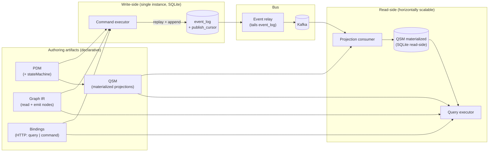
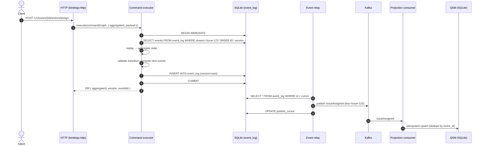
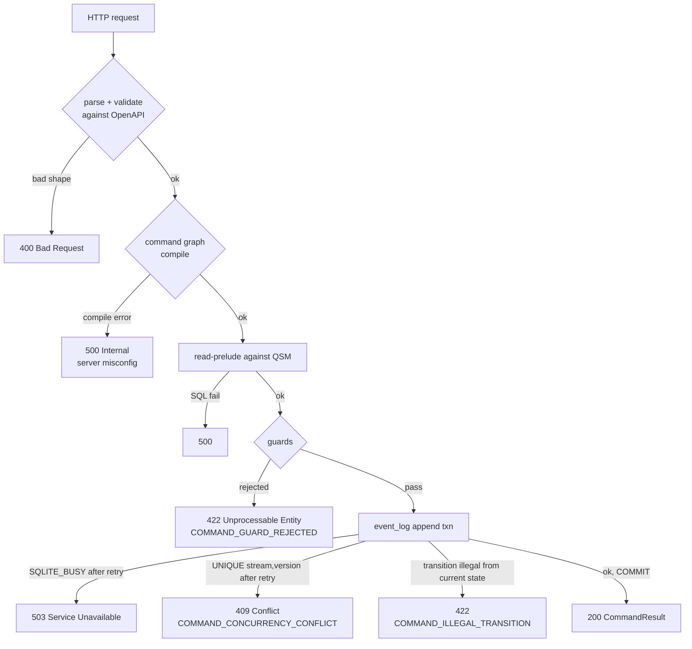
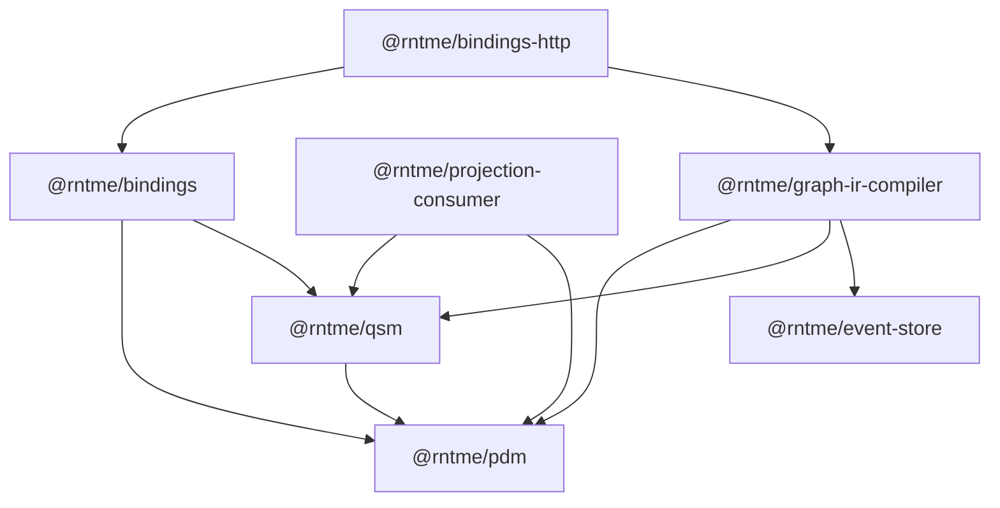

# Mutations — Event Sourcing + CQRS Design

**Date:** 2026-04-14
**Status:** Draft — for implementation-plan input
**Related:** `graph_ir_rc_7.md` (§2, §6, §8, §24), `docs/superpowers/specs/2026-04-13-graph-ir-sql-compiler-mvp-design.md`, `docs/superpowers/specs/2026-04-14-bindings-design.md`, `docs/superpowers/specs/2026-04-14-bindings-http-design.md`

---

## 1. Цель, контекст, архитектура

### 1.1. Цель и non-goals

rntme сегодня read-only: PDM + QSM + Graph IR → SQL → HTTP GET. Эта спека определяет, как в ту же архитектуру входят мутации, сохраняя декларативный характер всех user-authored артефактов. **События — декларативное следствие PDM, не рукописный catalog.** Write-side строится как Event Sourcing: event log источник истины, команды — это append новых событий; read-side — CQRS: материализованные проекции, обновляемые из Kafka через listen-to-yourself.

**В scope:** PDM stateMachine extension; единый Graph IR с новой `emit`-нодой и `command` role; event store на SQLite; relay в Kafka; projection consumer; materialized QSM store; HTTP bindings для commands; error model; schema evolution policy для MVP-уровня.

**Явно вне scope:**
- Process managers / sagas;
- Snapshot optimization на write-side; replay-rebuild tooling;
- Multi-tenancy;
- Auth / authz (actor передаётся как external context);
- Breaking schema evolution и миграции event log;
- Multi-writer write-side (SQLite constraint);
- Derived / aggregated projections (`backing: "derived"` — tier 2);
- Cross-bounded-context coordination;
- Dead-letter queue / poison-message runbook.

### 1.2. Архитектурные слои



Ключевые принципы слоёв:
- **PDM** — единый источник истины о доменных entity и, с этой спекой, о правилах мутации (stateMachine).
- **QSM** становится *runtime-артефактом* (а не только семантической спекой): декларирует материализованные проекции, которые физически существуют как SQLite-таблицы на read-side.
- **Graph IR** остаётся единым языком. "Read-only" — это было Tier-1 MVP compiler ограничение, не архитектурное. С `emit`-нодой граф может быть role=`command`.
- **Bindings** — единый артефакт HTTP-слоя, с двумя `kind`: `query` (GET) и `command` (POST).

### 1.3. End-to-end: command path



Свойства:
- Одна Postgres-SQLite-транзакция на write-side включает *весь* state-change: event append (events — единственная форма записи, отдельного state-store нет).
- Client получает ответ *сразу после commit*, до публикации в Kafka.
- Projection consumer идемпотентен (dedupe по `event_id`); QSM eventually consistent.

### 1.4. Почему нет отдельной outbox-таблицы

В "classical transactional outbox" smысл отдельной outbox-таблицы — атомарно зафиксировать факт события вместе с изменением state-таблицы. В не-ES системах это нужно, потому что state и event хранятся отдельно. В ES *event log сам по себе является* источником истины о state — дублировать события в outbox бессмысленно. Relay напрямую читает event log с помощью `publish_cursor`; идемпотентность выводится из `event_id` на consumer-стороне.

### 1.5. Scaling constraints (MVP)

SQLite — single-writer per file. Это даёт:

| Слой | Масштабирование в MVP |
|---|---|
| bindings-http (stateless) | да, N инстансов |
| command executor + event_log writer | **нет** — один инстанс |
| relay | один инстанс на один event_log |
| projection consumer | да, Kafka consumer group |
| query executor | да, read-replicas QSM |

`EventStore` фиксируется как абстракция с методами `readStream`, `appendEvents`, `readFrom`. MVP-имплементация — SQLite. Будущее масштабирование write-side — смена реализации (Postgres event log / Kafka-as-log / выделенный ES) без изменения command executor, PDM stateMachine, event derivation и projection consumer.

---

## 2. PDM stateMachine extension

### 2.1. Форма

PDM entity получает опциональную секцию `stateMachine`:

```json
"Issue": {
  "table": "issues",
  "fields": { "id": ..., "status": ..., "title": ..., ... },
  "relations": { ... },
  "keys": ["id"],
  "stateMachine": {
    "stateField": "status",
    "initial": null,
    "states": ["draft", "open", "in_progress", "resolved", "closed"],
    "transitions": {
      "report":   { "from": null,              "to": "draft",        "affects": ["title", "projectId", "reporterId", "priority", "storyPoints"] },
      "submit":   { "from": "draft",           "to": "open"                                            },
      "assign":   { "from": "open",            "to": "in_progress",  "affects": ["assigneeId"]         },
      "reassign": { "from": "in_progress",     "to": "in_progress",  "affects": ["assigneeId"]         },
      "resolve":  { "from": "in_progress",     "to": "resolved",     "affects": ["resolvedAt"]         },
      "reopen":   { "from": "resolved",        "to": "open"                                            },
      "close":    { "from": "resolved",        "to": "closed"                                          }
    }
  }
}
```

Поля:

| Поле | Тип | Смысл |
|---|---|---|
| `stateField` | string | имя поля entity, хранящего state. Должно быть объявлено в `fields`, `nullable: false`, `type: "string"`. |
| `initial` | `null` | единственное значение — `null` означает "агрегат не существует"; creation-transitions ссылаются через `"from": null`. |
| `states` | string[] | закрытый enum допустимых значений `stateField`. Компилятор генерирует runtime-enum и (опционально) CHECK-constraint в QSM-проекциях. |
| `transitions` | Record<name, Transition> | именованный catalog разрешённых переходов. |

`Transition`:

| Поле | Тип | Обязательное | Смысл |
|---|---|---|---|
| `from` | state \| state[] \| null | да | допустимое текущее состояние(я). `null` = creation. Массив — transition легален из нескольких состояний. |
| `to` | state | да | состояние после transition. |
| `affects` | string[] | условно (см. 2.2) | список полей entity, которые transition имеет право менять. |

### 2.2. Правила `affects` (explicit + derived-by-convention)

| Тип transition | Определение | Default для `affects` | Explicit обязателен? |
|---|---|---|---|
| **State-only** | `from` ≠ `to`, оба не null | `[stateField]` | нет (default применяется) |
| **Self-loop** | `from` == `to` | — | **да**. Пустой self-loop ⇒ `PDM_SM_EMPTY_SELF_LOOP`. |
| **Creation** | `from` == null | — | **да**. Creation всегда меняет больше чем state; default неадекватен. |

Формальные invariants:
- `stateField` *всегда* неявно входит в `affects` (авто-добавляется компилятором).
- Каждый field ∈ `affects` должен существовать в `fields` entity.
- `affects` не может содержать `keys` (primary key агрегата неизменен).
- `affects` не может содержать поля с `generated: true` (см. 2.6 — auto-filled аудит-поля).

### 2.3. Self-loop семантика

Self-loop — легальный способ выразить "событие произошло, но state не сменился" (e.g. `reassign` в том же `in_progress`). Без self-loop пришлось бы либо плодить промежуточные состояния, либо терять business intent под зонтичным `IssueUpdated`. Ограничение: self-loop обязан иметь непустой `affects`.

### 2.4. Entities без stateMachine

Опциональность — фича:
- Entity без `stateMachine` → read-only reference data; нет commands, нет событий, нельзя `emit`. Пример для demo: `User`, `Project`, `Sprint` — если они seed.
- Entity с `stateMachine`, но без command graphs — легально. StateMachine — возможность, не обязательство.

Read-graphs не зависят от stateMachine: существующие Graph IR query-спеки работают одинаково независимо от его присутствия в PDM.

### 2.5. Validation rules (PDM parser, Layer B)

| Код ошибки | Условие |
|---|---|
| `PDM_SM_STATE_FIELD_MISSING` | `stateField` не объявлен в `fields` |
| `PDM_SM_STATE_FIELD_TYPE_INVALID` | `stateField` не `string` или `nullable: true` |
| `PDM_SM_UNKNOWN_STATE` | `transition.from`/`to` не ∈ `states` (и не `null` для `from`) |
| `PDM_SM_UNKNOWN_AFFECTED_FIELD` | field в `affects` не существует в `fields` |
| `PDM_SM_AFFECTS_KEY` | `affects` содержит key field |
| `PDM_SM_EMPTY_SELF_LOOP` | self-loop без `affects` или с пустым `affects` |
| `PDM_SM_CREATION_MISSING_AFFECTS` | `from: null` transition без explicit `affects` |
| `PDM_SM_UNREACHABLE_STATE` | state в `states`, но недостижим из `initial` через transitions |
| `PDM_SM_TRAPPED_STATE` | state без исходящих transitions (warning в MVP; tier 2 — error если не помечен `terminal: true`) |
| `PDM_SM_DUPLICATE_TRANSITION_NAME` | одинаковое имя transition в одной entity |

### 2.6. Auto-generated (`generated`) поля

Расширение PDM-field: опциональный флаг:

```json
"createdAt": { "type": "datetime", "nullable": false, "column": "created_at", "generated": "createdAt" },
"updatedAt": { "type": "datetime", "nullable": false, "column": "updated_at", "generated": "updatedAt" }
```

Значения `generated`: `"createdAt"`, `"updatedAt"`, `"actor"`. Такие поля:
- Не попадают в `affects`.
- Не появляются в event payload `before`/`after`.
- Заполняются command executor'ом автоматически (`createdAt = occurredAt` первого события, `updatedAt = occurredAt` последнего, `actor` — из envelope).

Также `keys` entity типа integer могут быть помечены как `generated: "id"` для авто-генерации. В demo-проекте `id INTEGER PRIMARY KEY AUTOINCREMENT` — естественный case.

---

## 3. Event model

### 3.1. Event type naming

Derivation детерминирован:

```
EventType = PascalCase(entityName) + PascalCase(transitionName)
```

| Entity | Transition | Event type |
|---|---|---|
| `Issue` | `report` | `IssueReported` |
| `Issue` | `assign` | `IssueAssigned` |
| `Issue` | `reassign` | `IssueReassigned` |
| `Issue` | `resolve` | `IssueResolved` |
| `Issue` | `close` | `IssueClosed` |

Стиль имени transition (past-tense или present-tense) — выбор автора PDM. Формальное ограничение: `transitionName ∈ /^[a-z][a-zA-Z0-9]*$/`.

### 3.2. Event envelope

```ts
type EventEnvelope<TPayload> = {
  eventId:       string;        // UUIDv7
  eventType:     string;        // "IssueAssigned"
  aggregateType: string;        // "Issue"
  aggregateId:   string;        // "123"   (wire-format string даже для integer keys)
  stream:        string;        // "Issue-123"
  version:       number;        // per-stream monotonic
  occurredAt:    string;        // ISO-8601 UTC
  actor:         ActorRef | null;
  payload:       TPayload;
  schemaVersion: number;
};
```

Envelope хранится как JSON в `event_log.payload_json`. Компилятор генерирует TypeScript-типы, JSON-schema, и (tier 2) Avro для schema-registry.

### 3.3. Actor

```ts
type ActorRef =
  | { kind: "user";    id: string }
  | { kind: "system";  id: string }
  | { kind: "service"; id: string };
```

Runtime-контекст, не часть PDM. MVP: actor передаётся через binding как обычный required body/header parameter (auth/authz — вне scope).

### 3.4. Payload derivation

```ts
type TransitionPayload<E, T> = {
  before: Pick<EntityState<E>, AffectsOf<E, T> | StateFieldOf<E>> | null;
  after:  Pick<EntityState<E>, AffectsOf<E, T> | StateFieldOf<E>>;
};
```

- `AffectsOf<E, T>` = `transition.affects` + auto-added `stateField`.
- `before` = значения этих полей *до* transition (для creation — `null`).
- `after` = значения после.

Наличие `before` обеспечивает: (a) self-containedness события (consumer не возвращается в event log); (b) delta-style проекции (например, history of status changes) работают.

Примеры:

**IssueAssigned** (transition `assign`, `affects: ["assigneeId"]`):

```json
{
  "eventId": "018e9d2a-...",
  "eventType": "IssueAssigned",
  "aggregateType": "Issue",
  "aggregateId": "123",
  "stream": "Issue-123",
  "version": 5,
  "occurredAt": "2026-04-14T10:15:00Z",
  "actor": { "kind": "user", "id": "alice" },
  "payload": {
    "before": { "status": "open",        "assigneeId": null },
    "after":  { "status": "in_progress", "assigneeId": "bob" }
  },
  "schemaVersion": 1
}
```

**IssueReported** (creation):

```json
{
  "eventType": "IssueReported",
  "aggregateId": "123",
  "stream": "Issue-123",
  "version": 1,
  "payload": {
    "before": null,
    "after": {
      "status": "draft",
      "title": "Add dark mode",
      "projectId": 7,
      "reporterId": "alice",
      "priority": "high",
      "storyPoints": 5
    }
  }
}
```

### 3.5. Stream naming и aggregate identity

```
stream = "<aggregateType>-<aggregateId>"
```

Правила:
- Один aggregate = один stream; stream содержит *все* события конкретного instance.
- Stream — единица concurrency control: replay по stream'у, append проверяет `expected_version` по stream'у.
- Composite команды (несколько `emit` в одной команде), затрагивающие разные агрегаты — каждая appends в свой stream; все в одной транзакции event_log; `expected_version` проверяется по каждому stream'у независимо.

### 3.6. Optimistic concurrency

```
version = (SELECT COALESCE(MAX(version), 0) FROM event_log WHERE stream=?) + 1
INSERT INTO event_log (stream, version, ...) VALUES (?, ?, ...)
-- UNIQUE(stream, version) детектит конфликт
```

Concurrent writer к тому же stream получит constraint violation → `CONCURRENCY_CONFLICT` → command runtime auto-retry с replay+re-execute graph до N раз; потом возвращает `409 Conflict` клиенту.

В MVP (single writer) — вырожденный случай, но контракт корректен.

### 3.7. Ordering

- Per-stream — total order (по `version`).
- Cross-stream — partial order. Consumer **не должен** полагаться на cross-stream ordering. Kafka partition key = `stream` гарантирует per-stream order в consumer'е.

---

## 4. Graph IR `emit` node + `command` role

### 4.1. Нода `emit`

Единственный write-primitive Graph IR. Добавляется в §8 каталог нод:

```json
{
  "id": "appendAssigned",
  "kind": "emit",
  "config": {
    "aggregate":   "Issue",
    "aggregateId": { "$param": "issueId" },
    "transition":  "assign",
    "payload":     { "assigneeId": { "$param": "assigneeId" } },
    "actor":       { "$param": "actor" }
  }
}
```

| Поле `config` | Тип | Смысл |
|---|---|---|
| `aggregate` | string | entity ∈ PDM; обязана иметь `stateMachine` |
| `aggregateId` | `EXPR` | тип = primary-key тип entity |
| `transition` | string (literal) | имя ∈ `stateMachine.transitions`. Literal — компилятор должен знать transition статически |
| `payload` | Record<field, EXPR> | покрывает весь `affects` transition-а, без лишних ключей, типы по PDM |
| `actor` | `EXPR` (optional) | если отсутствует — берётся из runtime-контекста |

### 4.2. Graph role inference — расширение §6.5

| Приоритет | Contract | Role |
|---|---|---|
| 1 | root `row<T>` input + boolean output | predicate |
| 2 | root `row<T>` input + `row<U>` output | mapper |
| 3 | root `rowset<T>` input + `rowset<U>` output + ≥1 `reduce` | reducer |
| 4 | no root + `rowset<T>` output + 0 `emit` | query |
| **5** | **no root + ≥1 `emit`** | **command** |
| — | no root + `rowset<T>` output + ≥1 `emit` | **compile error** `GRAPH_MIXED_ROLE` |

Command graph:
- Не имеет root input (command — top-level entry point, всегда с runtime-параметрами).
- Может содержать любые read-nodes до emits (precondition / derivation payload).
- Содержит ≥1 `emit`.
- Output — `row<CommandResult>` (см. 4.4).

### 4.3. Пример: composite command graph

```json
{
  "id": "assignIssueSafe",
  "signature": {
    "inputs": {
      "issueId":    { "type": "integer", "mode": "required" },
      "assigneeId": { "type": "string",  "mode": "required" },
      "actor":      { "type": "string",  "mode": "required" }
    },
    "output": { "type": "row<CommandResult>", "from": "emitAssign" }
  },
  "nodes": [
    {
      "id": "currentLoad",
      "kind": "findMany",
      "config": {
        "source": { "entity": "Issue" },
        "filter": {
          "and": [
            { "eq": ["assigneeId", { "$param": "assigneeId" }] },
            { "eq": ["status", { "$literal": "in_progress" }] }
          ]
        }
      }
    },
    {
      "id": "loadCount",
      "kind": "reduce",
      "config": { "input": "currentLoad", "into": "LoadCount", "groupBy": [], "measures": { "count": { "$agg": "count" } } }
    },
    {
      "id": "guardCapacity",
      "kind": "filter",
      "config": { "input": "loadCount", "predicate": { "lt": ["count", { "$literal": 5 }] } }
    },
    {
      "id": "emitAssign",
      "kind": "emit",
      "config": {
        "aggregate":   "Issue",
        "aggregateId": { "$param": "issueId" },
        "transition":  "assign",
        "payload":     { "assigneeId": { "$param": "assigneeId" } },
        "actor":       { "$param": "actor" }
      }
    }
  ]
}
```

Поток: read-nodes (`currentLoad` → `loadCount` → `guardCapacity`) выполняются против **QSM store** (eventually consistent) — допустимо для *soft guards* (business rules). Hard invariants (transition legal из текущего state) проверяются command executor'ом по replay **event_log** — это другой слой, strongly consistent.

### 4.4. Command output

Auto-generated named shape `CommandResult` (зарезервирован; не пишется в `shapes`):

```ts
type CommandResult = {
  aggregateId: string;
  version:     integer;
  eventIds:    string[];
};
```

`signature.output.type` command graph обязан быть `row<CommandResult>`; `from` указывает на "финальный" emit-нод (обычно последний); компилятор агрегирует `eventIds` из всех emit-нод в один массив. Custom output shape (`map` поверх `CommandResult`) — tier 2.

### 4.5. Runtime semantics

1. **Read-prelude** (если есть read-nodes перед emit) — отдельная read-only транзакция по **QSM store**.
2. **Guard evaluation** — filter/predicate-нод, отсекающий path к emit, возвращает `COMMAND_GUARD_REJECTED` без side-effects.
3. **Write-transaction** — одна SQLite-транзакция:
   - для каждого emit-нода (в порядке топосортировки): replay stream → validate transition → append event.
4. **Commit** — any fail ⇒ rollback всех emits команды.
5. **Return** — `{ aggregateId, version, eventIds }`.

**MVP-ограничение scope.** В MVP все emit-ноды команды обязаны ссылаться на **один aggregate** (одинаковая `aggregate` + `aggregateId`). Проверяется семантическим слоем (`CMD_MULTI_AGGREGATE_NOT_ALLOWED`). Это позволяет детерминированный `CommandResult.aggregateId` и простой runtime. Архитектурно txn-модель готова к multi-aggregate (все emits уже в одной SQLite-транзакции, `expected_version` проверяется per-stream), но публичный API (output shape, error semantics) расширяется под multi-aggregate в tier 2 (массив CommandResult).

### 4.6. Validation codes (semantic layer)

| Код | Условие |
|---|---|
| `CMD_UNKNOWN_AGGREGATE` | `emit.aggregate` entity не существует в PDM |
| `CMD_AGGREGATE_WITHOUT_STATE_MACHINE` | entity без `stateMachine` |
| `CMD_UNKNOWN_TRANSITION` | `emit.transition` ∉ `stateMachine.transitions` |
| `CMD_PAYLOAD_MISSING_FIELD` | поле из `affects` отсутствует в `payload` |
| `CMD_PAYLOAD_EXTRANEOUS_FIELD` | `payload` содержит поле вне `affects` |
| `CMD_PAYLOAD_TYPE_MISMATCH` | тип expr ≠ PDM-типу поля |
| `CMD_AGGREGATE_ID_TYPE_MISMATCH` | тип `aggregateId` expr ≠ primary key типу entity |
| `GRAPH_MIXED_ROLE` | одновременно `rowset<T>` output и `emit` |
| `CMD_OUTPUT_SHAPE_INVALID` | output ≠ `row<CommandResult>` в MVP |
| `CMD_EMIT_UNREACHABLE` | emit-нод недостижим через `signature.output.from` |
| `CMD_MULTI_AGGREGATE_NOT_ALLOWED` | в MVP: emit-ноды ссылаются на разные `(aggregate, aggregateId)` в одном графе |

### 4.7. Что `emit` **не делает** (явно)

- Не читает state агрегата (этим занимается command executor через replay).
- Не делает произвольных INSERT/UPDATE в доменные таблицы — единственный способ изменить state — emit event.
- Не триггерит другие commands (нет chained commands внутри графа). Реакция на событие — projection consumer (§6) или будущий process manager.

---

## 5. Storage и delivery

### 5.1. `event_log` schema (SQLite)

```sql
CREATE TABLE event_log (
  id              INTEGER PRIMARY KEY AUTOINCREMENT,
  stream          TEXT    NOT NULL,              -- 'Issue-123'
  aggregate_type  TEXT    NOT NULL,              -- 'Issue'
  aggregate_id    TEXT    NOT NULL,              -- '123'
  version         INTEGER NOT NULL,              -- per-stream monotonic, 1..N
  event_type      TEXT    NOT NULL,              -- 'IssueAssigned'
  event_id        TEXT    NOT NULL UNIQUE,       -- UUIDv7
  actor_kind      TEXT,
  actor_id        TEXT,
  occurred_at     TEXT    NOT NULL,
  payload_json    TEXT    NOT NULL,
  schema_version  INTEGER NOT NULL DEFAULT 1,
  UNIQUE (stream, version)
);

CREATE INDEX idx_event_log_stream      ON event_log(stream, version);
CREATE INDEX idx_event_log_undelivered ON event_log(id);
```

- `id AUTOINCREMENT` — глобальный monotonic cursor для relay (AUTOINCREMENT гарантирует never-reuse).
- `UNIQUE(stream, version)` — основа optimistic concurrency.
- `UNIQUE(event_id)` — defense-in-depth от повторного append-а.
- `actor_*` вынесены для удобства аудита/фильтрации; в envelope склеиваются обратно.

**Топология файлов БД.** В MVP рекомендуется: `events.db` для write-side и `qsm.db` для read-side — два отдельных SQLite-файла. Это моделирует production CQRS split. Один файл допустим для локального dev.

### 5.2. `publish_cursor`

```sql
CREATE TABLE publish_cursor (
  relay_id        TEXT PRIMARY KEY,              -- 'kafka-main'
  last_event_id   INTEGER NOT NULL,
  updated_at      TEXT NOT NULL
);
```

Relay обновляет cursor *после* успешной публикации в Kafka (at-least-once). Один relay на один event_log в MVP.

### 5.3. Append logic

```ts
function appendEvents(streams: AppendRequest[]): AppendResult[] {
  db.exec('BEGIN IMMEDIATE');
  try {
    const results: AppendResult[] = [];
    for (const req of streams) {
      const currentVersion = db.prepare(
        'SELECT COALESCE(MAX(version), 0) FROM event_log WHERE stream = ?'
      ).get(req.stream);
      for (let i = 0; i < req.events.length; i++) {
        const nextVersion = currentVersion + i + 1;
        db.prepare(`
          INSERT INTO event_log (stream, aggregate_type, aggregate_id, version,
                                 event_type, event_id, actor_kind, actor_id,
                                 occurred_at, payload_json, schema_version)
          VALUES (?, ?, ?, ?, ?, ?, ?, ?, ?, ?, ?)
        `).run(/* ... */);
      }
      results.push({ stream: req.stream, lastVersion: currentVersion + req.events.length, eventIds: [...] });
    }
    db.exec('COMMIT');
    return results;
  } catch (e) {
    db.exec('ROLLBACK');
    if (isConflict(e)) throw new ConcurrencyConflict();
    throw e;
  }
}
```

`BEGIN IMMEDIATE` берёт RESERVED-lock сразу. В MVP (single writer) redundant, но сохраняет корректность при будущей миграции.

### 5.4. Relay process

Отдельный long-running процесс (рекомендуется отдельный, чтобы не делить WAL-I/O с главным writer'ом).

```ts
function relayLoop(relayId: string, kafka: KafkaProducer) {
  while (true) {
    const cursor = readCursor(relayId);
    const batch = db.prepare(`
      SELECT * FROM event_log WHERE id > ? ORDER BY id ASC LIMIT 500
    `).all(cursor);
    if (batch.length === 0) { sleep(pollInterval); continue; }

    for (const row of batch) {
      await kafka.send({
        topic: topicOf(row.aggregate_type),        // 'rntme.issue.v1'
        key: row.stream,                           // partition key
        headers: {
          'event-id':       row.event_id,
          'event-type':     row.event_type,
          'schema-version': String(row.schema_version)
        },
        value: row.payload_json
      });
    }
    writeCursor(relayId, batch[batch.length - 1].id);
  }
}
```

Гарантии:
- **At-least-once** — падение после `kafka.send` до `writeCursor` вызовет retry; consumer дедупит по `event_id`.
- **Per-stream order** — batch по `id ASC`; Kafka sequencing по partition key = `stream`.
- **Backpressure** — `LIMIT N` + sleep (polling). Tier 2: CDC через SQLite update hooks / shared-memory pub-sub.
- **Poll interval** — 100ms в MVP dev-setup; 500–1000ms в prod с большим batching.

### 5.5. Kafka topology

- **Topic per aggregate type**: `rntme.<aggregate>.v<majorSchema>` — `rntme.issue.v1`, `rntme.project.v1`, etc.
- **Partition key = `stream`** (`aggregateType-aggregateId`) — per-stream order preserved.
- **Partitions per topic** — 3–6 в MVP; deploy-config.
- **Retention = infinite** — это event log, не queue. Compaction отключена (старые события нельзя потерять).
- **Schema registry** — tier 2; MVP использует header `schema-version` + JSON-schema в гите.

### 5.6. Consistency guarantees

| Compound | Guarantee |
|---|---|
| append event → visible for replay | immediately (same txn) |
| append event → visible for read graph (QSM) | eventually (relay poll + Kafka propagation + consumer apply) |
| Типичный MVP-lag | ~100ms – 1s |
| Concurrent append к одному stream | serialised (`UNIQUE(stream, version)` + `BEGIN IMMEDIATE`) |
| Duplicate Kafka delivery | возможна (at-least-once); consumer idempotent |
| Per-stream order в Kafka | preserved |
| Cross-stream order | not guaranteed |

### 5.7. Retry / error cases (write-side)

| Случай | Поведение |
|---|---|
| `SQLITE_BUSY` при `BEGIN IMMEDIATE` | auto-retry exponential backoff, до N попыток |
| `UNIQUE(stream, version)` violation | `ConcurrencyConflict` → full replay + re-execute graph до N попыток → `409 Conflict` клиенту |
| `UNIQUE(event_id)` violation | программная ошибка (дубль UUIDv7); throw, no retry |
| Kafka недоступна | write-side продолжает работать; relay накапливает cursor gap; после восстановления — догонит |
| Relay упал | при рестарте события переотправятся; consumer дедупит |

**Write-side никогда не блокируется на Kafka.** Availability Kafka важна для read-side latency, не для приёма commands.

---

## 6. Projection consumer + QSM store

### 6.1. QSM получает runtime-измерение

Projection теперь декларирует физическую backing-таблицу:

```json
{
  "projections": {
    "IssueView": {
      "backing": "entity-mirror",
      "source":  { "entity": "Issue" },
      "keys":    ["id"],
      "grain":   ["id"],
      "exposed": ["id", "title", "status", "priority", "storyPoints",
                  "assigneeId", "reporterId", "projectId",
                  "createdAt", "updatedAt", "resolvedAt"],
      "table":   "projection_issue"
    }
  }
}
```

| Значение `backing` | Смысл | Scope |
|---|---|---|
| `entity-mirror` | 1:1 current-state сущности; auto-derived из PDM + stateMachine; обновляется consumer'ом из envelope-events этой entity | **MVP** |
| `derived` | aggregate/join проекция; explicit materializer-rules | tier 2 |

`table` — physical имя таблицы в QSM store (default = `projection_<lowercase(name)>`).

### 6.2. Auto-derivation entity-mirror projections

Для каждой entity PDM со `stateMachine` компилятор QSM генерирует:
- **DDL таблицы** — mirror полей entity (кроме `generated`) + idempotency columns;
- **Consumer handler** — envelope → UPSERT;
- **Resolver mapping** для read-graphs — `findMany.source.entity = "Issue"` теперь компилируется в SELECT из `projection_issue`, не из PDM-table `issues`.

MVP entity-mirror покрывает demo issue-tracker полностью: все существующие read-graphs (`listIssues`, `issueDetail`, `issuesByProject`, `sprintBurndown`) читают из mirror-projections. Aggregations (`issuesByProject`, `sprintBurndown`) *считаются на лету* в read-path — проекция хранит atomic state.

### 6.3. DDL примера

```sql
CREATE TABLE projection_issue (
  -- mirror entity-полей
  id           INTEGER PRIMARY KEY,
  project_id   INTEGER NOT NULL,
  reporter_id  INTEGER NOT NULL,
  assignee_id  INTEGER,
  sprint_id    INTEGER,
  title        TEXT    NOT NULL,
  priority     TEXT    NOT NULL,
  story_points INTEGER NOT NULL,
  status       TEXT    NOT NULL,
  resolved_at  TEXT,
  created_at   TEXT    NOT NULL,
  updated_at   TEXT    NOT NULL,
  -- idempotency / audit
  last_event_id      TEXT    NOT NULL,
  last_event_version INTEGER NOT NULL,
  applied_at         TEXT    NOT NULL
);

CREATE INDEX idx_projection_issue_status ON projection_issue(status);
```

Три служебных колонки (`last_event_id`, `last_event_version`, `applied_at`) — в каждой mirror-projection. Не видны в `exposed` (read-graphs их не читают); нужны для idempotent apply и debuggability.

### 6.4. Consumer loop

```ts
async function consumerLoop(consumer: KafkaConsumer, db: QsmDb) {
  for await (const batch of consumer) {
    db.exec('BEGIN IMMEDIATE');
    try {
      for (const msg of batch) {
        const envelope = JSON.parse(msg.value) as EventEnvelope;
        applyEvent(db, envelope);
      }
      db.exec('COMMIT');
      await consumer.commitOffsets(batch);
    } catch (e) {
      db.exec('ROLLBACK');
      throw e;  // poison-handling — tier 2
    }
  }
}
```

Batch transactions (не per-message) ускоряют SQLite write-path; idempotency гарантирует безопасность повторного apply.

### 6.5. `applyEvent` — idempotent upsert

```ts
function applyEvent(db: QsmDb, ev: EventEnvelope) {
  const projection = projectionFor(ev.aggregateType);
  if (!projection) return;                               // entity без mirror — skip

  const row = db.prepare(`
    SELECT last_event_version FROM ${projection.table} WHERE id = ?
  `).get(ev.aggregateId);
  if (row && row.last_event_version >= ev.version) return;

  if (ev.payload.before === null) {
    db.prepare(`
      INSERT INTO ${projection.table} (id, ...mirror..., last_event_id, last_event_version, applied_at)
      VALUES (?, ..., ?, ?, ?)
      ON CONFLICT (id) DO UPDATE SET ...
    `).run(...);
  } else {
    const affects = Object.keys(ev.payload.after);
    const setClauses = affects.map(f => `${columnOf(f)} = ?`).join(', ');
    db.prepare(`
      UPDATE ${projection.table}
      SET ${setClauses}, last_event_id = ?, last_event_version = ?, applied_at = ?
      WHERE id = ? AND last_event_version < ?
    `).run(...);
  }
}
```

Три уровня защиты от двойной обработки:
1. Kafka consumer offset commit после успешной транзакции.
2. `last_event_version` guard в `WHERE` — предохранитель от re-apply при replay.
3. `ON CONFLICT` + `UPDATE ... WHERE version <` — корректно обрабатывают out-of-order.

### 6.6. Offset tracking

- Kafka consumer-group offsets — основной SoT про обработанное.
- `last_event_version` в проекциях — guard для recovery после reset consumer offset (события дедупнутся).

### 6.7. Scaling read-side

- Consumer group с N инстансами; Kafka балансит partitions.
- Partition key = stream → события одного aggregate всегда на одном consumer'е → per-aggregate apply сериализован естественно.
- Несколько QSM-DB в prod (read replicas per consumer instance) или одна shared QSM-DB.

### 6.8. Read-graph compile path (обновлённый)

Было (rc7 + MVP compiler):
```
findMany source.entity = "Issue"
  → SELECT ... FROM issues    (PDM table + column mapping)
```

Станет:
```
findMany source.entity = "Issue"
  → resolver: entity Issue → projection IssueView → table 'projection_issue'
  → SELECT ... FROM projection_issue (no PDM column-mapping)
```

Authoring specs read-graphs **не меняются**. Меняется target resolver в `@rntme/graph-ir-compiler`. Это implementation-reshape, не breaking API.

### 6.9. Deferred tier 2

| Функция | Причина отложить |
|---|---|
| `backing: "derived"` projections (explicit event→update rules) | Entity-mirror + on-the-fly aggregation покрывают 100% current demo |
| Replay tooling для пересборки проекции | Ops concern; MVP собирает on-the-fly с offset=0 |
| Poison message / DLQ | Ops concern; MVP throws |
| Cross-aggregate consistency для derived проекций | требует saga / process manager — вне scope |

---

## 7. Bindings, schema evolution, error model, testing

### 7.1. Bindings extension для commands

`@rntme/bindings` расширяется новым `binding.entry.kind`:

| Kind | Метод | Источник | Статус |
|---|---|---|---|
| `query` | `GET` | read Graph IR | существует |
| `command` | `POST` | command Graph IR (role=`command`) | **новое** |

```json
"assignIssue": {
  "kind": "command",
  "graph": "assignIssueSafe",
  "target": { "engine": "sqlite", "dialect": "sqlite" },
  "http": {
    "method": "POST",
    "path": "/v1/issues/{issueId}/actions/assign",
    "tags": ["issues"],
    "summary": "Assign an issue to a user (with capacity guard).",
    "parameters": [
      { "name": "issueId",    "in": "path",  "bindTo": "issueId",    "required": true },
      { "name": "assigneeId", "in": "body",  "bindTo": "assigneeId", "required": true },
      { "name": "actor",      "in": "body",  "bindTo": "actor",      "required": true }
    ]
  }
}
```

Правила:
- `kind` — новое поле (`"query"` | `"command"`), optional. Отсутствие трактуется как `"query"` — это сохраняет backwards-compatibility для существующих binding-artifact'ов, написанных до этой спеки. В tier 2, когда query-only использование binding-артефактов уйдёт, поле можно сделать обязательным через minor bump `BindingArtifact.version`.
- `method: "POST"` обязательно для commands (OpenAPI semantic "non-idempotent state-change").
- `in: "body"` для payload; `in: "path"` для aggregate id; `in: "query"` запрещён (`BINDINGS_COMMAND_QUERY_PARAM_FORBIDDEN`).
- Response авто-генерится из `row<CommandResult>` → 200 OK schema.
- Standard error responses: `400/422/500` + новый `409 Conflict` для `COMMAND_CONCURRENCY_CONFLICT`.

OpenAPI ответа command:

```json
"200": { "description": "OK",
  "content": { "application/json": { "schema": { "$ref": "#/components/schemas/CommandResult" }}}},
"409": { "description": "Concurrency conflict. Retry the command.",
  "content": { "application/json": { "schema": { "$ref": "#/components/schemas/ErrorResponse" }}}},
"422": { "description": "Business guard rejected (transition illegal, invariant violated).",
  "content": { "application/json": { "schema": { "$ref": "#/components/schemas/ErrorResponse" }}}}
```

### 7.2. Новые коды ошибок в `@rntme/bindings`

- `BINDINGS_COMMAND_ON_NON_COMMAND_GRAPH` — `kind: "command"` для graph с role ≠ `command`.
- `BINDINGS_QUERY_ON_COMMAND_GRAPH` — обратное.
- `BINDINGS_COMMAND_QUERY_PARAM_FORBIDDEN` — `in: "query"` для command.
- `BINDINGS_COMMAND_METHOD_NOT_POST` — command с method ≠ POST.

### 7.3. Schema evolution

#### 7.3.1. PDM `stateMachine` evolution

**Backwards-compatible** (без bump envelope schemaVersion):
- Добавление нового state (не упоминается в существующих событиях).
- Добавление нового transition (новый event type; consumer'ы, не знающие его, игнорируют).
- Расширение `affects` — `schemaVersion` bump этого event type (старый consumer работает со старым под-set'ом `after`).

**Breaking** (координированная миграция, вне MVP):
- Удаление state, на который ссылаются прошлые события.
- Удаление transition, который использовался.
- Сужение `from` set-а transition.
- Переименование `stateField`.

MVP — только backwards-compatible changes.

#### 7.3.2. Event payload evolution

Envelope содержит `schemaVersion`:

| Изменение | `schemaVersion` | Совместимость |
|---|---|---|
| Добавление optional поля в `after`/`before` | +1 | старый consumer игнорирует, новый читает |
| Добавление required поля | +1 + migration старых событий | breaking в MVP |
| Удаление поля | breaking | — |
| Изменение типа | breaking | — |

MVP — только additive.

#### 7.3.3. Read shapes / QSM

- Добавление поля в `IssueView.exposed` — добавление колонки в `projection_issue` + update consumer handler. Старые rows получают NULL (или default) — должна быть nullable.
- Удаление field — breaking для read-graphs; защищается `SEMANTIC_UNKNOWN_FIELD` в compile существующего графа.

### 7.4. End-to-end error model



Слои:
- **bindings-http** — HTTP validation → 400.
- **graph compiler** — compile errors → 500.
- **command executor** — business errors (422), concurrency (409).
- **storage** — raw SQLite после retry → 503.

### 7.5. Testing strategy

| Слой | Что тестируется | Tooling |
|---|---|---|
| PDM parser (stateMachine) | все `PDM_SM_*` codes, derivation defaults, self-loop rules | vitest unit |
| Graph IR compiler (emit, command role) | все `CMD_*` codes, role inference, guard-rejection | vitest unit |
| Event envelope derivation | eventType naming, payload shape, before/after, schemaVersion | vitest unit |
| Event store (append + replay) | optimistic concurrency, UNIQUE violation, BEGIN IMMEDIATE retry | vitest + sqlite `:memory:` |
| Relay | cursor advance, at-least-once, retry после Kafka-down | vitest + mock Kafka producer |
| Projection consumer | idempotency, dedup, out-of-order safety, entity-mirror DDL correctness | vitest + in-memory consumer interface |
| Bindings для commands | OpenAPI generation, все `BINDINGS_COMMAND_*` codes | vitest unit + golden JSON |
| End-to-end | `demo/issue-tracker-api`: `POST /v1/issues/{id}/actions/*` → event → relay → consumer → projection → `GET /v1/issues/{id}` видит update | vitest integration + real SQLite + mock-Kafka in-process |

E2E acceptance: полный цикл issue (`report → submit → assign → reassign → resolve → close`) с проверкой QSM state после каждого transition.

### 7.6. Scope recap

**В этом спеке:** PDM stateMachine (§2), event model (§3), Graph IR emit + command role (§4), event_log + relay + Kafka (§5), projection consumer + QSM materialization (§6), bindings для commands + schema evolution + error model + testing (§7).

**Явно вне scope:** sagas / process managers, snapshot-optimisation / replay-rebuild, multi-tenancy, auth, breaking schema evolution, multi-writer write-side, derived projections (`backing: "derived"`), cross-bounded-context coordination, DLQ / poison-message runbook.

### 7.7. Package layout

Следуем паттерну существующих пакетов монорепы (`@rntme/bindings` — parse → validate → emit с branded result types, Zod schemas, агрегированные Result<T, Error[]>). PDM и QSM становятся самостоятельными пакетами (сейчас PDM/QSM парсятся ad-hoc в demo через `JSON.parse` + ручные shape types — с мутациями и stateMachine эта модель не масштабируется).

```
packages/
  pdm/                        # NEW — @rntme/pdm
    src/
      types/                  # PdmArtifact, Entity, Field, Relation, StateMachine, Transition, ActorRef
      parse/                  # Zod schema + parsePdm()
      validate/               # structural + stateMachine rules (все PDM_SM_* codes)
      derive/                 # deriveEventTypes(pdm): EventTypeSpec[]  — выводит имена событий, payload shapes из transitions
      resolvers/              # createPdmResolver() — API для graph-ir-compiler / qsm / bindings
    test/
      parse.test.ts
      validate-structural.test.ts
      validate-state-machine.test.ts
      derive-event-types.test.ts

  qsm/                        # NEW — @rntme/qsm
    src/
      types/                  # QsmArtifact, Projection, ProjectionBacking ("entity-mirror" | "derived")
      parse/                  # Zod schema + parseQsm()
      validate/               # structural + cross-ref PDM (все QSM_* codes)
      derive/                 # generateProjectionDdl(), deriveProjectionHandler()  — DDL + apply-функция из PDM stateMachine
      resolvers/              # createQsmResolver() — API для graph-ir-compiler / projection-consumer
    test/
      parse.test.ts
      validate-cross-ref.test.ts
      derive-ddl.test.ts
      derive-handler.test.ts

  event-store/                # NEW — @rntme/event-store
    src/
      types/                  # EventEnvelope, AppendRequest, ConcurrencyConflict
      schema.sql              # DDL для event_log + publish_cursor
      store/                  # EventStore interface + SqliteEventStore реализация
      relay/                  # createRelay({ store, kafka, cursorId }) — long-running loop
      kafka/                  # KafkaProducer abstraction (не тянем конкретный client в ядро)
    test/
      append.test.ts          # optimistic concurrency, UNIQUE violations, BEGIN IMMEDIATE retry
      replay.test.ts          # per-stream order, cursor semantics
      relay.test.ts           # at-least-once, retry после "Kafka down"

  graph-ir-compiler/          # EXISTING — расширяется:
    src/
      parse/, validate/, canonical/, semantic-plan/, relational/, lower/, execute/  # существующие
      emit/                   # NEW — лоупринт emit-ноды: canonical, semantic validation, runtime
      command-runtime/        # NEW — read-prelude (against QSM) + write-txn (against event-store) + guard rejection
    test/
      emit-semantic.test.ts   # все CMD_* codes
      command-runtime.test.ts # интеграция с in-memory event-store

  projection-consumer/        # NEW — @rntme/projection-consumer
    src/
      types/                  # ConsumerOptions, KafkaConsumer abstraction
      consumer.ts             # createProjectionConsumer({ kafka, qsm, pdm, qsmDb }) → start/stop
      apply/                  # applyEvent() через deriveProjectionHandler из @rntme/qsm
    test/
      apply-idempotent.test.ts
      consumer-loop.test.ts

  bindings/                   # EXISTING — расширяется:
    src/
      types/, parse/, validate/, openapi/  # существующие
      # новый kind в BindingEntry; новые BINDINGS_COMMAND_* codes
    test/
      validate-command.test.ts
      openapi-command.test.ts

  bindings-http/              # EXISTING — расширяется:
    src/
      # routing для kind=command; вызов command runtime из graph-ir-compiler
    test/
      command-routing.test.ts
      command-e2e.test.ts
```

**Зависимости между пакетами (compile-time):**



Следуем существующей конвенции bindings: shared types *не* публикуются из нижних пакетов. Resolvers — типовой интерфейс, реализация прячется за factory. Это даёт возможность менять internal модели в PDM/QSM без ломания верхних пакетов.

### 7.8. Follow-up работы (implementation rollout order)

Каждый пункт — отдельный implementation plan + (где нужно) sub-spec.

1. **`@rntme/pdm`** — парсинг, structural validation, stateMachine-rules, resolvers, event-type derivation. Standalone, нет зависимостей. Параллельно: расширение `demo/issue-tracker-api/src/artifacts/pdm.json` с `stateMachine` для Issue.
2. **`@rntme/qsm`** — парсинг, validation, cross-ref к PDM, DDL generation, handler derivation. Зависит от (1).
3. **`@rntme/event-store`** — EventStore interface, SQLite-реализация, relay. Параллельно с (1–2), независимый пакет.
4. **`@rntme/graph-ir-compiler`** — расширение: emit-нода, command role, command runtime. Мигрирует ad-hoc PDM/QSM-парсинг на `@rntme/pdm` + `@rntme/qsm` resolvers. Зависит от (1, 2, 3).
5. **`@rntme/projection-consumer`** — consumer loop, idempotent apply через derived handlers. Зависит от (1, 2).
6. **`@rntme/bindings`** — расширение: `kind: "command"`, новые validation codes, OpenAPI для commands. Зависит от (1, 2) для resolvers (ранее типы были локальные).
7. **`@rntme/bindings-http`** — расширение: routing для commands, вызов command runtime. Зависит от (4, 6).
8. **`demo/issue-tracker-api`** — расширяется в параллель каждому этапу; финальный acceptance — E2E-сценарий (§7.5): `report → submit → assign → reassign → resolve → close`.

Там, где детальной формальной модели в этой спеке не хватает (точные правила upcasting event schema, derived-projections DSL, saga runtime в tier 2), появятся sub-specs по мере созревания эпиков.
